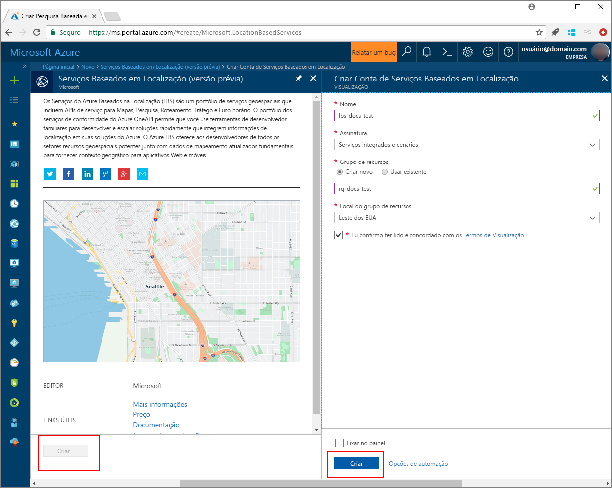

# <a name="search-nearby-point-of-interest-using-azure-location-based-services"></a>Procurar um ponto de interesse próximo usando os Serviços do Azure Baseados na Localização

Este tutorial mostra como configurar uma conta com os Serviços do Azure Baseados na Localização e depois usar as APIs fornecidas para procurar um ponto de interesse. Neste tutorial, você aprenderá como:

> [!div class="checklist"]
> * Criar uma conta com os Serviços do Azure Baseados na Localização
> * Obter a chave de assinatura para sua conta
> * Criar nova página da Web usando a API de Controle de mapa
> * Usar o Serviço de Pesquisa para localizar um ponto de interesse próximo

Se você não tiver uma assinatura do Azure, crie uma [conta gratuita](https://azure.microsoft.com/free/) antes de começar.

# <a name="log-in-to-the-azure-portal"></a>Faça logon no Portal do Azure
Faça logon no [Portal do Azure](https://portal.azure.com).

<a id="createaccount"></a>

## <a name="create-an-account-with-azure-location-based-services"></a>Criar uma conta com os Serviços do Azure Baseados na Localização

Siga estas etapas para criar uma nova conta dos Serviços Baseados na Localização.

1. No canto superior esquerdo do [Portal do Azure](https://portal.azure.com), clique em **Criar um recurso**.
2. Na caixa *Pesquisar no Marketplace*, digite **location based services**.
3. Em *Resultados*, clique em **Serviços Baseados na Localização (versão prévia)**. Clique no botão **Criar** que aparece abaixo do mapa. 
4. Na página **Criar Conta dos Serviços Baseados na Localização**, insira os seguintes valores:
    - O *Nome* da sua nova conta. 
    - A *Assinatura* que você deseja usar para a conta.
    - O nome do *Grupo de recursos* para a conta. Você pode optar por *Criar novo* ou *Usar existente* em relação ao grupo de recursos.
    - Selecione a *Localização do grupo de recursos*.
    - Leia os *Termos de visualização* e marque a caixa de seleção para aceitar os termos. 
    - Por fim, clique no botão **Criar**.
   
    


<a id="getkey"></a>

## <a name="get-the-subscription-key-for-your-account"></a>Obter a chave de assinatura para sua conta

Assim que sua Conta dos Serviços Baseados na Localização for criada com êxito, siga as etapas para vinculá-la a suas APIs de pesquisa de mapa:

1. Abra sua Conta dos Serviços Baseados na Localização no portal.
2. Navegue até as **CONFIGURAÇÕES** da conta e selecione **Chaves**.
3. Copie a **Chave Primária** para sua área de transferência. Salve-a localmente para usá-la nas etapas seguintes. 

    


<a id="createmap"></a>

## <a name="create-new-web-page-using-azure-map-control-api"></a>Criar nova página da Web usando a API de Controle de Mapa do Azure
A API de Controle de Mapa do Azure é uma biblioteca cliente conveniente que permite integrar facilmente os Serviços do Azure Baseados na Localização ao seu aplicativo Web. Ela oculta a complexidade das chamadas de serviço básicas REST e aumenta a produtividade com componentes estilizáveis e personalizáveis. As etapas a seguir mostra como criar uma página HTML estática inserida com a API do Controle de mapa dos Serviços Baseados na Localização. 

1. Em seu computador local, crie um novo arquivo e nomeie-o como **MapSearch.html**. 
2. Adicione os seguintes componentes HTML ao arquivo:

    ```HTML
    <!DOCTYPE html>
    <html lang="en">

    <head>
        <meta charset="utf-8" />
        <meta name="viewport" content="width=device-width, user-scalable=no" />
        <title>Map Search</title>

        <link rel="stylesheet" href="https://atlas.microsoft.com/sdk/css/atlas.min.css?api-version=1.0" type="text/css" />
        <script src="https://atlas.microsoft.com/sdk/js/atlas.min.js?api-version=1.0"></script>

        <style>
            html,
            body {
                width: 100%;
                height: 100%;
                padding: 0;
                margin: 0;
            }

            #map {
                width: 100%;
                height: 100%;
            }
        </style>
    </head>
    <body>
        <div id="map"></div>
        <script>
        // Embed Map Control JavaScript code here
        </script>

    </body>

    </html>
    ``` 
    Observe que o cabeçalho HTML inclui os arquivos de recurso CSS e JavaScript hospedados pela biblioteca de Controle de mapa do Azure. Observe o segmento *script* adicionado ao *corpo* do arquivo HTML. Esse segmento conterá o código JavaScript embutido para acessar as APIs do Serviço Baseado na Localização do Azure.
 
3.  Adicione o seguinte código JavaScript ao bloco de *script* do arquivo HTML. Substitua o espaço reservado *<insert-key>* pela chave primária da conta dos Serviços Baseados em Localização. 

    ```HTML/JavaScript
            // Instantiate map to the div with id "map"
            var subscriptionKey = "<insert-key>";
            var map = new atlas.Map("map", {
                "subscription-key": subscriptionKey
            });

    ```
    Esse segmento inicia a API de Controle de mapa para sua chave de assinatura. **Atlas** é o namespace que contém a API de Controle de mapa do Azure e os componentes visuais relacionados. **atlas.Map** fornece o controle para um mapa visual e interativo na Web. Você pode observar a aparência do mapa abrindo a página HTML no navegador. 

4. Adicione o código JavaScript a seguir ao bloco de *script* para adicionar uma camada de marcações de pesquisa ao Controle de Mapeamento:

    ```HTML/JavaScript
            // Initialize the pin layer for search results to the map
            var searchLayerName = "search-results";
            map.addPins([], {
                name: searchLayerName,
                cluster: false,
                icon: "pin-round-darkblue"
            });
    ```

5. Salve o arquivo no seu computador. 


<a id="usesearch"></a>

## <a name="use-search-service-to-find-nearby-point-of-interest"></a>Usar o Serviço de Pesquisa para localizar um ponto de interesse próximo

Esta seção mostra como usar a API do Serviço de Pesquisa dos Serviços do Azure Baseados na Localização para encontrar um ponto de interesse em seu mapa. É uma API RESTful projetada para desenvolvedores para a procura de endereços, pontos de interesse e outras informações geográficas. O Serviço de Pesquisa atribui informações de latitude e longitude a um endereço especificado. 

1. Abra o arquivo **MapSearch.html** criado na seção anterior e adicione o seguinte código JavaScript ao bloco de *script* para ilustrar o Serviço de Pesquisa. 
    ```HTML/JavaScript
            // Perform a request to the search service and create a pin on the map for each result
            var xhttp = new XMLHttpRequest();
            xhttp.onreadystatechange = function () {
                var searchPins = [];

                if (this.readyState === 4 && this.status === 200) {
                    var response = JSON.parse(this.responseText);

                    var poiResults = response.results.filter((result) => { return result.type === "POI" }) || [];

                    searchPins = poiResults.map((poiResult) => {
                        var poiPosition = [poiResult.position.lon, poiResult.position.lat];
                        return new atlas.data.Feature(new atlas.data.Point(poiPosition), {
                            name: poiResult.poi.name,
                            address: poiResult.address.freeformAddress,
                            position: poiResult.position.lat + ", " + poiResult.position.lon
                        });
                    });

                    map.addPins(searchPins, {
                        name: searchLayerName
                    });

                    var lons = searchPins.map((pin) => { return pin.geometry.coordinates[0] });
                    var lats = searchPins.map((pin) => { return pin.geometry.coordinates[1] });

                    var swLon = Math.min.apply(null, lons);
                    var swLat = Math.min.apply(null, lats);
                    var neLon = Math.max.apply(null, lons);
                    var neLat = Math.max.apply(null, lats);

                    map.setCameraBounds({
                        bounds: [swLon, swLat, neLon, neLat],
                        padding: 50
                    });
                }
            };
    ```
    Esse trecho de código cria uma [XMLHttpRequest](https://xhr.spec.whatwg.org/) e adiciona um manipulador de eventos para analisar a resposta de entrada. Para uma resposta bem-sucedida, ele coleta endereços, nomes, informações de latitude e longitude de cada local retornado, na variável `searchPins`. Por fim, adiciona essa coleção de pontos de localização para o controle de `map` como marcações. 

2. Adicione o seguinte código para o bloco de *script* para enviar o XMLHttpRequest ao Serviço de Pesquisa dos Serviços do Azure Baseados na Localização:

    ```HTML/JavaScript
            var url = "https://atlas.microsoft.com/search/fuzzy/json?";
            url += "&api-version=1.0";
            url += "&query=gasoline%20station";
            url += "&subscription-key=" + subscriptionKey;
            url += "&lat=47.6292";
            url += "&lon=-122.2337";
            url += "&radius=100000"

            xhttp.open("GET", url, true);
            xhttp.send();
    ``` 
    Este trecho de código usa a API de pesquisa básica do Serviço de Pesquisa, chamada de **Pesquisa Difusa**. Ele trata das entradas mais difusas, lidando com qualquer combinação de endereço ou tokens *POI*. Ele procura o **posto gasolina** próximo ao endereço fornecido na latitude e longitude e dentro do raio especificado. Ele usa a chave de assinatura da conta fornecida anteriormente no arquivo de exemplo para fazer a chamada para os Serviços Baseados na Localização. Ele retorna os resultados como pares de latitude/longitude para os locais encontrados. É possível observar as marcações de pesquisa abrindo a página HTML no navegador. 

3. Adicione as linhas a seguir o bloco de *script* para criar pop-ups para os pontos de interesse retornados pelo Serviço de Pesquisa:

    ```HTML/JavaScript
            // Add a popup to the map which will display some basic information about a search result on hover over a pin
            var popup = new atlas.Popup();
            map.addEventListener("mouseover", searchLayerName, (e) => {
                var popupContentElement = document.createElement("div");
                popupContentElement.style.padding = "5px";

                var popupNameElement = document.createElement("div");
                popupNameElement.innerText = e.features[0].properties.name;
                popupContentElement.appendChild(popupNameElement);

                var popupAddressElement = document.createElement("div");
                popupAddressElement.innerText = e.features[0].properties.address;
                popupContentElement.appendChild(popupAddressElement);

                var popupPositionElement = document.createElement("div");
                popupPositionElement.innerText = e.features[0].properties.position;
                popupContentElement.appendChild(popupPositionElement);

                popup.setPopupOptions({
                    position: e.features[0].geometry.coordinates,
                    content: popupContentElement
                });

                popup.open(map);
            });
    ```
    A API **atlas.Popup** fornece uma janela de informações ancorada na posição requerida no mapa. Este trecho de código define o conteúdo e a posição para a pop-up, além de adicionar um ouvinte de eventos para o controle de `map`, aguardando o _mouse_ passar sobre a pop-up. 

4. Salve o arquivo, depois abra o arquivo **MapSearch.html** em um navegador da Web de sua escolha e observe o resultado. Nesse momento, o mapa no navegador mostra pop-ups de informações quando você passa o mouse sobre qualquer marcação de pesquisa mostrada, semelhante ao seguinte. 

    


## <a name="next-steps"></a>Próximas etapas
Neste tutorial, você aprendeu como:

> [!div class="checklist"]
> * Criar uma conta com os Serviços do Azure Baseados na Localização
> * Obter a chave de assinatura para sua conta
> * Criar nova página da Web usando a API de Controle de mapa
> * Usar o Serviço de Pesquisa para localizar um ponto de interesse próximo

Siga até o tutorial [Rota para um ponto de interesse usando os Serviços do Azure Baseados na Localização](./tutorial-route-location.md) para saber como usar os Serviços do Azure Baseados na Localização para criar a rota ao seu ponto de interesse. 
