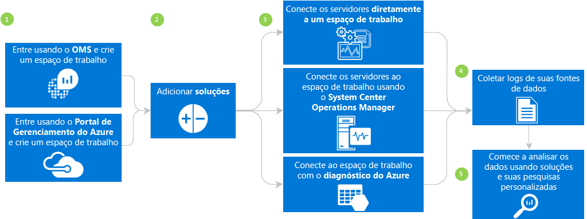
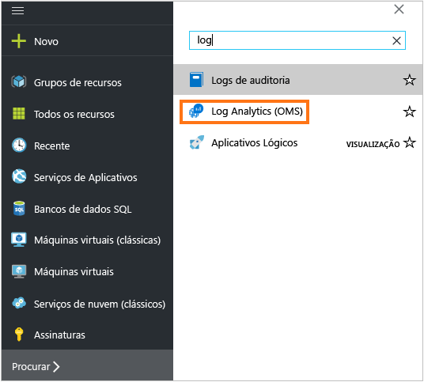
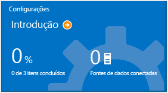
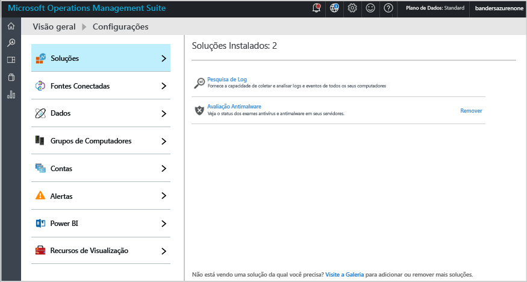
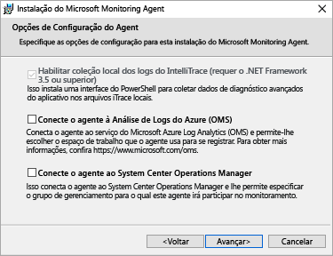
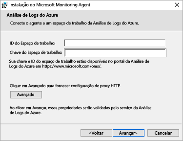
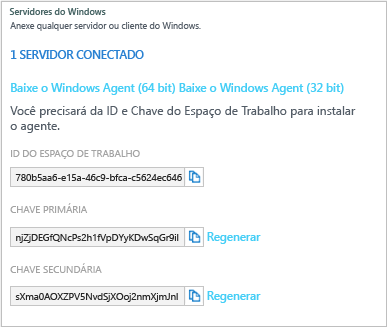

<properties
	pageTitle="Introdução ao Log Analytics | Microsoft Azure"
	description="Você pode entrar em funcionamento com o Log Analytics no Microsoft OMS (Operations Management Suite) em minutos."
	services="log-analytics"
	documentationCenter=""
	authors="bandersmsft"
	manager="jwhit"
	editor=""/>

<tags
	ms.service="log-analytics"
	ms.workload="na"
	ms.tgt_pltfrm="na"
	ms.devlang="na"
	ms.topic="get-started-article"
	ms.date="05/11/2016"
	ms.author="banders"/>

# Introdução ao Log Analytics

Você pode entrar em funcionamento com o Log Analytics no Microsoft OMS (Operations Management Suite) em minutos. Você tem duas opções ao escolher como criar um espaço de trabalho do OMS, que é semelhante a uma conta:

- Site do Microsoft Operations Management Suite
- Uma assinatura do Microsoft Azure

Você pode criar um espaço de trabalho gratuito do OMS usando o site do OMS. Ou, você pode usar uma assinatura do Microsoft Azure para criar um espaço de trabalho do OMS. Ambos os espaços de trabalho são funcionalmente equivalentes, exceto que um espaço de trabalho gratuito do OMS só pode enviar 500 MB de dados diariamente para o serviço OMS. Se você usar uma assinatura do Azure, você também pode usar essa assinatura para acessar outros serviços do Azure. Independentemente do método que você usa para criar o espaço de trabalho, você criará o espaço de trabalho com uma conta da Microsoft ou uma conta organizacional.

Vamos dar uma olhada no processo:

## Pré-requisitos e considerações de implantação do Log Analytics

- Você precisa de uma assinatura paga do Microsoft Azure para usar totalmente o Log Analytics. Se não tiver uma assinatura do Azure, crie uma [conta gratuita](https://azure.microsoft.com/free/), que permitirá o acesso a qualquer serviço do Azure. Ou então, você pode criar uma conta gratuita do OMS no site do [Operations Management Suite](http://microsoft.com/oms) e clicar em **Experimente gratuitamente**.
- Um espaço de trabalho do OMS
- Cada computador com Windows do qual você deseja coletar dados devem executar o Windows Server 2008 SP1 ou superior
- Acesso de [firewall](log-analytics-proxy-firewall.md) ao endereço do serviço Web do OMS
- Um servidor [Encaminhador do Log Analytics do OMS](https://blogs.technet.microsoft.com/msoms/2016/03/17/oms-log-analytics-forwarder) (Gateway) para encaminhar o tráfego de servidores para o OMS, se o acesso à Internet não estiver disponível nos computadores
- Se você usar o Operations Manager, o Log Analytics dará suporte ao Operations Manager 2012 SP1 UR6 e superior e ao Operations Manager 2012 R2 UR2 e superior. Foi adicionado suporte a proxy ao Operations Manager 2012 SP1 UR7 e Operations Manager 2012 R2 UR3. Determine como ele será integrado ao OMS.
- Determine se os computadores têm acesso direto à Internet. Caso contrário, eles precisarão de um servidor de gateway para acessar os sites de serviço Web do OMS. Todo o acesso é via HTTPS.
- Determine quais tecnologias e servidores enviarão dados para o OMS. Como por exemplo, controladores de domínio, SQL Server, etc.
- Conceder permissão a usuários no OMS e no Azure.
- Se você estiver preocupado com o uso de dados, implante cada solução individualmente e teste o impacto do desempenho antes de adicionar soluções adicionais.
- Analise seu uso de dados e o desempenho conforme você adiciona recursos e soluções ao Log Analytics. Isso inclui a coleta de eventos, coleta de log e coleta dados de desempenho, entre outros. É melhor iniciar com uma coleta mínima até o impacto do uso de dados ou do desempenho ser identificado.
- Verifique se os agentes do Windows também não são gerenciados usando o Operations Manager, caso contrário isso resultará em dados duplicados. Isso também se aplica a agentes do Azure que têm o Diagnóstico do Azure habilitado.
- Depois de instalar agentes, verifique se estão funcionando corretamente. Caso contrário, verifique se a API de Criptografia: Isolamento de Chave CNG (Next Generation) não está desabilitada usando Política de Grupo.
- Algumas soluções do Log Analytics têm requisitos adicionais

## Inscreva-se em 3 etapas usando o Operations Management Suite

1. Vá para o site do [Operations Management Suite](http://microsoft.com/oms) e clique em **Experimentar gratuitamente**. Entrar com sua conta da Microsoft, como Outlook.com, ou com uma conta organizacional, fornecida por sua empresa ou instituição educacional para usar com o Office 365 ou outros serviços da Microsoft.
2. Forneça um nome exclusivo do espaço de trabalho. Um espaço de trabalho é um contêiner lógico em que os dados de gerenciamento estão armazenados. Ele fornece uma forma de particionar dados entre diferentes equipes em sua organização, pois os dados são exclusivos ao seu espaço de trabalho. Especifique um endereço de email e a região onde você deseja ter os dados armazenados.
3. Em seguida, você pode criar uma nova assinatura do Azure ou um link para uma assinatura do Azure existente. Se você quiser continuar usando a versão de avaliação gratuita, clique em **Agora não**.

Você está pronto para começar a usar o portal do Operations Management Suite.

Você pode aprender mais sobre a configuração de seu espaço de trabalho e a vinculação de contas do Azure existentes em espaços de trabalho criados com o Operations Management Suite em [Gerenciar acesso ao Log Analytics](log-analytics-manage-access.md).

## Inscreva-se rapidamente usando o Microsoft Azure

1. Acesse o [Portal do Azure](https://portal.azure.com) e entre, navegue pela lista de serviços e, em seguida, selecione **Log Analytics (OMS)**. 
2. Clique em **Adicionar** e selecione opções para os seguintes itens:
    - Nome do **espaço de trabalho do OMS**
    - **Assinatura**: se você tiver várias assinaturas, selecione aquele que você deseja associar o novo espaço de trabalho.
    - **Grupo de recursos**
    - **Localidade**
    - **Tipo de preço** 
3. Clique em **Criar** e você verá os detalhes do espaço de trabalho no portal do Azure.          
4. Clique no link do **Portal OMS** para abrir o site do Operations Management Suite com seu novo espaço de trabalho.

Você está pronto para começar a usar o portal do Operations Management Suite.

Você pode aprender mais sobre a configuração de seu espaço de trabalho e o vínculo de espaços de trabalho criados com o Operations Management Suite nas assinaturas do Azure em [Gerenciar acesso ao Log Analytics](log-analytics-manage-access.md).

## Introdução ao portal do Operations Management Suite
Para escolher soluções e conectar os servidores que você deseja gerenciar, clique no bloco **Configurações** e siga as etapas desta seção.

- **Adicionar Soluções**: selecione as soluções que você gostaria de usar e clique em **Adicionar Soluções Selecionadas**. 
- **Conectar-se a uma fonte de dados**: escolha como você deseja se conectar ao seu ambiente de servidor para coletar de dados:
    - Conecte-se a qualquer cliente ou Windows Server diretamente ao instalar um agente.
    - Use o System Center Operations Manager para anexar seus grupos de gerenciamento ou sua implantação completa do Operations Manager.
    - Use uma conta de armazenamento do Azure configurada com a extensão de VM de diagnóstico do Azure com Windows ou Linux.     
- **Adicionar logs**: configure pelo menos uma fonte de dados para popular os dados e selecione **Salvar**. Para logs de eventos, você pode especificar o tipo de mensagens, incluindo erro, aviso e informações para monitorar.    

    

## Opcionalmente, conecte os servidores diretamente ao Operations Management Suite instalando um agente
1. Clique no bloco **Configurações**, clique na guia **Fontes Conectadas** e clique em **Baixar o Agente de Windows** para a arquitetura do computador em que você deseja instalar. Só é possível instalar o agente no Windows Server 2008 SP 1 ou posterior, ou no Windows 7 SP1 ou posterior.
2. Instale o agente em um ou mais servidores. Você pode instalar agentes um a um, usar um método mais automatizado com um [script personalizado](log-analytics-windows-agents.md) ou usar a solução de distribuição de software existente que você tiver.
3. Depois que você concordar com o contrato de licença e escolher a pasta de instalação, selecione **Conectar o agente do Insights Operacionais do Microsoft Azure**. (Anteriormente, o OMS era chamado de Insights Operacionais). 

4. Na próxima página, serão solicitadas a ID do espaço de trabalho e a chave do espaço de trabalho. A ID do Espaço de Trabalho e a chave são exibidas na tela em que você baixou o arquivo do agente.  
5. Durante a instalação, você pode clicar em **Avançado** para instalar opcionalmente o servidor proxy e fornecer informações de autenticação. Clique no botão **Próximo** para retornar à tela de informações do espaço de trabalho.
6. Clique em **Próximo** para validar a Chave e a ID do Espaço de Trabalho. Se forem encontrados erros, você pode clicar em **Voltar** para fazer as correções. Quando a ID do Espaço de trabalho e a Chave forem validadas, clique em **Instalar** para concluir a instalação do agente.
7. Faça logon no portal do Operations Management Suite e clique no bloco **Configurações** na página de Visão geral. Um ícone de marca de seleção verde será exibido quando os agentes se comunicarem com o serviço Operations Management Suite. Inicialmente, isso leva cerca de 5 a 10 minutos.

>[AZURE.NOTE] As soluções de avaliação de configuração e gerenciamento de capacidade não têm suporte atualmente por servidores conectados diretamente ao Operations Management Suite.

Você também pode conectar o agente ao System Center Operations Manager 2012 SP1 e posterior. Para fazer isso, selecione **Conectar o agente ao System Center Operations Manager**. Quando você escolher essa opção, você envia dados para o serviço sem a necessidade de hardware adicional ou de carregar seus grupos de gerenciamento.

Você pode ler mais sobre como conectar agentes diretamente ao Operations Management Suite em [Conectar computadores com Windows ao Log Analytics](log-analytics-windows-agents.md).

## Opcionalmente, conecte os servidores usando o System Center Operations Manager

1. No console do Operations Manager, clique em **Administração**.
2. Expanda o nó **Insights Operacionais** e clique em **Conexão de Insights Operacionais**.

  >[AZURE.NOTE] Dependendo de qual pacote cumulativo de atualizações do SCOM estiver usando, você poderá ver um nó para *System Center Advisor*, *Insights Operacionais* ou *Operations Management Suite*.

3. Clique no link **Registrar-se ao Insights Operacionais**, na direção do canto superior direito, e siga as instruções.
4. Depois de concluir o assistente de registro, clique no link **Adicionar um Computador/Grupo**.
5. Na caixa de diálogo **Pesquisa de Computador**, é possível pesquisar computadores ou grupos monitorados pelo Operations Manager. Selecione os computadores ou grupos para carregar no Log Analytics, clique em **Adicionar** e em **OK**. É possível verificar se o serviço do OMS está recebendo dados acessando o bloco **Uso** no Portal do Operations Management Suite. Os dados devem ser exibidos em cerca de 5 a 10 minutos.

Você pode ler mais sobre a conexão do Operations Manager ao Operations Management Suite em [Conectar o Operations Manager ao Log Analytics](log-analytics-om-agents.md).

## Opcionalmente, analise os dados de serviços de nuvem no Microsoft Azure

Com o Operations Management Suite, você pode rapidamente pesquisar eventos e logs do IIS para serviços de nuvem e máquinas virtuais, permitindo o diagnóstico nos Serviços de Nuvem do Azure. Você também pode receber informações adicionais para as máquinas virtuais do Azure instalando o Microsoft Monitoring Agent. Você pode ler mais sobre como configurar seu ambiente do Azure para usar o Operations Management Suite em [Conectar o armazenamento do Azure ao Log Analytics](log-analytics-azure-storage.md).

## Próximas etapas

- [Adicionar soluções do Log Analytics da Galeria de Soluções](log-analytics-add-solutions.md) para adicionar funcionalidade e obter dados.
- Familiarize-se com as [pesquisas de log](log-analytics-log-searches.md) para exibir informações detalhadas reunidas por soluções.
- Use [painéis](log-analytics-dashboards.md) para salvar e exibir suas próprias pesquisas personalizadas.

<!---HONumber=AcomDC_0525_2016-->