# Introdução a um espaço de trabalho de Log Analytics
Você pode começar a trabalhar rapidamente com Azure Log Analytics, que ajuda a avaliar inteligência operacional coletada da infraestrutura de TI. Usando este artigo, você pode facilmente começar a explorar, analisar e agir em relação aos dados coletados *gratuitamente*.

Este artigo serve como introdução à Log Analytics, usando um breve tutorial para orientá-lo ao longo de uma implantação mínima no Azure, para que você possa começar a usar o serviço. O contêiner lógico em que os dados de gerenciamento no Azure são armazenados é chamado de espaço de trabalho. Após ler essas informações e concluir sua própria avaliação, você pode remover o espaço de trabalho de avaliação. Como este artigo é um tutorial, ela não aborda requisitos de negócios, planejamento ou diretrizes de arquitetura.

>[!NOTE]
>Se usar a Nuvem do Microsoft Azure Governamental, use a [documentação do Gerenciamento + monitoramento do Azure Governamental](https://docs.microsoft.com/azure/azure-government/documentation-government-services-monitoringandmanagement#log-analytics) em vez disso.

Aqui está uma visão geral do processo usado para começar:

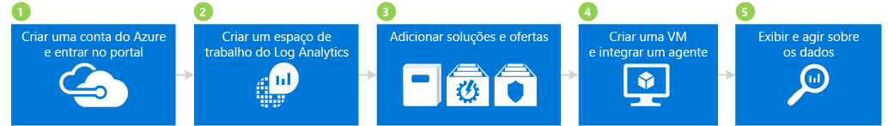

## 1 Criar uma conta do Azure e entrar

Se ainda não tiver uma conta do Azure, você precisará criar um para usar a Log Analytics. Você pode criar uma [conta gratuita](https://azure.microsoft.com/free/) que é válida por 30 dias e permite acessar qualquer serviço do Azure.

### Para criar uma conta gratuita e entrar
1. Siga as instruções em [Criar sua conta gratuita do Azure](https://azure.microsoft.com/free/).
2. Acesse o [portal do Azure](https://portal.azure.com) e entre.

## 2 Criar um espaço de trabalho

A próxima etapa é criar um espaço de trabalho.

1. No portal do Azure, procure na lista de serviços no Marketplace a *Log Analytics*e selecione **Log Analytics**.  
    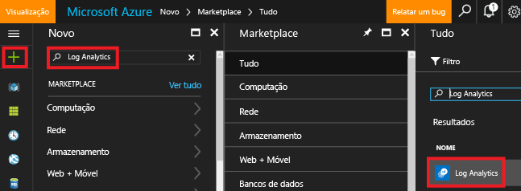
2. Clique em **Criar**e selecione opções para os seguintes itens:
   * **Espaço de trabalho OMS** - digite um nome para o espaço de trabalho.
   * **Assinatura** : se você tiver várias assinaturas, selecione aquele que você deseja associar o novo espaço de trabalho.
   * **Grupo de recursos**
   * **Localidade**
   * **Tipo de preços**  
       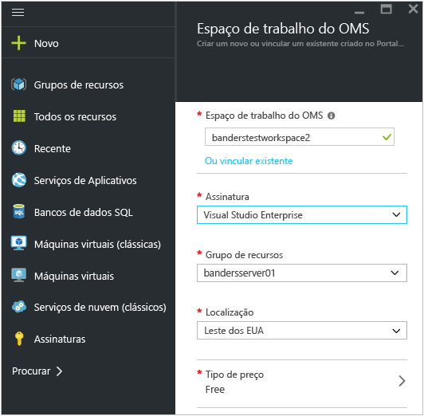
3. Clique em **OK** para ver uma lista dos espaços de trabalho.
4. Selecione um espaço de trabalho para ver seus detalhes no portal do Azure.       
    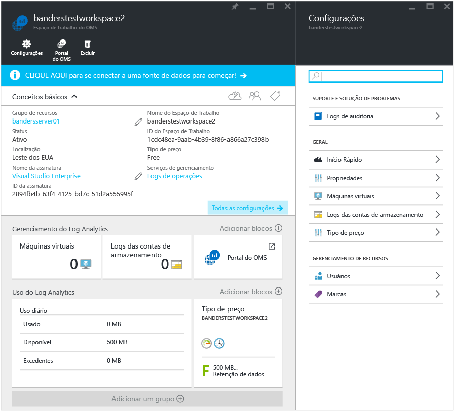         

## 3 Adicionar soluções e ofertas de soluções

Em seguida, adicione soluções de gerenciamento e ofertas de soluções. As soluções de gerenciamento são uma coleção de lógica, visualização e regras de aquisição de dados que fornecem as métricas que giram em torno de uma área de problema específica. Uma oferta de solução é um pacote de soluções de gerenciamento.

Adicionar soluções ao espaço de trabalho permite que a Log Analytics colete vários tipos de dados de computadores que estão conectados a seu espaço de trabalho usando agentes. Abordaremos os agentes de integração posteriormente.

### Para adicionar soluções e ofertas de soluções

1. No portal do Azure, clique em **Novo** e, na caixa **Pesquisar no marketplace**, digite **Log Analytics de Atividade** e pressione ENTER.
2. Na folha Tudo, selecione **Log Analytics de Atividade** e clique em **Criar**.  
    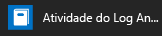  
3. Na folha *Nome da solução de gerenciamento*, selecione um espaço de trabalho que você deseja associar à solução de gerenciamento.
4. Clique em **Criar**.  
    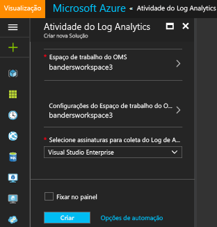  
5. Repita as etapas de 1 a 4 para adicionar:
    - A oferta de serviço **Segurança e Conformidade** com as soluções Avaliação Antimalware e Segurança e Auditoria.
    - A oferta de serviço **Automação e Controle** com as soluções Hybrid Worker de Automação, Controle de Alterações e Avaliação de Atualização do Sistema (também chamada de Gerenciamento de Atualizações). Você deve criar uma conta de Automação ao adicionar a oferta de solução.  
        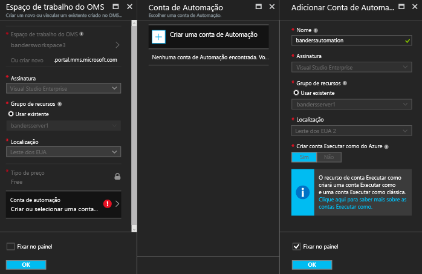  
6. Você pode exibir as soluções de gerenciamento que adicionou ao espaço de trabalho navegando até **Log Analytics** > **Assinaturas** > ***nome do espaço de trabalho*** > **Visão geral**. São mostrados blocos das soluções de gerenciamento que você adicionou.  
    >[!NOTE]
    >Como ainda não conectamos agentes ao espaço de trabalho, você não vê dados para as soluções que adicionou.  

    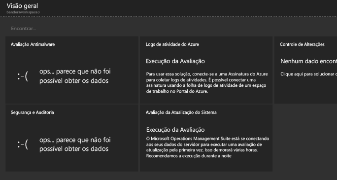

## 4 Criar uma VM e integrar um agente

Em seguida, crie uma máquina virtual simples no Azure. Após criar uma VM, integre o agente do OMS para habilitá-la. Habilitar o agente inicia a coleta de dados da VM e envia dados para a Log Analytics.

### Para criar uma máquina virtual

- Siga as instruções em [Criar sua primeira máquina virtual Windows no portal do Azure](../virtual-machines/virtual-machines-windows-hero-tutorial.md) e inicie a nova máquina virtual.

### Conectar a máquina virtual à Log Analytics

- Siga as instruções em [Conectar máquinas virtuais do Azure à Log Analytics](log-analytics-azure-vm-extension.md) para conectar a VM à Log Analytics usando o portal do Azure.

## 5 Exibir e agir sobre os dados

Anteriormente, você habilitou a solução de Log Analytics de Atividade e as ofertas de serviço de Segurança e Conformidade e Automação e Controle. Em seguida, vamos começar a examinar os dados coletados pelas soluções e os resultados em pesquisas de log.

Para começar, examine os dados exibidos de dentro das soluções. Em seguida, examine algumas pesquisas de log que são acessadas por meio de pesquisas de log. As pesquisas de log permitem combinar e correlacionar quaisquer dados de computador de várias fontes em seu ambiente. Para obter mais informações, confira [Registrar pesquisas na Log Analytics](log-analytics-log-searches.md). Por fim, tome medidas em relação aos dados que encontramos usando o portal do OMS, que está fora do portal do Azure.

### Para exibir dados Antimalware

1. No portal do Azure, navegue até **Log Analytics** > ***seu espaço de trabalho***.
2. Na folha de seu espaço de trabalho, em **Geral**, clique em **Visão geral**.  
    
3. Clique no bloco **Avaliação Antimalware**. Neste exemplo, você pode ver que o Windows Defender está instalado em um computador, mas sua assinatura está desatualizada.  
    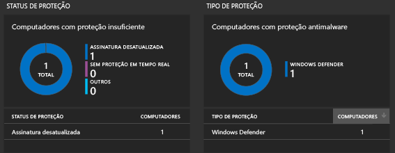
4. Para este exemplo, em **Status de proteção**, clique em **Assinatura desatualizada** para abrir a Pesquisa de Logs e exibir detalhes sobre os computadores que têm assinaturas desatualizadas. Neste exemplo, observe que o computador é chamado de *getstarted*. Se houver mais de um computador com assinaturas desatualizadas, eles serão exibidos nos resultados da Pesquisa de Log.  
    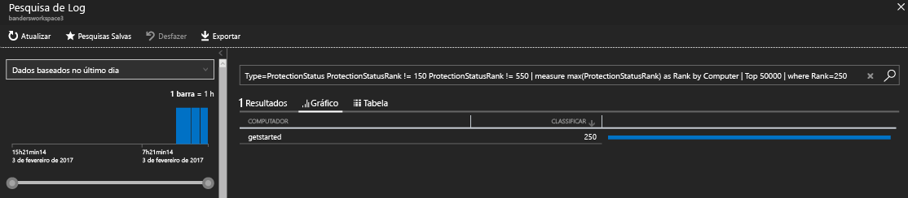

### Para exibir dados de Segurança e Auditoria

1. Na folha de seu espaço de trabalho, em **Geral**, clique em **Visão geral**.  
2. Clique no bloco **Segurança e Auditoria**. Neste exemplo, você pode ver que há dois problemas importantes: há um computador com atualizações críticas ausentes e há um computador com proteção insuficiente.  
    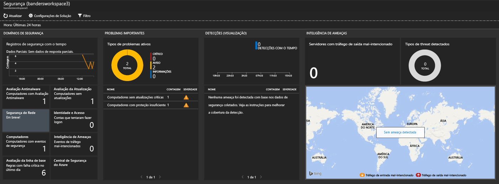
3. Para este exemplo, em **Problemas Importantes**, clique em **Computadores sem atualizações críticas** para abrir a Pesquisa de Logs e exibir detalhes sobre computadores, com atualizações críticas ausentes. Neste exemplo, há uma atualização crítica ausente e 63 outras atualizações ausentes.  
    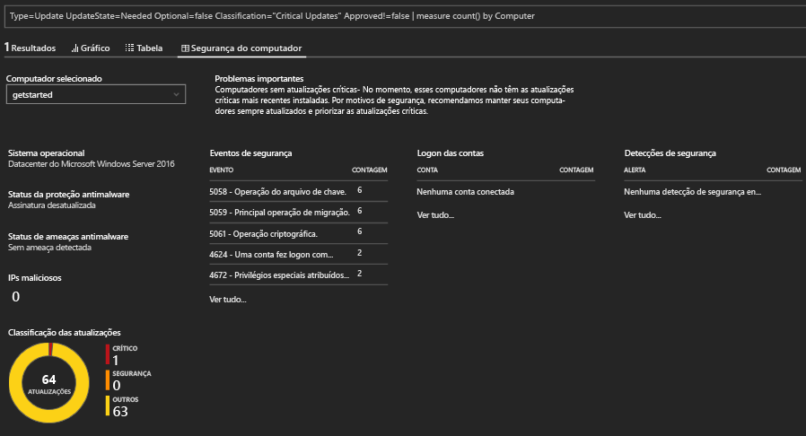

### Para exibir e agir em relação dados de Atualização do Sistema

1. Na folha de seu espaço de trabalho, em **Geral**, clique em **Visão geral**.  
2. Clique no bloco **Avaliação de Atualização do Sistema**. Neste exemplo, você pode ver que há um computador Windows chamado *getstarted* que precisa de atualizações críticas e um que precisa de atualizações de definição.  
    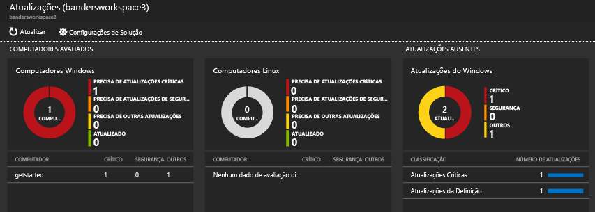
3. Para este exemplo, em **Atualizações Ausentes**, clique em **Atualizações Críticas** para abrir a Pesquisa de Logs e exibir detalhes sobre computadores com atualizações críticas ausentes. Neste exemplo, há uma atualização ausente e há uma atualização necessária.  
    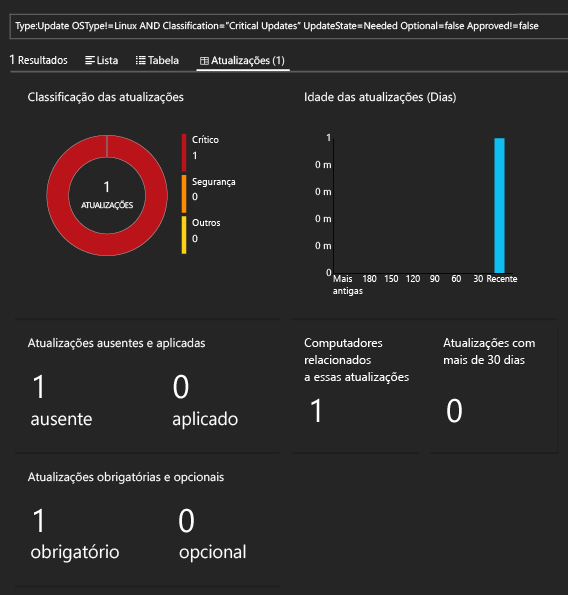
4. Acesse o site do [Operations Management Suite](http://microsoft.com/oms) e entre com sua conta do Azure. Quando conectado, observe que as informações da solução são semelhantes ao que você vê no portal do Azure.  
    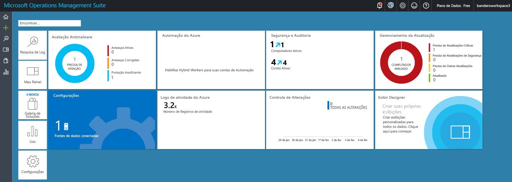
5. Clique no bloco **Gerenciamento de Atualização**.
6. No painel de Gerenciamento de Atualização, observe que as informações de atualização do sistema são semelhantes às informações de Atualização de Sistema que você viu no portal do Azure. No entanto, o bloco **Gerenciar Implantações de Atualização** é novo. Clique no bloco **Gerenciar Implantações de Atualização**.  
    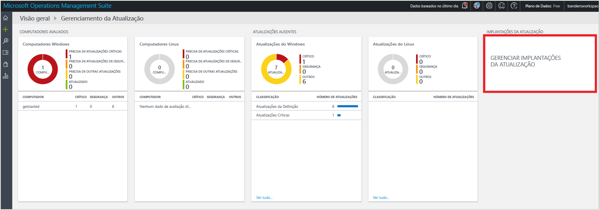
7. Na página **Atualizar Implantações**, clique em **Adicionar** para criar uma *execução de atualização*.  
    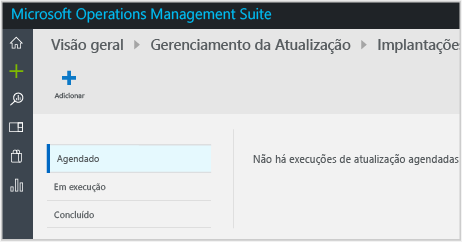
8.  Na página **Nova Implantação de Atualização**, digite um nome para a implantação de atualização, selecione os computadores para atualizar (neste exemplo, *getstarted*), escolha uma agenda e clique em **Salvar**.  
    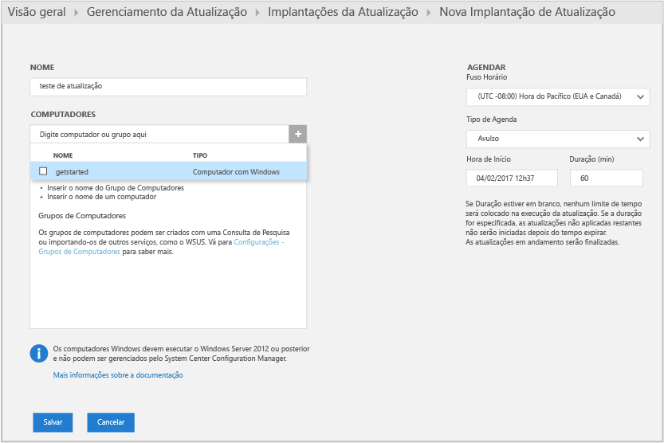  
    Após salvar a implantação de atualização, você verá a atualização agendada.  
    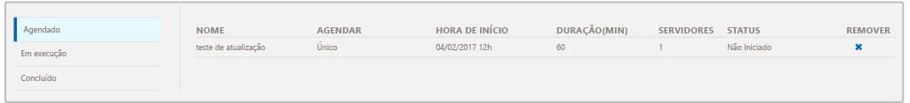  
    Após a execução de atualização ser concluída, o status exibirá **Concluído**.
    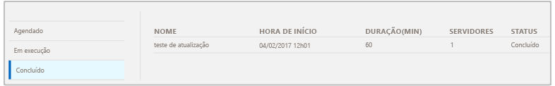
9. Após a execução de atualização, você pode exibir se a execução foi bem-sucedida ou não e pode exibir detalhes sobre as atualizações às quais ela foi aplicada.

## Após a avaliação

Neste tutorial, você instalou um agente em uma máquina virtual e começou a trabalhar rapidamente. As etapas que você seguiu foram rápidas e simples. No entanto, a maioria das grandes organizações e empresas tem infraestruturas de TI locais complexas. Portanto, a coleta de dados nesses ambientes complexos requer mais planejamento e esforço do que o tutorial. Examine as informações na seção Próximas etapas a seguir para obter links para artigos úteis.

Opcionalmente, você pode remover o espaço de trabalho que criou com este tutorial.

## Próximas etapas
* Saiba como conectar [agentes do Windows](log-analytics-windows-agents.md) à Log Analytics.
* Saiba como conectar [agentes do Operations Manager](log-analytics-om-agents.md) à Log Analytics.
* [Adicionar soluções do Log Analytics da Galeria de Soluções](log-analytics-add-solutions.md) para adicionar funcionalidade e obter dados.
* Familiarize-se com as [pesquisas de log](log-analytics-log-searches.md) para exibir informações detalhadas reunidas por soluções.

