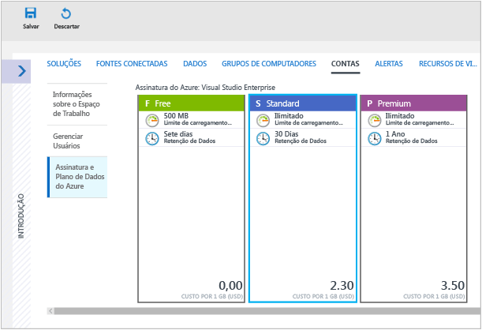
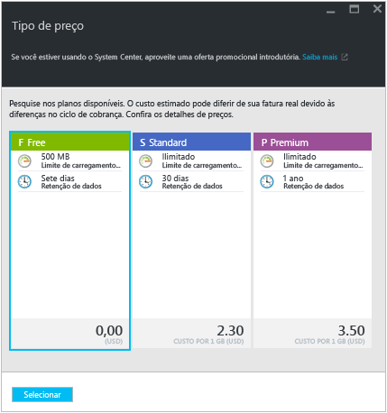
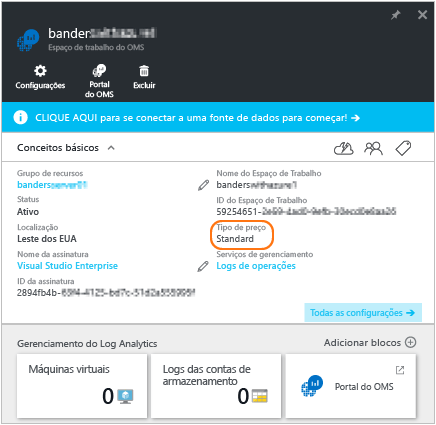
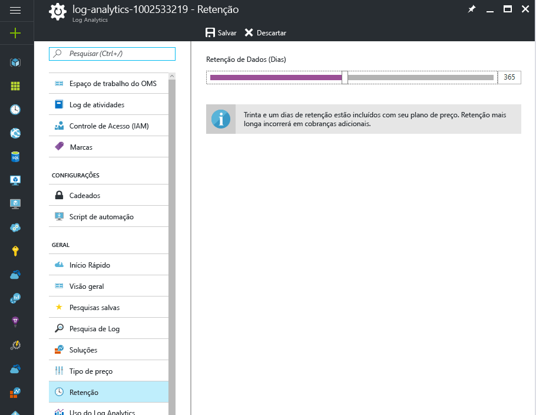
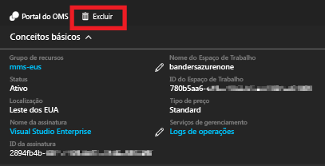

# Gerenciar espaços de trabalho

Para gerenciar o acesso ao Log Analytics, você executa várias tarefas administrativas relacionadas aos espaços de trabalho. Este artigo fornece conselhos de práticas recomendados e os procedimentos para gerenciar espaços de trabalho. Um espaço de trabalho é essencialmente um contêiner que inclui informações da conta e informações de configuração simples para a conta. Você ou outros membros de sua organização podem usar vários espaços de trabalho para gerenciar diferentes conjuntos de dados que são coletados de todos ou de partes da sua infraestrutura de TI.

Para criar um espaço de trabalho, você precisa:

1. Tenho uma assinatura do Azure.
2. Escolher um nome para o espaço de trabalho.
3. Associar sua assinatura ao espaço de trabalho.
4. Escolher uma localização geográfica.

## Determinar o número de espaços de trabalho que você precisa
Um espaço de trabalho é um recurso do Azure e é um contêiner no qual os dados são coletados, agregados, analisados e apresentados no portal do Azure.

É possível criar vários espaços de trabalho para que os usuários tenham acesso a um ou mais espaços de trabalho. Minimizar o número de espaços de trabalho permite consultar e correlacionar entre a maior parte dos dados. Esta seção descreve quando pode ser útil criar mais de um espaço de trabalho.

Hoje, um espaço de trabalho fornece:

* Uma localização geográfica para o armazenamento dos dados
* Granularidade de cobrança
* Isolamento dos dados
* Escopo de configuração

Com base nas características anteriores, pode ser útil criar vários espaços de trabalho se:

* Você é uma empresa global e precisa de dados armazenados em regiões específicas por motivos de soberania de dados ou conformidade.
* Você usa o Azure e deseja evitar encargos de transferência de dados de saída com um espaço de trabalho na mesma região que os recursos do Azure que ele gerencia.
* Você deseja alocar os encargos para diferentes departamentos ou grupos de negócios com base no uso. Quando você cria um espaço de trabalho para cada departamento ou grupo de negócios, a instrução de fatura e uso do Azure mostra os encargos de cada espaço de trabalho separadamente.
* Você é um provedor de serviço gerenciado e precisa para manter os dados do Log Analytics para cada cliente que você gerencia isolados dos de outros clientes.
* Você gerencia vários clientes e deseja que cada cliente/departamento/grupo de negócios veja seus próprios dados, mas não os dados de outras pessoas.

Ao usar agentes para coletar dados, você pode configurar cada agente para relatar para um ou mais espaços de trabalho.

Se você estiver usando o System Center Operations Manager, cada grupo de gerenciamento do Operations Manager poderá ser conectado a apenas um espaço de trabalho. Você pode instalar o Microsoft Monitoring Agent em computadores gerenciados pelo Operations Manager e fazer o agente relatar ao Operations Manager e a um espaço de trabalho do Log Analytics diferente.

### Informações do espaço de trabalho

Você pode exibir detalhes sobre o espaço de trabalho no portal do Azure. Você também pode exibir detalhes no portal do OMS.

#### Exibir informações do espaço de trabalho no portal do Azure

1. Se ainda não tiver feito isso, entre no [portal do Azure](https://portal.azure.com) usando a sua assinatura do Azure.
2. No menu **Hub**, clique em **Mais serviços** e, na lista de recursos, digite **Log Analytics**. Quando você começa a digitar, a lista é filtrada com base em sua entrada. Clique em **Log Analytics**.  
      
3. Na folha de assinaturas do Log Analytics, selecione um espaço de trabalho.
4. A folha de espaço de trabalho exibe detalhes sobre o espaço de trabalho e links para obter informações adicionais.  
      

## Gerenciar contas e usuários
Cada espaço de trabalho pode ter várias contas de usuário associadas e cada conta de usuário (conta da Microsoft ou conta Organizacional) pode ter acesso a vários espaços de trabalho.

Por padrão, a conta da Microsoft ou a conta Organizacional usada para criar o espaço de trabalho torna-se o Administrador do espaço de trabalho. O administrador pode convidar contas adicionais da Microsoft ou selecionar os usuários no Azure Active Directory.

A concessão de acesso ao espaço de trabalho é controlada em dois locais:

* No Azure, você pode usar o controle de acesso baseado em função para fornecer acesso à assinatura do Azure e os recursos do Azure associados. Essas permissões também são usadas para acesso à API REST e ao PowerShell.
* No portal do OMS, acesse apenas o portal do OMS - não a assinatura do Azure associada.

Para ver os dados em blocos de solução de Backup e Site Recovery, é necessário ter permissão de administrador ou coadministrador para a assinatura do Azure que o espaço de trabalho está vinculado a.   

### Gerenciar o acesso ao Log Analytics usando o Portal do Azure
Se você fornecer acesso às pessoas ao espaço de trabalho do Log Analytics usando as permissões do Azure, no portal do Azure por exemplo, então, os mesmo usuários poderão acessar o portal do Log Analytics. Se os usuários estiverem no portal do Azure, eles poderão navegar para o portal do OMS clicando na tarefa **Portal do OMS** ao exibirem o recurso do espaço de trabalho do Log Analytics.

Alguns pontos a ter em mente sobre o portal do Azure:

* Este não é o *Controle de Acesso Baseado em Função*. Se você tiver permissões de acesso do *Leitor* no portal do Azure para o espaço de trabalho do Log Analytics, então, você poderá fazer alterações usando o portal do OMS. O Portal do OMS tem um conceito de Usuário Administrador, Colaborador e Somente Leitura. Se a conta à qual você está conectado estiver no Azure Active Directory vinculado ao espaço de trabalho, você será um Administrador no portal do OMS; caso contrário, será um Colaborador.
* Ao entrar no portal do OMS usando http://mms.microsoft.com, por padrão, você verá a lista **Selecionar um espaço de trabalho**. Ela contém apenas espaços de trabalho que foram adicionados usando o portal do OMS. Para ver os espaços de trabalho aos quais você tem acesso com as assinaturas do Azure, será necessário especificar um locatário como parte da URL. Por exemplo:

  `mms.microsoft.com/?tenant=contoso.com` O identificador do locatário costuma ser a última parte do endereço de email que você usa para entrar.
* Se a conta com a qual você entrar for uma conta no locatário do Azure Active Directory, você será um *Administrador* no portal do OMS. Isso normalmente ocorre, a menos que você esteja entrando como um CSP.  Se sua conta não estiver no Azure Active Directory do locatário, você será um *Usuário* no portal do OMS.
* Se você quiser navegar diretamente para um portal ao qual tem acesso por meio das permissões do Azure, será necessário especificar o recurso como parte da URL. É possível obter essa URL usando o PowerShell.

  Por exemplo: `(Get-AzureRmOperationalInsightsWorkspace).PortalUrl`.

  A URL é semelhante: `https://eus.mms.microsoft.com/?tenant=contoso.com&resource=%2fsubscriptions%2faaa5159e-dcf6-890a-a702-2d2fee51c102%2fresourcegroups%2fdb-resgroup%2fproviders%2fmicrosoft.operationalinsights%2fworkspaces%2fmydemo12`

Por exemplo, para adicionar ou remover soluções de gerenciamento, o usuário deve ser um administrador ou colaborador da assinatura do Azure ao usar o Portal do Azure. Além disso, o usuário deve ser membro da função de colaborador ou administrador do espaço de trabalho OMS no portal do OMS.

### Gerenciar usuários no Portal do OMS
Você gerencia os usuários e o grupo na guia **Gerenciar Usuários** sob a guia **Contas** na página Configurações.   

#### Adicionar um usuário a um espaço de trabalho existente
Use as seguintes etapas para adicionar um usuário ou grupo a um espaço de trabalho.

1. No portal do OMS, clique no bloco **Configurações**.
2. Clique na guia **Contas**, em seguida, clique na guia **Gerenciar Usuários**.
3. Na seção **Gerenciar Usuários**, escolha o tipo de conta a adicionar: **Conta Organizacional**, **Conta da Microsoft**, **Suporte da Microsoft**.

   * Se você escolher Conta da Microsoft, digite o endereço de email do usuário associado à Conta da Microsoft.
   * Se escolher Conta Organizacional, você poderá digitar parte do nome ou alias de email do usuário ou do grupo, e uma lista de usuários e grupos correspondentes será mostrada em uma caixa suspensa. Selecione um usuário ou um grupo.
   * Use o Suporte da Microsoft para fornecer a um engenheiro do Suporte da Microsoft ou a outro funcionário da Microsoft acesso temporário a seu espaço de trabalho para ajudar a solucionar problemas.

     > [!NOTE]
     > Para ter melhores resultados de desempenho, limite o número de grupos do Active Directory associados a uma única conta do OMS a três, um para administradores, um para colaboradores e outro para usuários somente leitura. Usar mais grupos pode afetar o desempenho do Log Analytics.
     >
     >
4. Escolha o tipo de usuário ou grupo a adicionar: **Administrador**, **Colaborador** ou **Usuário de Somente Leitura**.  
5. Clique em **Adicionar**.

   Se você estiver adicionando uma Conta da Microsoft, um convite para ingressar no espaço de trabalho será enviado ao email fornecido. Depois que o usuário seguir as instruções no convite para ingressar no OMS, ele poderá acessar esse espaço de trabalho.
   Se você estiver adicionando uma conta organizacional, o usuário poderá acessar o Log Analytics imediatamente.  

#### Editar um tipo de usuário existente
Você pode alterar a função da conta de um usuário associado à sua conta do OMS. Você tem as seguintes opções de função:

* *Administrador*: pode gerenciar os usuários, exibir e agir em todos os alertas, adicionar e remover servidores
* *Contribuidor*: pode exibir e agir em todos os alertas, adicionar e remover servidores
* *Usuário Somente Leitura*: os usuários marcados como somente leitura não podem:

  1. Adicione/remova as soluções. A galeria de soluções está oculta.
  2. Adicione/modifique/remova os blocos em **Meu Painel**.
  3. Exiba as páginas **Configurações**. As páginas estão ocultas.
  4. Na exibição Pesquisa, a configuração do PowerBI, Pesquisas Salvas e tarefas de Alertas estão ocultas.

#### Para editar uma conta
1. No portal do OMS, clique no bloco **Configurações**.
2. Clique na guia **Contas**, em seguida, clique na guia **Gerenciar Usuários**.
3. Selecione a função do usuário que você deseja alterar.
4. Na caixa de diálogo de confirmação, clique em **Sim**.

### Remover um usuário de um espaço de trabalho
Use as seguintes etapas para remover um usuário de um espaço de trabalho. Remover o usuário não fecha o espaço de trabalho. Em vez disso, remove a associação entre o usuário e o espaço de trabalho. Se um usuário estiver associado a vários espaços de trabalho, ele ainda poderá entrar no OMS e ver os outros espaços de trabalho.

1. No portal do OMS, clique no bloco **Configurações**.
2. Clique na guia **Contas**, em seguida, clique na guia **Gerenciar Usuários**.
3. Clique em **Remover** ao lado do nome de usuário que você deseja remover.
4. Na caixa de diálogo de confirmação, clique em **Sim**.

### Adicionar um grupo a um espaço de trabalho existente
1. Siga as etapa 1 a 4 em “Para adicionar um usuário a um espaço de trabalho existente”, acima.
2. Em **Escolher Usuário/Grupo**, selecione **Grupo**.  
   
3. Insira o Nome de Exibição ou Endereço de email para o grupo que você deseja adicionar.
4. Selecione o grupo nos resultados da lista e clique em **Adicionar**.

## Vincular um espaço de trabalho existente a uma assinatura do Azure
Todos os espaços de trabalho criados depois de 26 de setembro de 2016 devem ser vinculados a uma assinatura do Azure no momento da criação. Espaços de trabalho criados antes dessa data deverão ser vinculados a um espaço de trabalho quando você entrar pela próxima vez. Quando você cria o espaço de trabalho no Portal do Azure ou vincula seu espaço de trabalho a uma assinatura do Azure, o Azure Active Directory é vinculado à sua conta organizacional.

> [!IMPORTANT]
> Para vincular um espaço de trabalho, sua conta do Azure já deve ter acesso ao espaço de trabalho que você deseja vincular.  Em outras palavras, a conta usada para acessar o portal do Azure deve ser **igual** à conta usada para acessar seu espaço de trabalho. Para fazer isso, confira [Adicionar um usuário a um espaço de trabalho existente](#add-a-user-to-an-existing-workspace).
>
>

### Para vincular um espaço de trabalho a uma assinatura do Azure no portal do OMS
Para vincular um espaço de trabalho a uma assinatura do Azure no portal do OMS, o usuário conectado já deve ter uma conta do Azure paga.

1. No portal do OMS, clique no bloco **Configurações**.
2. Clique na guia **Contas**, em seguida, clique na guia **Plano de Assinatura e Dados do Azure**.
3. Clique no plano de dados que você deseja usar.
4. Clique em **Salvar**.  
   

Seu novo plano de dados é exibido na faixa de opções do portal do OMS, na parte superior da página da Web.

### Para vincular um espaço de trabalho a uma assinatura do Azure no portal do Azure
1. Faça logon no [Portal do Azure](http://portal.azure.com).
2. Procure pelo **Log Analytics** e selecione-o.
3. Você vê sua lista de espaços de trabalho existentes. Clique em **Adicionar**.  
   
4. No **Espaço de Trabalho do OMS**, clique em **ou no link existente**.  
   
5. Clique em **Definir configurações obrigatórias**.  
   
6. Você vê a lista de espaços de trabalho que ainda não estão vinculados à sua conta do Azure. Selecione um espaço de trabalho.  
   
7. Se necessário, você pode alterar os valores para os seguintes itens:
   * Assinatura
   * Grupo de recursos
   * Local padrão
   * Tipo de preço   
     
8. Clique em **OK**. O espaço de trabalho agora está vinculado à sua conta do Azure.

> [!NOTE]
> Caso você não veja o espaço de trabalho que deseja vincular aqui, sua assinatura do Azure não tem acesso ao espaço de trabalho que você criou usando o site da Web do OMS.  Para conceder acesso a essa conta no portal do OMS, consulte [adicionar um usuário a um espaço de trabalho](#add-a-user-to-an-existing-workspace).
>
>

## Atualizar um espaço de trabalho para um plano pago
Há três tipos de plano de espaço de trabalho para OMS: **Gratuito**, **Autônomo** e **OMS**.  Se você estiver usando o plano *Gratuito*, haverá um limite de 500 MB de dados por dia enviados para o Log Analytics.  Se exceder esse valor, você precisará alterar o espaço de trabalho para um plano pago para não coletar dados acima do limite. Você pode alterar seu tipo de plano a qualquer momento.  Para obter mais informações sobre os preços do OMS, consulte [Detalhes do Preço](https://www.microsoft.com/en-us/cloud-platform/operations-management-suite-pricing).

### Usar os direitos de uma assinatura do OMS
Para usar os direitos provenientes da aquisição de OMS E1, OMS E2 OMS ou Complemento do OMS para System Center, escolha o plano *OMS* do Log Analytics do OMS.

Quando você adquire uma assinatura do OMS, os direitos são adicionados ao Enterprise Agreement. Qualquer assinatura do Azure criada seguindo esse contrato pode usar os direitos. Isso permite que você, por exemplo, tenha vários espaços de trabalho que usam os direitos das assinaturas do OMS.

Para garantir que o uso de um espaço de trabalho seja aplicado aos seus direitos da assinatura do OMS, você precisa:

1. Criar o espaço de trabalho em uma assinatura do Azure que faz parte do Enterprise Agreement que inclui a assinatura do OMS
2. Selecione o plano *OMS* para o espaço de trabalho

> [!NOTE]
> Se o espaço de trabalho tiver sido criado antes de 26 de setembro de 2016 e seu plano de preços do Log Analytics for *Premium*, esse espaço de trabalho usará direitos do Complemento do OMS para o System Center. Você também pode usar seus direitos alterando para o tipo de preços *OMS*.
>
>

Os direitos de assinatura do OMS não são visíveis no portal do Azure ou do OMS. Você pode ver os direitos e o uso no Portal Enterprise.  

Se você precisar alterar a assinatura do Azure vinculada ao seu espaço de trabalho, poderá usar o cmdlet do Azure PowerShell [Move-AzureRmResource](https://msdn.microsoft.com/library/mt652516.aspx) .

### Usar o Azure Commitment de um Enterprise Agreement
Se não tiver uma assinatura do OMS, você pagará separadamente por cada componente do OMS, e o uso será exibido em sua conta do Azure.

Se você tiver um compromisso monetário do Azure no registro enterprise ao qual suas assinaturas do Azure estão vinculadas, qualquer uso do Log Analytics automaticamente debitará qualquer compromisso monetário restante.

Se você precisar alterar a assinatura do Azure vinculada ao seu espaço de trabalho, poderá usar o cmdlet do Azure PowerShell [Move-AzureRmResource](https://msdn.microsoft.com/library/mt652516.aspx) .  

### Alterar um espaço de trabalho para um tipo de preço pago
1. Faça logon no [Portal do Azure](http://portal.azure.com).
2. Procure pelo **Log Analytics** e selecione-o.
3. Você vê sua lista de espaços de trabalho existentes. Selecione um espaço de trabalho.  
4. Na folha do espaço de trabalho, em **Geral**, clique em **Tipo de preço**.  
5. Em **Tipo de preço**, clique em selecionar um tipo de preço e clique em **Selecionar**.  
    
6. Ao atualizar sua exibição do Portal do Azure, você vê o **Tipo de preço** atualizado para o tipo selecionado.  
    

> [!NOTE]
> Se o seu espaço de trabalho está vinculado a uma conta de automação, antes de poder selecionar o tipo de preços *Autônomo (por GB)*, deve excluir quaisquer soluções de **Automação e Controle** e desvincular a conta de Automação. Na folha do espaço de trabalho, em **geral**, clique em **soluções** para ver e excluir soluções. Para desvincular a conta de automação, clique no nome da conta de automação na folha **Tipo de preços**.
>
>

## Alterar o tempo que o Log Analytics leva para armazenar dados

No tipo de preço Gratuito, o Log Analytics disponibiliza os últimos sete dias de dados.
No tipo de preço Standard, o Log Analytics disponibiliza os últimos 30 dias de dados.
No tipo de preço Premium, o Log Analytics disponibiliza os últimos 365 dias de dados.
Nos tipos de preço Autônomo e OMS, o Log Analytics disponibiliza por padrão os últimos 31 dias de dados.

Quando você usa as faixas de preço OMS e Autônomo, você pode manter até 2 anos de dados (730 dias). Dados armazenados por mais tempo do que o padrão de 31 dias acarreta um custo por retenção de dados. Para obter mais informações sobre preços, consulte [encargos excedentes](https://azure.microsoft.com/pricing/details/log-analytics/).

Para alterar o período de retenção de dados:

1. Faça logon no [Portal do Azure](http://portal.azure.com).
2. Procure pelo **Log Analytics** e selecione-o.
3. Você vê sua lista de espaços de trabalho existentes. Selecione um espaço de trabalho.  
4. Na folha do espaço de trabalho, em **Geral**, clique em **Retenção**.  
5. Use o controle deslizante para aumentar ou diminuir o número de dias de retenção e, em seguida, clique em **alvar**

## Alterar uma Organização do Azure Active Directory para um espaço de trabalho

Você pode alterar a organização do Azure Active Directory de um espaço de trabalho. Alterar a organização do Azure Active Directory permite adicionar usuários e grupos do diretório ao espaço de trabalho.

### Para alterar uma Organização do Azure Active Directory para um espaço de trabalho

1. Na página Configurações no portal do OMS, clique em **Contas** e clique na guia **Gerenciar Usuários**.  
2. Examine as informações sobre as contas organizacionais e clique em **Alterar Organização**.  
    
3. Insira as informações de identidade para o administrador do domínio do Azure Active Directory. Posteriormente, você vê uma confirmação informando que seu espaço de trabalho está vinculado ao domínio do Azure Active Directory.  
    

## Excluir um espaço de trabalho do Log Analytics
Quando você exclui um espaço de trabalho do Log Analytics, todos os dados relacionados ao espaço de trabalho são excluídos do serviço OMS dentro de 30 dias.

Se você for um administrador e houver vários usuários associados ao espaço de trabalho, a associação entre os usuários e o espaço de trabalho será interrompida. Se os usuários estiverem associados a outros espaços de trabalho, eles poderão continuar usando as OMS com esses outros espaços. No entanto, se eles não estiverem associados a outros espaços de trabalho, precisarão criar um espaço de trabalho para usar o OMS.

### Para excluir um espaço de trabalho
1. Faça logon no [Portal do Azure](http://portal.azure.com).
2. Procure pelo **Log Analytics** e selecione-o.
3. Você vê sua lista de espaços de trabalho existentes. Selecione o espaço de trabalho que você deseja excluir.
4. Na folha do espaço de trabalho, clique em **Excluir**.  
    
5. Na caixa de diálogo de confirmação da exclusão do espaço de trabalho, clique em **Sim**.

## Próximas etapas
* Consulte [Conectar computadores Windows ao Log Analytics](log-analytics-windows-agents.md) para adicionar agentes e coletar dados.
* [Adicionar soluções do Log Analytics da Galeria de Soluções](log-analytics-add-solutions.md) para adicionar funcionalidade e obter dados.
* [Definir configurações de proxy e firewall no Log Analytics](log-analytics-proxy-firewall.md) se sua organização usar um servidor proxy ou firewall para que os agentes possam se comunicar com o serviço do Log Analytics.

