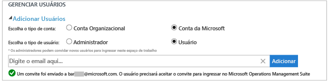
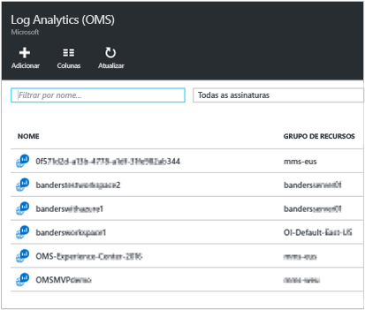
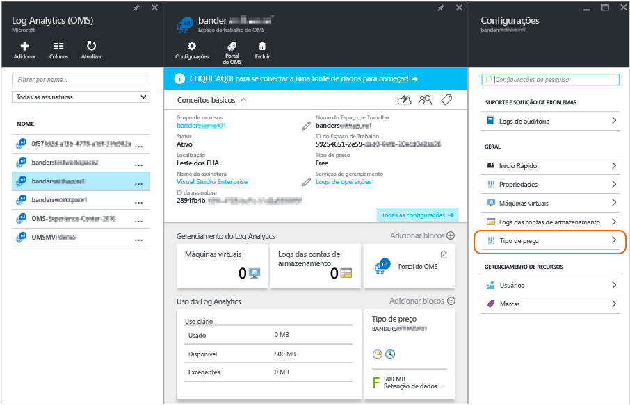

<properties
	pageTitle="Gerenciar o acesso ao Log Analytics | Microsoft Azure"
	description="Gerencie o acesso ao Log Analytics usando uma variedade de tarefas administrativas em usuários, contas, espaços de trabalho do OMS e contas do Azure."
	services="log-analytics"
	documentationCenter=""
	authors="bandersmsft"
	manager="jwhit"
	editor=""/>

<tags
	ms.service="log-analytics"
	ms.workload="na"
	ms.tgt_pltfrm="na"
	ms.devlang="na"
	ms.topic="article"
	ms.date="04/28/2016"
	ms.author="banders"/>

# Gerenciar o acesso ao Log Analytics

Para gerenciar o acesso ao Log Analytics, você usará uma variedade de tarefas administrativas em usuários, contas, espaços de trabalho do OMS e contas do Azure. Para criar um novo espaço de trabalho no OMS (Operations Management Suite), escolha um nome do espaço de trabalho, associe-o à sua conta e escolha uma localização geográfica. Um espaço de trabalho é essencialmente um contêiner que inclui informações da conta e informações de configuração simples para a conta. Você ou outros membros de sua organização podem usar vários espaços de trabalho do OMS para gerenciar diferentes conjuntos de dados que são coletados de todos ou de partes da sua infraestrutura de TI.

O artigo [Introdução ao Log Analytics](log-analytics-get-started.md) mostra como começar rapidamente e o restante deste artigo descreve em detalhes algumas das ações necessárias para gerenciar o acesso ao OMS.

Embora talvez não seja necessário executar todas as tarefas de gerenciamento primeiramente, vamos abordar todas as tarefas geralmente usadas que você poderia usar nas seções a seguir:

- Gerenciar contas e usuários
- Adicionar um grupo a um espaço de trabalho existente
- Determinar o número de espaços de trabalho que você precisa
- Vincular um espaço de trabalho existente a uma assinatura do Azure
- Atualizar um espaço de trabalho para um plano de dados pago
- Alterar um tipo de plano de dados
- Adicionar uma Organização do Active Directory do Azure a um espaço de trabalho existente
- Controlar o acesso aos recursos do Log Analytics do OMS
- Fechar seu espaço de trabalho do OMS

## Gerenciar contas e usuários
Gerencie as contas e usuários com a guia **Contas** na página Configurações. Nele, você poderá executar as tarefas mostradas nas seções a seguir.

### Adicionar um usuário a um espaço de trabalho existente

Use as seguintes etapas para adicionar um usuário ou grupo a um espaço de trabalho do OMS. O usuário ou o grupo poderá exibir e atuar em todos os alertas associados a esse espaço de trabalho.

>[AZURE.NOTE] Se quiser adicionar um usuário ou grupo por meio de sua conta organizacional do Azure Active Directory, verifique primeiro se você associou sua conta do OMS ao domínio do Active Directory. Consulte [Adicionar uma Organização do Active Directory do Azure a um espaço de trabalho existente](#add-an-azure-active-directory-organization-to-an-existing-workspace).

#### Para adicionar um usuário a um espaço de trabalho existente
1. No OMS, clique no bloco **Configurações**.
2. Clique na guia **Contas**.
3. Na seção **Gerenciar Usuários**, escolha o tipo de conta a ser adicionado: **Conta Organizacional** ou **Conta da Microsoft**.
    - Se você escolher Conta da Microsoft, digite o endereço de email do usuário associado à Conta da Microsoft.
    - Se você escolher Conta Organizacional, poderá inserir parte do nome ou do alias de email do grupo ou do usuário e uma lista de usuários e de grupos será exibida. Selecione um usuário ou um grupo.

    >[AZURE.NOTE] Para ter melhores resultados de desempenho, limite o número de grupos do Active Directory associados a uma única conta do OMS a dois, uma para os administradores e outro para os usuários. Usar mais grupos pode afetar o desempenho do Log Analytics.

7. Escolha o tipo de usuário ou de grupo a ser adicionado: **Administrador** ou **Usuário**.
8. Clique em **Adicionar**.

  Se você estiver adicionando uma Conta da Microsoft, um convite para ingressar no espaço de trabalho será enviado ao email fornecido. Depois de o usuário seguir as instruções no convite para ingressar no OMS, o usuário poderá exibir os alertas e as informações da conta para essa conta do OMS, e você poderá exibir as informações do usuário na guia **Contas** da página **Configurações**. Se você estiver adicionando uma conta organizacional, o usuário será capaz de acessar o Log Analytics imediatamente. 

### Editar um tipo de usuário existente

Você pode alterar a função da conta de um usuário associado à sua conta do OMS. Você tem as seguintes opções de função:

 - *Administrador*: pode gerenciar os usuários, exibir e agir em todos os alertas, adicionar e remover servidores

 - *Usuário*: pode exibir e agir em todos os alertas, adicionar e remover servidores

#### Para editar uma conta
1. Na página **Configurações**, na guia **Contas** no OMS, selecione a função do usuário que você deseja alterar.
2. Clique em **OK**.

## Remover um usuário de um espaço de trabalho do OMS

Use as seguintes etapas para remover um usuário de um espaço de trabalho do OMS. Observe que isso não fecha o espaço de trabalho do usuário. Em vez disso, remove a associação entre o usuário e o espaço de trabalho. Se um usuário estiver associado a vários espaços de trabalho, esse usuário ainda poderá entrar no OMS.

### Para remover um usuário de um espaço de trabalho

1. Na página **Configurações**, na guia **Contas** do OMS, clique em Remover ao lado do nome de usuário que você quer remover.
2. Clique em **OK** para confirmar que você deseja remover o usuário.

## Adicionar um grupo a um espaço de trabalho existente

1.	Siga as etapa 1 a 4 em “Para adicionar um usuário a um espaço de trabalho existente”, acima.
2.	Em **Escolher Usuário/Grupo**, selecione **Grupo**. 
3.	Insira o Nome de Exibição ou Endereço de email para o grupo que você deseja adicionar.
4.	Selecione o grupo nos resultados da lista e clique em **Adicionar**.

## Determinar o número de espaços de trabalho que você precisa

Um espaço de trabalho é visto como um recurso do Azure no Portal de Gerenciamento do Azure.

Você pode criar um novo espaço de trabalho ou vincular um espaço de trabalho existente que você pode ter aberto anteriormente para usar com o System Center Operations Manager, mas ainda não associou a uma assinatura do Azure (necessária para a cobrança).

Um espaço de trabalho representa o nível no qual os dados são coletados, agregados, analisados e apresentados no portal do OMS. Você pode optar por ter vários espaços de trabalho para separar os dados de diferentes ambientes e sistemas; cada grupo de gerenciamento do Operations Manager (e todos os seus agentes) ou VMs/agentes individuais podem ser conectados a apenas um espaço de trabalho.

Cada espaço de trabalho pode ter várias contas de usuário associadas e cada conta de usuário (conta da Microsoft ou conta Organizacional) pode ter acesso a vários espaços de trabalho do OMS.

Por padrão, a conta da Microsoft ou a conta Organizacional usada para criar o espaço de trabalho torna-se o Administrador do espaço de trabalho. O administrador pode convidar contas adicionais da Microsoft ou selecionar os usuários em seu Active Directory do Azure.

## Vincular um espaço de trabalho existente a uma assinatura do Azure

É possível criar um espaço de trabalho no site [microsoft.com/oms](https://microsoft.com/oms). No entanto, existem certos limites para esses espaços de trabalho, o mais notável sendo um limite de 500 MB/dia dos carregamentos de dados se você estiver usando uma conta gratuita. Para fazer alterações nesse espaço de trabalho, você precisará **vincular seu espaço de trabalho existente a uma assinatura do Azure**.

>[AZURE.IMPORTANT] Para vincular um espaço de trabalho, sua conta do Azure já deve ter acesso ao espaço de trabalho que você deseja vincular. Em outras palavras, a conta usada para acessar o portal do Azure deve ser **igual** à conta usada para acessar seu espaço de trabalho do OMS. Se este não for o caso, consulte [Adicionar um usuário a um espaço de trabalho existente](#add-a-user-to-an-existing-workspace).

1.	Entre no [Portal do Azure](http://portal.azure.com).
2.	Procure pelo **Log Analytics (OMS)** e selecione-o.
3.	Você verá sua lista de espaços de trabalho existentes. Clique em **Adicionar**. 
4.	Em **Espaço de Trabalho do OMS**, clique em **Ou link existente**. 
5.	Clique em **Definir configurações obrigatórias**. 
6.	Você verá a lista de espaços de trabalho que ainda não estão vinculadas à sua conta do Azure. Selecione um espaço de trabalho. 
7.	Se necessário, você pode alterar os valores para os seguintes itens:
    - Assinatura
    - Grupo de recursos
    - Local padrão
    - Tipo de preço 
8.	Clique em **Criar**. O espaço de trabalho agora está vinculado à sua conta do Azure.

>[AZURE.NOTE] Caso você não veja o espaço de trabalho que deseja vincular aqui, sua assinatura do Azure não tem acesso ao espaço de trabalho do OMS que você criou usando o site da Web do OMS. Você precisará conceder acesso a essa conta de dentro de seu espaço de trabalho do OMS usando o site. Para fazer isso, consulte [Adicionar um usuário a um espaço de trabalho existente](#add-a-user-to-an-existing-workspace).

## Atualizar um espaço de trabalho para um plano de dados pago

Há três tipos de plano de dados de espaço de trabalho para o OMS: **Gratuito**, **Standard** e **Premium**. Se você estiver usando um plano *gratuito*, poderá ter atingido o limite de dados de 500 MB. Você precisará atualizar seu espaço de trabalho para um '**plano pré-pago**' para coletar dados além desse limite. Você pode converter seu tipo de plano a qualquer momento. Para obter mais informações sobre preços do OMS, consulte [Detalhes de Preços](https://www.microsoft.com/pt-BR/server-cloud/operations-management-suite/pricing.aspx).

>[AZURE.IMPORTANT] Os planos do espaço de trabalho podem ser alterados apenas se eles estiverem *vinculados* a uma assinatura do Azure. Se você criou seu espaço de trabalho no Azure ou se *já* vinculou seu espaço de trabalho, poderá ignorar essa mensagem. Se você criou seu espaço de trabalho com o [site da Web do OMS](http://www.microsoft.com/oms), precisará seguir as etapas em [Vincular um espaço de trabalho existente a uma assinatura do Azure](#link-an-existing-workspace-to-an-azure-subscription).

### Usar os direitos do Complemento OMS para o System Center

O Complemento OMS para o System Center fornece um direito ao plano Premium do Log Analytics do OMS, descrito em [Preço do OMS](https://www.microsoft.com/pt-BR/server-cloud/operations-management-suite/pricing.aspx).

Se você comprar o Complemento do OMS para o System Center, sua equipe de conta da Microsoft ou revendedor associará os complementos do OMS ao Enterprise Agreement que inclui suas compras do Azure. O complemento do OMS cria um direito no seu contrato e qualquer assinatura do Azure pode usá-lo. Isso permite que você, por exemplo, tenha vários espaços de trabalho do OMS que usam os direitos do complemento do OMS.

Para garantir que o uso de um espaço de trabalho do OMS seja aplicado aos seus direitos do complemento do OMS, você precisará:

1. Vincular seu espaço de trabalho do OMS a uma assinatura do Azure que faz parte do Enterprise Agreement que inclui a compra do complemento do OMS e o uso da assinatura do Azure
2. Selecione o plano Premium para o espaço de trabalho

Ao examinar o uso no Portal do Azure ou do OMS, você não verá os direitos do complemento do OMS. No entanto, é possível vê-los no Portal Empresarial.

Se você precisar alterar a assinatura do Azure vinculada ao seu espaço de trabalho do OMS, poderá usar cmdlet do Azure PowerShell [Move-AzureRMResource](https://msdn.microsoft.com/library/mt652516.aspx).

### Usar o Azure Commitment de um Enterprise Agreement

Se você optar por usar um preço autônomo para componentes do OMS, pagará separadamente para cada componente do OMS e o uso aparecerá na sua cobrança do Azure.

Se você já pagou uma determinada quantia de uso do Azure como parte de seu Enterprise Agreement, o uso do OMS utilizará seu uso pré-pago. Para usar seu preço do Azure Commitment para o Log Analytics do OMS, a assinatura à qual o espaço de trabalho do OMS está vinculada precisa fazer parte do Azure Enterprise Agreement.

Se você precisar alterar a assinatura do Azure vinculada ao seu espaço de trabalho do OMS, poderá usar cmdlet do Azure PowerShell [Move-AzureRMResource](https://msdn.microsoft.com/library/mt652516.aspx).

### Alterar um espaço de trabalho para um plano de dados pago

1.	Entre no [Portal do Azure](http://portal.azure.com).
2.	Procure pelo **Log Analytics (OMS)** e selecione-o.
3.	Você verá sua lista de espaços de trabalho existentes. Selecione um espaço de trabalho. 
4.	Em **Configurações**, clique em **Tipo de preço**. 
5.	Em **Tipo de preço**, selecione um plano de dados e clique em **Selecionar**. 
6.	Ao atualizar sua exibição do Portal do Azure, você verá o **Tipo de preço** atualizado para o plano selecionado. 

Agora você pode coletar dados além do limite de dados "gratuito".

## Adicionar uma Organização do Active Directory do Azure a um espaço de trabalho existente

Você pode associar seu espaço de trabalho do OMS (Operational Insights) a um domínio do Azure Active Directory. Isso permite que você adicione usuários do Active Directory diretamente ao espaço de trabalho do OMS sem a necessidade de uma conta da Microsoft separada.

### Para adicionar uma Organização do Active Directory do Azure a um espaço de trabalho existente

1. Na página Configurações do OMS, clique em **Contas** e em **Informações de Espaço de Trabalho**.  
2. Examine as informações sobre as contas organizacionais e clique em **Adicionar Organização**. 
3. Insira as informações de identidade para o administrador do domínio do Azure Active Directory. Posteriormente, você verá uma confirmação informando que seu espaço de trabalho está vinculado ao seu domínio do Azure Active Directory. 

## Controlar o acesso aos recursos do Log Analytics do OMS

Conceder acesso ao espaço de trabalho do OMS é controlada em dois locais:

- Para acesso ao Portal do OMS, isto é gerenciado no próprio portal e é separado se as pessoas têm acesso às assinaturas do Azure na qual estão os recursos.
- Para acesso ao PowerShell e acesso direto à API REST, isso é gerenciado dentro do Azure no RBAC do Azure

Se você tiver concedido acesso ao portal do OMS, mas não à assinatura do Azure à qual ele está vinculado, os blocos de Automação, Backup e Recuperação de Site não mostrarão nenhum dado sobre o usuário ao entra no portal do OMS.

Para permitir que todos os usuários vejam os dados nessas soluções, verifique se eles têm pelo menos acesso de **leitor** à Conta de Automação, Cofre de Backup e cofre da Recuperação de Site vinculados ao espaço de trabalho do OMS.

## Fechar seu espaço de trabalho do OMS

Quando você fecha um espaço de trabalho de OMS, todos os dados relacionados ao espaço de trabalho são excluídos do serviço do OMS no máximo 30 dias depois de fechar o espaço de trabalho.

Se você for um administrador e houver vários usuários associados ao espaço de trabalho, a associação entre os usuários e o espaço de trabalho será interrompida. Se os usuários estiverem associados a outros espaços de trabalho, eles poderão continuar usando as OMS com esses outros espaços. No entanto, se eles não estiverem associados a outros espaços de trabalho, então, precisarão criar um novo espaço de trabalho para usar o OMS.

### Para fechar um espaço de trabalho do OMS

1. Na página **Configurações**, na guia **Contas** do OMS, clique em **Fechar Espaço de Trabalho**.

2. Selecione um dos motivos para fechar seu espaço de trabalho ou insira um motivo diferente na caixa de texto.

3. Clique em **Fechar espaço de trabalho**.

## Próximas etapas

- Consulte [Conectar computadores Windows ao Log Analytics](log-analytics-windows-agents.md) para adicionar agentes e coletar dados.
- [Adicionar soluções do Log Analytics por meio da Galeria de Soluções](log-analytics-add-solutions.md) para adicionar funcionalidades e reunir dados.
- [Definir configurações de proxy e firewall no Log Analytics](log-analytics-proxy-firewall.md) se sua organização usar um servidor proxy ou firewall para que os agentes possam se comunicar com o serviço do Log Analytics.

<!---HONumber=AcomDC_0504_2016-->