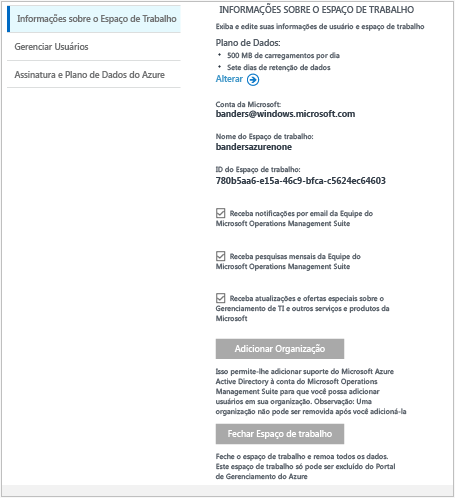

# Gerenciar o acesso ao Log Analytics
Para gerenciar o acesso ao Log Analytics, você usará uma variedade de tarefas administrativas em usuários, contas, espaços de trabalho do OMS e contas do Azure. Para criar um novo espaço de trabalho no OMS (Operations Management Suite), escolha um nome do espaço de trabalho, associe-o à sua conta e escolha uma localização geográfica. Um espaço de trabalho é essencialmente um contêiner que inclui informações da conta e informações de configuração simples para a conta. Você ou outros membros de sua organização podem usar vários espaços de trabalho do OMS para gerenciar diferentes conjuntos de dados que são coletados de todos ou de partes da sua infraestrutura de TI.

O artigo [Introdução ao Log Analytics](log-analytics-get-started.md) mostra como começar rapidamente e o restante deste artigo descreve em detalhes algumas das ações necessárias para gerenciar o acesso ao OMS.

Embora talvez não seja necessário executar todas as tarefas de gerenciamento primeiramente, vamos abordar todas as tarefas geralmente usadas que você poderia usar nas seções a seguir:

* Determinar o número de espaços de trabalho que você precisa
* Gerenciar contas e usuários
* Adicionar um grupo a um espaço de trabalho existente
* Vincular um espaço de trabalho existente a uma assinatura do Azure
* Atualizar um espaço de trabalho para um plano de dados pago
* Alterar um tipo de plano de dados
* Adicionar uma Organização do Active Directory do Azure a um espaço de trabalho existente
* Fechar seu espaço de trabalho do OMS

## Determinar o número de espaços de trabalho que você precisa
Um espaço de trabalho é um recurso do Azure e é um contêiner no qual os dados são coletados, agregados, analisados e apresentados no portal do OMS.

É possível criar vários espaços de trabalho do Log Analytics do OMS para que os usuários tenham acesso a um ou mais espaços de trabalho. Em geral é recomendável minimizar o número de espaços de trabalho, pois isso permite consultar e correlacionar a maioria dos dados. Esta seção descreve quando pode ser útil criar mais de um espaço de trabalho.

Hoje, o espaço de trabalho do Log Analytics fornece:

* Uma localização geográfica para o armazenamento dos dados
* Granularidade de cobrança
* Isolamento dos dados

Com base nas características acima, pode ser útil criar vários espaços de trabalho se:

* Você é uma empresa global e precisa de dados armazenados em regiões específicas por motivos de soberania de dados ou conformidade.
* Você usa o Azure e desejar evitar encargos de transferência de dados de saída tendo um espaço de trabalho do Log Analytics na mesma região que os recursos do Azure que ele gerencia.
* Você deseja alocar os encargos para diferentes departamentos ou grupos de negócios com base no uso. Quando você cria um espaço de trabalho para cada departamento ou grupo de negócios, a instrução de fatura e uso do Azure mostra os encargos de cada espaço de trabalho separadamente.
* Você é um provedor de serviço gerenciado e precisa para manter os dados do Log Analytics para cada cliente que você gerencia isolados dos de outros clientes.
* Você gerencia vários clientes e deseja que cada cliente, departamento ou grupo de negócios veja seus próprios dados, mas não os dos outros clientes, departamentos ou grupos de negócios.

Ao usar agentes para coletar dados, você pode configurar cada agente para relatar o espaço de trabalho necessário.

Se você estiver usando o System Center Operations Manager, cada grupo de gerenciamento do Operations Manager poderá ser conectado a apenas um espaço de trabalho. Você pode instalar o Microsoft Monitoring Agent em computadores gerenciados pelo Operations Manager e fazer o agente relatar ao Operations Manager e a um espaço de trabalho do Log Analytics diferente.

### Informações do espaço de trabalho
No portal do OMS, você pode exibir suas informações do espaço de trabalho e escolher se deseja receber informações da Microsoft.

#### Exibir informações do espaço de trabalho
1. No OMS, clique no bloco **Configurações** .
2. Clique na guia **Contas** .
3. Clique na guia **Informações do Espaço de Trabalho**.  
   

## Gerenciar contas e usuários
Cada espaço de trabalho pode ter várias contas de usuário associadas e cada conta de usuário (conta da Microsoft ou conta Organizacional) pode ter acesso a vários espaços de trabalho do OMS.

Por padrão, a conta da Microsoft ou a conta Organizacional usada para criar o espaço de trabalho torna-se o Administrador do espaço de trabalho. O administrador pode convidar contas adicionais da Microsoft ou selecionar os usuários no Azure Active Directory.

Conceder acesso ao espaço de trabalho do OMS é controlada em dois locais:

* No Azure, você pode usar o controle de acesso baseado em função para fornecer acesso à assinatura do Azure e os recursos do Azure associados. Isso também é usado para acesso à API REST e ao PowerShell.
* No portal do OMS, acesse apenas o portal do OMS - não a assinatura do Azure associada.

Se você der às pessoas acesso ao portal do OMS, mas não à assinatura do Azure à qual está vinculado, então, os blocos de solução de Automação, Backup e Recuperação de Site não mostrarão os dados para os usuários quando eles entrarem no portal do OMS.

Para permitir que todos os usuários vejam os dados nessas soluções, verifique se eles têm pelo menos acesso de **leitor** à Conta de Automação, Cofre de Backup e cofre da Recuperação de Site vinculados ao espaço de trabalho do OMS.   

### Gerenciar o acesso ao Log Analytics usando o Portal do Azure
Se você fornecer acesso às pessoas ao espaço de trabalho do Log Analytics usando as permissões do Azure, no portal do Azure por exemplo, então, os mesmo usuários poderão acessar o portal do Log Analytics. Se os usuários estiverem no portal do Azure, eles poderão navegar para o portal do OMS clicando na tarefa **Portal do OMS** ao exibirem o recurso do espaço de trabalho do Log Analytics.

Alguns pontos a ter em mente sobre o portal do Azure:

* Este não é o *Controle de Acesso Baseado em Função*. Se você tiver permissões de acesso do *Leitor* no portal do Azure para o espaço de trabalho do Log Analytics, então, você poderá fazer alterações usando o portal do OMS. O Portal do OMS tem um conceito de Usuário Administrador, Colaborador e Somente Leitura. Se a conta à qual você está conectado estiver no Azure Active Directory vinculado ao espaço de trabalho, você será um Administrador no portal do OMS, caso contrário, será um Colaborador.
* Quando você entrar no portal do OMS usando http://mms.microsoft.com, por padrão, verá a lista **Selecionar um espaço de trabalho**. Ela contém apenas espaços de trabalho que foram adicionados usando o portal do OMS. Para ver os espaços de trabalho aos quais você tem acesso com as assinaturas do Azure, será necessário especificar um locatário como parte da URL. Por exemplo:
  
  `mms.microsoft.com/?tenant=contoso.com` O identificador do locatário costuma ser a última parte do endereço de email com o qual você entra.
* Se a conta com a qual você entra for uma conta no Azure Active Directory do locatário, que é geralmente o caso, a menos que esteja entrando como um CSP, então, você será um *Administrador* no portal do OMS. Se sua conta não estiver no Azure Active Directory do locatário, você será um *Usuário* no portal do OMS.
* Se você quiser navegar diretamente para um portal ao qual tem acesso por meio das permissões do Azure, será necessário especificar o recurso como parte da URL. É possível obter essa URL usando o PowerShell.
  
  Por exemplo,  `(Get-AzureRmOperationalInsightsWorkspace).PortalUrl`.
  
  A URL será semelhante a: `https://eus.mms.microsoft.com/?tenant=contoso.com&resource=%2fsubscriptions%2faaa5159e-dcf6-890a-a702-2d2fee51c102%2fresourcegroups%2fdb-resgroup%2fproviders%2fmicrosoft.operationalinsights%2fworkspaces%2fmydemo12`

### Gerenciar usuários no Portal do OMS
Você gerencia os usuários e o grupo na guia **Gerenciar Usuários** sob a guia **Contas** na página Configurações. Nele, você poderá executar as tarefas mostradas nas seções a seguir.  

#### Adicionar um usuário a um espaço de trabalho existente
Use as seguintes etapas para adicionar um usuário ou grupo a um espaço de trabalho do OMS. O usuário ou o grupo poderá exibir e atuar em todos os alertas associados a esse espaço de trabalho.

> [!NOTE]
> Se quiser adicionar um usuário ou grupo por meio de sua conta organizacional do Azure Active Directory, verifique primeiro se você associou sua conta do OMS ao domínio do Active Directory. Consulte [Adicionar uma Organização do Active Directory do Azure a um espaço de trabalho existente](#add-an-azure-active-directory-organization-to-an-existing-workspace).
> 
> 

1. No OMS, clique no bloco **Configurações** .
2. Clique na guia **Contas**, em seguida, clique na guia **Gerenciar Usuários**.
3. Na seção **Gerenciar Usuários**, escolha o tipo de conta a adicionar: **Conta Organizacional**, **Conta da Microsoft**, **Suporte da Microsoft**.
   
   * Se você escolher Conta da Microsoft, digite o endereço de email do usuário associado à Conta da Microsoft.
   * Se você escolher Conta Organizacional, poderá inserir parte do nome ou do alias de email do grupo ou do usuário e uma lista de usuários e de grupos será exibida. Selecione um usuário ou um grupo.
   * Use o Suporte da Microsoft para conceder acesso temporário ao seu espaço de trabalho a um engenheiro de Suporte da Microsoft para que ele possa ajudar a solucionar problemas.
     
     > [!NOTE]
     > Para ter melhores resultados de desempenho, limite o número de grupos do Active Directory associados a uma única conta do OMS a três, um para administradores, um para colaboradores e outro para usuários somente leitura. Usar mais grupos pode afetar o desempenho do Log Analytics.
     > 
     > 
4. Escolha o tipo de usuário ou grupo a adicionar: **Administrador**, **Colaborador** ou **Usuário de Somente Leitura** .  
5. Clique em **Adicionar**.
   
   Se você estiver adicionando uma Conta da Microsoft, um convite para ingressar no espaço de trabalho será enviado ao email fornecido. Depois do usuário seguir as instruções no convite para ingressar no OMS, ele poderá exibir os alertas e informações da conta para essa conta do OMS e você poderá exibir as informações do usuário na guia **Contas** da página **Configurações**.
   Se você estiver adicionando uma conta organizacional, o usuário será capaz de acessar o Log Analytics imediatamente.  
   

#### Editar um tipo de usuário existente
Você pode alterar a função da conta de um usuário associado à sua conta do OMS. Você tem as seguintes opções de função:

* *Administrador*: pode gerenciar os usuários, exibir e agir em todos os alertas, adicionar e remover servidores
* *Contribuidor*: pode exibir e agir em todos os alertas, adicionar e remover servidores
* *Usuário Somente Leitura*: usuários marcados como somente leitura não poderão:
  
  1. Adicione/remova as soluções. A galeria de soluções está oculta.
  2. Adicione/modifique/remova os blocos em **Meu Painel**.
  3. Exiba as páginas **Configurações**. As páginas estão ocultas.
  4. Na exibição Pesquisa, a configuração do PowerBI, Pesquisas Salvas e tarefas de Alertas estão ocultas.

#### Para editar uma conta
1. No OMS, clique no bloco **Configurações** .
2. Clique na guia **Contas**, em seguida, clique na guia **Gerenciar Usuários**.
3. Selecione a função do usuário que você deseja alterar.
4. Na caixa de diálogo de confirmação, clique em **Sim**.

### Remover um usuário de um espaço de trabalho do OMS
Use as seguintes etapas para remover um usuário de um espaço de trabalho do OMS. Observe que isso não fecha o espaço de trabalho do usuário. Em vez disso, remove a associação entre o usuário e o espaço de trabalho. Se um usuário estiver associado a vários espaços de trabalho, esse usuário ainda poderá entrar no OMS e exibir os outros espaços de trabalho.

1. No OMS, clique no bloco **Configurações** .
2. Clique na guia **Contas**, em seguida, clique na guia **Gerenciar Usuários**.
3. Clique em **Remover** ao lado do nome de usuário que você deseja remover.
4. Na caixa de diálogo de confirmação, clique em **Sim**.

### Adicionar um grupo a um espaço de trabalho existente
1. Siga as etapa 1 a 4 em “Para adicionar um usuário a um espaço de trabalho existente”, acima.
2. Em **Escolher Usuário/Grupo**, selecione **Grupo**.
   
3. Insira o Nome de Exibição ou Endereço de email para o grupo que você deseja adicionar.
4. Selecione o grupo nos resultados da lista e clique em **Adicionar**.

## Vincular um espaço de trabalho existente a uma assinatura do Azure
É possível criar um espaço de trabalho no site [microsoft.com/oms](https://microsoft.com/oms) .  No entanto, existem certos limites para esses espaços de trabalho, o mais notável sendo um limite de 500 MB/dia dos carregamentos de dados se você estiver usando uma conta gratuita. Para fazer alterações nesse espaço de trabalho, você precisará *vincular seu espaço de trabalho existente a uma assinatura do Azure*.

> [!IMPORTANT]
> Para vincular um espaço de trabalho, sua conta do Azure já deve ter acesso ao espaço de trabalho que você deseja vincular.  Em outras palavras, a conta usada para acessar o portal do Azure deve ser **igual** à conta usada para acessar seu espaço de trabalho do OMS. Se este não for o caso, consulte [Adicionar um usuário a um espaço de trabalho existente](#add-a-user-to-an-existing-workspace).
> 
> 

### Para vincular um espaço de trabalho a uma assinatura do Azure no portal do OMS
Para vincular um espaço de trabalho a uma assinatura do Azure no portal do OMS, o usuário conectado já deve ter uma conta do Azure paga. O espaço de trabalho que você está usando ativamente é vinculado à conta do Azure.

1. No OMS, clique no bloco **Configurações** .
2. Clique na guia **Contas**, em seguida, clique na guia **Plano de Assinatura e Dados do Azure**.
3. Clique no plano de dados que você deseja usar.
4. Clique em **Salvar**.  
   

Seu novo plano de dados é exibido na faixa de opções do portal do OMS, na parte superior da página da Web.

### Para vincular um espaço de trabalho a uma assinatura do Azure no portal do Azure
1. Faça logon no [Portal do Azure](http://portal.azure.com).
2. Procure pelo **Log Analytics (OMS)** e selecione-o.
3. Você verá sua lista de espaços de trabalho existentes. Clique em **Adicionar**.  
   
4. No **Espaço de Trabalho do OMS**, clique em **ou no link existente**.  
   
5. Clique em **Definir configurações obrigatórias**.  
   
6. Você verá a lista de espaços de trabalho que ainda não estão vinculadas à sua conta do Azure. Selecione um espaço de trabalho.  
   
7. Se necessário, você pode alterar os valores para os seguintes itens:
   * Assinatura
   * Grupo de recursos
   * Local padrão
   * Tipo de preço   
       
8. Clique em **Criar**. O espaço de trabalho agora está vinculado à sua conta do Azure.

> [!NOTE]
> Caso você não veja o espaço de trabalho que deseja vincular aqui, sua assinatura do Azure não tem acesso ao espaço de trabalho do OMS que você criou usando o site da Web do OMS.  Você precisará conceder acesso a essa conta de dentro de seu espaço de trabalho do OMS usando o site. Para fazer isso, consulte [Adicionar um usuário a um espaço de trabalho existente](#add-a-user-to-an-existing-workspace).
> 
> 

## Atualizar um espaço de trabalho para um plano de dados pago
Há três tipos de plano de dados do espaço de trabalho para o OMS: **Gratuito**, **Standard** e **Premium**.  Se você está usando um plano *gratuito* , pode ter atingido o limite de dados de 500 MB.  Você precisará atualizar seu espaço de trabalho para um ***plano pré-pago*** para coletar os dados além desse limite. Você pode converter seu tipo de plano a qualquer momento.  Para obter mais informações sobre os preços do OMS, consulte [Detalhes do Preço](https://www.microsoft.com/en-us/server-cloud/operations-management-suite/pricing.aspx).

> [!IMPORTANT]
> Os planos do espaço de trabalho podem ser alterados apenas se eles estiverem *vinculados* a uma assinatura do Azure.  Se você criou seu espaço de trabalho no Azure ou se *já* vinculou seu espaço de trabalho, poderá ignorar essa mensagem.  Se você criou seu espaço de trabalho com o [site do OMS](http://www.microsoft.com/oms), precisará seguir as etapas em [Vincular um espaço de trabalho existente a uma assinatura do Azure](#link-an-existing-workspace-to-an-azure-subscription).
> 
> 

### Usar os direitos do Complemento OMS para o System Center
O Complemento do OMS para o System Center fornece uma qualificação para o plano Premium do Log Analytics do OMS, descrito em [Preços do OMS](https://www.microsoft.com/en-us/server-cloud/operations-management-suite/pricing.aspx).

Quando você adquire o complemento do OMS para o System Center, ele é adicionado como um direito no seu contrato do System Center. Qualquer assinatura do Azure criada seguindo esse contrato pode usar esse direito. Isso permite que você, por exemplo, tenha vários espaços de trabalho do OMS que usam os direitos do complemento do OMS.

Para garantir que o uso de um espaço de trabalho do OMS seja aplicado aos seus direitos do complemento do OMS, você precisará:

1. Vincular seu espaço de trabalho do OMS a uma assinatura do Azure que faz parte do Enterprise Agreement que inclui a compra do complemento do OMS e o uso da assinatura do Azure
2. Selecione o plano Premium para o espaço de trabalho

Ao examinar o uso no Portal do Azure ou do OMS, você não verá os direitos do complemento do OMS. No entanto, é possível vê-los no Portal Empresarial.  

Se você precisar alterar a assinatura do Azure vinculada ao seu espaço de trabalho do OMS, poderá usar o cmdlet do Azure PowerShell [Move-AzureRmResource](https://msdn.microsoft.com/library/mt652516.aspx) .

### Usar o Azure Commitment de um Enterprise Agreement
Se você optar por usar um preço autônomo para componentes do OMS, pagará separadamente para cada componente do OMS e o uso aparecerá na sua cobrança do Azure.

Se você tiver um compromisso monetário do Azure no registro enterprise ao qual suas assinaturas do Azure estão vinculadas, qualquer uso do Log Analytics automaticamente debitará qualquer compromisso monetário restante.

Se você precisar alterar a assinatura do Azure vinculada ao espaço de trabalho do OMS, poderá usar o cmdlet do Azure PowerShell [Move-AzureRmResource](https://msdn.microsoft.com/library/mt652516.aspx) .  

### Alterar um espaço de trabalho para um plano de dados pago
1. Faça logon no [Portal do Azure](http://portal.azure.com).
2. Procure pelo **Log Analytics (OMS)** e selecione-o.
3. Você verá sua lista de espaços de trabalho existentes. Selecione um espaço de trabalho.  
   
4. Em **Configurações**, clique em **Tipo de preços**.  
   
5. Em **Tipo de preços**, selecione um plano de dados, em seguida, clique em **Selecionar**.  
   
6. Ao atualizar sua exibição do Portal do Azure, você verá o **Tipo de preço** atualizado para o plano selecionado.  
   

Agora você pode coletar dados além do limite de dados "gratuito".

## Adicionar uma Organização do Active Directory do Azure a um espaço de trabalho existente
Você pode associar seu espaço de trabalho do OMS (Log Analytics) a um domínio do Azure Active Directory. Isso permite que você adicione usuários do Active Directory diretamente ao espaço de trabalho do OMS sem a necessidade de uma conta da Microsoft separada.

Quando você cria o espaço de trabalho no Portal do Azure ou vincula seu espaço de trabalho a uma assinatura do Azure, seu Azure Active Directory será vinculado à sua conta organizacional.

Ao criar o espaço de trabalho do Portal do OMS, você será solicitado a vinculá-lo a uma assinatura do Azure e uma conta organizacional.

### Para adicionar uma Organização do Active Directory do Azure a um espaço de trabalho existente
1. Na página Configurações do OMS, clique em **Contas** e na guia **Informações do Espaço de Trabalho**.  
2. Examine as informações sobre as contas organizacionais e clique em **Adicionar Organização**.  
    
3. Insira as informações de identidade para o administrador do domínio do Azure Active Directory. Posteriormente, você verá uma confirmação informando que seu espaço de trabalho está vinculado ao seu domínio do Azure Active Directory.
    

> [!NOTE]
> Depois de vincular sua conta a uma Conta Institucional, não será possível remover nem alterar tal vínculo.
> 
> 

## Fechar seu espaço de trabalho do OMS
Quando você fecha um espaço de trabalho do OMS, todos os dados relacionados ao espaço de trabalho são excluídos do serviço do OMS dentro de 30 dias depois de fechar o espaço.

Se você for um administrador e houver vários usuários associados ao espaço de trabalho, a associação entre os usuários e o espaço de trabalho será interrompida. Se os usuários estiverem associados a outros espaços de trabalho, eles poderão continuar usando as OMS com esses outros espaços. No entanto, se eles não estiverem associados a outros espaços de trabalho, então, precisarão criar um novo espaço de trabalho para usar o OMS.

### Para fechar um espaço de trabalho do OMS
1. No OMS, clique no bloco **Configurações** .
2. Clique na guia **Contas**, em seguida, clique na guia **Informações do Espaço de Trabalho**.
3. Clique em **Fechar Espaço de Trabalho**.
4. Selecione um dos motivos para fechar seu espaço de trabalho ou insira um motivo diferente na caixa de texto.
5. Clique em **Fechar espaço de trabalho**.

## Próximas etapas
* Consulte [Conectar computadores Windows ao Log Analytics](log-analytics-windows-agents.md) para adicionar agentes e coletar dados.
* [Adicionar soluções do Log Analytics da Galeria de Soluções](log-analytics-add-solutions.md) para adicionar funcionalidade e obter dados.
* [Definir configurações de proxy e firewall no Log Analytics](log-analytics-proxy-firewall.md) se sua organização usar um servidor proxy ou firewall para que os agentes possam se comunicar com o serviço do Log Analytics.

<!--HONumber=Oct16_HO2-->

