# Gerenciar espaços de trabalho

Para gerenciar o acesso ao Log Analytics, você executa várias tarefas administrativas relacionadas aos espaços de trabalho. Este artigo fornece conselhos de práticas recomendados e os procedimentos para gerenciar espaços de trabalho. Um espaço de trabalho é essencialmente um contêiner que inclui informações da conta e informações de configuração simples para a conta. Você ou outros membros de sua organização podem usar vários espaços de trabalho para gerenciar diferentes conjuntos de dados que são coletados de todos ou de partes da sua infraestrutura de TI.

Para criar um espaço de trabalho, você precisa:

1. Tenho uma assinatura do Azure.
2. Escolher um nome para o espaço de trabalho.
3. Associar sua assinatura ao espaço de trabalho.
4. Escolher uma localização geográfica.

## Determinar o número de espaços de trabalho que você precisa
Um espaço de trabalho é um recurso do Azure e é um contêiner no qual os dados são coletados, agregados, analisados e apresentados no portal do Azure.

Você pode ter vários espaços de trabalho por assinatura do Azure e ter acesso a mais de um espaço de trabalho. Minimizar o número de espaços de trabalho permite que você consulte e correlacione a maioria dos dados, já que não é possível consultar em vários espaços de trabalho. Esta seção descreve quando pode ser útil criar mais de um espaço de trabalho.

Hoje, um espaço de trabalho fornece:

* Uma localização geográfica para o armazenamento dos dados
* Granularidade de cobrança
* Isolamento dos dados
* Escopo de configuração

Com base nas características anteriores, pode ser útil criar vários espaços de trabalho se:

* Você é uma empresa global e precisa de dados armazenados em regiões específicas por motivos de soberania de dados ou conformidade.
* Você usa o Azure e deseja evitar encargos de transferência de dados de saída com um espaço de trabalho na mesma região que os recursos do Azure que ele gerencia.
* Você deseja alocar os encargos para diferentes departamentos ou grupos de negócios com base no uso. Quando você cria um espaço de trabalho para cada departamento ou grupo de negócios, a instrução de fatura e uso do Azure mostra os encargos de cada espaço de trabalho separadamente.
* Você é um provedor de serviço gerenciado e precisa para manter os dados do Log Analytics para cada cliente que você gerencia isolados dos de outros clientes.
* Você gerencia vários clientes e deseja que cada cliente/departamento/grupo de negócios veja seus próprios dados, mas não os dados de outras pessoas.

Ao usar agentes para coletar dados, você pode [configurar cada agente para relatar para um ou mais espaços de trabalho](log-analytics-windows-agents.md).

Se você estiver usando o System Center Operations Manager, cada grupo de gerenciamento do Operations Manager poderá ser conectado a apenas um espaço de trabalho. No entanto, o Microsoft Monitoring Agent no computador pode ser configurado para relatórios do Operations Manager e um espaço de trabalho diferente do Log Analytics.  

### Informações do espaço de trabalho

Você pode exibir detalhes sobre o espaço de trabalho no portal do Azure. 

#### Exibir informações do espaço de trabalho no portal do Azure

1. Entre no [Portal do Azure](https://portal.azure.com).
2. Clique em **Mais serviços**, encontrado no canto inferior esquerdo do portal do Azure.  Na lista de recursos, digite **Log Analytics**. Quando você começa a digitar, a lista é filtrada com base em sua entrada. Clique em **Log Analytics**.  
    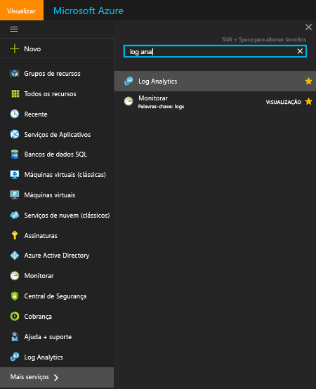  
3. Na folha de assinaturas do Log Analytics, selecione um espaço de trabalho.
4. A folha de espaço de trabalho exibe detalhes sobre o espaço de trabalho e links para obter informações adicionais.  
    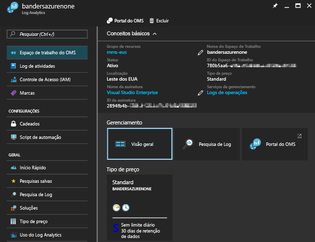  

## Gerenciar contas e usuários
Cada espaço de trabalho pode ter várias contas associadas e cada conta (conta da Microsoft ou conta Organizacional) pode ter acesso a vários espaços de trabalho.

Por padrão, a conta da Microsoft ou a conta Organizacional usada para criar o espaço de trabalho torna-se o Administrador do espaço de trabalho.

Há dois modelos de permissão que controlam o acesso a um espaço de trabalho do Log Analytics:

1. Funções de usuário herdadas do Log Analytics
2. [Acesso baseado em função do Azure](../active-directory/role-based-access-control-configure.md)

A tabela a seguir resume o acesso que pode ser definido usando cada modelo de permissão:

|                          | Portal do Log Analytics | Portal do Azure | API (incluindo PowerShell) |
|--------------------------|----------------------|--------------|----------------------------|
| Funções de usuário do Log Analytics | Sim                  | Não           | Não                         |
| Acesso baseado em função do Azure  | Sim                  | Sim          | Sim                        |

> [!NOTE]
> O Log Analytics está passando a usar o acesso baseado em função do Azure como o modelo de permissão, substituindo as funções de usuário do Log Analytics.
>
>

As funções de usuário herdadas do Log Analytics apenas controlam o acesso às atividades executadas no [Portal do Log Analytics](https://mms.microsoft.com).

As atividades a seguir também exigem permissões do Azure:

| Ação                                                          | Permissões do Azure necessárias | Observações |
|-----------------------------------------------------------------|--------------------------|-------|
| Adicionar e remover soluções de gerenciamento                        | `Microsoft.Resources/deployments/*`   `Microsoft.OperationalInsights/*`   `Microsoft.OperationsManagement/*`   `Microsoft.Automation/*`   `Microsoft.Resources/deployments/*/write` | |
| Alterar o tipo de preço                                       | `Microsoft.OperationalInsights/workspaces/*/write` | |
| Exibir dados nos blocos de solução *Backup* e *Site Recovery* | Administrador/coadministrador | Acessa recursos implantados usando o modelo de implantação clássico |
| Criar um espaço de trabalho no portal do Azure                        | `Microsoft.Resources/deployments/*`   `Microsoft.OperationalInsights/workspaces/*` ||

### Gerenciar o acesso ao Log Analytics usando permissões do Azure
Para conceder acesso ao espaço de trabalho do Log Analytics usando permissões do Azure, execute as etapas em [Usar atribuições de função para gerenciar o acesso aos recursos de sua assinatura do Azure](../active-directory/role-based-access-control-configure.md).

O Azure tem duas funções de usuário predefinidas para o Log Analytics:
- Leitor do Log Analytics
- Colaborador do Log Analytics

Os membros da função *Leitor do Log Analytics* podem:
- Exibir e pesquisar todos os dados de monitoramento 
- Exiba configurações de monitoramento, incluindo exibir a configuração do diagnóstico do Azure em todos os recursos do Azure.

| Tipo    | Permissão | Descrição |
| ------- | ---------- | ----------- |
| Ação | `*/read`   | Capacidade de exibir todos os recursos e a configuração do recurso. Inclui exibir:   Status de extensão da máquina virtual   Configuração do diagnóstico do Azure nos recursos   Todas as propriedades e configurações de todos os recursos |
| Ação | `Microsoft.OperationalInsights/workspaces/analytics/query/action` | Capacidade de execução de consultas de Pesquisa de Logs v2 |
| Ação | `Microsoft.OperationalInsights/workspaces/search/action` | Capacidade de execução de consultas de Pesquisa de Logs v1 |
| Ação | `Microsoft.Support/*` | Capacidade de abrir casos de suporte |
|Nenhuma Ação | `Microsoft.OperationalInsights/workspaces/sharedKeys/read` | Impede a leitura da chave do espaço de trabalho necessária para usar a API da coleta de dados e instalar os agentes |

Os membros da função *Colaborador do Log Analytics* podem:
- Ler todos os dados de monitoramento 
- Criar e configurar Contas de automação
- Adicionar e remover soluções de gerenciamento
- Ler as chaves da conta de armazenamento 
- Configurar a coleta de logs no Armazenamento do Azure
- Editar configurações de monitoramento dos recursos do Azure, incluindo
  - Adicionar a extensão VM às VMs
  - Configurar o diagnóstico do Azure em todos os recursos do Azure

> [!NOTE] 
> Você pode usar a capacidade de adicionar uma extensão da máquina virtual a uma máquina virtual para ter controle total sobre uma máquina virtual.

| Permissão | Descrição |
| ---------- | ----------- |
| `*/read`     | Capacidade de exibir todos os recursos e a configuração do recurso. Inclui exibir:   Status de extensão da máquina virtual   Configuração do diagnóstico do Azure nos recursos   Todas as propriedades e configurações de todos os recursos |
| `Microsoft.Automation/automationAccounts/*` | Capacidade de criar e configurar Contas de automação do Azure, incluindo adicionar e editar runbooks |
| `Microsoft.ClassicCompute/virtualMachines/extensions/*`   `Microsoft.Compute/virtualMachines/extensions/*` | Adicionar, atualizar e remover as extensões da máquina virtual, incluindo a extensão do Microsoft Monitoring Agent e o Agente do OMS para a extensão do Linux |
| `Microsoft.ClassicStorage/storageAccounts/listKeys/action`   `Microsoft.Storage/storageAccounts/listKeys/action` | Exiba a chave da conta de armazenamento. Necessário para configurar o Log Analytics para ler os logs das contas de armazenamento do Azure |
| `Microsoft.Insights/alertRules/*` | Adicionar, atualizar e remover as regras de alerta |
| `Microsoft.Insights/diagnosticSettings/*` | Adicionar, atualizar e remover as configurações de diagnóstico nos recursos do Azure |
| `Microsoft.OperationalInsights/*` | Adicionar, atualizar e remover a configuração dos espaços de trabalho do Log Analytics |
| `Microsoft.OperationsManagement/*` | Adicionar e remover soluções de gerenciamento |
| `Microsoft.Resources/deployments/*` | Crie e exclua implantações. Necessário para adicionar e remover soluções, espaços de trabalho e contas de automação |
| `Microsoft.Resources/subscriptions/resourcegroups/deployments/*` | Crie e exclua implantações. Necessário para adicionar e remover soluções, espaços de trabalho e contas de automação |

Para adicionar e remover usuários de uma função de usuário, é necessário ter as permissões `Microsoft.Authorization/*/Delete` e `Microsoft.Authorization/*/Write`.

Use essas funções para conceder acesso aos usuários em escopos diferentes:
- Assinatura – acesso a todos os espaços de trabalho na assinatura
- Grupo de Recursos - acesso a todo espaço de trabalho no grupo de recursos
- Recurso - acesso somente ao espaço de trabalho especificado

Use as [funções personalizadas](../active-directory/role-based-access-control-custom-roles.md) para criar funções com as permissões específicas necessárias.

### Funções de usuário do Azure e funções de usuário do portal do Log Analytics
Se você tiver pelo menos a permissão de leitura do Azure no espaço de trabalho do Log Analytics, abra o portal do OMS clicando na tarefa **Portal do OMS** ao exibir o espaço de trabalho do Log Analytics.

Ao abrir o portal do OMS, use as funções de usuário herdadas do Log Analytics. Se você não tiver uma atribuição de função no portal do Log Analytics, o serviço [verificará as permissões do Azure existentes no espaço de trabalho](https://docs.microsoft.com/rest/api/authorization/permissions#Permissions_ListForResource).
Sua atribuição de função no portal do OMS é determinada da seguinte maneira:

| Condições                                                   | Funções de usuário do Log Analytics atribuída | Observações |
|--------------------------------------------------------------|----------------------------------|-------|
| Sua conta pertence a uma função de usuário herdada do Log Analytics     | A função de usuário especificada do Log Analytics | |
| Sua conta não pertence a uma função de usuário herdada do Log Analytics   Permissões totais do Azure para o espaço de trabalho (`*` permissão 1) | Administrador ||
| Sua conta não pertence a uma função de usuário herdada do Log Analytics   Permissões totais do Azure para o espaço de trabalho (`*` permissão 1)   *sem ações* de `Microsoft.Authorization/*/Delete` e `Microsoft.Authorization/*/Write` | Colaborador ||
| Sua conta não pertence a uma função de usuário herdada do Log Analytics   Permissão de leitura do Azure | Somente leitura ||
| Sua conta não pertence a uma função de usuário herdada do Log Analytics   Permissões do Azure não são compreendidas | Somente leitura ||
| Para assinaturas de gerenciadas por CSP (Provedor de solução de nuvem)   A conta com a qual você está conectado está no Azure Active Directory vinculado ao espaço de trabalho | Administrador | Normalmente, o cliente de um CSP |
| Para assinaturas de gerenciadas por CSP (Provedor de solução de nuvem)   A conta com a qual você está conectado não está no Azure Active Directory vinculado ao espaço de trabalho | Colaborador | Normalmente o CSP |

1 Consulte [Permissões do Azure](../active-directory/role-based-access-control-custom-roles.md) para saber mais sobre definições de função. Ao avaliar funções, uma ação de `*` não é equivalente a `Microsoft.OperationalInsights/workspaces/*`.

Alguns pontos a ter em mente sobre o portal do Azure:

* Ao entrar no portal do OMS usando http://mms.microsoft.com, você verá a lista **Selecionar um espaço de trabalho**. Essa lista só contém espaços de trabalho onde você tem uma função de usuário do Log Analytics. Para ver os espaços de trabalho aos quais você tem acesso com as assinaturas do Azure, será necessário especificar um locatário como parte da URL. Por exemplo: `mms.microsoft.com/?tenant=contoso.com`. O identificador do locatário costuma ser a última parte do endereço de email que você usa para entrar.
* Se você quiser navegar diretamente para um portal ao qual tem acesso por meio das permissões do Azure, será necessário especificar o recurso como parte da URL. É possível obter essa URL usando o PowerShell.

  Por exemplo: `(Get-AzureRmOperationalInsightsWorkspace).PortalUrl`.

  A URL é semelhante: `https://eus.mms.microsoft.com/?tenant=contoso.com&resource=%2fsubscriptions%2faaa5159e-dcf6-890a-a702-2d2fee51c102%2fresourcegroups%2fdb-resgroup%2fproviders%2fmicrosoft.operationalinsights%2fworkspaces%2fmydemo12`

### Gerenciar usuários no Portal do OMS
Você gerencia os usuários e o grupo na guia **Gerenciar Usuários** sob a guia **Contas** na página Configurações.   

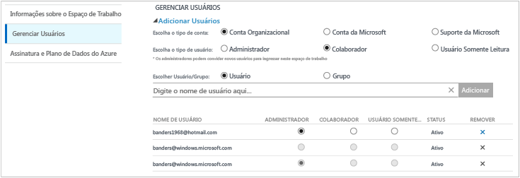

#### Adicionar um usuário a um espaço de trabalho existente
Use as seguintes etapas para adicionar um usuário ou grupo a um espaço de trabalho.

1. No portal do OMS, clique no bloco **Configurações**.
2. Clique na guia **Contas**, em seguida, clique na guia **Gerenciar Usuários**.
3. Na seção **Gerenciar Usuários**, escolha o tipo de conta a adicionar: **Conta Organizacional**, **Conta da Microsoft**, **Suporte da Microsoft**.

   * Se você escolher Conta da Microsoft, digite o endereço de email do usuário associado à Conta da Microsoft.
   * Se você escolher Conta Organizacional, poderá digitar parte do nome ou alias de email do usuário/grupo, e uma lista de usuários e grupos correspondentes será mostrada em uma caixa suspensa. Selecione um usuário ou um grupo.
   * Use o Suporte da Microsoft para fornecer a um engenheiro do Suporte da Microsoft ou a outro funcionário da Microsoft acesso temporário a seu espaço de trabalho para ajudar a solucionar problemas.

     > [!NOTE]
     > Para ter um desempenho melhor, limite o número de grupos do Active Directory associados a uma única conta do OMS a três, um para administradores, um para colaboradores e outro para usuários somente leitura. Usar mais grupos pode afetar o desempenho do Log Analytics.
     >
     >
4. Escolha o tipo de usuário ou grupo a adicionar: **Administrador**, **Colaborador** ou **Usuário de Somente Leitura**.  
5. Clique em **Adicionar**.

   Se você estiver adicionando uma Conta da Microsoft, um convite para ingressar no espaço de trabalho será enviado ao email fornecido. Depois que o usuário seguir as instruções no convite para ingressar no OMS, ele poderá acessar esse espaço de trabalho.
   Se você estiver adicionando uma conta organizacional, o usuário poderá acessar o Log Analytics imediatamente.  

#### Editar um tipo de usuário existente
Você pode alterar a função da conta de um usuário associado à sua conta do OMS. Você tem as seguintes opções de função:

* *Administrador*: pode gerenciar os usuários, exibir e agir em todos os alertas, adicionar e remover servidores
* *Contribuidor*: pode exibir e agir em todos os alertas, adicionar e remover servidores
* *Usuário Somente Leitura*: os usuários marcados como somente leitura não podem:

  1. Adicione/remova as soluções. A galeria de soluções está oculta.
  2. Adicione/modifique/remova os blocos em **Meu Painel**.
  3. Exiba as páginas **Configurações**. As páginas estão ocultas.
  4. Na exibição Pesquisa, a configuração do PowerBI, Pesquisas Salvas e tarefas de Alertas estão ocultas.

#### Para editar uma conta
1. No portal do OMS, clique no bloco **Configurações**.
2. Clique na guia **Contas**, em seguida, clique na guia **Gerenciar Usuários**.
3. Selecione a função do usuário que você deseja alterar.
4. Na caixa de diálogo de confirmação, clique em **Sim**.

### Remover um usuário de um espaço de trabalho
Use as seguintes etapas para remover um usuário de um espaço de trabalho. Remover o usuário não fecha o espaço de trabalho. Em vez disso, remove a associação entre o usuário e o espaço de trabalho. Se um usuário estiver associado a vários espaços de trabalho, ele ainda poderá entrar no OMS e ver os outros espaços de trabalho.

1. No portal do OMS, clique no bloco **Configurações**.
2. Clique na guia **Contas**, em seguida, clique na guia **Gerenciar Usuários**.
3. Clique em **Remover** ao lado do nome de usuário que você deseja remover.
4. Na caixa de diálogo de confirmação, clique em **Sim**.

### Adicionar um grupo a um espaço de trabalho existente
1. Na seção anterior “Para adicionar um usuário a um espaço de trabalho existente”, execute as etapas 1 a 4.
2. Em **Escolher Usuário/Grupo**, selecione **Grupo**.  
   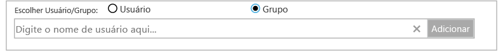
3. Insira o Nome de Exibição ou Endereço de email para o grupo que você deseja adicionar.
4. Selecione o grupo nos resultados da lista e clique em **Adicionar**.

## Vincular um espaço de trabalho existente a uma assinatura do Azure
Todos os espaços de trabalho criados depois de 26 de setembro de 2016 devem ser vinculados a uma assinatura do Azure no momento da criação. Os espaços de trabalho criados antes dessa data devem ser vinculados a um espaço de trabalho quando você entra. Quando você cria o espaço de trabalho no Portal do Azure ou vincula seu espaço de trabalho a uma assinatura do Azure, o Azure Active Directory é vinculado à sua conta organizacional.

### Para vincular um espaço de trabalho a uma assinatura do Azure no portal do OMS

- Ao entrar no portal do OMS, você precisará selecionar uma assinatura do Azure. Selecione a assinatura que você deseja vincular à sua área de trabalho e clique em **Link**.  
    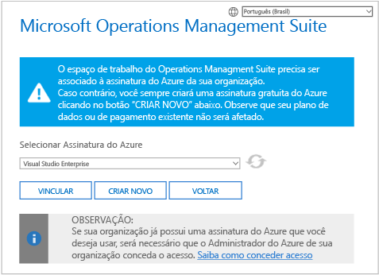

    > [!IMPORTANT]
    > Para vincular um espaço de trabalho, sua conta do Azure já deve ter acesso ao espaço de trabalho que você deseja vincular.  Em outras palavras, a conta usada para acessar o portal do Azure deve ser **igual** à conta usada para acessar seu espaço de trabalho. Para fazer isso, confira [Adicionar um usuário a um espaço de trabalho existente](#add-a-user-to-an-existing-workspace).

### Para vincular um espaço de trabalho a uma assinatura do Azure no portal do Azure
1. Faça logon no [Portal do Azure](http://portal.azure.com).
2. Procure pelo **Log Analytics** e selecione-o.
3. Você vê sua lista de espaços de trabalho existentes. Clique em **Adicionar**.  
   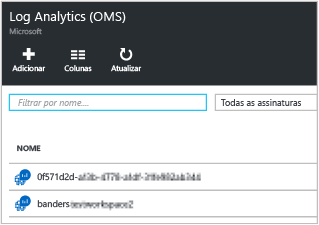
4. No **Espaço de Trabalho do OMS**, clique em **ou no link existente**.  
   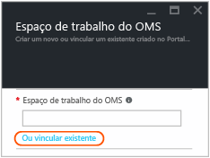
5. Clique em **Definir configurações obrigatórias**.  
   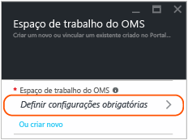
6. Você vê a lista de espaços de trabalho que ainda não estão vinculados à sua conta do Azure. Selecione um espaço de trabalho.  
   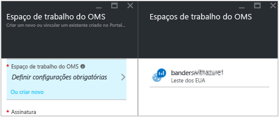
7. Se necessário, você pode alterar os valores para os seguintes itens:
   * Assinatura
   * Grupo de recursos
   * Local padrão
   * Tipo de preço   
     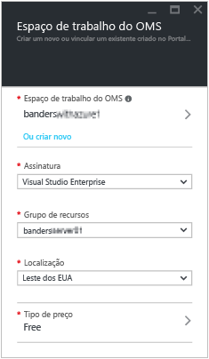
8. Clique em **OK**. O espaço de trabalho agora está vinculado à sua conta do Azure.

> [!NOTE]
> Caso você não veja o espaço de trabalho que deseja vincular, sua assinatura do Azure não tem acesso ao espaço de trabalho criado usando o portal do OMS.  Para conceder acesso a essa conta no portal do OMS, consulte [adicionar um usuário a um espaço de trabalho](#add-a-user-to-an-existing-workspace).
>
>

## Alterar uma Organização do Azure Active Directory para um espaço de trabalho

Você pode alterar a organização do Azure Active Directory de um espaço de trabalho. Alterar a organização do Azure Active Directory permite adicionar usuários e grupos do diretório ao espaço de trabalho.

### Para alterar uma Organização do Azure Active Directory para um espaço de trabalho

1. Na página Configurações no portal do OMS, clique em **Contas** e clique na guia **Gerenciar Usuários**.  
2. Examine as informações sobre as contas organizacionais e clique em **Alterar Organização**.  
    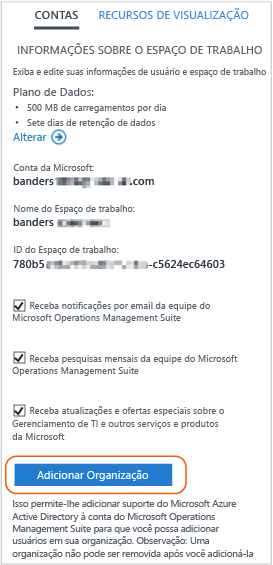
3. Insira as informações de identidade para o administrador do domínio do Azure Active Directory. Posteriormente, você vê uma confirmação informando que seu espaço de trabalho está vinculado ao domínio do Azure Active Directory.  
    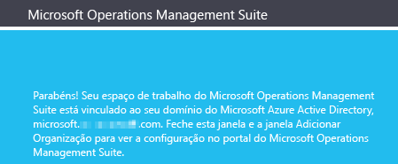

## Próximas etapas
* Veja [Noções básicas sobre o uso de dados](log-analytics-usage.md) para aprender como analisar o volume de dados coletados por soluções e enviados de computadores.
* [Adicionar soluções de gerenciamento do Log Analytics do Azure marketplace](log-analytics-add-solutions.md) para adicionar funcionalidade e reunir dados.
