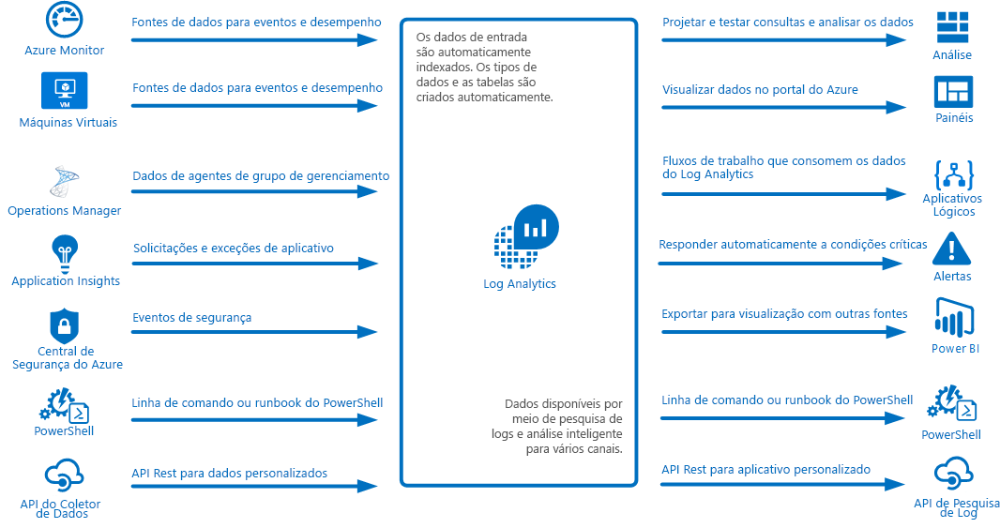
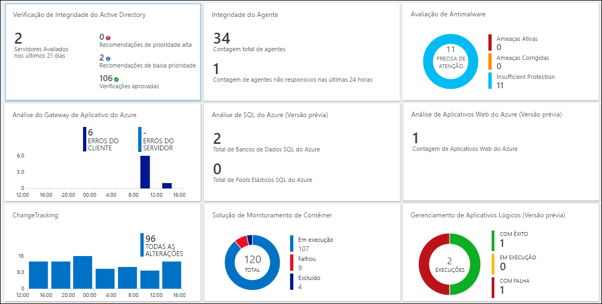
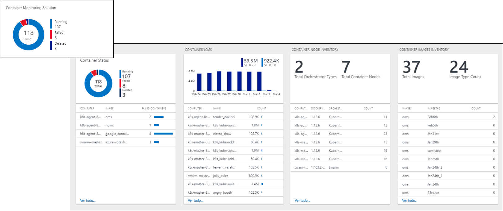
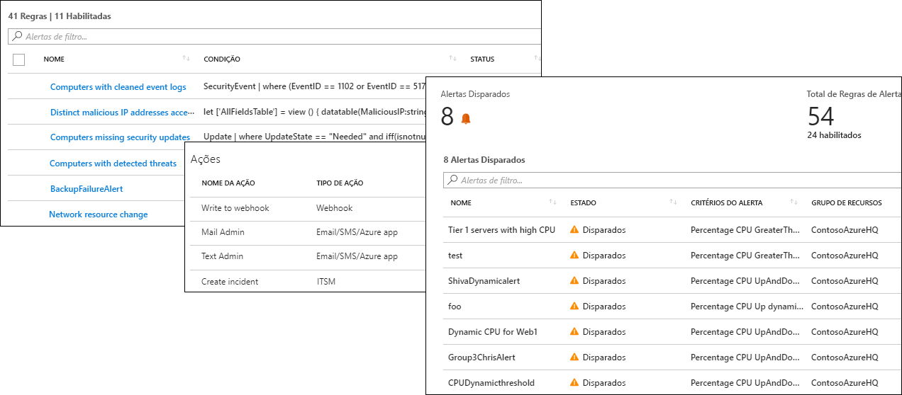
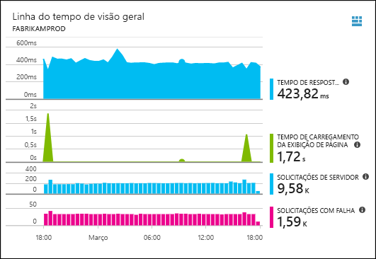
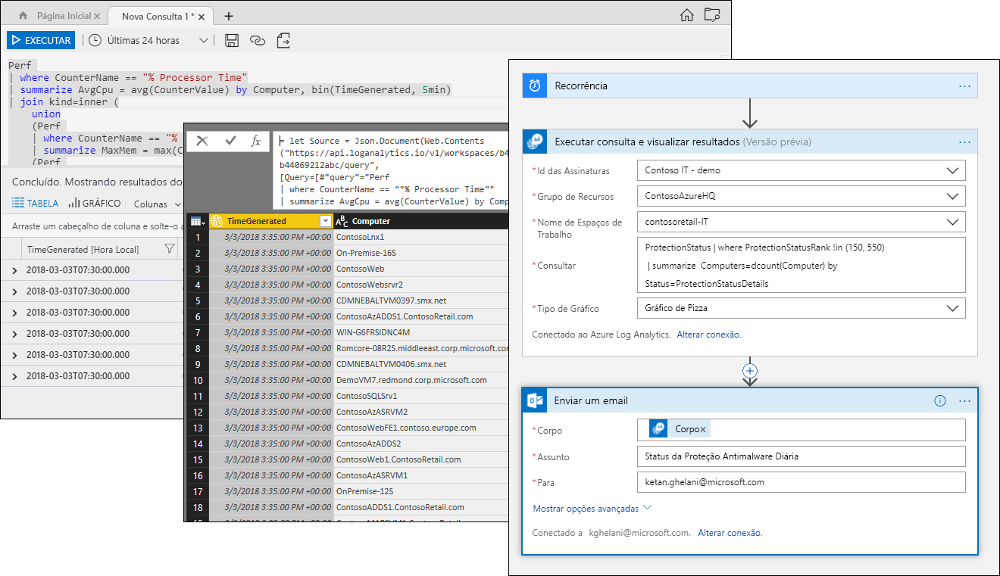

# O que é o Azure Log Analytics?
O Log Analytics desempenha um papel central no gerenciamento do Azure ao coletar a telemetria e outros dados de diversas fontes e fornecer um mecanismo de linguagem de consulta e de análise que fornece informações sobre a operação de seus aplicativos e recursos.  Você pode interagir diretamente com os dados do Log Analytics por meio de exibições e pesquisas de log ou usar as ferramentas de análise em outros serviços do Azure que armazenam seus dados no Log Analytics, como o Application Insights e a Central de Segurança do Azure.  

O Log Analytics requer configuração mínima e já está integrado com outros serviços do Azure.  É preciso criar um espaço de trabalho para habilitar a coleção.  Depois, é possível instalar agentes em máquinas virtuais para incluí-los no espaço de trabalho e habilitar soluções de gerenciamento que incluem lógica para fornecer informações adicionais sobre os diferentes aplicativos.  Nos bastidores, os tipos de dados são predefinidos ou criados automaticamente à medida que os dados são coletados.

## Função no monitoramento

Os diferentes serviços de monitoramentos no Azure são descritos em [Monitorando aplicativos e recursos do Azure](../monitoring-and-diagnostics/monitoring-overview.md).  O Log Analytics desempenha um papel central por consolidar dados de monitoramento de diferentes origens e fornecer uma linguagem de consulta eficiente para consolidação e análise.  

Contudo, o Log Analytics não se limita ao monitoramento de recursos do Azure.  Ele pode coletar dados de recursos que estão no local ou em outras nuvens para criar um ambiente de monitoramento híbrido e pode se conectar diretamente ao System Center Operations Manager para coletar telemetria de agentes existentes.  As ferramentas de análise no Log Analytics, como pesquisas de logs, exibições e soluções de gerenciamento, funcionam com todos os dados coletados, fornecendo a capacidade de analisar seu ambiente inteiro centralmente.

## Coleta de dados
O Log Analytics coleta dados de várias fontes.  Depois de coletados, os dados são organizados em tabelas separadas para cada tipo de dados, o que permite que todos os dados sejam analisados em conjunto, independentemente de sua fonte.

Entre os métodos para coletar dados para o Log Analytics, temos:

- Configurar o Azure Monitor para copiar as métricas e os logs que ele coleta dos recursos do Azure.
- Agentes em máquinas virtuais do [Windows](log-analytics-windows-agent.md) e do [Linux](log-analytics-linux-agents.md) enviam telemetria do sistema operacional convidado e dos aplicativos para o Log Analytics de acordo com as [Fontes de Dados](log-analytics-data-sources.md) que você configurar.  
- Conectar um [grupo de gerenciamento do System Center Operations Manager](log-analytics-om-agents.md) ao Log Analytics para coletar dados de seus agentes.
- Serviços do Azure, como [Application Insights](https://docs.microsoft.com/azure/application-insights/) e a [Central de Segurança do Azure](https://docs.microsoft.com/azure/security-center/) armazenam seus dados diretamente no Log Analytics sem qualquer configuração.
- Gravar dados da linha de comando do PowerShell ou do [runbook de Automação do Azure](../automation/automation-runbook-types.md) usando os cmdlets do Log Analytics.
- Caso tenha requisitos personalizados, é possível usar a [API do Coletor de Dados HTTP](log-analytics-data-collector-api.md) para gravar dados no Log Analytics de qualquer cliente API REST.

## Adicionar funcionalidade com soluções de gerenciamento
As [Soluções de gerenciamento](log-analytics-add-solutions.md) fornecem lógica predefinida para um cenário ou produto específico.  Elas podem reunir dados extras no Log Analytics ou dados de processo que já foram coletados.  Normalmente, elas incluirão um modo de exibição para ajudá-lo a analisar esses dados adicionais.  As soluções estão disponíveis para várias funções, e outras soluções são adicionadas constantemente.  Você pode procurar as soluções disponíveis com facilidade e [adicioná-las ao seu espaço de trabalho](log-analytics-add-solutions.md) do Azure Marketplace.  

## Idioma de consulta

O Log Analytics inclui uma [avançada linguagem de consulta](http://docs.loganalytics.io) para recuperar, consolidar e analisar dados rapidamente.  É possível criar e testar as consultas usando os [portais de Pesquisa de logs ou de Análise avançada](log-analytics-log-search-portals.md) e, então, analisar diretamente os dados usando essas ferramentas, salvar consultas para uso com visualizações e alertas ou exportar para outras ferramentas, como o Power BI ou o Excel.

A linguagem de consulta do Log Analytics é adequada para pesquisas de log simples, mas também inclui recursos avançados, como agregações, junções e análise inteligente. É possível aprender rapidamente a linguagem de consulta por meio de [vários tutoriais](https://docs.loganalytics.io/docs/Learn/Tutorials) que estão disponíveis.  São fornecidas orientações específicas para usuários que já estão familiarizados com [SQL](https://docs.loganalytics.io/docs/Learn/References/SQL-to-Azure-Log-Analytics) e [Splunk](https://docs.loganalytics.io/docs/Learn/References/Splunk-to-Azure-Log-Analytics).

## Visualizar dados do Log Analytics

Os [Modos de exibição do Log Analytics](log-analytics-view-designer.md) apresentam os dados de pesquisas de logs visualmente.  Cada modo de exibição inclui uma combinação de visualizações, como gráficos de barras e de linhas, além de listas resumindo dados críticos.  As [Soluções de gerenciamento](#add-functionality-with-management-solutions) incluem modos de exibição que resumem os dados de um aplicativo específico, e você pode criar seus próprios modos de exibição para apresentar dados de qualquer pesquisa de log do Log Analytics.

Também é possível fixar os resultados de uma consulta do Log Analytics em um [Painel do Azure](../azure-portal/azure-portal-dashboards.md), o que permite que você combine blocos de diferentes serviços do Azure.  Ainda é possível fixar um modo de exibição do Log Analytics em um painel.

## Criando alertas a partir de dados do Log Analytics

Use os [Alertas do Azure](../monitoring-and-diagnostics/monitoring-overview-unified-alerts.md) para receber notificações sobre as condições de dados do Log Analytics que sejam importantes para você.  Uma consulta é executada automaticamente em intervalos agendados, e um alerta é criado se os resultados corresponderem a critérios específicos.  Isso permite combinar alertas do Log Analytics com outras fontes, como alertas quase em tempo real do [Azure Monitor](../monitoring-and-diagnostics/monitoring-near-real-time-metric-alerts.md) e exceções de aplicativo do [Application Insights](../application-insights/app-insights-alerts.md), compartilhando [Grupos de ação](../monitoring-and-diagnostics/monitoring-action-groups.md) como respostas a condições de alerta.

## Usando dados do Log Analytics em outros serviços
Serviços como o Application Insights e a Central de Segurança do Azure armazenam seus dados no Log Analytics.  Em geral, você vai interagir com as avançadas ferramentas de análise fornecidas por esses serviços, mas também é possível usar consultas do Log Analytics para acessar seus dados e potencialmente combiná-los com dados de outros serviços.  

Por exemplo, a exibição a seguir é do Application Insights.  Se você clicar no ícone no canto superior direito, o console de análise do Log Analytics será inicializado com as consultas usadas pelo gráfico.

## Exportando dados do Log Analytics

O Log Analytics também disponibiliza seus dados fora do Azure.  É possível configurar o [Power BI](log-analytics-powerbi.md) para importar os resultados de uma consulta em intervalos agendados, permitindo obter benefícios de seus recursos, como combinar dados de fontes diferentes e compartilhar relatórios na Web e em dispositivos móveis.  Você também pode aproveitar a [API de Pesquisa de Log](log-analytics-log-search-api.md) para criar soluções personalizadas que aproveitam os dados do Log Analytics ou para integração com outros sistemas.

É possível usar [Aplicativos Lógicos](../logic-apps/logic-apps-overview.md) no Azure para criar fluxos de trabalho personalizados baseados nos dados do Log Analytics.  Para uma lógica mais complexa baseada no PowerShell, é possível usar [runbooks na Automação do Azure](../automation/automation-runbook-types.md).

## Próximas etapas
- Comece [coletando dados de VMs do Azure](log-analytics-quick-collect-azurevm.md).
- Veja um [tutorial sobre como analisar dados do Log Analytics com uma consulta simples](log-analytics-tutorial-viewdata.md).
* [Procure as soluções disponíveis](log-analytics-add-solutions.md) para adicionar funcionalidades ao Log Analytics.

