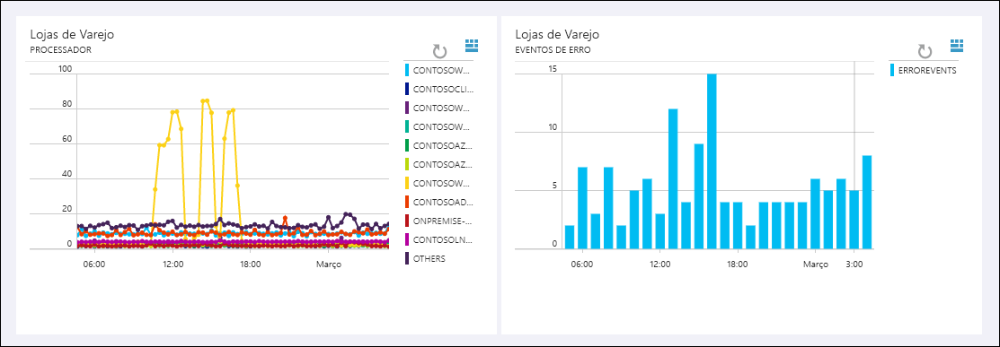

# O que é o Log Analytics?
O Log Analytics é um serviço no [Operations Management Suite\(OMS \)](../operations-management-suite/operations-management-suite-overview.md) que monitora seus ambientes na nuvem e locais a fim de manter a disponibilidade e o desempenho.  Ele coleta dados gerados pelos recursos em seus ambientes de nuvem e locais e de outras ferramentas de monitoramento para fornecer análise de várias fontes.  Este artigo fornece uma breve discussão sobre o valor fornecido pelo Log Analytics, uma visão geral de como ele funciona e links para um conteúdo mais detalhado, para que você possa se aprofundar ainda mais.

## O Log Analytics serve para você?
Se no momento você não tiver nenhum monitoramento de seu ambiente do Azure em vigor, comece com o [Azure Monitor](../monitoring-and-diagnostics/monitoring-overview.md), que coleta e analisa dados de monitoramento de seus recursos do Azure.  O Log Analytics pode [coletar dados do Azure Monitor](log-analytics-azure-storage.md) para correlacioná-los com outros dados e fornecer mais análise.

Se você quiser monitorar seu ambiente local, ou se houver um monitoramento usando serviços como o Azure Monitor ou o System Center Operations Manager, o Log Analytics poderá agregar um valor considerável.  Ele pode coletar dados diretamente de seus agentes e também dessas outras ferramentas em um único repositório.  Ferramentas de análise no Log Analytics como pesquisas, exibições e soluções de log funcionam em todos os dados coletados, oferecendo análise centralizada de todo o ambiente.

## Como usar o Log Analytics
Acesse o Log Analytics por meio do portal do OMS ou do Portal do Azure, que é executado em qualquer navegador e fornece acesso às definições de configuração e várias ferramentas para analisar e agir sobre os dados coletados.  No portal, você pode aproveitar as [pesquisas de log](log-analytics-log-searches.md) nas quais é possível construir consultas para analisar os dados coletados, [painéis](log-analytics-dashboards.md) que podem ser usados para personalizar a exibição gráfica das suas pesquisas mais valiosas e [soluções](log-analytics-add-solutions.md) que fornecem ferramentas de análise e funcionalidade adicionais.

A imagem abaixo é do portal do OMS, que mostra o painel com informações de resumo para as [soluções](#add-functionality-with-management-solutions) que estão instaladas no espaço de trabalho.  Clique em qualquer bloco para analisar ainda mais os dados dessa solução.

O Log Analytics inclui uma linguagem de consulta para recuperar e consolidar dados no repositório rapidamente.  Você poderá criar e salvar [Pesquisas de Log](log-analytics-log-searches.md) para analisar dados no portal ou fazer as pesquisas de log serem executadas automaticamente para criar um alerta se os resultados da consulta indicarem uma condição importante.

Para uma rápida exibição gráfica da integridade do seu ambiente geral, você pode adicionar visualizações de pesquisas de log salvas ao seu [painel](log-analytics-dashboards.md).   

Para analisar os dados fora do Log Analytics, você pode exportá-los do repositório do OMS em ferramentas como [Power BI](log-analytics-powerbi.md) ou Excel.  Você também pode aproveitar a [API de Pesquisa de Log](log-analytics-log-search-api.md) para criar soluções personalizadas que aproveitam os dados do Log Analytics ou para integração com outros sistemas.

## Adicionar funcionalidade com soluções de gerenciamento
[As soluções de gerenciamento](log-analytics-add-solutions.md) adicionam funcionalidade ao OMS, fornecendo dados adicionais e ferramentas de análise ao Log Analytics.  Elas também podem definir novos tipos de registro a serem coletados que podem ser analisados com Pesquisas de Log ou pela interface do usuário adicional fornecida pela solução no painel.  A imagem de exemplo abaixo mostra a [solução de Controle de Alterações](log-analytics-change-tracking.md)

As soluções estão disponíveis para várias funções, e outras soluções são adicionadas constantemente.  Você pode procurar as soluções disponíveis com facilidade e [adicioná-las ao seu espaço de trabalho do OMS](log-analytics-add-solutions.md) da Galeria de Soluções ou no Azure Marketplace.  Muitas delas serão implantados automaticamente e começarão a funcionar imediatamente, enquanto outras podem exigir uma configuração moderada.

## Componentes do Log Analytics
No centro no Log Analytics está o repositório do OMS, que está hospedado na nuvem do Azure.  Os dados são coletados para o repositório de fontes conectadas configurando fontes de dados e adicionando soluções à sua assinatura.  Fontes de dados e soluções criarão diferentes tipos de registro que têm seus próprios conjuntos de propriedades, mas ainda podem ser analisados juntos em consultas no repositório.  Isso permite usar as mesmas ferramentas e métodos para trabalhar com diferentes tipos de dados coletados por fontes diferentes.

Fontes conectadas são os computadores e outros recursos que geram dados coletados pelo Log Analytics.  Isso pode incluir os agentes instalados em computadores [Windows](log-analytics-windows-agents.md) e [Linux](log-analytics-linux-agents.md) que se conectam diretamente ou agentes em um [grupo de gerenciamento do System Center Operations Manager conectado](log-analytics-om-agents.md).  Para os recursos do Azure, o Log Analytics coleta dados do [Azure Monitor e dos Diagnóstico do Azure](log-analytics-azure-storage.md).

[Fontes de dados](log-analytics-data-sources.md) são os diferentes tipos de dados coletados de cada fonte conectada.  Isso inclui [eventos](log-analytics-data-sources-windows-events.md) e [dados de desempenho](log-analytics-data-sources-performance-counters.md) de agentes [Windows](log-analytics-data-sources-windows-events.md) e Linux, além de fontes como [logs do IIS](log-analytics-data-sources-iis-logs.md) e [logs de texto personalizado](log-analytics-data-sources-custom-logs.md).  Você configura cada fonte de dados que deseja coletar e a configuração é fornecida automaticamente para cada fonte conectada.

Se você tiver requisitos personalizados, poderá usar a [API do Coletor de Dados HTTP](log-analytics-data-collector-api.md) para gravar dados no repositório de um cliente da API REST.

## Arquitetura do Log Analytics
Os requisitos de implantação do Log Analytics são mínimos, já que os componentes centrais são hospedados na nuvem do Azure.  Isso inclui o repositório, além dos serviços que permitem correlacionar e analisar os dados coletados.  O portal pode ser acessado de qualquer navegador, portanto não há nenhum requisito para o software cliente.

Você deve instalar agentes em computadores [Windows](log-analytics-windows-agents.md) e [Linux](log-analytics-linux-agents.md), mas nenhum agente adicional é necessário para computadores que já são membros de um [grupo de gerenciamento do SCOM conectado](log-analytics-om-agents.md).  Agentes do SCOM continuarão a se comunicar com servidores de gerenciamento que encaminharão os dados para o Log Analytics.  Contudo, algumas soluções exigirão que os agentes se comuniquem diretamente com o Log Analytics.  A documentação para cada solução especificará a seus requisitos de comunicação.

Ao [inscrever-se para o Log Analytics](log-analytics-get-started.md), você criará um espaço de trabalho do OMS.  Pense no espaço de trabalho como um ambiente exclusivo do Log Analytics com seu próprio repositório de dados, fontes de dados e soluções. É possível criar vários espaços de trabalho na sua assinatura para dar suporte a vários ambientes como produção e teste.

## Próximas etapas
* [Inscreva-se em uma conta gratuita do Log Analytics](log-analytics-get-started.md) para testá-lo em seu próprio ambiente.
* Veja as diferentes [Fontes de Dados](log-analytics-data-sources.md) disponíveis para coletar dados para o repositório do OMS.
* [Procure soluções disponíveis na Galeria de Soluções](log-analytics-add-solutions.md) para adicionar funcionalidades ao Log Analytics.

