<properties
	pageTitle="Definir as configurações de proxy e firewall no Log Analytics | Microsoft Azure"
	description="Defina as configurações de proxy e firewall quando seus agentes ou serviços do OMS precisarem usar portas específicas."
	services="log-analytics"
	documentationCenter=""
	authors="bandersmsft"
	manager="jwhit"
	editor=""/>

<tags
	ms.service="log-analytics"
	ms.workload="na"
	ms.tgt_pltfrm="na"
	ms.devlang="na"
	ms.topic="article"
	ms.date="04/28/2016"
	ms.author="banders"/>

# Definir as configurações de proxy e firewall no Log Analytics


As ações precisavam definir configurações de proxy e firewall para Log Analytics no OMS diferirem quando você usar o Operations Manager e seus agentes versus os agentes do Microsoft Monitoring que se conectam diretamente aos servidores. Examine as seções a seguir para o tipo de agente usado.

## Definir configurações de proxy e de firewall com o Microsoft Monitoring Agent

Para o Microsoft Monitoring Agent se conectar e se registrar no serviço do OMS, ele deverá ter acesso ao número da porta de seus domínios e às URLs. Se você usar um servidor proxy para comunicação entre o agente e o serviço do OMS, será necessário garantir que os recursos apropriados estejam acessíveis. Se você usar um firewall para restringir o acesso à Internet, precisará configurar o firewall para permitir o acesso ao OMS. As tabelas a seguir listam as portas de que o serviço do OMS precisa.

|**Recurso de agente**|**Portas**|
|--------------|-----|
|*.ods.opinsights.azure.com|Port 443| |*.oms.opinsights.azure.com|Porta 443|
|ods.systemcenteradvisor.com|Porta 443|
|**.blob.core.windows.net|Porta 443|

Você pode usar o procedimento a seguir para definir configurações de proxy para o Microsoft Monitoring Agent usando o painel de controle. Você precisará usar o procedimento para cada servidor. Se você tiver vários servidores que precisa configurar, talvez seja mais fácil usar um script para automatizar esse processo. Nesse caso, consulte o próximo procedimento [Definir configurações de proxy para o Microsoft Monitoring Agent usando um script](#to-configure-proxy-settings-for-the-microsoft-monitoring-agent-using-a-script).

### Para definir configurações de proxy para o Microsoft Monitoring Agent usando o painel de controle

1. Abra o **Painel de controle**.

2. Abra o **Microsoft Monitoring Agent**.

3. Clique na guia **Configurações de Proxy**. 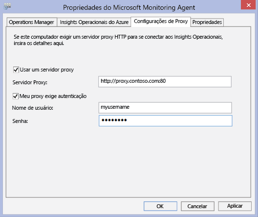

4. Selecione **Usar um servidor proxy** e digite a URL e o número da porta, se for necessário, semelhante ao exemplo mostrado. Se o servidor proxy requer autenticação, digite o nome de usuário e senha para acessar o servidor proxy.

Use o procedimento a seguir para criar um script do PowerShell que você possa executar para definir as configurações de proxy para cada agente que se conecte diretamente a servidores.

### Para definir configurações de proxy para o Microsoft Monitoring Agent usando um script


- Copie o exemplo a seguir, atualize-o com informações específicas para seu ambiente, salve-o com uma extensão de nome de arquivo PS1 e então execute o script em cada computador que se conecte diretamente ao serviço do OMS.


```
param($ProxyDomainName="http://proxy.contoso.com:80", $cred=(Get-Credential))

# First we get the health service configuration object.  We need to determine if we
# have the right update rollup with the API we need.  If not, no need to run the rest of the script.
$healthServiceSettings = New-Object -ComObject 'AgentConfigManager.MgmtSvcCfg'

$proxyMethod = $healthServiceSettings | Get-Member -Name 'SetProxyInfo'

if (!$proxyMethod)
{
    Write-Output 'Health Service proxy API not present, will not update settings.'
    return
}


Write-Output "Clearing proxy settings."
$healthServiceSettings.SetProxyInfo('', '', '')

$ProxyUserName = $cred.username;


Write-Output "Setting Proxy to ${ProxyDomainName} with proxy username of (${ProxyUserName})."
$healthServiceSettings.SetProxyInfo($ProxyDomainName, $ProxyUserName, $cred.GetNetworkCredential().password)
```

## Definir as configurações de proxy e de firewall com o Operations Manager

Para um grupo de gerenciamento do Operations Manager se conectar e se registrar no serviço do OMS, ele deverá ter acesso aos números de porta de seus domínios e URLs. Se você usar um servidor proxy para comunicação entre o servidor de gerenciamento do Operations Manager e o serviço do OMS, será necessário garantir que os recursos apropriados estejam acessíveis. Se você usar um firewall para restringir o acesso à Internet, precisará configurar o firewall para permitir o acesso ao OMS. Mesmo se um servidor de gerenciamento do Operations Manager não estiver protegido por um servidor proxy, talvez seus agentes possam. Nesse caso, o servidor proxy deve ser configurado da mesma maneira que os agentes para habilitar e permitir que os dados da solução Gerenciamento de Logs e Segurança sejam enviados ao serviço Web do OMS.

Para que os agentes do Operations Manager se comuniquem com o serviço do OMS, sua infraestrutura do Operations Manager (incluindo agentes) deve ter as configurações e a versão de proxy corretas. A configuração do proxy para agentes é especificada no console do Operations Manager. Sua versão deve ser uma das seguintes:

- Operations Manager 2012 SP1 com Pacote Cumulativo de Atualizações 7 ou posterior
- Operations Manager 2012 R2 com Pacote Cumulativo de Atualizações 3 ou posterior


As tabelas a seguir listam as portas relacionadas a essas tarefas.

>[AZURE.NOTE] Alguns dos recursos a seguir mencionam o Advisor e o Operational Insights, ambos versões anteriores do OMS. No entanto, os recursos listados serão alterado no futuro.

Aqui está uma lista de portas e recursos de agente:

|**Recurso de agente**|**Portas**|
|--------------|-----|
|*.ods.opinsights.azure.com|Port 443| |*.oms.opinsights.azure.com|Porta 443|
|ods.systemcenteradvisor.com|Porta 443|
|**.blob.core.windows.net/|Porta 443|

Aqui está uma lista de portas e recursos de servidor de gerenciamento:

|**Recurso do servidor de gerenciamento**|**Portas**|
|--------------|-----|
|*.ods.opinsights.azure.com|Porta 443| |service.systemcenteradvisor.com|Porta 443| |scadvisor.accesscontrol.windows.net|Porta 443| |scadvisorservice.accesscontrol.windows.net|Porta 443| |*.blob.core.windows.net|Porta 443|
|data.systemcenteradvisor.com|Porta 443|
|ods.systemcenteradvisor.com|Porta 443|
|**.systemcenteradvisor.com|Porta 443|

Aqui está uma lista de portas e recursos do OMS e do console do Operations Manager.

|**Recurso do console do OMS e do Operations Manager**|**Portas**|
|----|----|
|*.systemcenteradvisor.com|Port 80 and 443| |*.live.com|Porta 80 e 443|
|**.microsoftonline.com|Portas 80 e 443| |login.windows.net|Portas 80 e 443|


Use os procedimentos a seguir para registrar o seu grupo de gerenciamento do Operations Manager com o serviço do OMS. Se você estiver tendo problemas de comunicação entre o grupo de gerenciamento e o serviço do OMS, use os procedimentos de validação para solucionar problemas de transmissão de dados para o serviço do OMS.

### Para solicitar exceções para os pontos de extremidade do serviço do OMS

1. Use as informações da primeira tabela apresentada anteriormente para garantir que os recursos necessários para o servidor de gerenciamento do Operations Manager estejam acessíveis por meio de firewalls que talvez você tenha.
2. Use as informações da segunda tabela apresentada anteriormente para garantir que os recursos necessários para o console de Operações no Operations Manager e no OMS estejam acessíveis através de firewalls que você possa ter.
3. Se você usar um servidor proxy com o Internet Explorer, certifique-se de que ele esteja configurado e funcionando corretamente. Para verificar, você pode abrir uma conexão segura da Web (https), por exemplo [https://bing.com](https://bing.com). Se a conexão segura da web não funcionar em um navegador, provavelmente ela não funcionará no console de gerenciamento do Operations Manager com serviços da Web na nuvem.

### Para configurar o servidor proxy no console do Operations Manager

1. Abra o console do Operations Manager e selecione o espaço de trabalho **Administração**.

2. Expanda o nó **Insights Operacionais** e selecione **Conexão dos Insights Operacionais**. 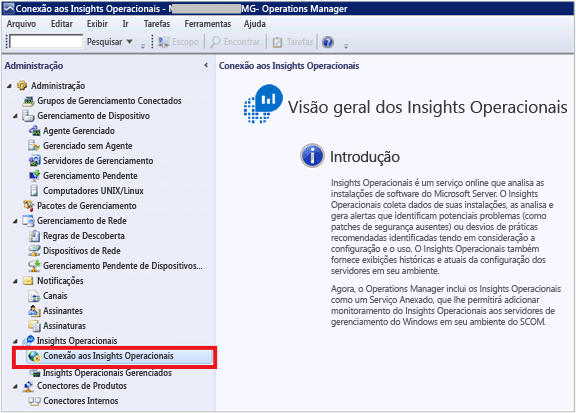
3. Na exibição Conexão do OMS, clique em **Configurar Servidor Proxy**. 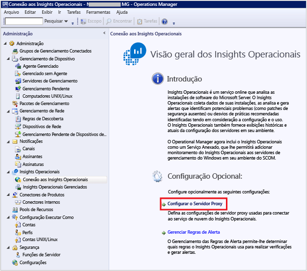
4. No Assistente de Configurações dos Insights Operacionais: Servidor Proxy, selecione **Usar um servidor proxy para acessar o Serviço Web dos Insights Operacionais** e, em seguida, digite a URL com o número da porta, como por exemplo, ****http://myproxy:80**. 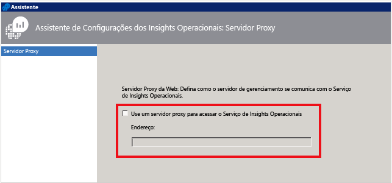


### Para especificar credenciais caso o servidor proxy exija autenticação
 As credenciais e configurações do servidor proxy precisam ser propagadas em computadores gerenciados que se reportarão aos OMS. Esses servidores devem estar no *Grupo de Servidores de Monitoramento do Microsoft System Center Advisor*. As credenciais são criptografadas no registro de cada servidor do grupo.

1. Abra o console do Operations Manager e selecione o espaço de trabalho **Administração**.
2. Em **Configuração RunAs**, selecione **Perfis**.
3. Abra o perfil **System Center Advisor executado como Proxy de perfil**. 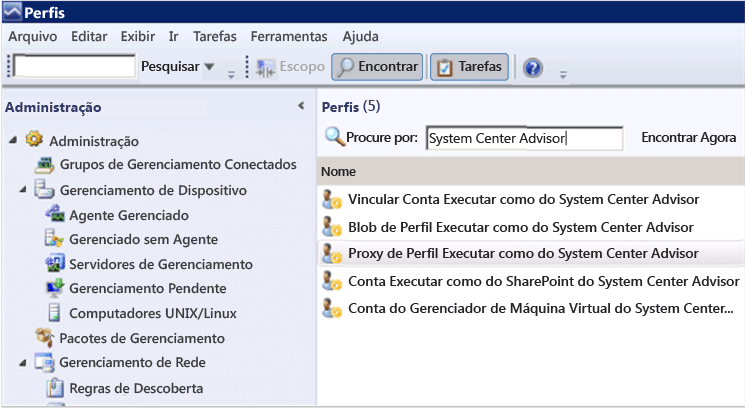
4. No Assistente Executar como Perfil, clique em **Adicionar** para usar uma conta Executar como. Você pode criar uma nova conta Executar como ou usar uma conta existente. Essa conta deve ter permissões suficientes para passar pelo servidor proxy. 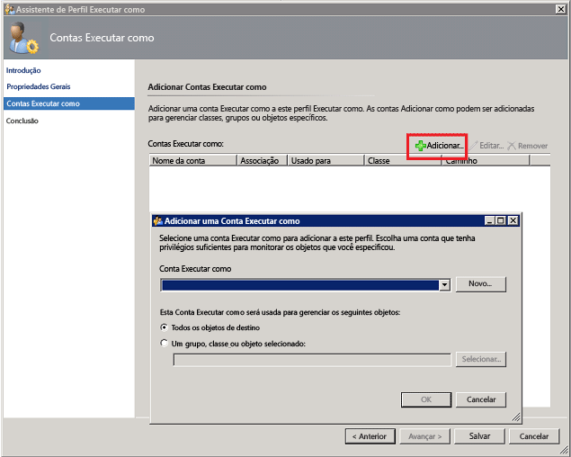
5. Para definir a conta a ser gerenciada, escolha **Uma classe, grupo ou objeto selecionado** para abrir a caixa de Pesquisa de Objetos. 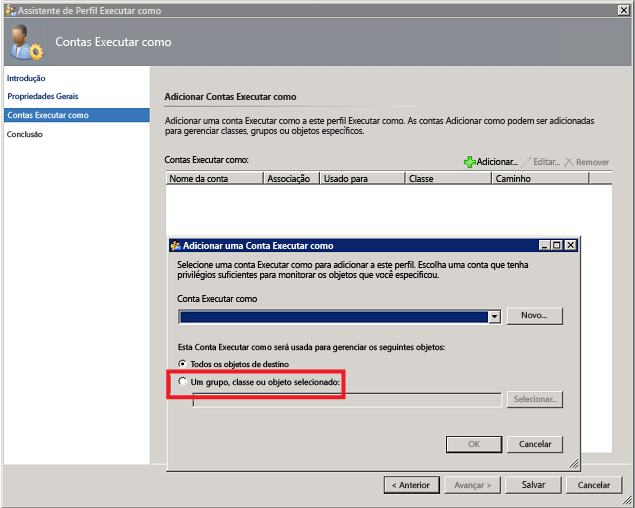
6. Procure e selecione o **Grupo de Servidores de Monitoramento do Microsoft System Center Advisor**. 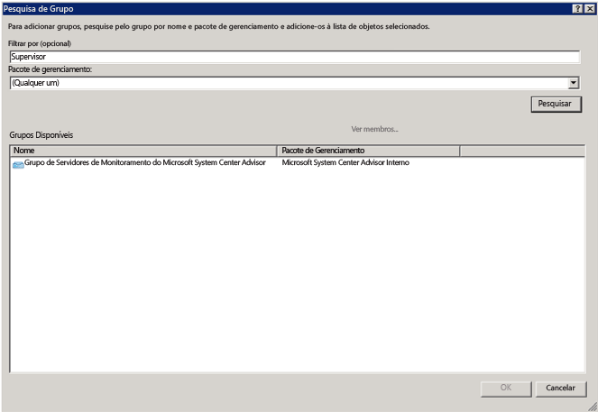
7. Clique em **OK** para fechar a caixa Adicionar uma conta Executar como. 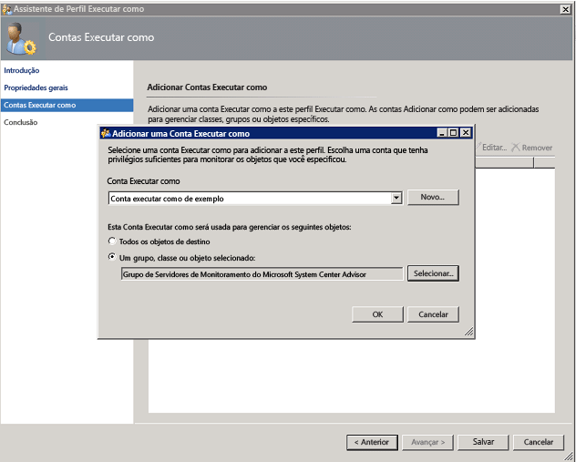
8. Conclua o assistente e salve as alterações. 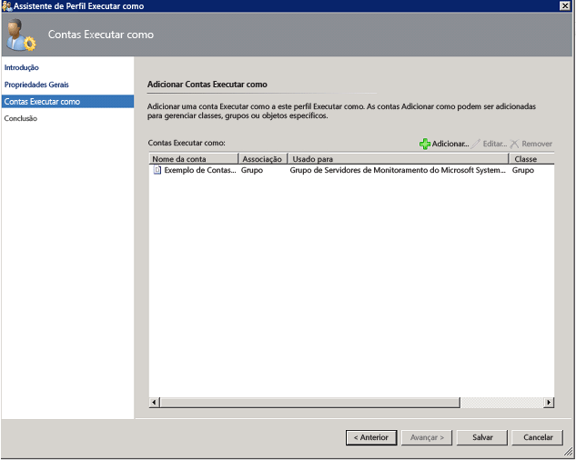


### Para validar se os pacotes de gerenciamento do OMS foram baixados

- Se você tiver adicionado soluções ao OMS, poderá exibi-las no console do Operations Manager como pacotes de gerenciamento em **Administração**. Pesquise *System Center Advisor* para encontrá-las rapidamente. 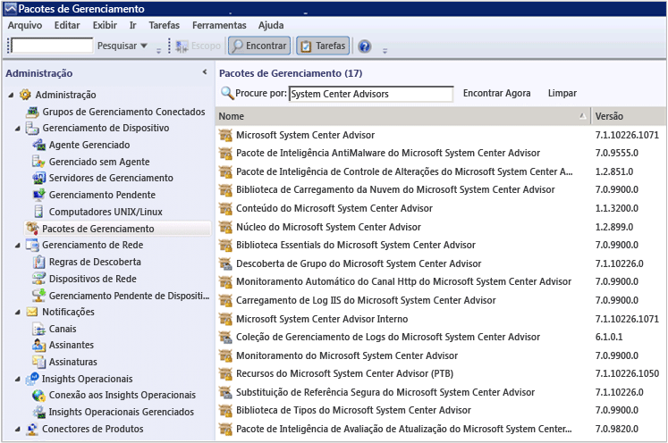
- Ou então, você também pode verificar os pacotes de gerenciamento do OMS usando os seguintes comandos do Windows PowerShell no servidor de gerenciamento do Operations Manager:

        get-scommanagementpack | where {$_.DisplayName -match 'Advisor'} | select Name,DisplayName,Version,KeyToken

        get-scommanagementpack | where {$_.DisplayName -match 'Advisor'} | select Name,DisplayName,Version | ft

### Para validar se o Operations Manager está enviando dados para o serviço do OMS

1. No servidor de gerenciamento do Operations Manager, abra o Monitor de Desempenho (perfmon.exe) e selecione **o Monitor de Desempenho**.
2. Clique em **Adicionar** e selecione **Grupos de Gerenciamento do Serviço de Integridade**.
3. Adicione todos os contadores que começam com **HTTP**. 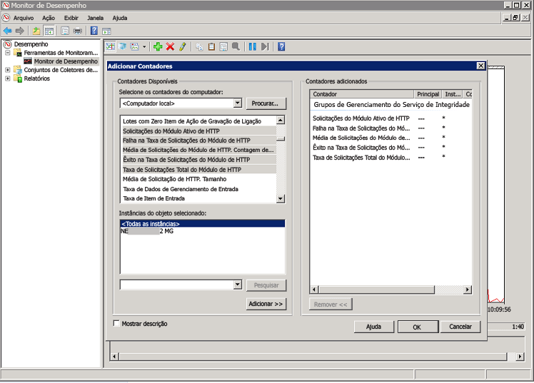
4. Se a sua configuração do Operations Manager for boa, você verá a atividade dos contadores do Gerenciamento do Serviço de Integridade para eventos e outros itens de dados, com base nos pacotes de gerenciamento adicionados no OMS e a política de coleta de logs configurada. 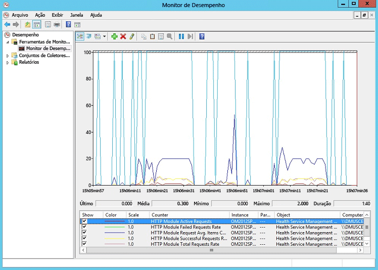


## Hybrid Runbook Worker da Automação do Azure

Não há nenhum requisito de firewall de entrada para dar suporte a Runbook Workers Híbridos.

Para o computador local que executa o Hybrid Runbook Worker, é necessário ter acesso de saída a *.cloudapp.net nas portas 443, 9354 e 30000-30199.

## Próximas etapas

- [Adicionar soluções do Log Analytics por meio da Galeria de Soluções](log-analytics-add-solutions.md) para adicionar funcionalidades e reunir dados.
- Familiarize-se com as [pesquisas de log](log-analytics-log-searches.md) para exibir informações detalhadas reunidas por soluções.

<!---HONumber=AcomDC_0504_2016-->