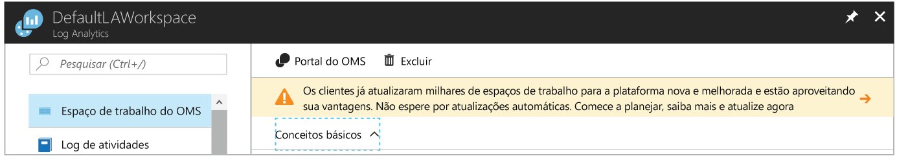
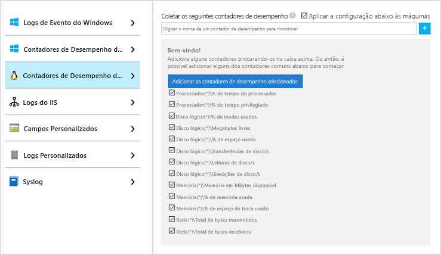
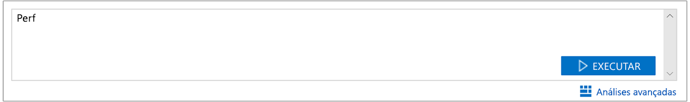
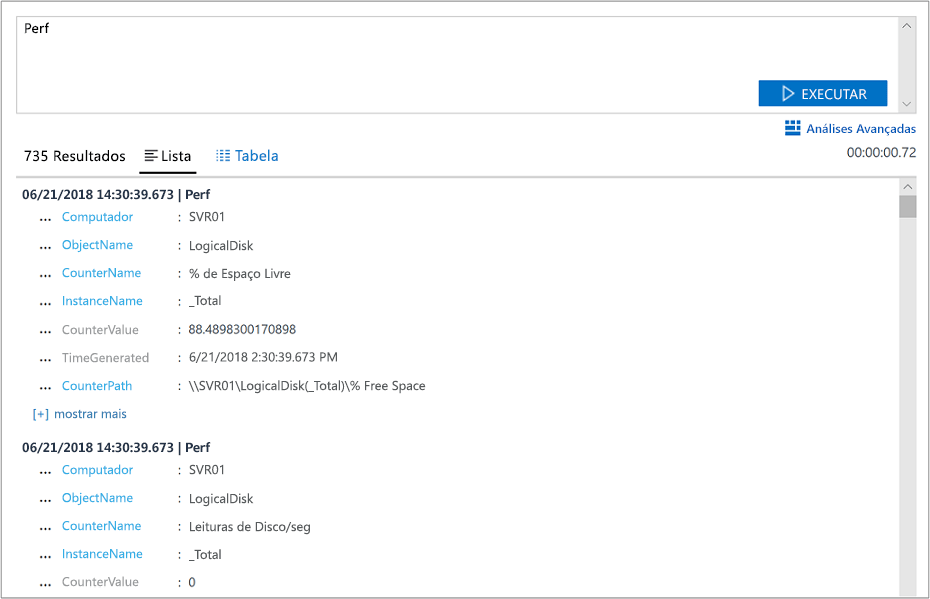

# Coletar dados sobre as Máquinas Virtuais do Azure
O [Azure Log Analytics](log-analytics-overview.md) pode coletar dados diretamente das máquinas virtuais do Azure e de outros recursos do ambiente em um único repositório para correlação e análise detalhada.  Este guia de início rápido mostra como configurar e coletar dados de VMs Linux ou Windows do Azure com algumas etapas simples.  
 
Este guia de início rápido pressupõe que você tenha uma máquina virtual do Azure existente. Se não puder [criar uma VM Windows](../virtual-machines/windows/quick-create-portal.md) nem [criar uma VM Linux](../virtual-machines/linux/quick-create-cli.md), siga nossos guias de início rápido de VM.

## Fazer logon no portal do Azure
Faça logon no portal do Azure em [https://portal.azure.com](https://portal.azure.com). 

## Criar um espaço de trabalho
1. No portal do Azure, clique em **Mais serviços** encontrado no canto inferior esquerdo. Na lista de recursos, digite **Log Analytics**. Quando você começa a digitar, a lista é filtrada com base em sua entrada. Selecione **Log Analytics**.     
2. Clique em **Criar** e, em seguida, selecione opções para os seguintes itens:

  * Forneça um nome para o novo **Espaço de Trabalho do OMS**, como *DefaultLAWorkspace*. 
  * Selecione uma **Assinatura** a vincular escolhendo uma na lista suspensa, se a selecionada por padrão não é adequada.
  * Para **Grupo de Recursos**, selecione um grupo de recursos existente que contém uma ou mais máquinas virtuais do Azure.  
  * Selecione o **Local** no qual as VMs serão implantadas.  Para obter mais informações, consulte em quais [regiões o Log Analytics está disponível](https://azure.microsoft.com/regions/services/).
  * Você pode escolher um de três diferentes **tipos de preço** no Log Analytics, mas para este guia de início rápido, você vai selecionar o preço **gratuito**.  Para obter mais informações sobre os tipos específicos, consulte [Detalhes de preço do Log Analytics](https://azure.microsoft.com/pricing/details/log-analytics/).

           
3. Depois de fornecer as informações necessárias no painel **Espaço de Trabalho do OMS**, clique em **OK**.  

Enquanto as informações são verificadas e o espaço de trabalho é criado, você pode acompanhar seu progresso no menu **Notificações**. 

## Habilitar a Extensão de VM do Log Analytics
Para máquinas virtuais Windows e Linux já implantadas no Azure, instale o agente do Log Analytics com a Extensão de VM do Log Analytics.  Usar a extensão simplifica o processo de instalação e configura automaticamente o agente para enviar dados para o espaço de trabalho do Log Analytics que você especificar. O agente também será automaticamente atualizado, garantindo que você disponha dos recursos e correções mais recentes.

>[!NOTE]
>O agente do OMS para Linux não pode ser configurado para se reportar a mais de um espaço de trabalho do Log Analytics. 

Caso tenha criado um espaço de trabalho na nuvem do Azure Governamental, pode aparecer uma faixa na parte superior da página de recursos do Log Analytics no portal convidando você a fazer a atualização.  A atualização não é necessária para fins deste guia de início rápido. 

.    
1. No portal do Azure, clique em **Mais serviços** encontrado no canto inferior esquerdo. Na lista de recursos, digite **Log Analytics**. Quando você começa a digitar, a lista é filtrada com base em sua entrada. Selecione **Log Analytics**.
2. Na lista de espaços de trabalho do Log Analytics, selecione *DefaultLAWorkspace* criado anteriormente.
3. No menu à esquerda, em Fontes de Dados do Espaço de Trabalho, clique em **Máquinas virtuais**.  
4. Na lista de **Máquinas virtuais**, selecione uma máquina virtual em que deseja instalar o agente. Observe que o **status de conexão do OMS** da VM indica que ela **Não está conectada**.
5. Nos detalhes de sua máquina virtual, selecione **Conectar**. O agente é automaticamente instalado e configurado para o seu espaço de trabalho do Log Analytics. Esse processo leva alguns minutos, período durante o qual o **Status** é **Conectando**.
6. Depois de instalar e conectar o agente, o **status da conexão do OMS** será atualizado com **Este espaço de trabalho**.

## Coletar dados de desempenho e eventos
O Log Analytics pode coletar eventos dos logs de eventos do Windows ou do Syslog do Linux e de contadores de desempenho especificados para relatórios e análise de prazo mais longo e tomar uma ação quando determinada condição for detectada.  Siga estas etapas para configurar a coleta de eventos do log do sistema do Windows e do Syslog do Linux e de vários contadores de desempenho comuns para começar.  

### Coleta de dados de VM Windows
1. Selecione **Configurações avançadas**.    
3. Selecione **Dados** e, em seguida, **Logs de Eventos do Windows**.  
4. Adicione um novo log de eventos digitando o nome do log.  Digite **Sistema** e, em seguida, clique no sinal de adição **+**.  
5. Na tabela, verifique as severidades **Erro** e **Aviso**.   
6. Clique em **Salvar** na parte superior da página para salvar a configuração.
7. Selecione **Dados de Desempenho do Windows** para habilitar a coleta de contadores de desempenho em um computador Windows. 
8. Quando você configura os contadores de desempenho do Windows para um novo espaço de trabalho do Log Analytics pela primeira vez, você tem a opção de criar rapidamente vários contadores comuns. Eles são listados com uma caixa de seleção ao lado de cada um.  .  Clique em **Adicionar os contadores de desempenho selecionados**.  Eles são adicionados e predefinidos com um intervalo de amostragem de coleta de dez segundos.  
9. Clique em **Salvar** na parte superior da página para salvar a configuração.

### Coleta de dados de VM Linux

1. Selecione **Syslog**.  
2. Adicione um novo log de eventos digitando o nome do log.  Digite **Syslog** e, em seguida, clique no sinal de adição **+**.  
3. Na tabela, desmarque as severidades **Informações**, **Aviso** e **Depuração**. 
4. Clique em **Salvar** na parte superior da página para salvar a configuração.
5. Selecione **Dados de Desempenho do Linux** para habilitar a coleta de contadores de desempenho em um computador Windows. 
6. Quando você configura os contadores de desempenho do Linux para um novo espaço de trabalho do Log Analytics pela primeira vez, você tem a opção de criar rapidamente vários contadores comuns. Eles são listados com uma caixa de seleção ao lado de cada um.  .  Clique em **Adicionar os contadores de desempenho selecionados**.  Eles são adicionados e predefinidos com um intervalo de amostragem de coleta de dez segundos.  
7. Clique em **Salvar** na parte superior da página para salvar a configuração.

## Exibir os dados coletados
Agora que você habilitou a coleta de dados, vamos executar um exemplo simples de pesquisa de logs para ver alguns dados das VMs de destino.  

1. No portal do Azure, navegue para Log Analytics e selecione o espaço de trabalho criado anteriormente.
2. Clique no bloco **Pesquisa de Logs** e, no painel da Pesquisa de Logs, no campo de consulta, digite `Perf` e, em seguida, pressione Enter ou clique no botão de pesquisa à direita do campo de consulta.    

   >[!NOTE]
   >Se o seu espaço de trabalho for criado na nuvem do Azure Governamental, você usará a consulta `Type=Perf`.  
   >

Por exemplo, a consulta na imagem a seguir retornou 78.000 registros de Desempenho.  Os resultados serão significativamente menores.  

## Limpar recursos
Quando não for mais necessário, exclua o espaço de trabalho do Log Analytics. Para fazer isso, selecione o espaço de trabalho do Log Analytics criado anteriormente e, na página de recursos, clique em **Excluir**.  

## Próximas etapas
Agora que você está coletando dados operacionais e de desempenho das máquinas virtuais Windows ou Linux, comece a explorar, analisar e tomar ações com facilidade em relação aos dados coletados *gratuitamente*.  

Para saber como exibir e analisar os dados, continue lendo o tutorial.   

> [!div class="nextstepaction"]
> [Exibir ou analisar dados no Log Analytics](log-analytics-tutorial-viewdata.md)
