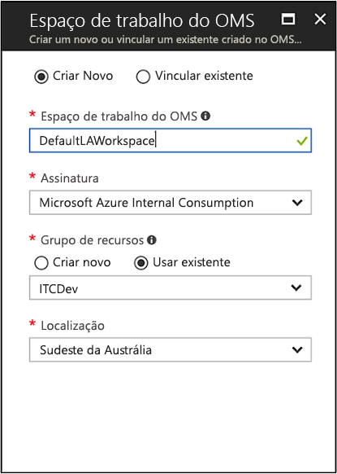

# Criar um espaço de trabalho do Log Analytics no Portal do Azure
No portal do Azure, você pode configurar um espaço de trabalho do Log Analytics, que é um ambiente exclusivo do Log Analytics com seu próprio repositório de dados, fontes de dados e soluções.  As etapas descritas neste artigo serão necessárias se você pretender coletar dados das seguintes fontes:

* Recursos do Azure em sua assinatura
* Computadores locais monitorados pelo System Center Operations Manager
* Coleções de dispositivos do System Center Configuration Manager 
* Dados de diagnóstico ou de log do armazenamento do Azure

Para outras fontes, como as VMs do Azure e as VMs do Windows ou do Linux em seu ambiente, veja os tópicos a seguir:

*  [Coletar dados de máquinas virtuais do Azure](log-analytics-quick-collect-azurevm.md) 
*  [Coletar dados de um computador Linux híbrido](log-analytics-quick-collect-linux-computer.md)
*  [Coletar dados de um computador Windows híbrido](log-analytics-quick-collect-windows-computer.md)

Se você não tiver uma assinatura do Azure, crie uma [conta gratuita](https://azure.microsoft.com/free/?WT.mc_id=A261C142F) antes de começar.

## Entre no portal do Azure
Entre no Portal do Azure em [https://portal.azure.com](https://portal.azure.com). 

## Criar um espaço de trabalho
1. No portal do Azure, clique em **Todos os serviços**. Na lista de recursos, digite **Log Analytics**. Quando você começa a digitar, a lista é filtrada com base em sua entrada. Selecione **Log Analytics**.

    
  
2. Clique em **Criar** e, em seguida, selecione opções para os seguintes itens:

  * Forneça um nome para o novo **Espaço de Trabalho do OMS**, como *DefaultLAWorkspace*. 
  * Selecione uma **Assinatura** a vincular escolhendo uma na lista suspensa, se a selecionada por padrão não é adequada.
  * Para o **Grupo de Recursos**, escolha entre usar um grupo de recursos existente já configurado ou criar um novo.  
  * Selecione um **local** disponível.  Para obter mais informações, veja em quais [regiões o Log Analytics está disponível](https://azure.microsoft.com/regions/services/).
  * Se você estiver criando um espaço de trabalho em uma nova assinatura feita depois de 2 de abril de 2018, ele usará o plano de preços *por GB* e a opção de selecionar um tipo de preço não estará disponível.  Se você estiver criando um espaço de trabalho para uma assinatura existente feita antes de 2 de abril ou uma assinatura associada a um registro do Enterprise Agreement existente, selecione seu tipo de preço preferido.  Para obter mais informações sobre os tipos de preço específicos, consulte [Detalhes de preço do Log Analytics](https://azure.microsoft.com/pricing/details/log-analytics/).

          

3. Depois de fornecer as informações necessárias no painel **Espaço de Trabalho do OMS**, clique em **OK**.  

Enquanto as informações são verificadas e o espaço de trabalho é criado, você pode acompanhar seu progresso no menu **Notificações**. 

## Próximas etapas
Agora que já tem um espaço de trabalho disponível, você pode configurar a coleta de monitoramento de telemetria, executar pesquisas de logs para analisar os dados e adicionar uma solução de gerenciamento para fornecer dados adicionais e informações analíticas. 

* Para habilitar a coleta de dados de recursos do Azure com o Diagnóstico do Azure ou com o armazenamento do Azure, consulte [Coletar logs e as métricas do serviço do Azure para uso no Log Analytics](log-analytics-azure-storage.md).  
* Adicione o [System Center Operations Manager como uma fonte de dados](log-analytics-om-agents.md) para coletar dados de agentes que se reportam ao seu grupo de gerenciamento do Operations Manager e armazene-o em seu repositório de espaço de trabalho do Log Analytics. 
* Conecte-se ao [Configuration Manager](log-analytics-sccm.md) para importar computadores que são membros de coleções na hierarquia.  
* Examine as [soluções de gerenciamento](log-analytics-add-solutions.md) disponíveis e como adicionar ou remover uma solução do espaço de trabalho.
