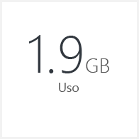
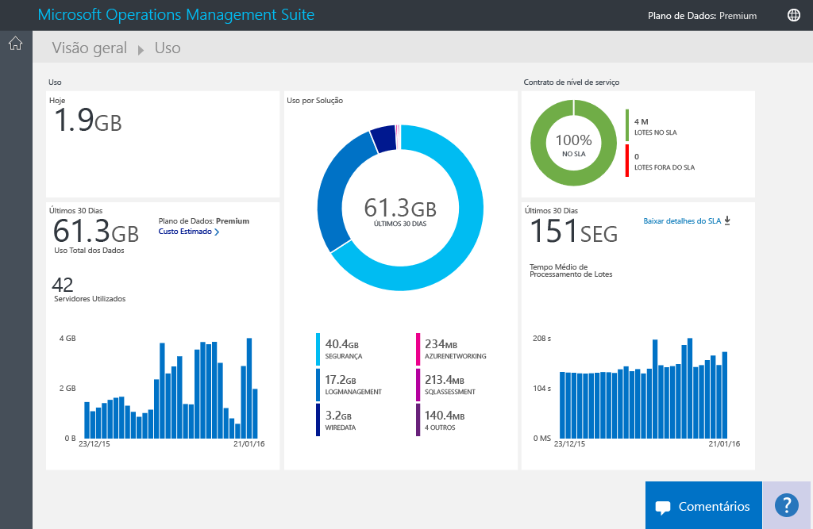
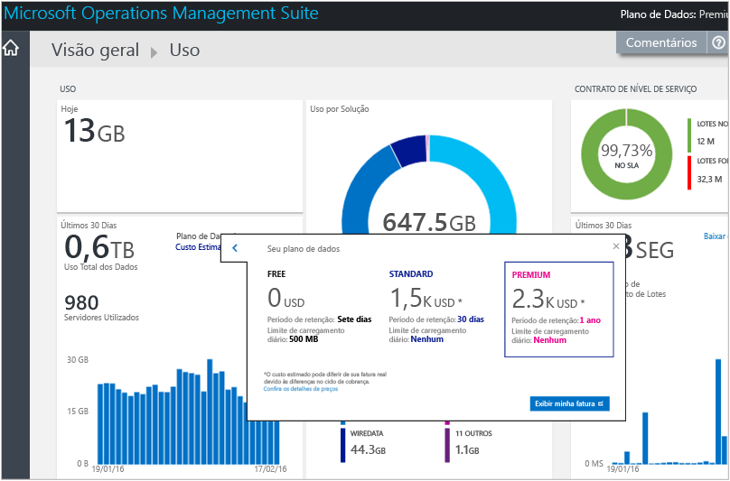
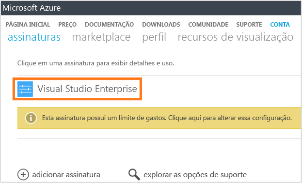
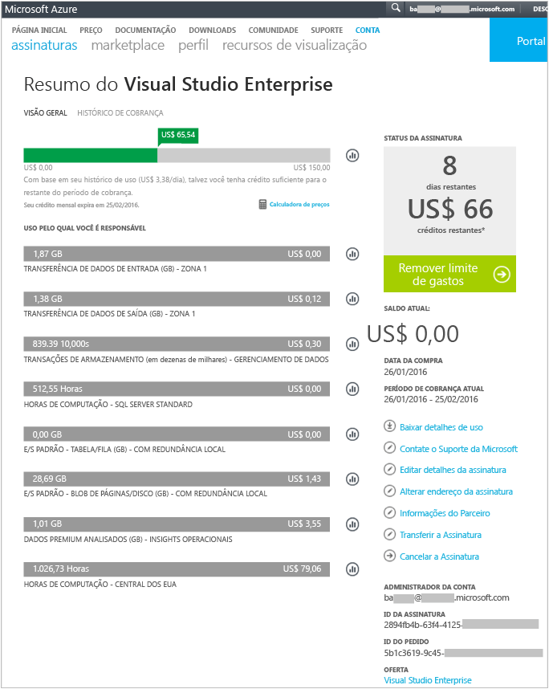
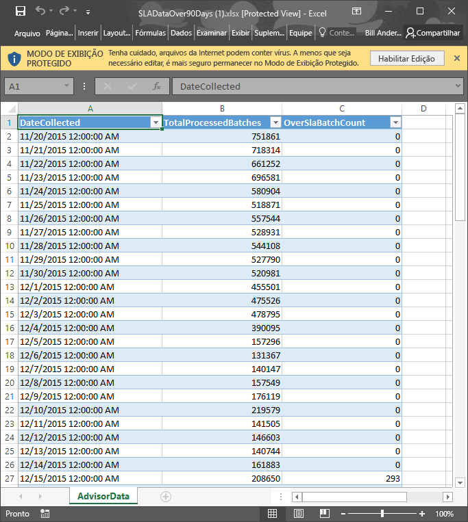

<properties
    pageTitle="Analisar o uso de dados no Log Analytics | Microsoft Azure"
    description="Você pode usar a página Uso no Log Analytics para exibir quantos dados estão sendo enviados para o serviço do OMS."
    services="log-analytics"
    documentationCenter=""
    authors="bandersmsft"
    manager="jwhit"
    editor=""/>

<tags
    ms.service="log-analytics"
    ms.workload="na"
    ms.tgt_pltfrm="na"
    ms.devlang="na"
    ms.topic="get-started-article"
    ms.date="08/11/2016"
    ms.author="banders"/>

# Analisar o uso de dados no Log Analytics

O Log Analytics no OMS (Operations Management Suite) coleta dados e os envia para o serviço do OMS periodicamente.  Você pode usar a página **Uso** para exibir quantos dados estão sendo enviados para o serviço do OMS. O painel **Uso** também mostra quantos dados estão sendo enviados diariamente pelas soluções e com que frequência seus servidores estão enviando dados.

>[AZURE.NOTE] Se você tiver uma conta gratuita criada usando o [site da Web do OMS](http://www.microsoft.com/oms), estará limitado a enviar 500 MB de dados para o serviço de OMS diariamente. Se você atingir o limite diário, a análise de dados parará e será retomada no início do dia seguinte. Você também precisará reenviar os dados não foi aceito ou processados pelo OMS.

Você pode exibir seu uso com o bloco **Uso** no painel **Visão Geral** do OMS.

Se tiver excedido o limite de uso diário ou se estiver próximo do limite, você também poderá remover uma solução para reduzir a quantidade de dados enviados para o serviço do OMS. Para obter mais informações sobre como remover soluções, consulte [Adicionar soluções do Log Analytics da Galeria de Soluções](log-analytics-add-solutions.md).

A página **Uso** exibe as seguintes informações:

- Uso médio por dia
- Uso de dados para cada solução pelos últimos 30 dias
- Quantos dados os servidores em seu ambiente estão enviado para o serviço do OMS nos últimos 30 dias
- Seu tipo de preço de plano de dados e custo estimado
- Informações sobre o SLA (Contrato de Nível de Serviço), incluindo quanto tempo o OMS leva para processar seus dados

## Para trabalhar com dados de uso

1. Na página **Visão Geral**, clique no bloco **Uso**.
2. Na página **Uso** , exiba as categorias de uso que mostram as áreas com as quais você está preocupado.
3. Se você tiver uma solução que está consumindo muito da sua cota de upload diário, será possível removê-la.

## Para exibir o custo estimado e as informações de cobrança
1. Na página **Visão Geral**, clique no bloco **Uso**.
2. Na página **Uso** em **Uso**, clique na divisa (**>**) ao lado de **Custo estimado**.
3. Nos detalhes de **Seu plano de dados** expandido, você pode ver sua estimativa de custo mensal.  
    
4. Se você deseja exibir as informações de cobrança, clique em **Exibir minha cobrança** para exibir as informações da sua assinatura.
    - Na página de assinaturas, clique na sua assinatura para exibir os detalhes e uma lista de item de uso.  
        
    - Na página Resumo da sua assinatura, você pode realizar uma variedade de tarefas para gerenciar e exibir mais detalhes da sua assinatura.  
        

## Para exibir os lotes de dados do seu SLA
1. Na página **Visão Geral**, clique no bloco **Uso**.
2. Em **Contrato de Nível de Serviço**, clique em **Detalhes para Baixar SLA **.
3. Um arquivo XLSX do Excel é baixado para você examinar.  
    

## Próximas etapas

- Consulte as [Pesquisas de log no Log Analytics](log-analytics-log-searches.md) para exibir as informações detalhadas reunidas pelas soluções.

<!--HONumber=Oct16_HO2-->

