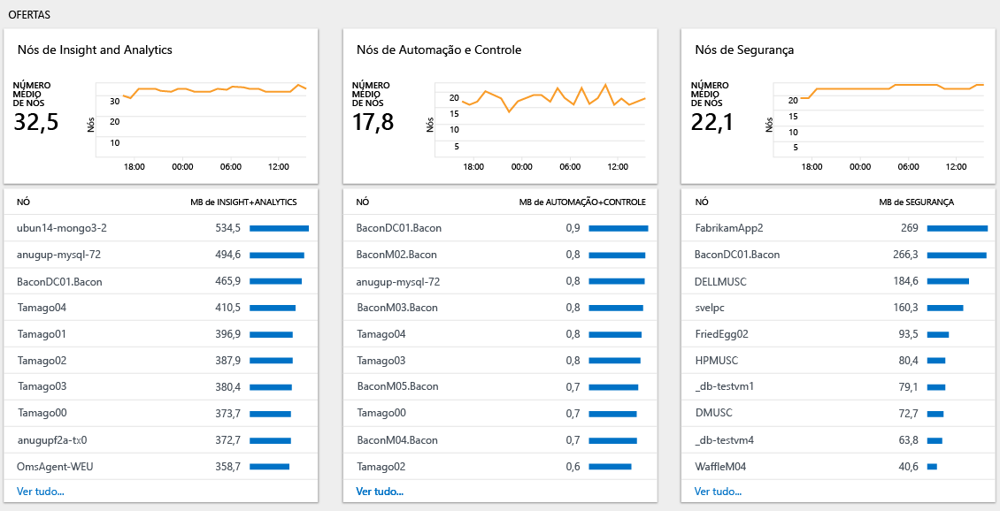

# Analisar o uso de dados no Log Analytics
O Log Analytics inclui informações sobre a quantidade de dados coletados, quais computadores enviaram os dados e os tipos diferentes de dados enviados.  Utilize o painel **Uso do Log Analytics** para ver a quantidade de dados enviados para o serviço Log Analytics. O painel mostra quantos dados são coletados por cada solução e quantos dados são enviados pelos seus computadores.

## Entender o painel Uso
O painel **Uso de Log Analytics** exibe as seguintes informações:

- Volume de dados
    - Volume de dados ao longo do tempo (com base em seu escopo de tempo atual)
    - Volume de dados por solução
    - Dados não associados a um computador
- Computadores
    - Computadores enviando dados
    - Computadores sem dados nas últimas 24 horas
- Ofertas
    - Nós Insight e de Análise
    - Nós de automação e controle
    - Nós de segurança
- Desempenho
    - Tempo necessário para coletar e indexar dados
- Lista de consultas

### Para trabalhar com dados de uso
1. Se ainda não tiver feito isso, entre no [portal do Azure](https://portal.azure.com) usando a sua assinatura do Azure.
2. No menu **Hub**, clique em **Mais serviços** e, na lista de recursos, digite **Log Analytics**. Quando você começa a digitar, a lista é filtrada com base em sua entrada. Clique em **Log Analytics**.  
    
3. O painel **Log Analytics** mostra uma lista dos espaços de trabalho. Selecione um espaço de trabalho.
4. No painel *espaço de trabalho*, clique em **Uso do Log Analytics**.
5. No painel **Uso do Log Analytics**, clique em **Tempo: últimas 24 horas** para alterar o intervalo de tempo.  
    
6. Exiba as folhas de categoria de uso que mostram as áreas de seu interesse. Escolha uma folha e clique em um item para exibir mais detalhes em [Pesquisa de Log](log-analytics-log-searches.md).  
    
7. No painel de Pesquisa de Log, examine os resultados que são retornados da pesquisa.  
    

## Criar um alerta quando a coleta de dados for maior que a esperada
Este artigo descreve como criar um alerta quando:
- O volume de dados excede uma quantidade definida.
- A previsão do volume de dados excede uma quantidade definida.

Os [alertas](log-analytics-alerts-creating.md) do Log Analytics usam consultas de pesquisa. A consulta abaixo tem um resultado quando há mais de 100 GB de dados coletados nas últimas 24 horas:

`Type=Usage QuantityUnit=MBytes IsBillable=true | measure sum(div(Quantity,1024)) as DataGB by Type | where DataGB > 100`

A consulta abaixo usa uma fórmula simples para prever quando mais de 100 GB de dados serão enviados em um mesmo dia: 

`Type=Usage QuantityUnit=MBytes IsBillable=true | measure sum(div(mul(Quantity,8),1024)) as EstimatedGB by Type | where EstimatedGB > 100`

Para receber um alerta em caso de volume de dados diferente, altere o número 100 nas consultas para o número de GB que deve disparar um alerta.

Use as etapas descritas em [Criar uma regra de alerta](log-analytics-alerts-creating.md#create-an-alert-rule) para ser notificado quando a coleta de dados for maior que a esperada.

Ao criar o alerta para a primeira consulta, quando há mais de 100 GB de dados em 24 horas, defina:
- O **Nome** como *Volume de dados maior que 100 GB em 24 horas*
- A **Gravidade** como *Aviso*
- A **Consulta de pesquisa** como `Type=Usage QuantityUnit=MBytes IsBillable=true | measure sum(div(Quantity,1024)) as DataGB by Type | where DataGB > 100`
- A **Janela de tempo** como *24 Horas*.
- A **frequência de alerta** como uma hora, pois os dados de uso só são atualizados uma vez por hora.
- A opção **Gerar alerta com base em** como *número de resultados*
- O **Número de resultados** como *Maior que 0*

Use as etapas descritas em [Adicionar ações a regras de alerta](log-analytics-alerts-actions.md) para configurar uma ação de runbook, webhook ou email para a regra de alerta.

Ao criar o alerta para a segunda consulta, quando existe a previsão de que haverá mais de 100 GB de dados em 24 horas, defina:
- O **Nome** como *Previsão de volume de dados maior que 100 GB em 24 horas*
- A **Gravidade** como *Aviso*
- A **Consulta de pesquisa** como `Type=Usage QuantityUnit=MBytes IsBillable=true | measure sum(div(mul(Quantity,8),1024)) as EstimatedGB by Type | where EstimatedGB > 100`
- A **Janela de tempo** como *3 Horas*.
- A **frequência de alerta** como uma hora, pois os dados de uso só são atualizados uma vez por hora.
- A opção **Gerar alerta com base em** como *número de resultados*
- O **Número de resultados** como *Maior que 0*

Ao receber um alerta, use as etapas na seção a seguir para solucionar problemas relativos ao uso acima do esperado.

## Solução de problemas por uso acima do esperado
O painel Uso ajuda a identificar por que o uso (e, portanto, o custo) é maior do que o esperado.

O uso aumenta devido a uma ou mais das seguintes causas:
- Os dados enviados para o Log Analytics estão acima do esperado
- A quantidade de nós enviando dados para o Log Analytics está acima da esperada

### Verificar se há mais dados do que é esperado 
Há duas seções principais da página de uso que ajudam a identificar o que está causando o excesso de coleta de dados.

O gráfico *Volume de dados ao longo do tempo* mostra o volume total de dados enviados e os computadores que enviam a maioria dos dados. O gráfico na parte superior permite que você veja se o uso geral dos dados está aumentando, permanece estável ou está diminuindo. A lista de computadores mostra os 10 computadores que estão enviando a maioria dos dados.

O gráfico *Volume de dados por solução* mostra o volume de dados enviados por cada solução e as soluções que enviam mais dados. O gráfico na parte superior mostra o volume total de dados enviados por cada solução ao longo do tempo. Essas informações permitem que você identifique se uma solução está enviando mais dados, a mesma quantidade ou menos dados ao longo do tempo. A lista de soluções mostra as 10 soluções que estão enviando a maioria dos dados. 

Esses dois gráficos mostram todos os dados. Alguns dados são faturáveis, e outros são gratuitos. Para se concentrar apenas em dados que faturáveis, modifique a consulta na página de pesquisa para incluir `IsBillable=true`.  

Examine o gráfico *Volume de dados ao longo do tempo*. Para ver as soluções e os tipos de dados que estão enviando a maioria dos dados para um computador específico, clique no nome do computador. Clique no nome do primeiro computador da lista.

Na captura de tela a seguir, o tipo de dados *Gerenciamento de logs/Desempenho* está enviando a maioria dos dados para o computador. 

Em seguida, volte para o painel *Uso* e examine o gráfico *Volume de dados por solução*. Para ver os computadores que enviam a maioria dos dados para uma solução, clique no nome da solução na lista. Clique no nome da primeira solução da lista. 

A captura de tela a seguir confirma que o computador *acmetomcat* está enviando a maioria dos dados para a solução Gerenciamento de Logs.

Se necessário, execute análises adicionais para identificar os volumes grandes dentro de uma solução ou tipo de dados. As consultas de exemplo incluem:

+ Solução de **Segurança**
  - `Type=SecurityEvent | measure count() by EventID`
+ Solução do **Gerenciamento de log**
  - `Type=Usage Solution=LogManagement IsBillable=true | measure count() by DataType`
+ Tipo de dados de **Desempenho**
  - `Type=Perf | measure count() by CounterPath`
  - `Type=Perf | measure count() by CounterName`
+ Tipo de dados de **Evento**
  - `Type=Event | measure count() by EventID`
  - `Type=Event | measure count() by EventLog, EventLevelName`
+ Tipo de dados **Syslog**
  - `Type=Syslog | measure count() by Facility, SeverityLevel`
  - `Type=Syslog | measure count() by ProcessName`

Use as etapas a seguir para reduzir o volume de logs coletados:

| Origem do alto volume de dados | Como reduzir o volume de dados |
| -------------------------- | ------------------------- |
| Eventos de segurança            | Selecione [eventos de segurança mínima ou comuns](https://blogs.technet.microsoft.com/msoms/2016/11/08/filter-the-security-events-the-oms-security-collects/)   Alterar a política de auditoria de segurança para coletar somente eventos necessários. Em particular, examine a necessidade para coletar eventos para   - [auditoria de plataforma de filtragem](https://technet.microsoft.com/library/dd772749(WS.10).aspx)   - [auditoria de registro](https://docs.microsoft.com/windows/device-security/auditing/audit-registry)  - [auditoria de sistema de arquivos](https://docs.microsoft.com/windows/device-security/auditing/audit-file-system)  - [auditoria de objeto kernel](https://docs.microsoft.com/windows/device-security/auditing/audit-kernel-object)  - [auditoria de manipulação de identificador](https://docs.microsoft.com/windows/device-security/auditing/audit-handle-manipulation)  - [auditoria de armazenamento removível](https://docs.microsoft.com/windows/device-security/auditing/audit-removable-storage) |
| Contadores de desempenho       | Altere a [configuração do contador de desempenho](log-analytics-data-sources-performance-counters.md) para:   - Reduzir a frequência de coleta   - Reduzir o número de contadores de desempenho |
| Logs de eventos                 | Altere a [configuração de log de eventos](log-analytics-data-sources-windows-events.md) para:   - Reduzir o número de logs de eventos coletados   - Coletar somente níveis de eventos necessários. Por exemplo, não colete eventos de nível *informações* |
| syslog                     | Altere a [configuração do syslog](log-analytics-data-sources-syslog.md) para:   - Reduzir o número de instalações coletadas   - Coletar somente níveis de eventos necessários. Por exemplo, não coletar eventos de nível *Informações* e *Depurar* |
| Dados da solução de computadores que não precisam da solução | Use [direcionamento de solução](../operations-management-suite/operations-management-suite-solution-targeting.md) para coletar dados somente dos grupos de computadores necessários. |

### Verifique se há mais nós do que o esperado
Se você estiver usando o tipo de preço *por nó (OMS)*, será cobrado com base no número de nós e soluções que usou. Você pode ver quantos nós de cada oferta estão em uso na seção *ofertas* do painel de uso.

Clique em **Ver tudo...** para exibir a lista completa de computadores que estão enviando dados para a oferta selecionada.

Use [direcionamento de solução](../operations-management-suite/operations-management-suite-solution-targeting.md) para coletar dados somente dos grupos de computadores necessários.

## Próximas etapas
* Confira [Pesquisas de log no Log Analytics](log-analytics-log-searches.md) para aprender a usar a linguagem de pesquisa. Você pode usar consultas de pesquisa para executar outras análises nos dados de uso.
* Use as etapas descritas em [Criar uma regra de alerta](log-analytics-alerts-creating.md#create-an-alert-rule) para ser notificado quando um critério de pesquisa for atendido
* Use [direcionamento de solução](../operations-management-suite/operations-management-suite-solution-targeting.md) para coletar dados somente dos grupos de computadores necessários
* Selecione [eventos de segurança mínima ou comuns](https://blogs.technet.microsoft.com/msoms/2016/11/08/filter-the-security-events-the-oms-security-collects/)
* Altere a [configuração do contador de desempenho](log-analytics-data-sources-performance-counters.md)
* Altere a [configuração de log de eventos](log-analytics-data-sources-windows-events.md)
* Altere a [configuração do syslog](log-analytics-data-sources-syslog.md)

