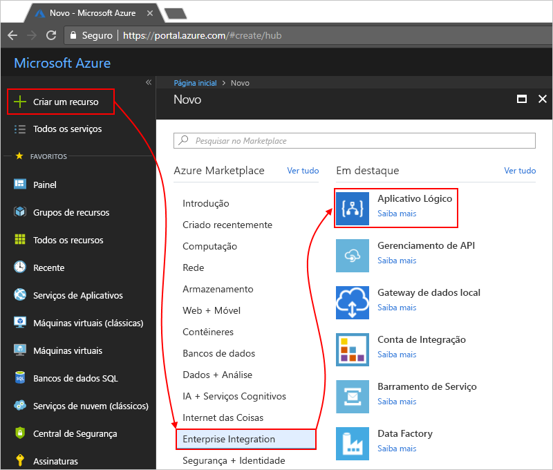

# Monitorar e obter informações sobre execuções de aplicativo lógico com o OMS (Operations Management Suite) e o Log Analytics

Para obter informações monitoramento e depuração mais detalhadas, ative o Log Analytics durante a criação de um aplicativo lógico. O Log Analytics fornece o registro em log de diagnóstico e o monitoramento de suas execuções de aplicativo lógico por meio do portal do OMS (Operations Management Suite). Quando você adiciona a solução de Gerenciamento de Aplicativos Lógicos ao OMS, você obtém o status agregado das execuções de seu aplicativo lógico e detalhes específicos, como status, tempo de execução, status de reenvio e IDs de correlação.

Este tópico mostra como ativar o Log Analytics ou instalar a solução de Gerenciamento de Aplicativos Lógicos no OMS, para que você possa exibir eventos de tempo de execução e dados para a execução de seu aplicativo lógico.

 > [!TIP]
 > Para monitorar seus aplicativos lógicos existentes, execute estas etapas para [ativar o registro em log de diagnóstico e enviar dados de tempo de execução do aplicativo lógica para o OMS](../logic-apps/logic-apps-monitor-your-logic-apps.md#azure-diagnostics).

## Requisitos

Antes de começar, você precisa ter um espaço de trabalho do OMS. Saiba [como criar um espaço de trabalho do OMS](../log-analytics/log-analytics-get-started.md). 

## Ativar o registro em log de diagnóstico durante a criação de aplicativos lógicos

1. No [Portal do Azure](https://portal.azure.com), crie um aplicativo lógico. Escolha **Criar um recurso** > **Integração corporativa** > **Aplicativo Lógico**.

   

2. Na página **Criar aplicativo lógico**, execute essas tarefas, conforme mostrado:

   1. Dê um nome para seu aplicativo lógico e selecione sua assinatura do Azure. 
   2. Crie ou selecione um grupo de recursos do Azure.
   3. Defina **Log Analytics** como **Ativado**. 
   Selecione o espaço de trabalho do OMS para o qual você deseja enviar dados para suas execuções de aplicativo lógico. 
   4. Quando você estiver pronto, escolha **Fixar no painel** > **Criar**.

      

      Após a conclusão dessa etapa, o Azure criará seu aplicativo lógico, que agora está associado ao seu espaço de trabalho do OMS. 
      Além disso, essa etapa também instala automaticamente a solução de Gerenciamento de Aplicativos Lógicos em seu espaço de trabalho do OMS.

3. Para exibir as execuções de seu aplicativo lógico no OMS, [continue com estas etapas](#view-logic-app-runs-oms).

## Instalar a solução de Gerenciamento de Aplicativos Lógicos no OMS

Se você já ativou o Log Analytics durante a criação de seu aplicativo lógico, ignore esta etapa. Você já tem a solução de Gerenciamento de Aplicativos Lógicos instalada no OMS.

1. No [portal do Azure](https://portal.azure.com), escolha **Mais serviços**. Pesquise por "log analytics" enquanto filtra e, em seguida, escolha **Log Analytics**, conforme exibido:

   

2. Em **Log Analytics**, encontre e selecione o espaço de trabalho do OMS. 

   

3. Em **Gerenciamento**, escolha **Portal do OMS**.

   

4. Na home page do OMS, se a faixa de atualização for exibida, escolha a faixa para que você atualizar seu espaço de trabalho do OMS primeiro. Então escolha **Galeria de Soluções**.

   

5. Em **Todas as soluções**, localize e escolha o bloco para a solução **Gerenciamento de Aplicativos Lógicos**.

   

6. Para instalar a solução em seu espaço de trabalho do OMS, escolha **Adicionar**.

   

## Exibir as execuções de seu aplicativo lógico em seu espaço de trabalho do OMS

1. Para exibir a contagem e o status das execuções de seu aplicativo lógico, acesse a página de visão geral de seu espaço de trabalho do OMS. Examine os detalhes no bloco **Gerenciamento de Aplicativos Lógicos**.

   

   > [!Note]
   > Se esse cabeçalho de atualização é exibida em vez do bloco de lógica de gerenciamento de aplicativos, escolha a faixa para que você atualizar seu espaço de trabalho do OMS primeiro.
  
   > 

2. Para exibir um resumo com mais detalhes sobre as execuções de seu aplicativo lógico, escolha o bloco **Gerenciamento de Aplicativos Lógicos**.

   Aqui, as execuções de seu aplicativo lógica são agrupadas por nome ou por status de execução. Você também pode ver detalhes sobre as falhas em ações ou gatilhos para as execuções do aplicativo lógico.

   
   
3. Para exibir todas as execuções de um aplicativo lógico específico ou status, selecione a linha de um aplicativo lógico ou um status.

   Veja um exemplo que mostra todas as execuções de um aplicativo lógico específico:

   

   Há duas opções avançadas nesta página:
   * **Propriedades rastreadas:** essa coluna mostra as propriedades rastreadas, agrupadas por ações, do aplicativo lógico. Para exibir as propriedades rastreadas, escolha **Exibir**. Você pode pesquisar as propriedades rastreadas usando o filtro de coluna.
   
     

     Quaisquer propriedades rastreadas recém-adicionada poderão demorar de 10 a 15 minutos antes de aparecerem pela primeira vez. Saiba [como adicionar propriedades rastreadas ao seu aplicativo lógico](logic-apps-monitor-your-logic-apps.md#azure-diagnostics-event-settings-and-details).

   * **Reenviar:** você pode enviar novamente uma ou mais execuções de aplicativo lógico que falharam, que obtiveram êxito ou que ainda estão em andamento. Marque as caixas de seleção das execuções que você deseja reenviar e escolha **Reenviar**. 

     

4. Para filtrar esses resultados, execute a filtragem tanto no lado do cliente quanto no lado do servidor.

   * Filtro no lado do cliente: para cada coluna, escolha os filtros desejados. 
   Estes são alguns exemplos:

     

   * Filtro no lado do servidor: para escolher um período específico, ou para limitar o número de execuções exibidas, use o controle de escopo na parte superior da página. 
   Por padrão, apenas 1.000 registros aparecem por vez. 
   
     
 
5. Para exibir todas as ações e os detalhes de uma execução específica, selecione uma linha para uma execução de aplicativo lógico.

   Veja um exemplo que mostra todas as ações de uma execução de aplicativo lógico específica:

   
   
6. Em qualquer página de resultados, para exibir a consulta por trás dos resultados ou para ver todos os resultados, escolha **Ver Tudo**, que abre a página Pesquisa de Logs.
   
   
   
   Na página Pesquisa de Logs,
   * Para exibir os resultados da consulta em uma tabela, escolha **Tabela**.
   * Para alterar a consulta, edite a cadeia de consulta na barra de pesquisa. 
   Para ter uma experiência melhor, escolha **Análise Avançada**.

     
     
     Aqui na página do Azure Log Analytics, você pode atualizar consultas e exibir os resultados da tabela. 
     Essa consulta usa a [linguagem de consulta Kusto](https://docs.loganalytics.io/docs/Language-Reference), que pode ser editada se você quiser exibir resultados diferentes. 

     

## Próximas etapas

* [Monitorar mensagens do B2B](../logic-apps/logic-apps-monitor-b2b-message.md)

