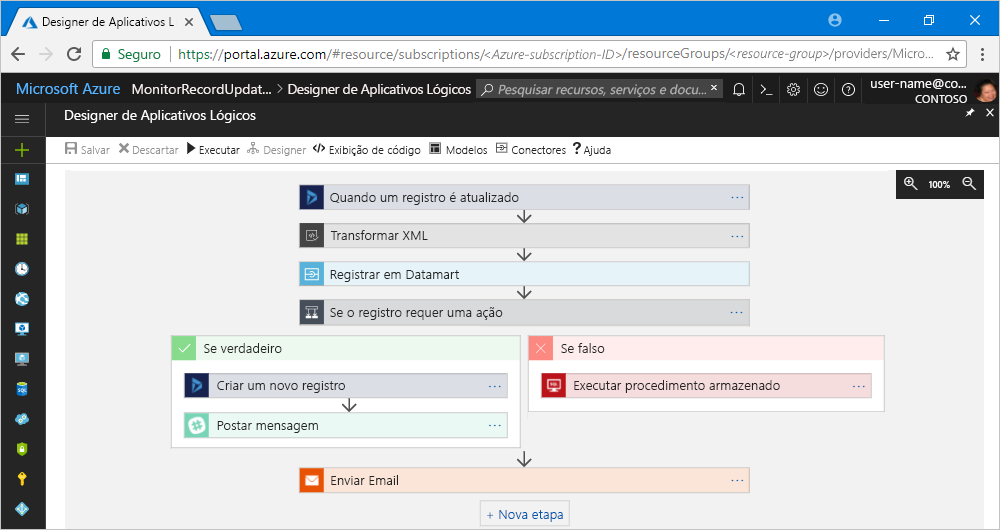

# O que são Aplicativos Lógicos do Azure?

Os [Aplicativos Lógicos](https://azure.microsoft.com/services/logic-apps) ajudam a criar, agendar e automatizar processos de [fluxos de trabalho](#logic-app-concepts), para que você passa integrar aplicativos, dados, sistemas e serviços entre empresas ou organizações. Os Aplicativos Lógicos simplificam como projetar e criar soluções escalonáveis para integração de aplicativos, integração de dados, integração de sistemas, EAI (integração de aplicativos empresariais) e comunicação B2B (entre empresas), quer seja na nuvem, localmente ou em ambos.

Por exemplo, eis algumas cargas de trabalho que você pode automatizar com aplicativos lógicos:

* Processe e direcione solicitações entre sistemas locais e serviços de nuvem.
* Mova arquivos carregados de um servidor FTP para o Armazenamento do Azure. 
* Monitore tweets sobre um assunto específico, analise o sentimento e crie alertas ou tarefas de itens que exigem revisão.

Para criar soluções de integração com aplicativos lógicos, escolha de uma galeria crescente de [aproximadamente 200 conectores internos ](../connectors/apis-list.md), como o Banco de Dados SQL, os serviços do Azure, o Office 365, o Salesforce, o Google e muito mais. Esses [conectores](#logic-app-concepts) fornecem [gatilhos](#logic-app-concepts), [ações](#logic-app-concepts) ou ambos para a criação de aplicativos lógicos que acessam dados e os processam em tempo real.

> [!VIDEO https://channel9.msdn.com/Blogs/Azure/Introducing-Azure-Logic-Apps/player]

## Como funcionam os Aplicativos Lógicos? 

Cada fluxo de trabalho do aplicativo lógico começa com um gatilho, que é acionado quando um evento específico ocorre, ou quando novos dados disponíveis atendem a critérios específicos. Vários gatilhos incluem recursos básicos de agendamento para que você possa especificar a regularidade das execuções das suas cargas de trabalho. Para mais cenários de agendamento personalizados, inicie os fluxos de trabalho com o gatilho de Agendamento. Saiba mais sobre [como criar fluxos de trabalho baseados em agendamento](../logic-apps/tutorial-build-schedule-recurring-logic-app-workflow.md).

Cada vez que o disparador é acionado, o mecanismo de Aplicativos Lógicos cria uma instância de aplicativo lógico que executa as ações do fluxo de trabalho. Essas ações também podem incluir conversões de dados e controles de fluxo, como instruções condicionais, instruções de comutação, loops e ramificações. Por exemplo, esse aplicativo lógico começa com um gatilho Dynamics 365 com os critérios internos "Quando um registro é atualizado". Se o gatilho detectar um evento que corresponde a esses critérios, o gatilho será acionado e executará ações do fluxo de trabalho. Aqui, essas ações incluem transformação XML, atualizações de dados, ramificação de decisões e notificações por email.

Você pode criar seus aplicativos lógicos visualmente com o Designer de Aplicativos Lógicos, disponível no portal do Azure pelo navegador e no Visual Studio. Para mais aplicativos lógicos personalizados, você pode criar ou editar definições de aplicativo lógico em JSON (JavaScript Object Notation), trabalhando no modo "exibição de código". Você também pode usar comandos do Azure PowerShell e modelos do Azure Resource Manager para selecionar tarefas. Os aplicativos lógicos implantam e são executados na nuvem no Azure. Para obter uma introdução mais detalhada, assista a este vídeo: [Usar o Azure Enterprise Integration Services para executar aplicativos de nuvem em larga escala](https://channel9.msdn.com/Events/Connect/2017/T119/)

## Por que usar Aplicativos Lógicos?

Com empresas migrando para a digitalização, os aplicativos lógicos ajudarão a conectar sistemas herdados e modernos de última geração com mais facilidade e rapidez, fornecendo APIs pré-compiladas como conectores gerenciados pela Microsoft. Dessa forma, você pode se concentrar na lógica de negócios e na funcionalidade de seus aplicativos. Você não precisa se preocupar com a criação, a hospedagem, o dimensionamento, o gerenciamento, a manutenção e o monitoramento dos seus aplicativos. Os Aplicativos Lógicos tratam desses problemas para você. Além disso, você paga apenas pelo que usa com base no consumo de um [modelo de preços](../logic-apps/logic-apps-pricing.md). 

Em muitos casos, você não precisará codificar nada. Mas se você precisar codificar alguma coisa, poderá criar trechos de código com o [Azure Functions](../azure-functions/functions-overview.md) e executar esse código sob demanda dos aplicativos lógicos. Além disso, se seus aplicativos lógicos precisam interagir com eventos de serviços do Azure, aplicativos personalizados ou soluções de terceiros, você pode usar a [Grade de Eventos do Azure](../event-grid/overview.md) com seus aplicativos lógicos para eventos de monitoramento, roteamento e publicação.

Os Aplicativos Lógicos, o Functions e a Grade de Eventos são totalmente gerenciados pelo Microsoft Azure, o que o livra de preocupações sobre criação, hospedagem, dimensionamento, gerenciamento, monitoramento e manutenção das suas soluções. A capacidade de criar [aplicativos e soluções "sem servidor"](../logic-apps/logic-apps-serverless-overview.md) para que você possa se concentrar na lógica de negócios. Esses serviços são dimensionados automaticamente para atender às suas necessidades, agilizar integrações e ajudá-lo a criar aplicativos de nuvem robustos com o mínimo de código. Além disso, você paga apenas pelo que usa com base no consumo de um [modelo de preços](../logic-apps/logic-apps-pricing.md). 

Para saber como as empresas aprimoraram a agilidade e o foco em seus negócios principais ao combinar os aplicativos lógicos com outros serviços do Azure e produtos da Microsoft, confira essas [histórias](https://aka.ms/logic-apps-customer-stories).

Aqui estão mais detalhes sobre os recursos e benefícios que você obtém com os Aplicativos Lógicos:

* **Criar visualmente os fluxos de trabalho com ferramentas fáceis de usar**

  Economize tempo e simplifique processos complexos com ferramentas de design visual. 
  Crie aplicativos lógicos do início ao fim usando o Designer de Aplicativos Lógicos pelo navegador no portal do Azure ou no Visual Studio. Inicie o fluxo de trabalho com um gatilho e adicione uma quantidade de ações da [Galeria de conectores](../connectors/apis-list.md).

* **Comece mais rapidamente com modelos de aplicativo lógico**

  Crie soluções mais usadas rapidamente escolhendo fluxos de trabalho predefinidos da [Galeria de modelos](../logic-apps/logic-apps-create-logic-apps-from-templates.md). 
  Os modelos vão de simples conectividade para aplicativos SaaS (software como um serviço) a soluções B2B avançadas e modelos "apenas para diversão". Saiba como [criar aplicativos lógicos de modelos predefinidos](../logic-apps/logic-apps-create-logic-apps-from-templates.md).

* **Conectar sistemas diferentes entre ambientes diferentes**

  Alguns padrões e fluxos de trabalho são fáceis de descrever, mas difíceis de implementar no código. 
  Os aplicativos lógicos o ajudam a conectar sistemas diferentes entre locais e ambientes de nuvem perfeitamente. Por exemplo, você pode conectar uma solução de marketing de nuvem a um sistema de cobrança local ou centralizar mensagens entre APIs e sistemas com um Barramento de Serviço Enterprise. Os aplicativos lógicos fornecem uma maneira rápida, confiável e consistente de fornecer soluções reutilizáveis e reconfiguráveis para esses cenários.

* **Suporte de primeira classe para cenários de Enterprise Integration e B2B**

  Empresas e organizações comunicam-se eletronicamente entre si usando mensagens padrão do setor, mas diferentes protocolos e formatos, como X12, AS2 e EDIFACT. 
  Com os recursos no [EIP (Enterprise Integration Pack )](../logic-apps/logic-apps-enterprise-integration-overview.md), você pode criar aplicativos lógicos que transformam os formatos de mensagem usados por seus parceiros em formatos que os sistemas da sua organização podem interpretar e processar. Os aplicativos lógicos tratam dessas trocas sem problemas e também com segurança, com assinaturas digitais e criptografia.

  Comece discretamente com seus serviços e sistemas atuais e cresça incrementalmente em seu próprio ritmo. Quando estiver pronto, os Aplicativos Lógicos e o EIP o ajudarão a implementar e escalar verticalmente para cenários de integração mais maduros, fornecendo esses recursos e muito mais:

  * Crie usando estes produtos e serviços: 
    * [Microsoft BizTalk Server](https://docs.microsoft.com/biztalk/core/introducing-biztalk-server) 
    * [Gerenciamento da API](../api-management/api-management-key-concepts.md) 
    * [Funções do Azure](../azure-functions/functions-overview.md) 
    * [Barramento de Serviço do Azure](../service-bus-messaging/service-bus-messaging-overview.md)
  * Processar [mensagens XML](../logic-apps/logic-apps-enterprise-integration-xml.md)
  * Processar [arquivos simples](../logic-apps/logic-apps-enterprise-integration-flatfile.md)
  * Trocar mensagens com protocolos [EDIFACT](../logic-apps/logic-apps-enterprise-integration-edifact.md), [AS2](../logic-apps/logic-apps-enterprise-integration-as2.md) e [X12](../logic-apps/logic-apps-enterprise-integration-x12.md)
  * Armazenar e gerenciar esses artefatos B2B e outros em um só lugar com [contas de integração](../logic-apps/logic-apps-enterprise-integration-accounts.md):
    * [Parceiros](../logic-apps/logic-apps-enterprise-integration-partners.md)
    * [Contratos](../logic-apps/logic-apps-enterprise-integration-agreements.md) 
    * [Mapas para a transformação XML](../logic-apps/logic-apps-enterprise-integration-maps.md)
    * [Esquemas para validação XML](../logic-apps/logic-apps-enterprise-integration-schemas.md)

* **Gravar uma vez, reutilizar frequentemente**

  Crie seus aplicativos lógicos como modelos para que você possa [implantar e reconfigurar os aplicativos](../logic-apps/logic-apps-create-deploy-template.md) em vários ambientes e regiões.

* **Extensibilidade integrada**

  Se você não encontrar o conector que deseja ou precisar executar código personalizado, pode estender os aplicativos lógicos criando e chamando seus próprios trechos de código sob demanda por meio do [Azure Functions](../azure-functions/functions-overview.md). 
  Criar suas próprias [APIs](../logic-apps/logic-apps-create-api-app.md) e seus [conectores personalizados](../logic-apps/custom-connector-overview.md) que podem ser chamados dos aplicativos lógicos.

* **Pague apenas pelo que usar**
  
  Os Aplicativos Lógicos usam [preços e medição](../logic-apps/logic-apps-pricing.md) baseados em consumo, a menos que você tenha aplicativos lógicos criados anteriormente com planos do Serviço de Aplicativo.

Saiba mais sobre aplicativos lógicos com esses vídeos introdutórios:
* [Integração com Aplicativos Lógicos - Ir de zero a herói](https://channel9.msdn.com/Events/Build/2017/C9R17)
* [Integração do Enterprise com Aplicativos Lógicos do Azure](https://channel9.msdn.com/Events/Ignite/Microsoft-Ignite-Orlando-2017/BRK2188)
* [Criando processos de negócios avançados com Aplicativos Lógicos](https://channel9.msdn.com/Events/Ignite/Microsoft-Ignite-Orlando-2017/BRK3179)

## Principais termos

* **Fluxo de trabalho**: visualizar, criar, compilar, automatizar e implantar processos de negócios como uma série de etapas.

* **Conectores gerenciados**: seus aplicativos lógicos precisam de acesso a dados, serviços e sistemas. Você pode usar os conectores pré-compilados gerenciados pela Microsoft que são projetados para conectar, acessar e trabalhar com seus dados. Confira [Conectores de Aplicativos Lógicos do Azure](../connectors/apis-list.md)

* **Gatilhos**: muitos conectores gerenciados pela Microsoft fornecem gatilhos que são acionados quando eventos ou novos dados atendem a condições especificadas. Por exemplo, um evento pode ser receber um email ou detectar alterações em sua conta do Armazenamento do Azure. Cada vez que o gatilho é acionado, o mecanismo de Aplicativos Lógicos cria uma instância de aplicativo lógico nova que executa o fluxo de trabalho.

* **Ações**: ações são todas as etapas que ocorrem após o gatilho. Cada ação normalmente é mapeada para uma operação definida por um conector gerenciado, uma API personalizada ou um conector personalizado.

* **Enterprise Integration Pack**: para cenários de integração mais avançados, os Aplicativos Lógicos incluem recursos do BizTalk Server. O Enterprise Integration Pack fornece os conectores que ajudam os aplicativos lógicos a executar facilmente validação, transformação e muito mais.

## Como os aplicativos lógicos diferem do Functions, dos WebJobs e do Flow?

Todos esses serviços ajudam a "colar" e a interligar sistemas distintos. Cada serviço tem suas vantagens e benefícios, e combinar seus recursos é a melhor maneira de criar rapidamente um sistema de integração completa escalonável. Para saber mais, confira [Escolher entre Flow, Aplicativos Lógicos, Functions e WebJobs](../azure-functions/functions-compare-logic-apps-ms-flow-webjobs.md).

## Introdução 

Aplicativos Lógicos é um dos muitos serviços hospedados no Microsoft Azure. Portanto, antes de começar, você precisa de uma assinatura do Azure. Se você não tem uma assinatura, <a href="https://azure.microsoft.com/free/" target="_blank">inscreva-se em uma conta gratuita do Azure</a>. 

Se você tiver uma assinatura do Azure, experimente esse [início rápido para criar seu primeiro aplicativo lógica](../logic-apps/quickstart-create-first-logic-app-workflow.md), que monitora o novo conteúdo em um site por meio de um RSS feed e envia email quando um novo conteúdo é exibido.

## Suporte e comentários

* Em caso de dúvidas, visite o [Fórum dos Aplicativos Lógicos do Azure](https://social.msdn.microsoft.com/Forums/en-US/home?forum=azurelogicapps).
* Para enviar ou votar em ideias de recurso, visite o [site de comentários do usuário de Aplicativos Lógicos](http://aka.ms/logicapps-wish).

## Próximas etapas

* [Verificar o tráfego com um aplicativo lógico baseado em agendamento](../logic-apps/tutorial-build-schedule-recurring-logic-app-workflow.md)
* Saiba mais sobre [soluções sem servidor com o Azure](../logic-apps/logic-apps-serverless-overview.md)
* Saiba mais sobre [integração B2B com o Enterprise Integration Pack](../logic-apps/logic-apps-enterprise-integration-overview.md)