# <a name="quickstart-build-your-first-logic-app-workflow---azure-portal"></a>Início rápido: Criar seu fluxo de trabalho de aplicativo lógico - portal do Azure

Este guia de início rápido apresenta como criar seu primeiro fluxo de trabalho automatizado com o [Aplicativos Lógico do Azure](../logic-apps/logic-apps-overview.md). Neste artigo, você cria um aplicativo lógico que verifica regularmente o RSS feed para novos itens. Se existirem novos itens, o aplicativo lógico envia um email para cada item. Quando terminar, o aplicativo lógico ficará parecido com este fluxo de trabalho em alto nível:


Para seguir este guia de início rápido, você precisa de uma conta de email com qualquer provedor de email compatível com aplicativos lógicos do Azure, como o Office 365 Outlook, Outlook.com ou Gmail. Para outros provedores, [revise a lista de conectores aqui](https://docs.microsoft.com/connectors/). Esso aplicativo lógico usa uma conta do Outlook do Office 365. Se você usar outra conta de email, as etapas gerais são as mesmos, mas a interface do usuário pode ser ligeiramente diferente. 

Caso você não tenha uma assinatura do Azure, <a href="https://azure.microsoft.com/free/" target="_blank">crie uma conta gratuita do Azure</a>.

## <a name="sign-in-to-the-azure-portal"></a>Entrar no Portal do Azure

Entre no <a href="https://portal.azure.com" target="_blank">portal do Azure</a> com suas credenciais da conta do Azure.

## <a name="create-your-logic-app"></a>Criar seu aplicativo lógico 

1. No portal principal do Azure, escolha **Criar um recurso** > **Enterprise Integration** > **Aplicativo Lógico**.

   

3. Em **Criar aplicativo lógico**, forneça os detalhes sobre seu aplicativo lógico, conforme mostrado aqui. Quando tiver concluído, escolha **Fixar no painel** > **Criar**.

   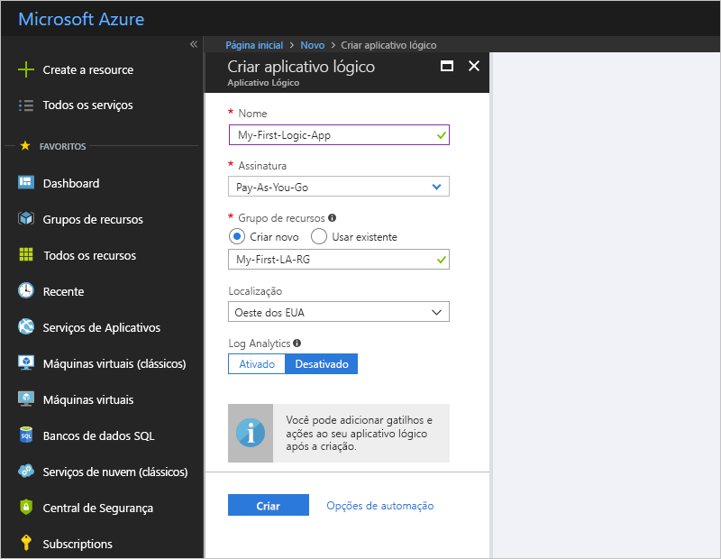

   | Configuração | Valor | DESCRIÇÃO | 
   | ------- | ----- | ----------- | 
   | **Nome** | MyFirstLogicApp | O nome do seu aplicativo lógico | 
   | **Assinatura** | <*nome-da-sua-assinatura-do-Azure*> | O nome e a ID da assinatura do Azure | 
   | **Grupo de recursos** | My-First-LA-RG | O nome do [grupo de recursos do Azure](../azure-resource-manager/resource-group-overview.md) usado para organizar os recursos relacionados | 
   | **Localidade** | Leste dos EUA 2 | A região onde as informações do seu aplicativo lógico serão armazenadas | 
   | **Log Analytics** | Desativar | Mantenha a configuração **Desligado** para o log de diagnósticos. | 
   |||| 

3. Depois que o Azure implanta o aplicativo lógico, o Designer de Aplicativos Lógicos é exibido e mostra uma página com um vídeo de introdução os gatilhos normalmente usados. Em **Modelos**, escolha **Aplicativo lógico em branco**.

   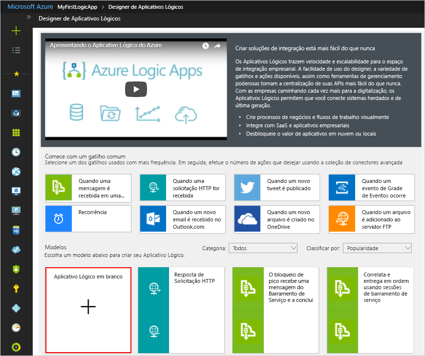

Em seguida, adicione um [gatilho](../logic-apps/logic-apps-overview.md#logic-app-concepts) que é acionado quando um novo item de RSS feed aparece. Cada aplicativo lógico deve começar com um gatilho, que é disparado quando um evento específico ocorre ou quando uma condição específica é atendida. Cada vez que o disparador é acionado, o mecanismo de Aplicativos Lógicos cria uma instância de aplicativo lógico que inicia e executa o fluxo de trabalho.

## <a name="check-rss-feed-with-a-trigger"></a>Verifique o RSS feed com um gatilho

1. No designer, digite "rss" na caixa de pesquisa. Selecione este gatilho: **RSS - Quando um item do feed é publicado**

   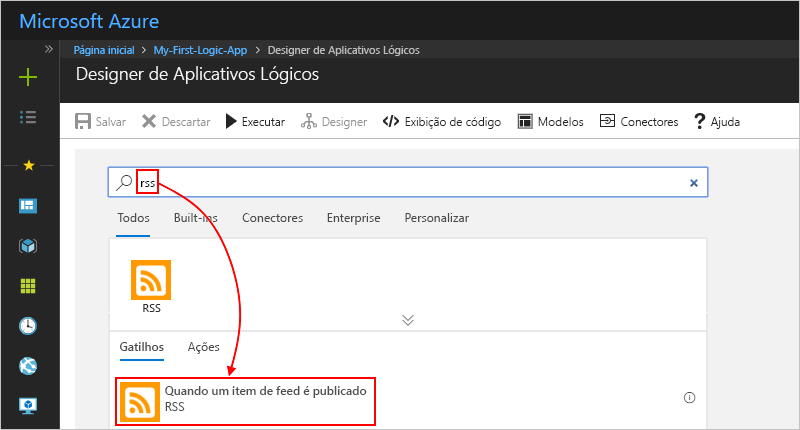

2. Forneça essas informações para o gatilho como mostrado e descrito: 

   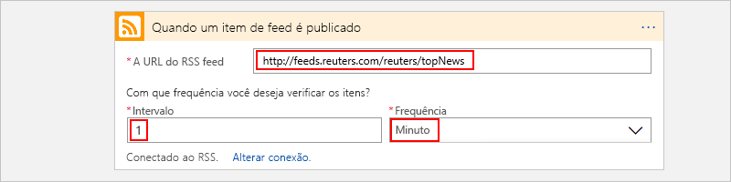

   | Configuração | Valor | DESCRIÇÃO | 
   | ------- | ----- | ----------- | 
   | **A URL do RSS feed** | ```http://feeds.reuters.com/reuters/topNews``` | O link do RSS feed do site que você deseja monitorar | 
   | **Intervalo** | 1 | O número de intervalos de espera entre as verificações | 
   | **Frequência** | Minuto | A unidade de tempo para cada intervalo entre verificações  | 
   |  |  |  | 

   Juntos, o intervalo e a frequência definem o agendamento para o gatilho do aplicativo lógico. 
   Este aplicativo lógico verifica o feed a cada minuto.

3. Por enquanto, para ocultar os detalhes do gatilho, clique na barra de título do gatilho.

   

4. Salve seu aplicativo lógico. Clique em **Salvar** na barra de ferramentas do designer. 

Seu aplicativo lógico agora está ativo, mas ele não faz nada além de verificar o RSS feed. Portanto, adicione uma ação que responde quando o gatilho é acionado.

## <a name="send-email-with-an-action"></a>Enviar email com uma ação

Agora adicione uma [ação](../logic-apps/logic-apps-overview.md#logic-app-concepts) que envia email quando um novo item é exibido no RSS feed. 

1. No gatilho **Quando um item do feed é publicado**, escolha **+ Nova etapa** > **Adicionar uma ação**.

   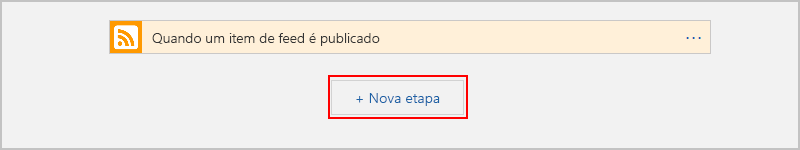

2. Em **escolher uma ação**, procure "enviar email" e selecione a ação "enviar email" para o provedor de email que você deseja. Para filtrar a lista de ações para um serviço específico, você pode selecionar primeiro o conector em **Conectores**.

   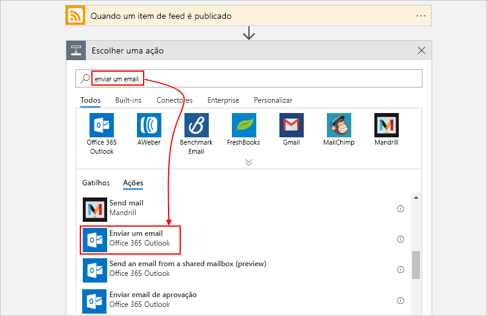

   * Para as contas corporativas ou de estudante do Azure, selecione o Outlook do Office 365. 
   * Para contas pessoais da Microsoft, selecione Outlook.com.

3. Se forem solicitadas credenciais, entre na sua conta de email para que os Aplicativos Lógicos criem uma conexão à sua conta de email.

4. Na ação **Enviar um email**, especifique os dados que você deseja incluir no email. 

   1. Na caixa **Para**, insira o endereço de email do destinatário. 
   Para fins de teste, você pode usar seu próprio endereço de email.

      Por enquanto, ignore a lista de parâmetros ou a lista **Adicionar conteúdo dinâmico** que forem exibidas. 
      Quando você clica em algumas caixas de edição, essa lista é exibida e mostra os parâmetros disponíveis de etapa anterior que você pode incluir em seu fluxo de trabalho como entradas.
      A largura do navegador determina a lista exibida.

   2. Na caixa **Assunto**, digite este texto com um espaço em branco à direita: ```New RSS item: ```

      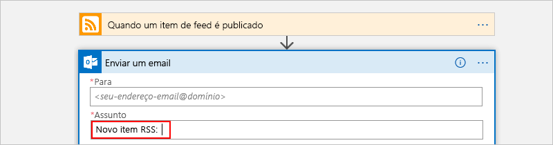
 
   3. Na lista de parâmetros ou na lista **Adicionar conteúdo dinâmico**, selecione **Título do feed** para incluir o título do item do RSS.

      Por exemplo, aqui está a lista de parâmetros:

      

      E aqui está a lista de conteúdo dinâmico:

      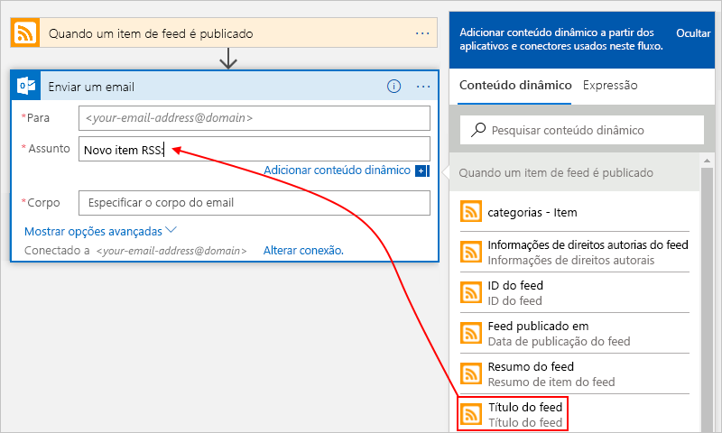

      Quando você tiver acabado, o assunto do email deve ser semelhante ao exemplo a seguir:

      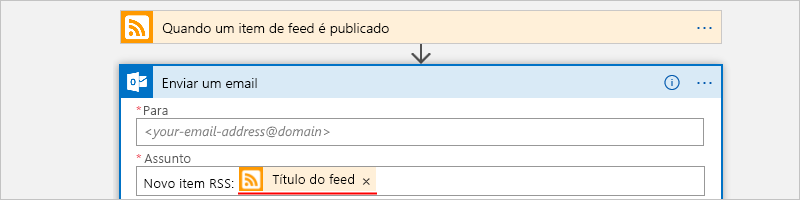

      Se um loop "For each" for exibida no designer, então você selecionou um campo que contém uma matriz, por exemplo, o campo **categorias de item** campo. 
      Para esses tipos de campos, o designer adiciona automaticamente esse loop em torno da ação que faz referência a esse campo. 
      Dessa forma, seu aplicativo lógico executará a mesma ação em cada item da matriz. 
      Para remover o loop, escolha as **elipses** (**...**) na barra de título do loop e, em seguida, escolha **Excluir**.

   4. Na caixa **Corpo**, digite o texto e selecione esses campos para o corpo do email. 
   Para adicionar linhas em branco em uma caixa de edição, pressione Shift + Enter. 

      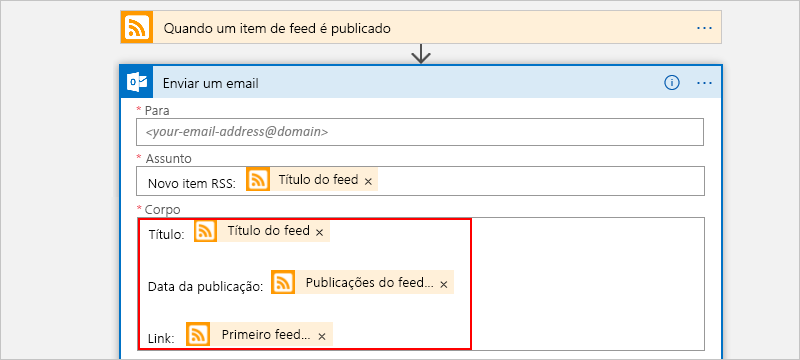

      | Configuração | DESCRIÇÃO | 
      | ----- | ----------- | 
      | **Título do feed** | O título do item | 
      | **Feed publicado em** | A data e a hora de publicação do item | 
      | **Link principal do feed** | A URL para o item | 
      ||| 
   
5. Salve seu aplicativo lógico.

Em seguida, teste o seu aplicativo lógico.

## <a name="run-your-logic-app"></a>Executar seu aplicativo lógico

Para executar manualmente o aplicativo lógico, escolha **Executar** na barra de ferramentas do designer. Ou então, aguarde até que seu aplicativo lógico seja executado conforme o agendamento especificado (cada minuto). Se o RSS feed possuir novos itens, o seu aplicativo lógico enviará um email para cada novo item. Se o seu feed não possuir novos itens, o aplicativo lógico ignora o acionamento do gatilho e aguarda o próximo intervalo antes de verificar novamente. 

Por exemplo, aqui está um email de exemplo enviado por esse aplicativo lógico:

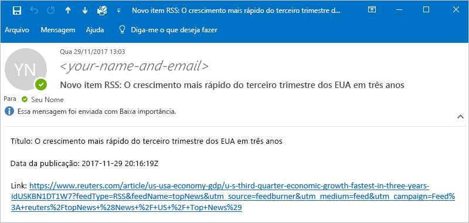

Se você não receber nenhum email, verifique a pasta de Lixo eletrônico. O filtro de lixo de email pode redirecionar esses tipos de mensagens. 

Parabéns! Você criou e executou seu primeiro aplicativo lógico.

## <a name="clean-up-resources"></a>Limpar recursos

Quando não for mais necessário, exclua o grupo de recursos que contém o aplicativo lógico e os recursos relacionados. No menu principal do Azure, vá para **Grupos de recursos** e selecione o grupo de recursos do seu aplicativo lógico. Selecione **Excluir grupo de recursos**. Insira o nome do grupo de recursos como confirmação e escolha **Excluir**.

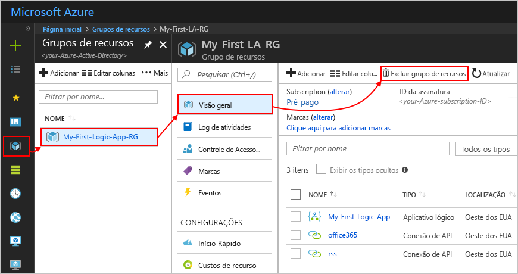

## <a name="get-support"></a>Obtenha suporte

* Em caso de dúvidas, visite o [Fórum dos Aplicativos Lógicos do Azure](https://social.msdn.microsoft.com/Forums/en-US/home?forum=azurelogicapps).
* Para enviar ou votar em ideias de recurso, visite o [site de comentários do usuário de Aplicativos Lógicos](http://aka.ms/logicapps-wish).

## <a name="next-steps"></a>Próximas etapas

Neste guia de início rápido, você criou seu primeiro aplicativo lógico que procura atualizações RSS com base em um agendamento específico (cada minuto) e executa uma ação (envia email) quando há atualizações. Para saber mais, continue com este tutorial que cria fluxos de trabalho mais avançados baseadas em agendamento:

> [!div class="nextstepaction"]
> [Verificar o tráfego com um aplicativo lógico baseado em agendamento](../logic-apps/tutorial-build-schedule-recurring-logic-app-workflow.md)