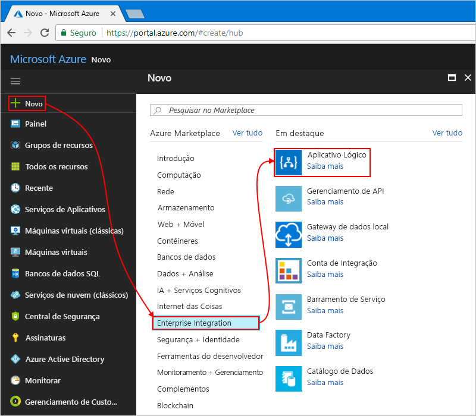

# <a name="check-traffic-with-a-scheduler-based-logic-app"></a>Verificar o tráfego com um aplicativo lógico baseado em agendador

Os Aplicativos Lógicos do Azure ajudam a automatizar os fluxos de trabalho que são executados em um agendamento. Este tutorial mostra como você pode criar um [aplicativo lógico](../logic-apps/logic-apps-overview.md) com um gatilho de agendador que executa todas as manhãs dos dias da semana e verifica o tempo de viagem, incluindo o tráfego, entre dois lugares. Se o tempo excede um limite específico, o aplicativo lógico envia email com o tempo de viagem e o tempo extra necessário para seu destino.

Neste tutorial, você aprenderá como:

> [!div class="checklist"]
> * Criar um aplicativo lógico em branco. 
> * Adicionar um gatilho que funciona como um agendador para seu aplicativo lógico.
> * Adicionar uma ação que obtém o tempo de viagem para uma rota.
> * Adicionar uma ação que cria uma variável, converte o tempo de viagem de segundos para minutos e salva o resultado na variável.
> * Adicionar uma condição que compara o tempo de viagem em relação a um limite especificado.
> * Adicionar uma ação que envia email se o tempo de viagem excede o limite.

Quando terminar, o aplicativo lógico ficará parecido com este fluxo de trabalho em alto nível:


Caso você não tenha uma assinatura do Azure, <a href="https://azure.microsoft.com/free/" target="_blank">crie uma conta gratuita do Azure</a> antes de começar.

## <a name="prerequisites"></a>pré-requisitos

* Uma conta de email de qualquer provedor de email compatível com os Aplicativos Lógicos, como o Outlook do Office 365, o Outlook.com ou o Gmail. Para outros provedores, [revise a lista de conectores aqui](https://docs.microsoft.com/connectors/). Este guia de início rápido usa uma conta do Outlook.com. Se você usar uma conta de email diferente, as etapas gerais serão as mesmas, mas a interface do usuário poderá parecer um pouco diferente.

* Para obter o tempo de viagem de uma rota, você precisará de uma chave de acesso para a API do Bing Mapas. Para obter essa chave, siga as etapas para saber <a href="https://msdn.microsoft.com/library/ff428642.aspx" target="_blank">como obter uma chave do Bing Mapas</a>. 

## <a name="sign-in-to-the-azure-portal"></a>Entrar no Portal do Azure

Entre no <a href="https://portal.azure.com" target="_blank">portal do Azure</a> com suas credenciais da conta do Azure.

## <a name="create-your-logic-app"></a>Criar seu aplicativo lógico

1. No menu principal do Azure, escolha **Novo** > **Enterprise Integration** > **Aplicativo Lógico**.

   

2. Em **Criar aplicativo lógico**, forneça essas informações sobre seu aplicativo lógico, como mostrado e descrito. Quando tiver concluído, escolha **Fixar no painel** > **Criar**.

   

   | Configuração | Valor | DESCRIÇÃO | 
   | ------- | ----- | ----------- | 
   | **Nome** | LA-TravelTime | O nome do seu aplicativo lógico | 
   | **Assinatura** | <*nome-da-sua-assinatura-do-Azure*> | O nome e a ID da assinatura do Azure | 
   | **Grupo de recursos** | LA-TravelTime-RG | O nome do [grupo de recursos do Azure](../azure-resource-manager/resource-group-overview.md) usado para organizar os recursos relacionados | 
   | **Localidade** | Leste dos EUA 2 | A região na qual armazenar informações sobre o seu aplicativo lógico | 
   | **Log Analytics** | Desativar | Mantenha a configuração **Desligado** para o log de diagnósticos. | 
   |||| 

3. Depois que o Azure implanta o aplicativo, o Designer de Aplicativos Lógicos é exibido e mostra uma página com um vídeo introdutório e modelos de padrões de aplicativo lógico comuns. Em **Modelos**, escolha **Aplicativo lógico em branco**.

   

Em seguida, adicione o [gatilho](../logic-apps/logic-apps-overview.md#logic-app-concepts) de recorrência, que é disparado com base em uma agenda especificada. Cada aplicativo lógico deve começar com um gatilho, que é disparado quando um evento específico ocorre ou quando novos dados atendem a uma condição específica. Para saber mais, confira [Criar seu primeiro aplicativo lógico](../logic-apps/quickstart-create-first-logic-app-workflow.md).

## <a name="add-scheduler-trigger"></a>Adicionar gatilho de agendador

1. No designer, digite "recorrência" na caixa de pesquisa. Selecione este gatilho: **Agenda – Recorrência**

   

2. Na forma **Recorrência**, escolha o botão de **reticências** (**...** ) e escolha **Renomear**. Renomeie o gatilho com esta descrição:```Check travel time every weekday morning```

   

3. No gatilho, escolha **Mostrar opções avançadas**.

4. Forneça os detalhes de agenda e recorrência para o disparador, como mostrado e descrito:

   

   | Configuração | Valor | DESCRIÇÃO | 
   | ------- | ----- | ----------- | 
   | **Intervalo** | 1 | O número de intervalos de espera entre as verificações | 
   | **Frequência** | Semana | A unidade de tempo a ser usada para a recorrência | 
   | **Fuso horário** | Nenhum | Aplica-se somente quando você especifica uma hora de início. Útil para especificar um fuso horário não local. | 
   | **Hora de início** | Nenhum | Atrasa a recorrência até data e hora específicas. Para saber mais, confira [Agendar tarefas e fluxos de trabalho executados regularmente](../connectors/connectors-native-recurrence.md). | 
   | **Nestes dias** | Segunda-feira, terça-feira, quarta-feira, quinta-feira, sexta-feira | Disponível apenas quando **Frequência** está definido como “Semana” | 
   | **A estas horas** | 7,8,9 | Disponível apenas quando **Frequência** está definido como "Semana" ou "Dia". Selecione as horas do dia para executar essa recorrência. Este exemplo é executado nas marcas de horas 7, 8 e 9. | 
   | **A estes minutos** | 0,15,30,45 | Disponível apenas quando **Frequência** está definido como "Semana" ou "Dia". Selecione os minutos do dia para executar essa recorrência. Este exemplo é executado a cada 15 minutos, começando na marca da hora zero. | 
   ||||

   Esse gatilho é acionado todos os dias da semana, a cada 15 minutos, começando às 7h e terminando às 9h45. 
   A caixa **Visualização** mostra a agenda de recorrência. 
   Para saber mais, confira [Agendar tarefas e fluxos de trabalho](../connectors/connectors-native-recurrence.md) e [Gatilhos e ações de fluxo de trabalho](../logic-apps/logic-apps-workflow-actions-triggers.md#recurrence-trigger).

5. Por enquanto, para ocultar os detalhes do disparador, clique na barra de título da forma.

   

6. Salve seu aplicativo lógico. Clique em **Salvar** na barra de ferramentas do designer. 

Seu aplicativo lógico agora está ativo, mas ele não faz nada além de repetir. Portanto, adicione uma ação que responde quando o gatilho é acionado.

## <a name="get-the-travel-time-for-a-route"></a>Obter o tempo de viagem para uma rota

Agora que você tem um gatilho, adicione uma [ação](../logic-apps/logic-apps-overview.md#logic-app-concepts) que obtém o tempo de viagem entre dois lugares. Os Aplicativos Lógicos fornecem um conector para a API do Bing Mapas para que você possa obter essas informações facilmente. Antes de começar essa tarefa, verifique se você tem uma chave de API do Bing Mapas conforme descrito nos pré-requisitos deste tutorial.

1. No Designer de Aplicativos Lógicos, no gatilho, escolha **+ Nova etapa** > **Adicionar uma ação**.

2. Pesquise "mapas" e selecione a ação: **Bing Mapas - Obter rota**

3. Se você não tiver uma conexão do Bing Mapas, a criação será solicitada. Forneça esses detalhes de conexão e escolha **Criar**.

   

   | Configuração | Valor | DESCRIÇÃO |
   | ------- | ----- | ----------- |
   | **Nome da Conexão** | BingMapsConnection | Forneça um nome para a conexão. | 
   | **Chave de API** | <*your-Bing-Maps-key*> | Insira a chave do Bing Mapas que você recebeu anteriormente. Se você não tiver uma chave do Bing Mapas, saiba <a href="https://msdn.microsoft.com/library/ff428642.aspx" target="_blank">como obter uma chave</a>. | 
   | | | |  

4. Renomeie a ação com esta descrição:```Get route and travel time with traffic```

5. Forneça detalhes para a ação **Obter rota**, como mostrado e descrito aqui, por exemplo:

    

   | Configuração | Valor | DESCRIÇÃO |
   | ------- | ----- | ----------- |
   | **Localizador 1** | <*start-location*> | Origem da rota | 
   | **Localizador 2** | <*end-location*> | Destino da rota | 
   | **Evitar** | Nenhum | Todos os itens a serem evitados na rota, como vias expressas, pedágios e assim por diante | 
   | **Otimizar** | timeWithTraffic | Um parâmetro para otimizar a rota, como distância, viagem de tempo com tráfego atual e assim por diante. Selecione este parâmetro: "timeWithTraffic" | 
   | **Unidades de distância** | <*your-preference*> | A unidade de distância da rota. Este artigo usa a seguinte unidade: "Milhas"  | 
   | **Modo de navegação** | Automóvel | O modo de viagem da rota. Selecione este modo: "Automóvel" | 
   | **Data /Hora de trânsito** | Nenhum | Aplica-se somente ao modo de trânsito | 
   | **Tipo de data e hora** | Nenhum | Aplica-se somente ao modo de trânsito | 
   |||| 

   Para saber mais sobre esses parâmetros, consulte [Calcular uma rota](https://msdn.microsoft.com/library/ff701717.aspx).

6. Salve seu aplicativo lógico.

Em seguida, crie uma variável para que você possa converter e armazenar o tempo de viagem atual como minutos em vez de segundos. Dessa forma, você pode evitar repetir a conversão e usar o valor mais facilmente em etapas posteriores. 

## <a name="create-variable-to-store-travel-time"></a>Criar variável para armazenar o tempo de viagem

Às vezes, convém executar operações em dados no fluxo de trabalho e usar os resultados em ações posteriores. Para salvar esses resultados e poder reutilizar ou fazer referência a eles facilmente, você pode criar variáveis para armazenar os resultados depois de processá-los. Você pode criar variáveis somente no nível superior no aplicativo lógico.

Por padrão, a ação **Obter rota** anterior retorna o tempo de viagem atual com tráfego em segundos pelo campo **Tráfego na Duração da Viagem**. Ao converter e armazenar esse valor como minutos, você facilita a reutilização do valor posteriormente sem convertê-lo novamente.

1. Na ação **Obter rota**, escolha **+ Nova etapa** > **Adicionar uma ação**.

2. Pesquise "variáveis" e selecione a ação: **Variáveis - Inicializar variável**

   

3. Renomear a ação com esta descrição:```Create variable to store travel time```

4. Forneça os detalhes para a variável conforme descrito aqui:

   | Configuração | Valor | DESCRIÇÃO | 
   | ------- | ----- | ----------- | 
   | **Nome** | travelTime | O nome da variável | 
   | **Tipo** | Número inteiro | O tipo de dados da variável | 
   | **Valor** | Uma expressão que converte o tempo de viagem atual de segundos em minutos (consulte as etapas nesta tabela). | O valor inicial da variável | 
   |||| 

   1. Para criar a expressão do campo **valor**, clique no campo para que seja exibida a lista de conteúdo dinâmico. 
   Se necessário, amplie seu navegador até que a lista seja exibida. 
   Na lista Conteúdo dinâmico, escolha **Expressão**. 

      

      Quando você clica em algumas caixas de edição, aparece uma lista de conteúdo dinâmico ou uma lista de parâmetros embutidos. A lista mostra os parâmetros de ações anteriores que você pode usar como entradas no seu fluxo de trabalho. 
      A lista de conteúdo dinâmico tem um editor de expressões em que você pode selecionar funções para executar operações. 
      Este editor de expressão aparece apenas na lista de conteúdo dinâmico.

      A largura do navegador determina a lista exibida. 
      Se o navegador for amplo, a lista de conteúdo dinâmico será exibida. 
      Se o navegador for estreito, será exibida uma lista de parâmetros embutidos na caixa de edição que tem o foco no momento.

   2. No editor de expressão, digite esta expressão:```div(,60)```

      

   3. Coloque o cursor dentro da expressão entre o parêntese esquerdo (**(**) e a vírgula (**,**). 
   Escolha **Conteúdo dinâmico**.

      

   4. Na lista de conteúdo dinâmico, selecione **Tráfego de Duração da Viagem**.

      

   5. Depois que o campo resolver dentro da expressão, escolha **OK**.

      

      O campo **Valor** agora é exibido conforme mostrado aqui:

      

5. Salve seu aplicativo lógico.

Em seguida, adicione uma condição que verifica se o tempo de viagem atual é maior que um limite específico.

## <a name="compare-travel-time-with-limit"></a>Comparar o tempo de viagem com o limite

1. Na ação anterior, escolha **+ Nova etapa** > **Adicionar uma condição**. 

2. Renomeie a condição com esta descrição:```If travel time exceeds limit```

3. Crie uma condição que verifica se **travelTime** excede o limite especificado, como descrito e mostrado aqui:

   1. Dentro da condição, clique na caixa **Escolha um valor**, que está à esquerda (exibição de navegador ampla) ou na parte superior (exibição de navegador estreita).

   2. Na lista de conteúdo dinâmico ou na lista de parâmetros, selecione campo **travelTime** em **Variáveis**.

   3. Na caixa de comparação, selecione este operador: **é maior que**

   4. Na caixa **Escolha um valor** à direita (exibição ampla) ou na parte inferior (exibição estreita), insira este limite:```15```

   Por exemplo, se você estiver trabalhando no modo restrito, veja aqui como criar essa condição:

   

4. Salve seu aplicativo lógico.

Em seguida, adicione a ação a ser executada quando o tempo de viagem excede seu limite.

## <a name="send-email-when-limit-exceeded"></a>Enviar email quando o limite é excedido

Agora, adicione uma ação que envia email quando o tempo de viagem excede seu limite. Este email inclui o tempo de viagem atual e o tempo extra necessário para concluir a rota especificada. 

1. Na ramificação **Se verdadeiro** da condição, escolha **Adicionar uma ação**.

2. Procure "enviar email" e selecione o conector de email e a "ação enviar email" que você deseja usar.

   

   * Para contas pessoais da Microsoft, selecione **Outlook.com**. 
   * Para as contas corporativas ou de estudante do Azure, selecione o **Outlook do Office 365**.

3. Se você ainda não tiver uma conexão, será solicitado a entrar na sua conta de email.

   Os Aplicativos Lógicos criam uma conexão à sua conta de email.

4. Renomeie a ação com esta descrição:```Send email with travel time```

5. Na caixa **Para**, insira o endereço de email do destinatário. Para fins de teste, use o seu endereço de email.

6. Na caixa **Subject**, especifique o assunto do email e inclua a variável **travelTime**.

   1. Insira o texto ```Current travel time (minutes): ``` com um espaço à direita. 
   
   2. Na lista de parâmetros ou na lista de conteúdo dinâmico, selecione **travelTime** em **Variáveis**. 
   
      Por exemplo, se seu navegador estiver na exibição estreita:

      

7. Na caixa **Body**, especifique o conteúdo do corpo do email. 

   1. Insira o texto ```Add extra travel time (minutes): ``` com um espaço à direita. 
   
   2. Se necessário, amplie seu navegador até que seja exibida a lista de conteúdo dinâmico. 
   Na lista Conteúdo dinâmico, escolha **Expressão**.

      

   3. No editor de expressão, digite esta expressão para que você possa calcular o número de minutos que excedem o limite:```sub(,15)```

      

   4. Coloque o cursor dentro da expressão entre o parêntese esquerdo (**(**) e a vírgula (**,**). Escolha **Conteúdo dinâmico**.

      

   5. Em **Variáveis**, selecione **travelTime**.

      

   6. Depois que o campo resolver dentro da expressão, escolha **OK**.

      

      O campo **Body** agora é exibido conforme mostrado aqui:

      

8. Salve seu aplicativo lógico.

Em seguida, teste seu aplicativo lógico, que agora se parece com este exemplo:


## <a name="run-your-logic-app"></a>Executar seu aplicativo lógico

Para executar manualmente o aplicativo lógico, escolha **Executar** na barra de ferramentas do designer. Se o tempo de viagem atual permanecer abaixo do limite, o aplicativo lógico não faz nada e aguarda o próximo intervalo antes de verificar novamente.
Mas se o tempo de viagem atual exceder o limite, você receberá um email com o tempo de viagem atual e o número de minutos acima do limite. Aqui está um email de exemplo que seu aplicativo lógico envia:


Se você não receber nenhum email, verifique a pasta de Lixo eletrônico. O filtro de lixo de email pode redirecionar esses tipos de mensagens. Caso contrário, se você não tiver certeza de que seu aplicativo lógico foi executado corretamente, confira [Solução de problemas do aplicativo lógico](../logic-apps/logic-apps-diagnosing-failures.md).

Parabéns, você agora criou e executou um aplicativo lógico recorrente com base em agendamento. 

Para criar outros aplicativos lógicos que usam o gatilho **Agenda - Recorrência**, confira estes modelos, que ficam disponíveis depois que você cria um aplicativo lógico:

* Receba lembretes diários.
* Exclua blobs do Azure mais antigos.
* Adicione uma mensagem a uma fila do Armazenamento do Azure.

## <a name="clean-up-resources"></a>Limpar recursos

Quando não for mais necessário, exclua o grupo de recursos que contém o aplicativo lógico e os recursos relacionados. No menu principal do Azure, vá para **Grupos de recursos** e selecione o grupo de recursos do seu aplicativo lógico. Selecione **Excluir grupo de recursos**. Insira o nome do grupo de recursos como confirmação e escolha **Excluir**.


## <a name="get-support"></a>Obtenha suporte

* Em caso de dúvidas, visite o [Fórum dos Aplicativos Lógicos do Azure](https://social.msdn.microsoft.com/Forums/en-US/home?forum=azurelogicapps).
* Para enviar ou votar em ideias de recurso, visite o [site de comentários do usuário de Aplicativos Lógicos](http://aka.ms/logicapps-wish).

## <a name="next-steps"></a>Próximas etapas

Neste tutorial, você criou um aplicativo lógico que verifica o tráfego com base em um agendamento especificado (nas manhãs dos dias da semana) e executa uma ação (envia email) quando o tempo de viagem excede um limite especificado. Agora, saiba como criar um aplicativo lógico que envia solicitações de lista de endereçamento para aprovação integrando serviços do Azure, serviços da Microsoft e outros aplicativos SaaS.

> [!div class="nextstepaction"]
> [Gerenciar solicitações da lista de correspondência](../logic-apps/tutorial-process-mailing-list-subscriptions-workflow.md)
