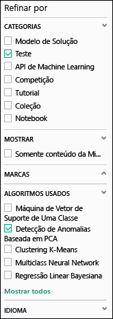
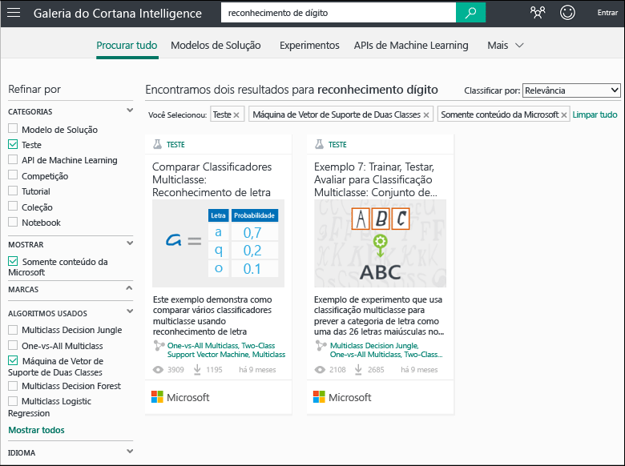
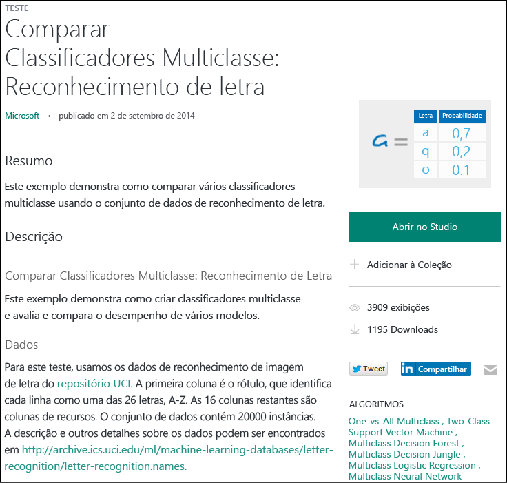

# Copiar os testes de amostra para criar novos experimentos do aprendizado de máquina
Saiba como começar com os testes de amostra na [Galeria do Cortana Intelligence](http://gallery.cortanaintelligence.com/) , em vez de criar experimentos do aprendizado de máquina a partir do zero. Você pode usar os exemplos para criar sua própria solução do aprendizado de máquina.

Na galeria, estão os testes de amostra da equipe de Aprendizado de Máquina do Microsoft Azure, bem como os exemplos compartilhados pela comunidade do Aprendizado de Máquina. Você pode fazer perguntas ou postar comentários sobre os experimentos

Para saber como usar a galeria, assista ao vídeo de 3 minutos [Copiar o trabalho de outras pessoas para fazer a ciência de dados](machine-learning-data-science-for-beginners-copy-other-peoples-work-to-do-data-science.md) da série [Ciência de Dados para Iniciantes](machine-learning-data-science-for-beginners-the-5-questions-data-science-answers.md).

[!INCLUDE [machine-learning-free-trial](../../includes/machine-learning-free-trial.md)]

## Localizar um experimento para copiar na Galeria do Cortana Intelligence
Para ver quais experimentos estão disponíveis, vá para a [Galeria](http://gallery.cortanaintelligence.com/) e clique em **Experimentos** na parte superior da página.

### Localizar os experimentos mais recentes ou mais populares
Nessa página, você pode ver os experimentos **Adicionados recentemente**, descer para examinar **O que é popular** ou os **Testes populares da Microsoft** mais recentes.

### Procurar um experimento que atenda aos requisitos específicos
Para procurar todos os experimentos:

1. Clique em **Procurar tudo** na parte superior da página.
2. Em **Refinar por**, selecione **Experimento** para ver todos os experimentos na Galeria.
3. Você pode encontrar os experimentos que atendem aos seus requisitos de duas maneiras diferentes:
   * **Selecione os filtros à esquerda.** Por exemplo, para procurar os experimentos que usam um algoritmo de detecção de anomalias com base em PCA, selecione **Experimento** em **Categorias** e **Detecção de Anomalias Baseada em PCA** em **Algoritmos Usados**. (Se você não vir esse algoritmo, clique em **Mostrar tudo** na parte inferior da lista).  
     
   * **Use a caixa de pesquisa.**  Por exemplo, para encontrar os experimentos fornecidos pela Microsoft relacionados ao reconhecimento de dígito e que usam um algoritmo de máquina do vetor com suporte de duas classes, digite "reconhecimento de dígito" na caixa de pesquisa. Em seguida, selecione os filtros **Experimento**, **Apenas o conteúdo da Microsoft** e **Máquina do Vetor com Suporte de Duas Classes**:  
4. Clique em um experimento para saber mais sobre ele.
5. Para executar e/ou modificar o experimento, clique em **Abrir no Estúdio** na página do experimento.
   
   > [!NOTE]
   > Para abrir um experimento no Estúdio de Aprendizado de Máquina, você precisará entrar com suas credenciais de conta da Microsoft. Se você ainda não tiver um espaço de trabalho de Aprendizado de Máquina, é criado um espaço de trabalho de avaliação gratuito. [Saiba o que está incluído na avaliação gratuita do Aprendizado de Máquina](https://azure.microsoft.com/pricing/details/machine-learning/)
   > 
   > 
   
     

## Usar um modelo no Estúdio de Aprendizado de Máquina
Você também pode criar um novo experimento no Estúdio de Aprendizado de Máquina usando um exemplo da galeria como modelo.

1. Entre com suas credenciais de conta da Microsoft no [Estúdio](https://studio.azureml.net)e clique em **Novo** para criar um novo experimento.
2. Procure o conteúdo de exemplo e clique em um.

Um novo experimento é criado no seu espaço de trabalho usando o experimento de exemplo como um modelo.

## Próximas etapas
* [Preparar os dados](machine-learning-data-science-import-data.md)
* [Tente usar R em seu experimento](machine-learning-r-quickstart.md)
* [Analise os experimentos R de exemplo](machine-learning-r-csharp-web-service-examples.md)
* [Criar uma API do serviço Web](machine-learning-publish-a-machine-learning-web-service.md)
* [Procurar aplicativos prontos para uso](https://datamarket.azure.com/browse?query=machine+learning)

<!--HONumber=Nov16_HO2-->

