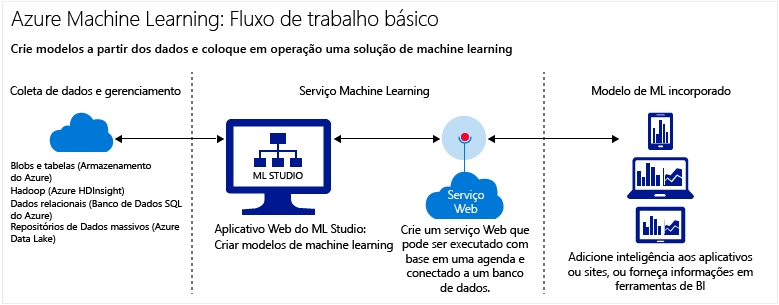

# Introdução ao Azure Machine Learning na nuvem
## O que aprendizado da máquina?
O aprendizado de máquina é uma técnica da ciência de dados que ajuda os computadores a aprenderem com os dados existentes para preverem as tendências, resultados e futuros comportamentos.  

Essas estimativas ou previsões de aprendizado de máquina podem tornar aplicativos e dispositivos mais inteligentes. Quando você faz compras online, o aprendizado de máquina ajuda a recomendar outros produtos que podem lhe agradar com base no que você já comprou. Ao passar seu cartão de crédito, o aprendizado de máquina compara a transação com um banco de dados de transações e ajuda a detectar fraudes. Quando o aspirador de pó robô aspira uma sala, o aprendizado de máquina ajuda a decidir se o trabalho é feito ou não.

Para ter uma visão geral, experimente a série de vídeos [Ciência de Dados para Iniciantes](machine-learning-data-science-for-beginners-the-5-questions-data-science-answers.md). Sem usar o jargão ou matemática, a Ciência de dados para Iniciantes apresenta o aprendizado de máquina e orienta-o em um modelo de previsão simples.

## O que é Aprendizado de Máquina na nuvem do Microsoft Azure?
O Azure Machine Learning é um serviço de análise preditiva na nuvem que permite criar rapidamente modelos preditivos e implantá-los como soluções de análise.

Você pode trabalhar com uma biblioteca de algoritmos pronta para uso, usá-los para criar modelos em um PC conectado à Internet e implantar sua solução preditiva rapidamente. Comece com exemplos prontos para uso e soluções na [Cortana Intelligence Gallery](https://gallery.cortanaintelligence.com/).

O Azure Machine Learning não apenas fornece ferramentas para modelar a análise preditiva, mas também fornece um serviço totalmente gerenciado que você pode usar para implantar seus modelos preditivos como serviços Web prontos para consumo.

## O que é análise preditiva?
A análise preditiva usa fórmulas matemáticas denominadas algoritmos que analisam os dados atuais ou históricos para identificar padrões ou tendências para prever futuros eventos.

## Ferramentas para criar soluções completas de aprendizado de máquina em nuvem
O Azure Machine Learning tem tudo o que você precisa para criar soluções completas de análise preditiva na nuvem, desde uma biblioteca de algoritmos grande até um estúdio para criar modelos e uma maneira fácil de implantar o modelo como um serviço Web. Crie, teste, operacionalize e gerencie rapidamente modelos preditivos.

### Estúdio de Aprendizado de Máquina: criar modelos preditivos
No [Estúdio de Aprendizado de Máquina](machine-learning-what-is-ml-studio.md), você pode criar rapidamente modelos preditivos arrastando, soltando e conectando módulos. Você pode fazer experiências com combinações diferentes e [experimentar gratuitamente](https://studio.azureml.net/?selectAccess=true&o=2).

* Na [Galeria do Cortana Intelligence](machine-learning-gallery-how-to-use-contribute-publish.md), você pode experimentar soluções de análise criadas por outros usuários ou contribuir com suas próprias. Poste perguntas ou comentários sobre experimentos na comunidade ou compartilhe links para experimentos por meio de redes sociais, como o LinkedIn e o Twitter.

  
* Use uma ampla biblioteca de [algoritmos e módulos de aprendizado de máquina](https://msdn.microsoft.com/library/azure/f5c746fd-dcea-4929-ba50-2a79c4c067d7) no Estúdio de Aprendizado de Máquina para começar imediatamente seus modelos preditivos. Escolha os testes de amostra, pacotes R e Python, e algoritmos de ponta de empresas da Microsoft, como Xbox e Bing. Estenda os módulos do Studio com seus próprios scripts [R](machine-learning-extend-your-experiment-with-r.md) e [Python](machine-learning-execute-python-scripts.md) personalizados.

  

### Colocar em operação soluções de análise preditiva publicando as suas próprias
Os seguintes tutoriais mostram como colocar em operação seus modelos de análise preditiva:

 * [Implantar serviços Web](machine-learning-publish-a-machine-learning-web-service.md)
 * [Treinar novamente os modelos por meio de APIs](machine-learning-retrain-models-programmatically.md)
 * [Gerenciar pontos de extremidade de serviço Web](machine-learning-create-endpoint.md)
 * [Dimensionar um serviço Web](machine-learning-scaling-webservice.md)
 * [Consumir serviços Web](machine-learning-consume-web-services.md)

## Principais termos e conceitos do aprendizado de máquina
Termos do aprendizado de máquina podem ser confusos. Aqui estão as definições dos principais termos para ajudá-lo. Use comentários para nos dizer sobre qualquer outro termo que gostaria de ver definido.

### Exploração de dados, análise descritiva e análise preditiva

**Exploração de dados** é o processo de coleta de informações sobre um conjunto de dados grande e geralmente não estruturado para encontrar características para uma análise focada.

**Mineração de dados** refere-se à mineração de dados automatizada.

**Análise descritiva** é o processo de análise de um conjunto de dados para gerar um resumo do que aconteceu. A grande maioria da análise de negócios - como relatórios de vendas, métricas de Web e análises de redes sociais - são descritivas.

**Análise preditiva** é o processo de criação de modelos por meio de dados atuais ou históricos para prever resultados futuros.

### Aprendizado supervisionado e não supervisionado
 **aprendizado supervisionado** são treinados com dados rotulados – em outras palavras, dados compostos de exemplos das respostas desejadas. Por exemplo, um modelo que identifica o uso fraudulento do cartão de crédito seria treinado por meio de um conjunto de dados com pontos de dados rotulados de cobranças fraudulentas e válidas conhecidas. Na maioria das vezes, o aprendizado de máquina é supervisionado.

 **aprendizado não supervisionado** é usado em dados sem rótulos e o objetivo é localizar relações existentes nos dados. Por exemplo, você talvez queira localizar agrupamentos de dados demográficos de clientes com hábitos de compra semelhantes.

### Treinamento e avaliação de modelo
Um modelo de aprendizado de máquina é uma abstração da pergunta que você está tentando responder ou o resultado que você deseja prever. Os modelos são treinados e avaliados por meio de dados existentes.

#### Dados de treinamento
Quando você treina um modelo a partir de dados, usa um conjunto de dados conhecido e faz ajustes no modelo com base nas características dos dados para obter a resposta mais precisa. No Aprendizado de Máquina do Azure, um modelo é criado por meio de um módulo de algoritmos que processa os dados de treinamento e módulos funcionais, por exemplo, um módulo de pontuação.

No aprendizado supervisionado, se você estiver treinando um modelo de detecção de fraudes, usará um conjunto de transações rotuladas como fraudulentas ou válidas. Você dividirá seu conjunto de dados aleatoriamente e usará uma parte para treinar o modelo e outra para testar ou avaliar o modelo.

#### Dados de avaliação
A partir do momento em que você tem um modelo treinado, avalie esse modelo usando os dados de teste restantes. Você utiliza os dados cujos resultados você já conhece, para que você possa determinar se o seu modelo prevê com precisão.

## Outros termos comuns de aprendizado de máquina
* **algoritmo**: Um conjunto independente de regras usadas para resolver problemas por meio do processamento de dados, cálculo ou raciocínio automatizado.
* **detecção de anomalias**: um modelo que marca os eventos ou valores incomuns e ajuda a descobrir problemas. Por exemplo, a detecção de fraudes de cartão de crédito procura compras incomuns.
* **dados categóricos**: Dados organizados em categorias e que podem ser divididos em grupos. Por exemplo, um conjunto de dados categórico para carros poderia especificar ano, marca, modelo e preço.
* **classificação**: Um modelo para organizar os pontos de dados em categorias com base em um conjunto de dados para o qual os agrupamentos de categorias já são conhecidos.
* **engenharia de recursos**: O processo de extração ou seleção de recursos relacionados a um conjunto de dados, para otimizar o conjunto de dados e aprimorar os resultados. Por exemplo, dados de passagens aéreas poderiam ser otimizados classificando-os em dias de semana e feriados. Consulte [Engenharia e seleção de recursos no Aprendizado de Máquina do Azure](machine-learning-feature-selection-and-engineering.md).
* **módulo**: uma parte funcional em um modelo do Estúdio de Aprendizado de Máquina, como, por exemplo, o módulo Inserir Dados, que permite inserir e editar pequenos conjuntos de dados. Um algoritmo também é um tipo de módulo no Estúdio de Aprendizado de Máquina.
* **modelo**: um modelo de aprendizado supervisionado é o produto de um experimento do aprendizado de máquina composto de dados de treinamento, módulo de algoritmo e módulos funcionais, como um módulo do Modelo de Pontuação.
* **dados numéricos**: Dados que têm significado, como medidas (dados contínuos) ou contagens (dados discretos). Também conhecidos como *dados quantitativos*.
* **partição**: O método pelo qual você divide dados em exemplos. Consulte [Partição e Exemplo](https://msdn.microsoft.com/library/azure/dn905960.aspx) para obter mais informações.
* **previsão**: Uma previsão é uma estimativa de valor ou valores a partir de um modelo de aprendizado de máquina. Você também pode ver o termo "pontuação prevista." No entanto, as pontuações previstas não são a saída final de um modelo. Uma avaliação do modelo vem a seguir da pontuação.
* **regressão**: um modelo para prever um valor com base em variáveis independentes, como prever o preço de um carro com base em seu ano e marca.
* **pontuação**: um valor previsto gerado por meio de uma classificação treinada ou um modelo de regressão, usando o [módulo Modelo de Pontuação](https://msdn.microsoft.com/library/azure/dn905995.aspx) no Estúdio de Aprendizado de Máquina. Os modelos de classificação também retornam uma pontuação para a probabilidade do valor previsto. Depois de ter gerado pontuações por meio de um modelo, você pode avaliar a precisão desse modelo usando o [módulo Avaliar modelo](https://msdn.microsoft.com/library/azure/dn905915.aspx).
* **exemplo**: uma parte de um conjunto de dados deve ser representativa do todo. Exemplos podem ser selecionados aleatoriamente ou com base em recursos específicos do conjunto de dados.

## Próximas etapas
Você pode aprender os fundamentos da análise preditiva e aprendizado de máquina usando um [tutorial passo a passo](machine-learning-create-experiment.md) e [aproveitando os exemplos](machine-learning-sample-experiments.md).  

<!-- Module References -->
[learning-with-counts]: https://msdn.microsoft.com/library/azure/81c457af-f5c0-4b2d-922c-fdef2274413c/

