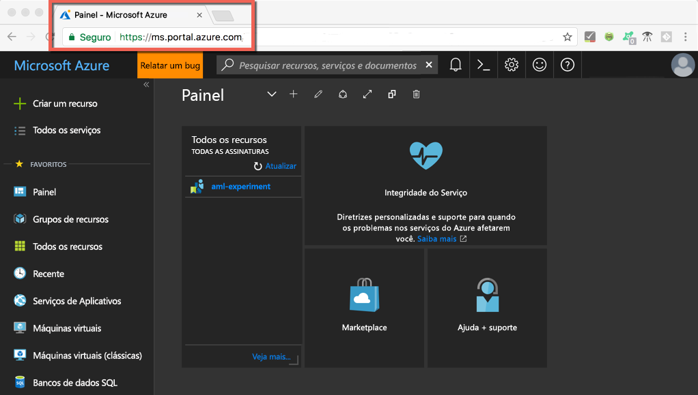

# <a name="quickstart-install-and-get-started-with-azure-machine-learning-services"></a>Guia de início rápido: instalar e começar a usar os serviços do Azure Machine Learning
Os serviços do Azure Machine Learning (versão prévia) são uma solução integrada de análise avançada e de ciência de dados de ponta a ponta. Eles ajudam os cientistas de dados profissionais a preparar dados, desenvolver experimentos e implantar modelos em escala de nuvem.

Este guia de início rápido mostra como:

* Criar contas de serviço para serviços do Azure Machine Learning
* Instalar e fazer logon no Azure Machine Learning Workbench.
* Criar um projeto no Workbench
* Executar um script nesse projeto  
* Acessar a interface de linha de comando (CLI)


Como parte do portfólio do Microsoft Azure, os serviços do Azure Machine Learning exigem uma assinatura do Azure. Se você não tiver uma assinatura do Azure, crie uma [conta gratuita](https://azure.microsoft.com/free/?WT.mc_id=A261C142F) antes de começar.

Além disso, você deve ter as permissões adequadas para criar ativos, como Grupos de Recursos, Máquinas Virtuais etc. 

<a name="prerequisites"></a>É possível instalar o aplicativo do Azure Machine Learning Workbench nos seguintes sistemas operacionais:
- Windows 10 ou Windows Server 2016
- macOS Sierra ou High Sierra

## <a name="create-azure-machine-learning-services-accounts"></a>Criar contas de serviços do Azure Machine Learning
Use o Portal do Azure para provisionar suas contas do Azure Machine Learning: 
1. Entre no [Portal do Azure](https://portal.azure.com/) usando as credenciais de assinatura do Azure que você usará. Caso não tenha uma assinatura do Azure, crie uma [conta gratuita](https://azure.microsoft.com/free/?WT.mc_id=A261C142F) agora. 

   

1. Selecione o botão **Criar um recurso** (+) no canto superior esquerdo do portal.

   

1. Digite **Machine Learning** na barra de pesquisa. Selecione o resultado de pesquisa denominado **Experimentação do Machine Learning**. 

   

1. No painel **Experimentação do Machine Learning**, role até a parte inferior e selecione **Criar** para começar a definir sua conta de experimentação.  

   

1. No painel **Experimentação do ML**, configure sua conta da Experimentação do Machine Learning. 

   Configuração|Valor sugerido para o tutorial|DESCRIÇÃO
   ---|---|---
   Nome da conta de experimentação | _Nome exclusivo_ |Insira um nome exclusivo que identifique a sua conta. Você pode usar seu próprio nome ou um nome do projeto ou departamental que melhor identifique o experimento. O nome deve ter entre 2 e 32 caracteres. Ele deve conter apenas caracteres alfanuméricos e traços (-). 
   Assinatura | _Sua assinatura_ |Escolha a assinatura do Azure que você deseja usar para o experimento. Se você tiver várias assinaturas, escolha a que for adequada para a cobrança do recurso.
   Grupo de recursos | _O seu grupo de recursos_ | Use um grupo de recursos existente na sua assinatura ou insira um nome para criar um novo grupo de recursos para essa conta de experimentação. 
   Local padrão | _A região mais próxima de seus usuários_ | Escolha a localização mais próxima a seus usuários e recursos de dados.
   Número de estações | 2 | Insira o número de estações. Saiba como [estações afetam o preço](https://azure.microsoft.com/pricing/details/machine-learning/).<br/><br/>Para este guia de início rápido, apenas duas estações são necessárias. Estações podem ser adicionadas ou removidas conforme o necessário no Portal do Azure.
   Conta de armazenamento | _Nome exclusivo_ | Selecione **Criar nova** e forneça um nome para criar uma [conta de armazenamento do Azure](https://docs.microsoft.com/en-us/azure/storage/common/storage-quickstart-create-account?tabs=portal). Selecione **Usar existente**e selecione uma conta de armazenamento existente na lista suspensa. A conta de armazenamento é necessária e é usada para conter os artefatos de projeto e dados do histórico de execuções. 
   Espaço de trabalho para a conta de Experimentação | IrisGarden<br/>(o nome é usado em tutoriais) | Forneça um nome para um espaço de trabalho dessa conta. O nome deve ter entre 2 e 32 caracteres. Ele deve conter apenas caracteres alfanuméricos e traços (-). Esse espaço de trabalho contém as ferramentas necessárias para criar, gerenciar e publicar testes.
   Atribuir um proprietário para o espaço de trabalho | _Sua conta_ | Selecione sua própria conta como o proprietário do espaço de trabalho.
   Criar conta de Gerenciamento de Modelos | **verificar** |Crie uma conta de Gerenciamento de Modelos agora para que esse recurso esteja disponível quando desejar implantar e gerenciar seus modelos como serviços Web em tempo real. <br/><br/>Embora opcional, é recomendável criar a conta de Gerenciamento de Modelos ao mesmo tempo que a conta de Experimentação.
   Nome da conta | _Nome exclusivo_ | Escolha um nome exclusivo que identifique a sua conta de Gerenciamento de Modelos. Você pode usar seu próprio nome ou um nome do projeto ou departamental que melhor identifique o experimento. O nome deve ter entre 2 e 32 caracteres. Ele deve conter apenas caracteres alfanuméricos e traços (-). 
   Tipo de preço do Gerenciamento de Modelos | **DEVTEST** | Selecione **Nenhum tipo de preço selecionado** para especificar o tipo de preço para sua nova conta de Gerenciamento de Modelos. Para reduzir os custos, selecione o tipo de preço **DEVTEST** se ele estiver disponível em sua assinatura (disponibilidade limitada). Caso contrário, selecione o tipo de preço S1 para redução de custos. Clique em **Selecionar** para salvar a seleção do tipo de preço. 
   Fixar no painel | _verificar_ | Selecione a opção **Fixar no painel** para permitir o acompanhamento fácil da sua conta de Experimentação do Machine Learning na página do painel frontal do portal do Azure.

   

5. Selecione **Criar** para iniciar o processo de criação da conta de Experimentação junto com a conta de Gerenciamento de Modelos.

   

   Pode demorar alguns minutos para criar uma conta. É possível verificar o status do processo de implantação clicando no sino na barra de ferramentas do Portal do Azure.
   
   


## <a name="install-and-log-in-to-workbench"></a>Instalar e fazer logon no Workbench

O Azure Machine Learning Workbench está disponível para Windows ou macOS. Consulte a lista de [plataformas com suporte](#prerequisites).

>[!WARNING]
>A instalação pode levar aproximadamente 30 minutos para ser concluída. 

1. Baixe e inicie o instalador mais recente do Workbench. 
   >[!IMPORTANT]
   >Baixe o instalador totalmente em disco, depois inicie-o a partir desse mesmo disco. Não execute-o diretamente do widget de download do seu navegador.

   **No Windows:** 

   &nbsp;&nbsp;&nbsp;&nbsp;A. Baixar [AmlWorkbenchSetup.msi](https://aka.ms/azureml-wb-msi).  <br/>
   &nbsp;&nbsp;&nbsp;&nbsp;B. Clique duas vezes no instalador baixado no Explorador de Arquivos.

   **No macOS:** 

   &nbsp;&nbsp;&nbsp;&nbsp;A. Baixar [AmlWorkbench.dmg](https://aka.ms/azureml-wb-dmg). <br/>
   &nbsp;&nbsp;&nbsp;&nbsp;B. Clique duas vezes no instalador baixado no Finder.<br/><br/>

1. Siga instruções da tela do instalador para concluir. 

   **A instalação pode levar aproximadamente 30 minutos para ser concluída.**  
   
   | |Caminho de instalação do Azure Machine Learning Workbench|
   |--------|------------------------------------------------|
   |Windows|C:\Users\<user>\AppData\Local\AmlWorkbench|
   |macOS|/Applications/Azure ML Workbench.app|

   O instalador baixou e instalou todas as dependências necessárias, como Python, Miniconda e outras bibliotecas relacionadas.    A instalação também inclui a ferramenta de linha de comando de plataforma cruzada do Azure ou a CLI do Azure.

  
1. Inicie o Workbench selecionando o botão **Iniciar Workbench** na última tela do instalador. 

   Caso tenha fechado o instalador, não há problema. 
   + No Windows, inicie-o usando o atalho do **Machine Learning Workbench** na área de trabalho. 
   + No macOS, selecione **Azure ML Workbench** na Launchpad.

1. Na primeira tela, selecione **Entrar** para se autenticar com o Azure Machine Learning Workbench. Use as mesmas credenciais usadas no Portal do Azure para criar as contas de Experimentação e Gerenciamento de Modelos. 

   Assim que estiver conectado, o Workbench usará a primeira conta de Experimentação que encontrar em suas assinaturas do Azure.  O Workbench usa a primeira conta de Experimentação que encontrar e exibe todos os espaços de trabalho e projetos associados a essa conta. 

   >[!TIP]
   > É possível alternar para outra conta de Experimentação usando o ícone no canto inferior esquerdo da janela do aplicativo Workbench.

## <a name="create-a-project-in-workbench"></a>Criar um projeto no Workbench

No Azure Machine Learning, um projeto é o contêiner lógico para todo o trabalho sendo feito para resolver um problema. Ele é mapeado para uma pasta de arquivo único no seu disco local e você pode adicionar todos os arquivos ou as subpastas nele. 

Aqui, estamos criando um novo projeto do Workbench usando um modelo que inclui o [conjunto de dados de flor de Íris](https://en.wikipedia.org/wiki/iris_flower_data_set). Os tutoriais apresentados a seguir neste guia de início rápido dependem desses dados para criar um modelo que prevê o tipo de Íris com base em algumas de suas características físicas.  

1. Com o Azure Machine Learning Workbench aberto, selecione o sinal de adição (+) no painel **PROJETOS** e escolha **Novo Projeto**.  

   

1. Preencha os campos de formulário e selecione o botão **Criar** para criar um novo projeto no Workbench.

   Campo|Valor sugerido para o tutorial|DESCRIÇÃO
   ---|---|---
   Nome do projeto | myIris |Insira um nome exclusivo que identifique a sua conta. Você pode usar seu próprio nome ou um nome do projeto ou departamental que melhor identifique o experimento. O nome deve ter entre 2 e 32 caracteres. Ele deve conter apenas caracteres alfanuméricos e traços (-). 
   Diretório do projeto | c:\Temp\ | Especifique o diretório no qual o projeto é criado.
   Descrição do projeto | _deixar em branco_ | Campo opcional útil para descrever os projetos.
   Visualstudio.com |_deixar em branco_ | Campo opcional. Como opção, um projeto pode ser associado a um repositório Git no Visual Studio Team Services para controle do código-fonte e colaboração. [Saiba como configurar](https://docs.microsoft.com/en-us/azure/machine-learning/preview/using-git-ml-project#step-3-set-up-a-machine-learning-project-and-git-repo). 
   Espaço de trabalho | IrisGarden (se houver) | Escolha um espaço de trabalho que você criou para sua conta de Experimentação no portal do Azure. <br/>Se você seguiu o Início Rápido, deve ter um espaço de trabalho com o nome IrisGarden. Caso contrário, selecione aquele criado quando você criou sua conta de Experimentação ou quaisquer outras que deseja usar.
   Modelo do projeto | Classificando a Íris | Os modelos contêm scripts e dados que você pode usar para explorar o produto. Este modelo contém os scripts e os dados necessários para este início rápido e outros tutoriais neste site de documentação. 

   
 
 Um novo projeto é criado e o seu painel é aberto com esse projeto. Neste ponto, você pode explorar a página inicial, as fontes de dados, as anotações e os arquivos de código-fonte do projeto. 

>[!TIP]
>É possível configurar o Workbench para trabalhar com um IDE Python para uma experiência suave de desenvolvimento de ciência de dados. Em seguida, é possível interagir com o seu projeto no IDE. [Saiba como](how-to-configure-your-IDE.md). 

## <a name="run-a-python-script"></a>Executar um script do Python

Agora, é possível executar o script **iris_sklearn.py** no computador local. Esse script está incluído por padrão com o modelo de projeto **Classificando a Íris**. Esse script compila um modelo com o algoritmo de [regressão logística](https://en.wikipedia.org/wiki/logistic_regression) da biblioteca [scikit-learn](http://scikit-learn.org/stable/index.html) popular do Python.

1. Na barra de comandos na parte superior da página **Painel do Projeto**, selecione **local** como o destino de execução e selecione **iris_sklearn.py** como o script a ser executado. Esses valores são pré-selecionados por padrão. 

   Há outros arquivos incluídos no exemplo e que podem ser consultados mais tarde, mas, para este guia de início rápido, nosso interesse é apenas no **iris_sklearn.py**. 

   

1. Na caixa de texto **Argumentos**, digite **0.01**. Esse número é usado no código do script para definir a taxa de regularização. Esse é um valor usado para configurar como o modelo de regressão linear é treinado. 

1. Selecione **Executar** para iniciar a execução do script em seu computador. O trabalho **iris_sklearn** aparece imediatamente no painel **Trabalhos** à direita, de modo que seja possível monitorar a execução do script.

   Parabéns! Você executou um script do Python com sucesso no Azure Machine Learning Workbench.

1. Repita as etapas 2 a 3 várias vezes com valores diferentes de argumentos variando entre **0,001** e **10**. Cada trabalho de execução aparece no painel **Trabalhos**.

1. Verifique o histórico de execuções, selecionando o modo de exibição **Execuções** e depois selecionando **iris_sklearn.py** na lista de Execuções para exibir o histórico de execuções desse script. 

   

   Ele mostra cada execução que foi realizada no **iris_sklearn**. O painel de histórico de execuções também exibe as principais métricas, um conjunto de grafos padrão e uma lista de métricas para cada execução. 

1. É possível personalizar essa exibição classificando, filtrando e ajustando as configurações usando os ícones de engrenagem ou filtro.

   

3. Selecione uma execução concluída no painel Trabalhos para ver uma exibição detalhada dessa execução específica. Os detalhes incluem métricas adicionais, os arquivos gerados e outros logs potencialmente úteis.

## <a name="start-the-cli"></a>Iniciar a CLI

A interface de linha de comando (CLI) do Azure Machine Learning também é instalada. A interface CLI permite acessar e interagir com os serviços do Azure Machine Learning usando os comandos `az` para executar todas as tarefas necessárias para um fluxo de trabalho de ciência de dados de ponta a ponta. [Saiba mais.](tutorial-iris-azure-cli.md)

É possível iniciar a CLI azure-cli-ml na barra de ferramentas do Workbench usando **Arquivo --> Abrir Prompt de Comando**.

É possível obter ajuda sobre os comandos na CLI azure-cli-ml usando argumento --help.

```az ml --help```

## <a name="clean-up-resources"></a>Limpar recursos

[!INCLUDE [aml-delete-resource-group](../../../includes/aml-delete-resource-group.md)]

## <a name="next-steps"></a>Próximas etapas
Neste momento, você criou o necessário para contas do Azure Machine Learning e instalou o aplicativo Azure Machine Learning Workbench. Nesse aplicativo, você criou um projeto, executou um script e explorou o histórico de execuções do script.

Para obter uma experiência mais detalhada deste fluxo de trabalho, incluindo como implantar seu modelo Íris como um serviço Web, siga o tutorial *Classificando Iris* completo. O tutorial contém etapas detalhadas para [preparação de dados](tutorial-classifying-iris-part-1.md), [experimentação](tutorial-classifying-iris-part-2.md) e [gerenciamento de modelo](tutorial-classifying-iris-part-3.md). 

> [!div class="nextstepaction"]
> [Tutorial: Classificando a Íris (Parte 1)](tutorial-classifying-iris-part-1.md)

>[!NOTE]
> Embora você tenha a conta de gerenciamento de modelos, o ambiente ainda não está configurado para implantar serviços Web.  Saiba como configurar o [ambiente de implantação](deployment-setup-configuration.md).