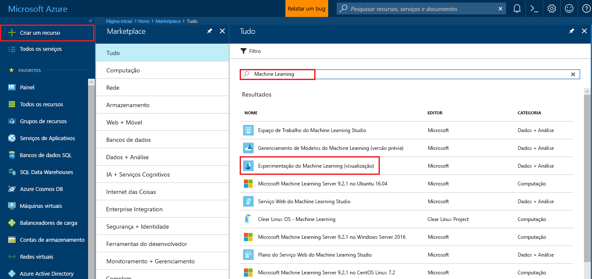
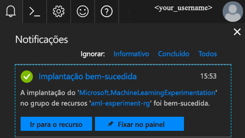
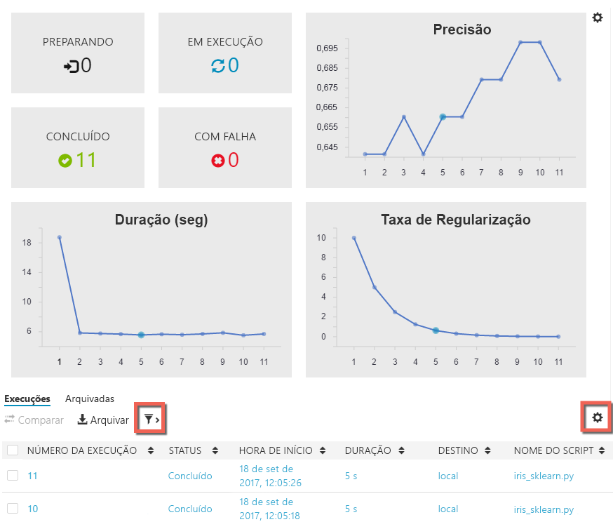

# Criar contas de versão prévia do Azure Machine Learning e instalar o Azure Machine Learning Workbench
Os serviços do Azure Machine Learning (versão prévia) são uma solução integrada de análise avançada e de ciência de dados de ponta a ponta. Ele ajuda os cientistas de dados profissionais a prepar dados, desenvolver experimentos e implar modelos em escala de nuvem.

Este guia de início rápido mostra como criar contas de gerenciamento de modelos e experimentação na versão prévia do Azure Machine Learning. Ele também mostra como instalar o aplicativo da área de trabalho Azure Machine Learning Workbench e as ferramentas CLI. Em seguida, faça um tour rápido pelos recursos da versão prévia do Azure Machine Learning usando o [conjunto de dados de Flor de íris](https://en.wikipedia.org/wiki/iris_flower_data_set) para criar um modelo para prever o tipo de íris com base em algumas de suas características físicas.  

Se você não tiver uma assinatura do Azure, crie uma [conta gratuita](https://azure.microsoft.com/free/?WT.mc_id=A261C142F) antes de começar.

## pré-requisitos

Atualmente, é possível instalar o aplicativo de área de trabalho do Azure Machine Learning Workbench somente nos seguintes sistemas operacionais: 
- Windows 10
- Windows Server 2016
- macOS Sierra
- macOS High Sierra

## Entrar no Portal do Azure
Entre no [portal do Azure](https://portal.azure.com/).

## Criar contas do Azure Machine Learning
Use o Portal do Azure para provisionar contas do Azure Machine Learning: 
1. Selecione o botão **Criar um recurso** (+) no canto superior esquerdo do portal.

2. Digite **Machine Learning** na barra de pesquisa. Selecione o resultado de pesquisa denominado **Experimentação do Machine Learning (versão prévia)**.  Clique no ícone de estrela para fazer dessa seleção um favorito no portal do Azure.

   

3. Selecione **+ Adicionar** para configurar uma nova conta de Experimentação do Machine Learning. O formulário detalhado é aberto.

   

4. Preencha o formulário de Experimentação do Machine Learning com as seguintes informações:

   Configuração|Valor sugerido|DESCRIÇÃO
   ---|---|---
   Nome da conta de experimentação | _Nome exclusivo_ |Escolha um nome exclusivo que identifique a sua conta. Você pode usar seu próprio nome ou um nome do projeto ou departamental que melhor identifique o experimento. O nome deve ter entre 2 e 32 caracteres. Ele deve conter apenas caracteres alfanuméricos e traços (-). 
   Assinatura | _Sua assinatura_ |Escolha a assinatura do Azure que você deseja usar para o experimento. Se você tiver várias assinaturas, escolha a que for adequada para a cobrança do recurso.
   Grupo de recursos | _O seu grupo de recursos_ | Você pode criar um novo nome do grupo de recursos ou você pode usar um existente de sua assinatura.
   Local padrão | _A região mais próxima de seus usuários_ | Escolha a localização mais próxima de seus usuários e dos recursos de dados.
   Número de estações | 2 | Insira o número de estações. Essa seleção afeta o [preço](https://azure.microsoft.com/pricing/details/machine-learning/). As duas primeiras estações são gratuitas. Use duas estações para os fins deste guia de início rápido. Você poderá atualizar o número de estações conforme necessário posteriormente no Portal do Azure.
   Conta de armazenamento | _Nome exclusivo_ | Selecione **Criar nova** e forneça um nome para criar uma conta de armazenamento do Azure. Selecione **Usar existente**e selecione uma conta de armazenamento existente na lista suspensa. A conta de armazenamento é necessária e é usada para conter os artefatos de projeto e dados do histórico de execuções. 
   Espaço de trabalho para a conta de Experimentação | _Nome exclusivo_ | Forneça um nome para o novo espaço de trabalho. O nome deve ter entre 2 e 32 caracteres. Ele deve conter apenas caracteres alfanuméricos e traços (-).
   Atribuir um proprietário para o espaço de trabalho | _Sua conta_ | Selecione sua própria conta como o proprietário do espaço de trabalho.
   Criar conta de Gerenciamento de Modelos | *verificar* | Como parte da experiência de criação de conta de Experimentação, você tem a opção de criar também a conta de Gerenciamento de Modelos do Machine Learning. Esse recurso é usado quando você está pronto para implantar e gerenciar seus modelos como serviços Web em tempo real. É recomendável criar a conta de Gerenciamento de Modelos ao mesmo tempo que a conta de Experimentação.
   Nome da conta | _Nome exclusivo_ | Escolha um nome exclusivo que identifique a sua conta de Gerenciamento de Modelos. Você pode usar seu próprio nome ou um nome do projeto ou departamental que melhor identifique o experimento. O nome deve ter entre 2 e 32 caracteres. Ele deve conter apenas caracteres alfanuméricos e traços (-). 
   Tipo de preço do Gerenciamento de Modelos | **DEVTEST** | Selecione **Nenhum tipo de preço selecionado** para especificar o tipo de preço para sua nova conta de Gerenciamento de Modelos. Para reduzir os custos, selecione o tipo de preço **DEVTEST** se ele estiver disponível em sua assinatura (disponibilidade limitada). Caso contrário, selecione o tipo de preço S1 para redução de custos. Clique em **Selecionar** para salvar a seleção do tipo de preço. 
   Fixar no painel | _verificar_ | Selecione a opção **Fixar no painel** para permitir o acompanhamento fácil da sua conta de Experimentação do Machine Learning na página do painel frontal do portal do Azure.

5. Selecione **Criar** para iniciar o processo de criação.

6. Na barra de ferramentas do portal do Azure, clique em **Notificações** (ícone de sino) para monitorar o processo de implantação. 

   A notificação mostra **Implantação em andamento**. O status é alterado para **Implantação bem-sucedida** depois que ela é concluída. A página da sua conta de Experimentação do Machine Learning se abre em caso de êxito.
   
   

Agora, dependendo de qual sistema operacional que você usa em seu computador local, siga uma das duas seções a seguir para instalar o Azure Machine Learning Workbench. 

## Instalar o Azure Machine Learning Workbench no Windows
Instale o Azure Machine Learning Workbench no seu computador executando o Windows 10, Windows Server 2016 ou mais recente.

1. Baixe o instalador do Azure Machine Learning Workbench mais recente, [AmlWorkbenchSetup.msi](https://aka.ms/azureml-wb-msi).

2. Clique duas vezes no instalador **AmlWorkbenchSetup.msi** baixado do Explorador de Arquivos.

   >[!IMPORTANT]
   >Baixe o instalador totalmente em disco, depois inicie-o a partir desse mesmo disco. Não execute-o diretamente do widget de download do seu navegador.

3. Conclua a instalação seguindo as instruções na tela.

   O instalador baixa todos os componentes dependentes necessários como Python, Miniconda e outras bibliotecas relacionadas. A instalação pode levar cerca de meia hora para concluir todos os componentes. 

4. O Azure Machine Learning Workbench agora está instalado no seguinte diretório:
   
   `C:\Users\<user>\AppData\Local\AmlWorkbench`

## Instalar o Azure Machine Learning Workbench no macOS
Instale o Azure Machine Learning Workbench no seu computador executando o macOS Sierra ou posterior.

1. Baixe o instalador do Azure Machine Learning Workbench mais recente, [AmlWorkbench.dmg](https://aka.ms/azureml-wb-dmg).

   >[!IMPORTANT]
   >Baixe o instalador totalmente em disco, depois inicie-o a partir desse mesmo disco. Não execute-o diretamente do widget de download do seu navegador.

2. Clique duas vezes no instalador **AmlWorkbench.dmg** baixado do Localizador.

3. Conclua a instalação seguindo as instruções na tela.

   O instalador baixa todos os componentes dependentes necessários como Python, Miniconda e outras bibliotecas relacionadas. A instalação pode levar cerca de meia hora para concluir todos os componentes. 

4. O Azure Machine Learning Workbench agora está instalado no seguinte diretório: 

   `/Applications/Azure ML Workbench.app`

## Execute o Azure Machine Learning Workbench para conectar-se pela primeira vez
1. Após o processo de instalação ser concluído, selecione o botão **Iniciar Workbench** na última tela do instalador. Se você tiver fechado o instalador, localize o atalho para o Machine Learning Workbench na sua área de trabalho e o menu **Iniciar** chamado **Azure Machine Learning Workbench** para iniciar o aplicativo.

2. Conecte-se ao Workbench usando a mesma conta que você usou anteriormente para provisionar os recursos do Azure. 

3. Quando o processo de conexão tiver sido bem-sucedido, o Workbench tentará localizar as contas de Experimentação do Machine Learning que você criou anteriormente. Ele pesquisa por todas as assinaturas do Azure às quais a sua credencial tem acesso. Quando pelo menos uma conta de Experimentação for encontrada, o Workbench será aberto com essa conta. Em seguida, ele lista os espaços de trabalho e projetos encontrado nessa conta. 

   >[!TIP]
   > Se você tem acesso a mais de uma conta de Experimentação, você pode mudar para outra selecionando o ícone de avatar no canto inferior esquerdo do aplicativo Workbench.

Para saber informações sobre a criação de um ambiente para a implantação de serviços Web, confira [Configuração do ambiente de implantação](deployment-setup-configuration.md).

## Criar um novo projeto
1. Inicie o aplicativo do Azure Machine Learning Workbench e conecte-se, se necessário. 

2. Selecione **Arquivo** > **Novo Projeto** (ou selecione o sinal **+** no painel **PROJETOS**). 

3. Preencha as caixas **Nome do projeto** e **Diretório do projeto**. A **Descrição do projeto** é opcional, mas útil. Deixe a caixa **URL do Repositório GIT do Visualstudio.com** em branco por enquanto. Escolha um espaço de trabalho e selecione **Classificação de Íris** como o modelo de projeto.

   >[!TIP]
   >Opcionalmente, você pode preencher a caixa de texto do repositório Git com a URL de um repositório Git hospedado em um projeto do [Visual Studio Team Services](https://www.visualstudio.com). Esse repositório Git já deve existir e deve estar vazio, sem nenhuma ramificação mestre. Além disso, você deve ter acesso de gravação a ele. Adicionar um repositório Git agora permitirá a você habilitar os cenários de mobilidade e de compartilhamento mais tarde. [Leia mais](using-git-ml-project.md).

4. Selecione o botão **Criar** para criar o projeto. Um novo projeto é criado e aberto para você. Neste ponto, você pode explorar a página inicial, as fontes de dados, as anotações e os arquivos de código-fonte do projeto. 

    >[!TIP]
    >Você pode também abrir o projeto no Visual Studio Code ou outros editores simplesmente configurando um link de ambiente de desenvolvimento integrado (IDE) e, em seguida, abrindo o diretório do projeto nele. [Leia mais](how-to-configure-your-IDE.md). 

## Executar um script do Python
Executaremos um script no computador local. 

1. Cada projeto é aberto na página do respectivo **Painel do Projeto**. Selecione **local** como o destino de execução da barra de comandos próxima à parte superior do aplicativo, e selecione **iris_sklearn.py** como o script a ser executado. Há outros arquivos incluídos no exemplo que você pode conferir mais tarde. 

   

2. Na caixa de texto **Argumentos**, digite **0.01**. Esse número é usado no código para definir a taxa de regularização. É um valor que é usado para configurar como o modelo de regressão linear é treinado. 

3. Selecione o botão **Executar** para começar a executar **iris_sklearn.py** no seu computador. 

   Esse código usa o algoritmo de [regressão logística](https://en.wikipedia.org/wiki/logistic_regression) da popular biblioteca [scikit-learn](http://scikit-learn.org/stable/index.html) do Python para compilar o modelo.

4. O painel **Trabalhos** deslizará vindo da direita se ele ainda não estiver visível e um trabalho **iris_sklearn** será adicionado ao painel. O status dele muda de **Enviando** para **Executando** conforme o trabalho começa a executar e para **Concluído** depois de mais alguns segundos. 

   Parabéns. Você executou um script do Python com sucesso no Azure Machine Learning Workbench.

6. Repita as etapas de 2 a 4 várias vezes. A cada vez, use diferentes valores de argumentos que variam de **10** a **0.001**.

## Exibir histórico de execuções
1. Vá até a exibição de **Execuções** e selecione **iris_sklearn.py** na lista de execuções. O painel de histórico de execuções para **iris.sklearn** abre. Ele mostra cada execução que foi realizada no **iris_sklearn**. 

   

2. O painel de histórico de execuções também exibe as principais métricas, um conjunto de grafos padrão e uma lista de métricas para cada execução. É possível personalizar essa exibição classificando, filtrando e ajustando as configurações. Basta selecionar o ícone de configuração ou o ícone de filtro.

   

3. Selecione uma execução concluída e você pode ver uma exibição detalhada para essa execução específica. Os detalhes incluem métricas adicionais, os arquivos gerados e outros logs potencialmente úteis.

## Próximas etapas
Você agora criou com êxito uma conta de Experimentação do Azure Machine Learning e uma conta de Gerenciamento de Modelos do Azure Machine Learning. Você instalou o aplicativo da área de trabalho do Azure Machine Learning Workbench e a interface de linha de comando. Você criou um novo projeto, criou um modelo executando um script e explorou o histórico de execuções do script.

Para obter uma experiência mais detalhada deste fluxo de trabalho, incluindo como implantar seu modelo Íris como um serviço Web, siga o tutorial *Classificando Iris* completo. O tutorial contém etapas detalhadas para [preparação de dados](tutorial-classifying-iris-part-1.md), [experimentação](tutorial-classifying-iris-part-2.md) e [gerenciamento de modelo](tutorial-classifying-iris-part-3.md). 

> [!div class="nextstepaction"]
> [Tutorial Classificando a Íris](tutorial-classifying-iris-part-1.md)
