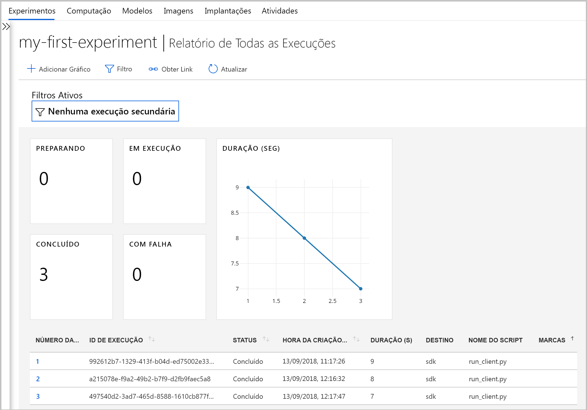
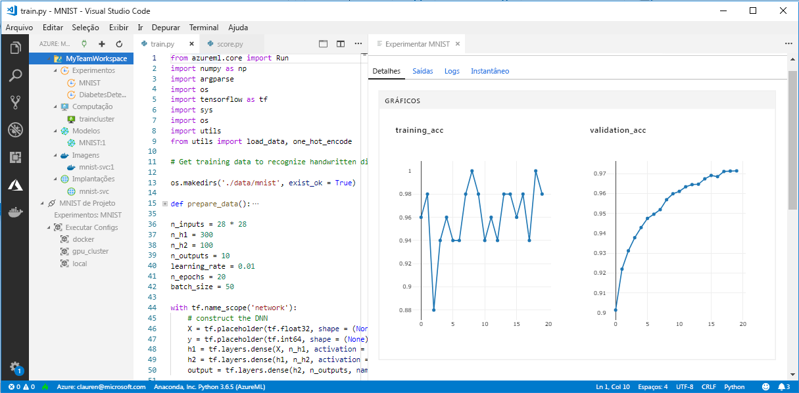

# <a name="what-happened-to-azure-machine-learning-workbench"></a>O que aconteceu com o Workbench de aprendizado de máquina do Azure?

O aplicativo Azure Machine Learning Workbench e alguns outros recursos iniciais foram preteridos e substituídos na versão de setembro de 2018 para abrir caminho para uma arquitetura [aprimorada](concept-azure-machine-learning-architecture.md). 

A versão contém muitas atualizações significativas solicitadas pelos comentários dos clientes para melhorar sua experiência. A funcionalidade principal de execuções de experimentos para implantação de modelo não foi alterada. Mas agora, você pode usar o robusto <a href="https://aka.ms/aml-sdk" target="_blank">SDK</a> e a [CLI do Azure](reference-azure-machine-learning-cli.md) para realizar seus pipelines e tarefas de aprendizado de máquina.  

A maioria dos artefatos criados na versão anterior do Serviço do Azure Machine Learning é armazenada em seu próprio armazenamento local ou na nuvem. Esses artefatos já não desaparecem.

Neste artigo, você aprenderá sobre o que mudou e como isso afeta seu trabalho preexistente com Azure Machine Learning Workbench e suas APIs.

>[!Warning]
>Este artigo não é para usuários do Azure Machine Learning Studio. É para clientes do serviço de aprendizado de máquina do Azure que instalaram o aplicativo Workbench (visualização) e / ou têm contas de visualização de gerenciamento de modelos e experimentação.


## <a name="what-changed"></a>O que mudou?

A versão mais recente do Serviço do Azure Machine Learning inclui os seguintes recursos:
+ Um [modelo simplificado de recursos do Azure](concept-azure-machine-learning-architecture.md).
+ Uma [nova interface do usuário do portal](how-to-track-experiments.md) para gerenciar suas experiências e destinos de computação.
+ Um novo, mais abrangente <a href="https://aka.ms/aml-sdk" target="_blank">SDK</a> do Python.
+ A nova [extensão de CLI do Azure](reference-azure-machine-learning-cli.md) expandida para aprendizado de máquina.

A [arquitetura](concept-azure-machine-learning-architecture.md) foi reprojetada visando facilidade de uso. Em vez de várias contas e recursos do Azure, você só precisa de um [workspace do serviço do Azure Machine Learning](concept-azure-machine-learning-architecture.md#workspace). Você pode criar workspaces rapidamente no [Portal do Azure](quickstart-get-started.md). Usando um workspace, múltiplos usuários podem armazenar destinos de computação de treinamento e de implantação, experimentos de modelo, imagens do Docker, modelos implementados e assim por diante.

Embora existam novos clientes da CLI e do SDK aprimorados na versão atual, o próprio aplicativo de workbench da área de trabalho foi desativado. Os testes podem ser gerenciados no [painel de workspace no portal do Azure](how-to-track-experiments.md#view-the-experiment-in-the-azure-portal). Use o painel para obter o histórico de experimentos, gerenciar as metas de computação anexadas ao seu workspace, gerenciar seus modelos e imagens do Docker e até mesmo implementar serviços da web.

<a name="timeline"></a>

## <a name="support-timeline"></a>Linha do tempo de suporte

Em 9 de janeiro de 2019, foi encerrado o suporte para as contas do Machine Learning Workbench, da Experimentação do Azure Machine Learning e do Gerenciamento de Modelos e as CLIs e os SDKs associados. 

Todas as funcionalidades mais recentes estão disponíveis usando este <a href="https://aka.ms/aml-sdk" target="_blank">SDK</a>, a [CLI](reference-azure-machine-learning-cli.md) e o [portal](quickstart-get-started.md).

## <a name="what-about-run-histories"></a>E o histórico de execução?

Os históricos de execução mais antigos não estão mais acessíveis, mas você ainda pode ver suas execuções na versão mais recente. 

Os históricos de execução agora são chamados de **testes**. Você pode coletar os experimentos do seu modelo e explorá-los usando o SDK, a CLI ou o portal do Azure.

Painel de workspace do portal é compatível apenas com os navegadores Microsoft Edge, Chrome e Firefox:

[] (./media/overview-what-happened-to-workbench/image001.png#lightbox)

Comece treinando seus modelos e acompanhando os históricos de execução usando o novo CLI e SDK. Você pode aprender como com o [Tutorial: treinar modelos com o serviço de aprendizado de máquina do Azure](tutorial-train-models-with-aml.md).

## <a name="can-i-still-prep-data"></a>Pode eu ainda de preparação de dados?

Seus arquivos de preparação de dados preexistentes não são portáteis para a versão mais recente, porque não temos mais o Machine Learning Workbench. Mas você ainda pode preparar qualquer tamanho de conjunto de dados para modelagem.   

Com conjuntos de dados de qualquer tamanho, é possível usar o [SDK de preparação de dados do Azure Machine Learning](http://aka.ms/data-prep-sdk) para preparar rapidamente seus dados antes da modelagem escrevendo código Python. 

Você pode seguir [este tutorial](tutorial-data-prep.md) para saber mais sobre como usar o SDK de Preparação de Dados do Azure Machine Learning.

## <a name="will-projects-persist"></a>Projetos persistirá?

Você não perderá nenhum código ou trabalho. Na versão mais antiga, os projetos são entidades na nuvem com um diretório local. Na versão mais recente, você anexa diretórios locais ao workspace do Serviço do Azure Machine Learning usando um arquivo de configuração local. Confira um [diagrama da arquitetura mais recente](concept-azure-machine-learning-architecture.md).

Grande parte do conteúdo do projeto já estava em seu computador local. Sendo assim, você só precisa criar um arquivo de configuração nesse diretório e referenciá-lo em seu código para se conectar ao seu workspace. Para continuar usando o diretório local que contém seus arquivos e scripts, especifique o nome do diretório no comando ['experiment.submit'](https://docs.microsoft.com/python/api/azureml-core/azureml.core.experiment.experiment?view=azure-ml-py) Python ou usando o comando da CLI 'az ml project attach'.  Por exemplo: 
```python
run = exp.submit(source_directory = script_folder, script = 'train.py', run_config = run_config_system_managed)
```

Saiba como começar a usar o [Python com o SDK principal](quickstart-create-workspace-with-python.md) ou usar o [portal do Azure](quickstart-get-started.md).

## <a name="what-about-my-registered-models-and-images"></a>E quanto aos meus modelos e imagens registrados?
 
Os modelos registrados em seu registro de modelo antigo devem ser migrados para o seu novo workspace se você quiser continuar a usá-los. Para migrar seus modelos, baixe-os e registre-os novamente no novo workspace. 

As imagens que você criou em seu registro de imagem antigo devem ser recriadas no novo workspace para continuar a usá-las. Você pode fazer isso seguindo as seções em [Configurar e criar uma imagem](how-to-deploy-and-where.md#configureimage). 

## <a name="what-about-deployed-web-services"></a>E serviços web implantados?

Agora que o suporte para a CLI antiga foi encerrado, não é mais possível reimplantar modelos ou gerenciar os serviços Web que você implantou originalmente com sua conta de Gerenciamento de Modelos. No entanto, esses serviços da Web continuarão a funcionar enquanto o Azure Container Service (ACS) ainda for suportado.

Na versão mais recente, os modelos são implantados como serviços Web para clusters da ACI (Instâncias de Contêiner do Azure) ou do AKS (Serviço de Kubernetes do Azure). Você também pode implantar em FPGAs e no Azure IoT Edge. 

Saiba mais nestes artigos:
+ [Onde e como implantar modelos](how-to-deploy-and-where.md)
+ [Tutorial: implantar modelos com o Serviço do Azure Machine Learning](tutorial-deploy-models-with-aml.md)

## <a name="what-about-the-old-sdk-and-cli"></a>E quanto ao SDK e à CLI antigos?

Sim, eles continuarão a funcionar até janeiro. Confira a [linha do tempo](#timeline) anterior. Recomendamos que você comece a criar seus novos experimentos e modelos com o SDK ou CLI mais recente.

Usando o novo SDK do Python na versão mais recente, você pode interagir com o Serviço do Azure Machine Learning em qualquer ambiente do Python. Saiba como instalar o <a href="https://aka.ms/aml-sdk" target="_blank">SDK mais recente</a>. Você também pode usar a [extensão da CLI do Azure Machine Learning](reference-azure-machine-learning-cli.md) atualizada com o conjunto avançado de comandos `az ml` para interagir com o serviço em qualquer ambiente de linha de comando, incluindo o Azure Cloud Shell.

## <a name="what-about-visual-studio-code-tools-for-ai"></a>E as Visual Studio Code Tools for AI?

Nesta última versão, a extensão foi renomeada para Azure Machine Learning para Visual Studio Code e foi expandida e aprimorada para trabalhar com os novos recursos acima.

[] (./media/overview-what-happened-to-workbench/vscode-big.png#lightbox)

## <a name="what-about-domain-packages"></a>E os pacotes de domínio?

Os pacotes de domínio para a Pesquisa Visual Computacional, a análise de texto e a previsão não podem ser usados com a versão mais recente do Azure Machine Learning. No entanto, você ainda pode criar e treinar modelos de pesquisa visual computacional, de texto e de previsão com o mais recente <a href="https://aka.ms/aml-sdk" target="_blank">SDK</a> do Python do Azure Machine Learning. Para saber como migrar modelos pré-existentes construídos usando os pacotes de pesquisa visual computacional, de análise de texto e de previsão, entre em contato conosco pelo telefone [AML-Packages@microsoft.com](mailto:AML-Packages@microsoft.com).

## <a name="next-steps"></a>Próximas etapas

Saiba mais sobre a [arquitetura mais recente para o Serviço do Azure Machine Learning](concept-azure-machine-learning-architecture.md). 

Para obter uma visão geral do serviço, leia [O que é o serviço do Azure Machine Learning?](overview-what-is-azure-ml.md)

Para um início rápido mostrando como criar um workspace, criar um projeto, executar um script e explorar o histórico de execução do script com a versão mais recente do serviço de aprendizado de máquina do Azure, tente [ iniciar com o serviço do Azure Machine Learning](quickstart-get-started.md).

Para obter uma experiência mais detalhada deste fluxo de trabalho, siga o [tutorial completo](tutorial-train-models-with-aml.md) que contém as etapas detalhadas para treinar e implantar modelos com o serviço do Azure Machine Learning. 
