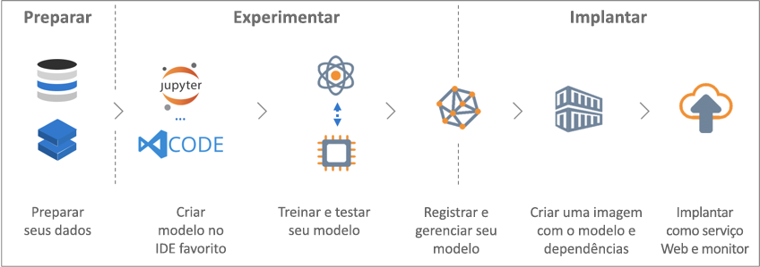

# O que é o serviço Azure Machine Learning?

O serviço Azure Machine Learning é um serviço de nuvem que você pode usar para treinar, implantar, automatizar e gerenciar modelos de aprendizado de máquina, tudo na ampla escala que a nuvem oferece.

## O que aprendizado da máquina?

O Machine Learning é uma técnica da ciência de dados que permite que os computadores usem os dados existentes para prever tendências, resultados e comportamentos futuros. Usando o aprendizado de máquina, os computadores aprendem sem serem explicitamente programados.

As estimativas ou previsões de aprendizado de máquina podem tornar aplicativos e dispositivos mais inteligentes. Por exemplo, quando você faz compras online, o aprendizado de máquina ajuda a recomendar outros produtos que podem lhe agradar com base no que você já comprou. Ou, ao passar seu cartão de crédito, o aprendizado de máquina compara a transação com um banco de dados de transações e ajuda a detectar fraudes. E, quando o aspirador de pó robô aspira uma sala, o aprendizado de máquina ajuda a decidir se o trabalho está concluído.

## O que é o serviço Azure Machine Learning?

O serviço Azure Machine Learning fornece um ambiente baseado em nuvem que você pode usar para desenvolver, treinar, testar, implantar, gerenciar e acompanhar os modelos de aprendizado de máquina.

[  ] (./media/overview-what-is-azure-ml/aml.png#lightbox)

O serviço Azure Machine Learning dá suporte a tecnologias de software livre, então você pode usar dezenas de milhares de pacotes do Python de software livre com componentes de aprendizado de máquina, como o TensorFlow e o scikit-learn.
O suporte a ferramentas avançadas, como [Jupyter Notebooks](http://jupyter.org) ou a extensão [Azure Machine Learning para Visual Studio Code](https://visualstudio.microsoft.com/downloads/ai-tools-vscode/), facilita a exploração de dados, a transformação, o desenvolvimento e o teste de modelos.
O serviço Azure Machine Learning também inclui recursos que permitem [automatizar a geração e o ajuste do modelo](tutorial-auto-train-models.md) para ajudá-lo a criar modelos com facilidade, eficiência e precisão.

O serviço Azure Machine Learning permite iniciar o treinamento em seu computador local e, em seguida, escalar horizontalmente para a nuvem. Com muitos [destinos de computação](how-to-set-up-training-targets.md) disponíveis, como o Azure Machine Learning Compute e o [Azure Databricks](/azure/azure-databricks/what-is-azure-databricks), e com [ serviços avançados de ajuste de hiperparâmetro](how-to-tune-hyperparameters.md), você pode criar modelos melhores com mais rapidez usando o poder da nuvem.

Quando você tem o modelo certo, pode implantá-lo facilmente em um contêiner como o Docker. Isso significa que ele é simples de implantar para [Instâncias de Contêiner do Azure](how-to-deploy-to-aci.md) ou [Serviço de Kubernetes do Azure](how-to-deploy-to-aks.md), ou você pode usar o contêiner em suas próprias implantações, seja localmente ou na nuvem.
Você pode gerenciar os modelos implantados e controlar várias execuções conforme testa até encontrar a melhor solução.
Após ser implantado, seu modelo pode retornar previsões em [tempo real](how-to-consume-web-service.md) ou [assincronamente](how-to-run-batch-predictions.md) em grandes quantidades de dados.

E com os [pipelines de aprendizado de máquina](concept-ml-pipelines.md) avançados, você pode colaborar com todas as etapas de preparação de dados, treinamento e avaliação de modelos e implantação.

## O que eu posso fazer com o serviço Azure Machine Learning?

O serviço Azure Machine Learning pode treinar um modelo e ajustá-lo automaticamente para você.
Para obter um exemplo, veja o [Tutorial: Treinar automaticamente um modelo de classificação com o aprendizado de máquina automatizado do Azure](tutorial-auto-train-models.md).

Usando o <a href="https://aka.ms/aml-sdk" target="_blank">SDK</a> do Azure Machine Learning para Python, junto com pacotes do Python de software livre, você mesmo pode criar e treinar modelos de aprendizado de máquina e aprendizado profundo altamente precisos em um workspace do serviço do Azure Machine Learning.
Você pode escolher entre muitos componentes de aprendizado de máquina disponíveis em pacotes do Python de software livre, como os seguintes:

- <a href="https://scikit-learn.org/stable/" target="_blank">Scikit-learn</a>
- <a href="https://www.tensorflow.org" target="_blank">Tensorflow</a>
- <a href="https://pytorch.org" target="_blank">PyTorch</a>
- <a href="https://www.microsoft.com/en-us/cognitive-toolkit/" target="_blank">CNTK</a>
- <a href="http://mxnet.io" target="_blank">MXNet</a>

Quando você tiver um modelo, o usará para criar um contêiner (como o Docker) que pode ser implantado localmente para teste. Quando o teste for concluído, o modelo poderá ser implantado como um serviço Web de produção em [Instâncias de Contêiner do Azure](how-to-deploy-to-aci.md) ou [Serviço de Kubernetes do Azure](how-to-deploy-to-aks.md).

Em seguida, você pode gerenciar seus modelos implantados usando o [portal do Azure](https://docs.microsoft.com/python/api/overview/azure/ml/intro?view=azure-ml-py) ou o [SDK do Azure Machine Learning para Python](https://portal.azure.com/).
Você pode avaliar as métricas do modelo, treinar novamente e reimplantar as novas versões do modelo, ao mesmo tempo em que acompanha os experimentos do modelo.

Para começar a usar o serviço Azure Machine Learning, consulte [Próximas etapas](#next-steps) abaixo.

## Como o serviço Azure Machine Learning é diferente do Studio?

O Azure Machine Learning Studio é um workspace visual colaborativo do tipo "arrastar e soltar" em que você pode criar, testar e implantar soluções de aprendizado de máquina sem precisar escrever código. Ele usa módulos de manipulação de dados e algoritmos de aprendizado de máquina pré-criados e pré-configurados.

Use o Machine Learning Studio quando quiser experimentar com modelos de aprendizado de máquina de maneira rápida e fácil, e os algoritmos de aprendizado de máquina internos são suficientes para as suas soluções.

Use o serviço Machine Learning se você trabalhar em um ambiente do Python, quiser mais controle sobre os algoritmos de aprendizado de máquina ou desejar usar bibliotecas de aprendizado de máquina de software livre.

> [!NOTE]
> Modelos criados no Azure Machine Learning Studio não podem ser implantados nem gerenciados pelo serviço Azure Machine Learning.

## Avaliação gratuita
Se você não for um assinante, poderá [abrir uma conta do Azure gratuitamente](https://aka.ms/amlfree). Você recebe créditos para gastar em serviços do Azure. Depois que eles forem utilizados, você poderá manter a conta e usar os [serviços gratuitos do Azure](https://azure.microsoft.com/free/). Seu cartão de crédito nunca será cobrado, a menos que você altere explicitamente suas configurações, solicitando esse tipo de cobrança. Se preferir, você pode [ativar benefícios para assinantes do MSDN](https://azure.microsoft.com/pricing/member-offers/msdn-benefits-details/?WT.mc_id=A261C142F), que concede créditos mensais que podem ser usados para serviços pagos do Azure.

## Próximas etapas

- Crie um workspace do serviço Machine Learning para começar a [usar o Portal do Azure](quickstart-get-started.md) ou [no Python](quickstart-create-workspace-with-python.md).

- Siga o tutorial completo, [Treinar e implantar um modelo de classificação de imagem com o Azure Machine Learning](tutorial-train-models-with-aml.md).

- [Use o Azure Machine Learning para gerar um modelo e ajustá-lo automaticamente](tutorial-auto-train-models.md).

- Saiba mais sobre [pipelines de aprendizado de máquina](/azure/machine-learning/service/concept-ml-pipelines) para compilar, otimizar e gerenciar cenários de aprendizado de máquina.

- Leia com atenção o arquivo [Arquitetura e conceitos do serviço do Azure Machine Learning](concept-azure-machine-learning-architecture.md).

- Para obter mais informações sobre outros produtos de aprendizado de máquina da Microsoft, confira [Outros produtos de aprendizado de máquina da Microsoft](./overview-more-machine-learning.md).

<!-- 

An intro to AML or an end-to-end quickstart video could go here.

In this 9-minute video, learn how you can benefit your app. You'll learn about key features and what a typical workflow looks like. 

>[!VIDEO https://channel9.msdn.com/Events/Connect/2016/138/player]
 
+ 0-3 minutes covers key features and use-cases.
+ 3-4 minutes covers service provisioning. 
+ 4-6 minutes covers Import Data wizard used to create an index using the built-in real estate dataset.

-->
