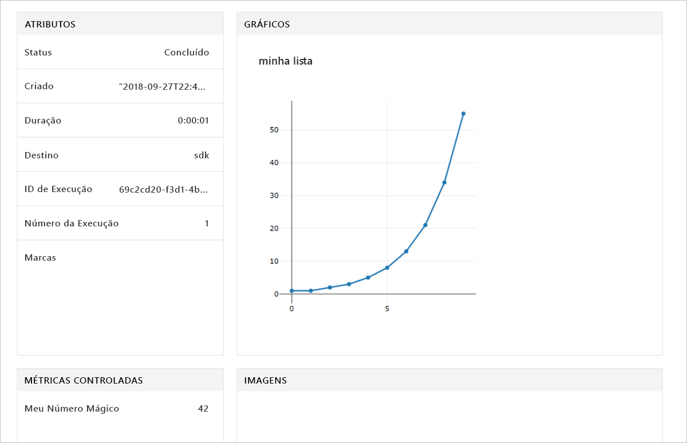

# <a name="quickstart-use-the-python-sdk-to-get-started-with-azure-machine-learning"></a>Início rápido: Usar o SDK do Python para começar a usar o Azure Machine Learning

Neste artigo, você usará o SDK do Azure Machine Learning para Python 3 para criar e, em seguida, usará um [workspace](concept-azure-machine-learning-architecture.md) do Serviço do Azure Machine Learning. O workspace é o bloco fundamental na nuvem usado para experimentar, treinar e implantar modelos de machine learning com o Machine Learning.

Comece configurando seu próprio ambiente do Python e o Servidor do Jupyter Notebook. Para executá-lo sem nenhuma instalação, confira [Início Rápido: usar o portal do Azure para começar a usar o Azure Machine Learning](quickstart-get-started.md). 

Exiba uma versão em vídeo deste início rápido:

> [!VIDEO https://www.microsoft.com/en-us/videoplayer/embed/RE2G9N6]

Neste início rápido, você:

* Instalará o SDK do Python.
* Criar um workspace na assinatura do Azure.
* Criar um arquivo de configuração para esse workspace que será usado posteriormente em outros scripts e notebooks.
* Escrever código que registra em log os valores dentro do espaço de trabalho.
* Exibir os valores registrados em log em seu workspace.

Você criará um workspace e um arquivo de configuração para usá-los como pré-requisitos para outros tutoriais e artigos de instruções sobre o Machine Learning. Assim como ocorre em outros serviços do Azure, há limites e cotas associados ao Machine Learning. [Saiba mais sobre cotas e como solicitar mais.](how-to-manage-quotas.md)

Os seguintes recursos do Azure serão adicionados automaticamente ao workspace quando estiverem disponíveis regionalmente:
 
- [Registro de Contêiner do Azure](https://azure.microsoft.com/services/container-registry/)
- [Armazenamento do Azure](https://azure.microsoft.com/services/storage/)
- [Azure Application Insights](https://azure.microsoft.com/services/application-insights/) 
- [Cofre da Chave do Azure](https://azure.microsoft.com/services/key-vault/)

>[!NOTE]
> O código neste artigo requer o SDK do Azure Machine Learning versão 1.0.2 ou posterior e foi testado com a versão 1.0.8.


Se você não tiver uma assinatura do Azure, crie uma conta gratuita antes de começar. Experimente a [versão gratuita ou paga do Serviço do Azure Machine Learning](http://aka.ms/AMLFree) hoje mesmo.

## <a name="install-the-sdk"></a>Instalar o SDK

> [!IMPORTANT]
> Ignore esta seção caso use uma Máquina Virtual de Ciência de Dados do Azure ou o Azure Databricks.
> * As Máquinas Virtuais de Ciência de Dados do Azure criadas após 27 de setembro de 2018 vêm com o SDK do Python pré-instalado.
> * No ambiente do Azure Databricks, siga as [etapas de instalação do Databricks](how-to-configure-environment.md#azure-databricks).

Antes de instalar o SDK, recomendamos que você crie um ambiente de Python isolado primeiro. Embora este artigo use o [Miniconda](https://docs.conda.io/en/latest/miniconda.html), você também poderá usar o [Anaconda](https://www.anaconda.com/) completo instalado ou o [Python virtualenv](https://virtualenv.pypa.io/en/stable/).

### <a name="install-miniconda"></a>Instalar o Miniconda

[Baixe e instale o Miniconda](https://docs.conda.io/en/latest/miniconda.html). Selecione o Python 3.7 ou versão posterior para instalar. Não selecione a versão do Python 2.x.  

### <a name="create-an-isolated-python-environment"></a>Criar um ambiente isolado do Python

1. Abra uma janela de linha de comando e crie um ambiente do Conda chamado *myenv* e instale o Python 3.6. O SDK do Azure Machine Learning funcionará com o Python 3.5.2 ou posterior, mas os componentes de aprendizado de máquina automatizado não serão totalmente funcionais no Python 3.7.

    ```shell
    conda create -n myenv -y Python=3.6
    ```

1. Ative o ambiente.

    ```shell
    conda activate myenv
    ```

### <a name="install-the-sdk"></a>Instalar o SDK

1. No ambiente Conda ativado, instale os componentes principais do SDK do Machine Learning com funcionalidades do Jupyter Notebook.  A instalação leva alguns minutos para ser concluída, dependendo da configuração do computador.

  ```shell
    pip install --upgrade azureml-sdk[notebooks]
    ```

1. Instale um servidor do Jupyter Notebook no ambiente do Conda.

  ```shell
    conda install -y nb_conda
    ```

1. Para usar esse ambiente para os tutoriais do Azure Machine Learning, instale esses pacotes.

    ```shell
    conda install -y cython matplotlib pandas
    ```

1. Para usar esse ambiente para tutoriais do Azure Machine Learning, instale os componentes de aprendizado de máquina automatizado.

    ```shell
    pip install --upgrade azureml-sdk[automl]
    ```

## <a name="create-a-workspace"></a>Criar um workspace

Crie seu workspace em um Jupyter Notebook usando o SDK do Python.

1. Crie e/ou CD para o diretório que você deseja usar para o guia de início rápido e tutoriais.

1. Para iniciar o Jupyter Notebook, insira este comando:

    ```shell
    jupyter notebook
    ```

1. Na janela do navegador, crie um novo notebook usando o kernel `Python 3` padrão. 

1. Para exibir a versão do SDK, insira e, em seguida, execute o seguinte código Python em uma célula do notebook:

   [!code-python[](~/aml-sdk-samples/ignore/doc-qa/quickstart-create-workspace-with-python/quickstart.py?name=import)]

1. Encontre um valor para o parâmetro `<azure-subscription-id>` na [lista de assinaturas no portal do Azure](https://ms.portal.azure.com/#blade/Microsoft_Azure_Billing/SubscriptionsBlade). Use qualquer assinatura em que sua função seja proprietário ou colaborador.

   ```python
   from azureml.core import Workspace
   ws = Workspace.create(name='myworkspace',
                         subscription_id='<azure-subscription-id>', 
                         resource_group='myresourcegroup',
                         create_resource_group=True,
                         location='eastus2' 
                        )
   ```

   Ao executar o código, talvez você precise entrar em sua conta do Azure. Depois de entrar, o token de autenticação será armazenado no cache local.

1. Para exibir os detalhes do workspace, como o armazenamento, o registro de contêiner e o cofre de chaves associados, insira o seguinte código:

    [!code-python[](~/aml-sdk-samples/ignore/doc-qa/quickstart-create-workspace-with-python/quickstart.py?name=getDetails)]


## <a name="write-a-configuration-file"></a>Escrever um arquivo de configuração

Salve os detalhes do workspace em um arquivo de configuração no diretório atual. Esse arquivo é chamado *aml_config\config.json*.  

Esse arquivo de configuração do workspace facilita o carregamento do mesmo workspace mais tarde. Você pode carregá-lo com outros notebooks e scripts no mesmo diretório ou subdiretório.  

[!code-python[](~/aml-sdk-samples/ignore/doc-qa/quickstart-create-workspace-with-python/quickstart.py?name=writeConfig)]

Esta chamada à API `write_config()` cria o arquivo de configuração no diretório atual. O arquivo *config.json* contém o seguinte:

```json
{
    "subscription_id": "<azure-subscription-id>",
    "resource_group": "myresourcegroup",
    "workspace_name": "myworkspace"
}
```

## <a name="use-the-workspace"></a>Usar o workspace

Execute um código que usa as APIs básicas do SDK para acompanhar as execuções de experimento:

1. Crie um experimento no workspace.
1. Registre em log um único valor para o experimento.
1. Faça uma lista de valores para o experimento.

[!code-python[](~/aml-sdk-samples/ignore/doc-qa/quickstart-create-workspace-with-python/quickstart.py?name=useWs)]

## <a name="view-logged-results"></a>Exibir os valores registrados em log
Quando a execução for concluída, você poderá exibir o execução do experimento no portal do Azure. Para imprimir uma URL que direciona você aos resultados da última execução, use o seguinte código:

```python
print(run.get_portal_url())
```

Use o link para exibir os valores registrados no portal do Azure no seu navegador.



## <a name="clean-up-resources"></a>Limpar recursos 
>[!IMPORTANT]
>Use os recursos criados aqui como pré-requisitos para outros tutoriais e artigos de instruções sobre o Machine Learning.

Se você não pretende usar os recursos criados neste artigo, exclua-os para evitar a geração de encargos.

[!code-python[](~/aml-sdk-samples/ignore/doc-qa/quickstart-create-workspace-with-python/quickstart.py?name=delete)]

## <a name="next-steps"></a>Próximas etapas

Neste artigo, você criou os recursos necessários para experimentar e implantar modelos. Você executou um código em um notebook e explorou o histórico de execuções desse código no workspace na nuvem.

> [!div class="nextstepaction"]
> [Tutorial: treinar um modelo de classificação de imagem](tutorial-train-models-with-aml.md)

Você também pode explorar [exemplos mais avançados no GitHub](https://aka.ms/aml-notebooks).
