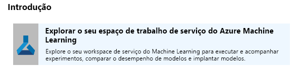
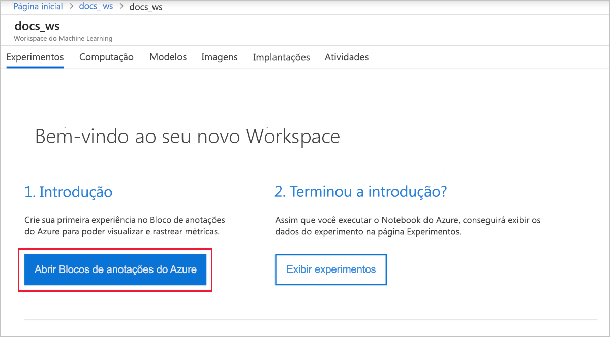
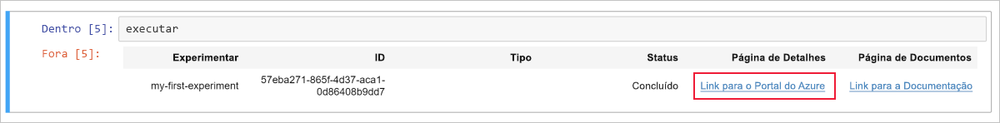
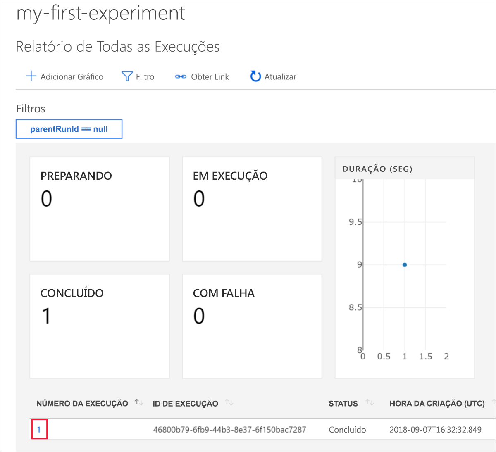
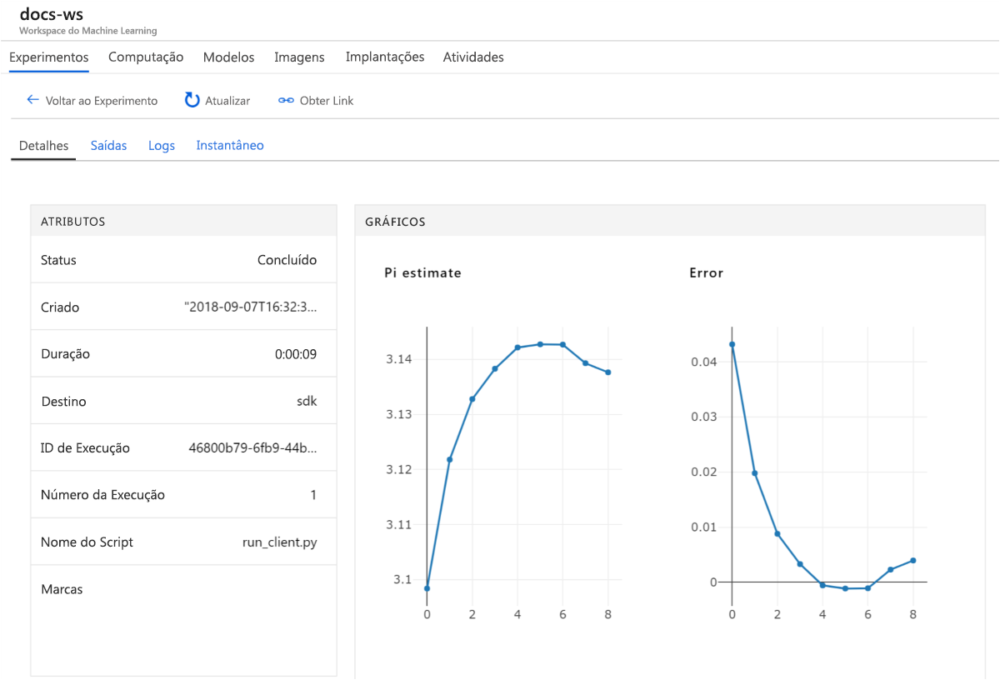

# Início Rápido: usar o portal do Azure para começar a usar o Azure Machine Learning

Neste início rápido, você usa o portal do Azure para criar um espaço de trabalho do Azure Machine Learning. Esse workspace é o bloco fundamental na nuvem para experimentação, treinamento e implantação de modelos de aprendizado de máquina com o serviço do Machine Learning. Este início rápido usa recursos de nuvem e não exige nenhuma instalação. Para configurar seu próprio servidor do Jupyter Notebook, confira [Início Rápido: usar Python para começar a usar o Azure Machine Learning](quickstart-create-workspace-with-python.md).

> [!VIDEO https://www.microsoft.com/en-us/videoplayer/embed/RE2F9Ad]

Neste início rápido, você:

* Criar um workspace na assinatura do Azure.
* Experimente com o Python em um Azure Notebook e registre em log valores em várias iterações.
* Exiba os valores registrados em log no seu espaço de trabalho.

Os seguintes recursos do Azure serão adicionados automaticamente ao workspace quando estiverem disponíveis regionalmente:

  - [Registro de Contêiner do Azure](https://azure.microsoft.com/services/container-registry/)
  - [Armazenamento do Azure](https://azure.microsoft.com/services/storage/)
  - [Azure Application Insights](https://azure.microsoft.com/services/application-insights/) 
  - [Cofre da Chave do Azure](https://azure.microsoft.com/services/key-vault/)

Os recursos que você cria podem ser usados como pré-requisitos em outros tutoriais e artigos de instruções do serviço do Machine Learning. Como acontece com outros serviços do Azure, há limites em determinados recursos associados ao Machine Learning, como tamanho do cluster de computação. Saiba mais sobre [os limites padrão e como aumentar sua cota](how-to-manage-quotas.md).

Se você não tiver uma assinatura do Azure, crie uma conta gratuita antes de começar. Experimente a [versão gratuita ou paga do Serviço do Azure Machine Learning](http://aka.ms/AMLFree) hoje mesmo.

## Criar um workspace 

[!INCLUDE [aml-create-portal](../../../includes/aml-create-in-portal.md)]

Na página do espaço de trabalho, selecione `Explore your Azure Machine Learning service workspace`.

 

## Usar o workspace

Agora veja como um workspace ajuda você a gerenciar seus scripts de aprendizado de máquina. Nesta seção, você:

* Abra um notebook no Azure Notebooks.
* Execute o código que cria alguns valores registrados em log.
* Exiba os valores registrados em log no seu espaço de trabalho.

Este exemplo mostra como o espaço de trabalho pode ajudar a manter o controle das informações geradas em um script. 

### Abra um notebook 

O Azure Notebooks fornece uma plataforma de nuvem gratuita para Jupyter Notebooks que estão previamente configurados com tudo o que você precisa para executar o Machine Learning.  

Selecione `Open Azure Notebooks` para tentar seu primeiro experimento.

 

Sua organização poderá exigir [consentimento do administrador](https://notebooks.azure.com/help/signing-up/work-or-school-account/admin-consent) antes de poder entrar.

Depois de entrar, uma nova guia é aberta e um prompt `Clone Library` é exibido. Selecione `Clone`.

### Executar o notebook

Junto com dois notebooks, você verá um arquivo `config.json`. Este arquivo de configuração contém informações sobre o espaço de trabalho que você criou.  

Selecione `01.run-experiment.ipynb` para abrir o notebook.

Para executar as células uma de cada vez, use `Shift`+`Enter`. Ou selecione `Cells` > `Run All` para executar o notebook inteiro. Quando você vir um asterisco [*] ao lado de uma célula, ele está em execução. Após o código para a célula ser concluído, um número é exibido. 

Depois de concluir a execução de todas as células no bloco de anotações, você poderá exibir os valores registrados em seu espaço de trabalho.

## Exibir valores registrados em log

Depois de executar todas as células no notebook, volte à página do portal.  

Selecione `View Experiments`.

Feche o pop-up `Reports`.

Selecione `my-first-experiment`.

Veja informações sobre a execução que você acabou de executar. Role a página para baixo para encontrar a tabela de execuções. Selecione o link de número de execução.

 

Você verá gráficos criados automaticamente dos valores registrados. Sempre que registra diversos valores com o mesmo parâmetro de nome, um gráfico é gerado automaticamente para você.

   

Uma vez que o código para aproximar o pi usa valores aleatórios, seus gráficos mostrarão valores diferentes.  

## Limpar recursos 

[!INCLUDE [aml-delete-resource-group](../../../includes/aml-delete-resource-group.md)]

Você também pode manter o grupo de recursos, mas excluir um único espaço de trabalho. Exiba as propriedades do espaço de trabalho e, em seguida, selecione **Excluir**.

## Próximas etapas

Você criou os recursos necessários para experimentar e implantar modelos. Você também executou código em um notebook. E explorou o histórico de execução desse código em seu espaço de trabalho na nuvem.

Para obter uma experiência de fluxo de trabalho detalhado, siga os tutoriais do Machine Learning para treinar e implantar um modelo.  

> [!div class="nextstepaction"]
> [Tutorial: treinar um modelo de classificação de imagem](tutorial-train-models-with-aml.md)
