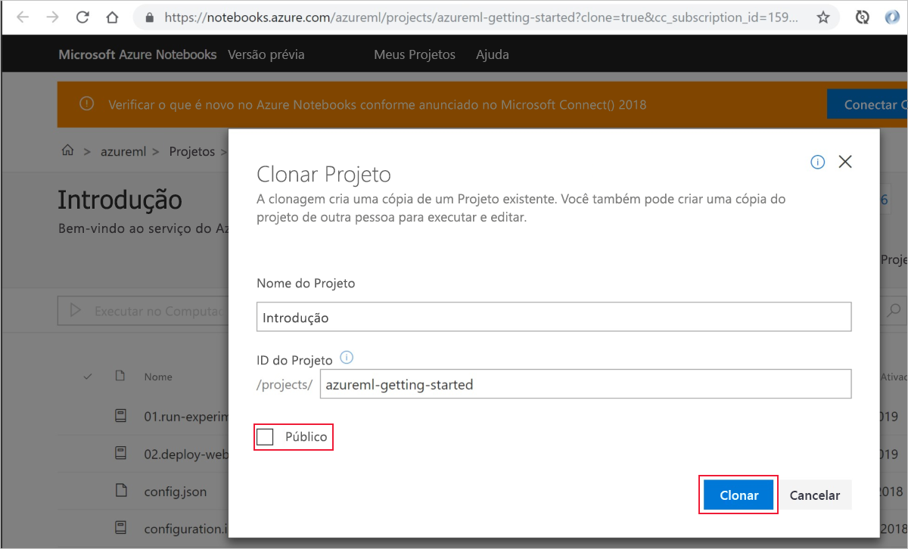
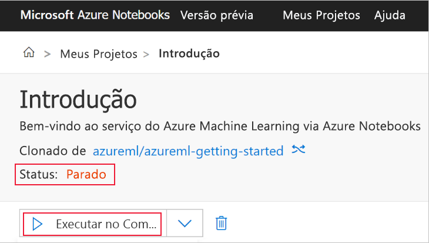
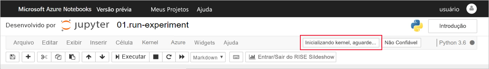
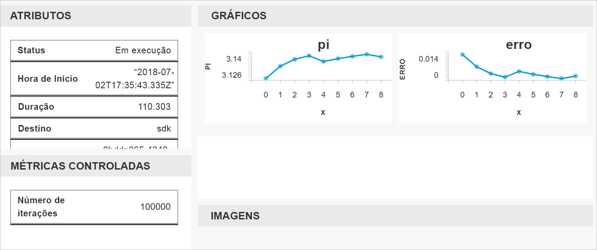

# Início Rápido: usar o portal do Azure para começar a usar o Azure Machine Learning

Use o portal do Azure para criar um workspace do Azure Machine Learning. Esse workspace é o bloco fundamental na nuvem para experimentação, treinamento e implantação de modelos de aprendizado de máquina com o serviço do Machine Learning. Este início rápido usa recursos de nuvem e não exige nenhuma instalação. Para configurar seu próprio servidor do Jupyter Notebook em vez disso, confira [Início Rápido: usar Python para começar a usar o Azure Machine Learning](quickstart-create-workspace-with-python.md).  
 
Neste início rápido, você realiza as seguintes ações:

* Criar um workspace na assinatura do Azure.
* Experimente com o Python em um Jupyter Notebook e registre valores em várias iterações.
* Exibir os valores registrados em log em seu workspace.

Os seguintes recursos do Azure serão adicionados automaticamente ao workspace quando estiverem disponíveis regionalmente:

  - [Registro de Contêiner do Azure](https://azure.microsoft.com/services/container-registry/)
  - [Armazenamento do Azure](https://azure.microsoft.com/services/storage/)
  - [Azure Application Insights](https://azure.microsoft.com/services/application-insights/) 
  - [Cofre da Chave do Azure](https://azure.microsoft.com/services/key-vault/)

Os recursos que você cria podem ser usados como pré-requisitos em outros tutoriais e artigos de instruções do serviço do Machine Learning. Como com outros serviços do Azure, há limites em determinados recursos associados ao Machine Learning. Um exemplo é o tamanho do cluster de computação. Saiba mais sobre [os limites padrão e como aumentar sua cota](how-to-manage-quotas.md).

Se você não tiver uma assinatura do Azure, crie uma conta gratuita antes de começar. Experimente a [versão gratuita ou paga do Serviço do Azure Machine Learning](http://aka.ms/AMLFree) hoje mesmo.

## Criar um workspace 

[!INCLUDE [aml-create-portal](../../../includes/aml-create-in-portal.md)]

## Usar o workspace

> [!VIDEO https://www.microsoft.com/en-us/videoplayer/embed/RE2F9Ad]

Agora, saiba como um workspace ajuda a gerenciar seus scritps de aprendizado de máquina. Nesta seção, você executa as seguintes etapas:

* Abra um notebook no Azure Notebooks.
* Execute o código que cria alguns valores registrados em log.
* Exiba os valores registrados em log no seu espaço de trabalho.

Este exemplo mostra como o espaço de trabalho pode ajudar a manter o controle das informações geradas em um script. 

### Abra um notebook 

O [Azure Notebooks](https://notebooks.azure.com) fornece uma plataforma de nuvem gratuita para Jupyter Notebooks que está previamente configurada com tudo o que você precisa para executar o Machine Learning. No workspace, é possível iniciar essa plataforma para começar a usar o workspace do Serviço do Azure Machine Learning.

1. Na página Workspace, selecione **Explore o seu workspace de serviço do Azure Machine Learning**.

 

1. Selecione **Abrir Azure Notebooks** para fazer seu primeiro experimento no Azure Notebooks.  O Azure Notebooks é um serviço separado que permite executar notebooks Jupyter gratuitamente na nuvem.  Quando você usa esse link para o serviço, informações sobre como se conectar ao seu workspace serão adicionadas à biblioteca criada no Azure Notebooks.

 

1. Entre no Azure Notebooks.  Lembre-se de entrar no Azure Notebooks com a mesma conta usada para entrar no portal do Azure. Sua organização poderá exigir [consentimento do administrador](https://notebooks.azure.com/help/signing-up/work-or-school-account/admin-consent) antes de poder entrar.

1. Depois de entrar, uma nova guia é aberta e um prompt `Clone Library` é exibido. A clonagem dessa biblioteca carregará um conjunto de notebooks e outros arquivos na sua conta do Azure Notebooks.  Esses arquivos ajudarão você a explorar as capacidades do Azure Machine Learning.

1. Desmarque a opção **Público** para não compartilhar suas informações de workspace com outras pessoas.

1. Selecione **Clonar**.

 

1. Se vir que o status do projeto é interrompido, clique em **Executar em computação gratuita** para usar o servidor de notebook gratuito.

    

### Executar o notebook

Na lista de arquivos para este projeto, você vê um arquivo `config.json`. Este arquivo de configuração contém informações sobre o workspace que você criou no portal do Azure.  Esse arquivo permite que seu código se conecte e adicione informações ao seu workspace.

1. Selecione **01.run experiment.ipynb** para abrir o notebook.

1. A área de status informará para aguardar até o kernel ser iniciado.  A mensagem desaparecerá depois que o kernel estiver pronto.

    

1. Depois que o kernel tiver iniciado, execute as células uma de cada vez usando **Shift+Enter**. Ou selecione **Células** > **Executar todas** para executar o notebook inteiro. Quando você vir um asterisco, __*__, ao lado de uma célula, significa que ela ainda está em execução. Após o código para a célula ser concluído, um número é exibido. 

1. Siga as instruções no notebook para autenticar sua assinatura do Azure.

Depois de concluir a execução de todas as células no bloco de anotações, você poderá exibir os valores registrados em seu workspace.

## Exibir valores registrados em log

1. A saída da célula `run` contém um link para o portal do Azure para exibir os resultados do experimento em seu workspace. 

    

1. Clique no **Link para o portal do Azure** para exibir informações sobre a execução em seu workspace.  Esse link abre seu workspace no portal do Azure.

1. Os gráficos dos valores registrados que você vê foram criados automaticamente no workspace. Sempre que registra diversos valores com o mesmo parâmetro de nome, um gráfico é gerado automaticamente para você.

   

Já que o código para aproximar o pi usa valores aleatórios, seus gráficos mostrarão valores diferentes.  

## Limpar recursos 

[!INCLUDE [aml-delete-resource-group](../../../includes/aml-delete-resource-group.md)]

Você também pode manter o grupo de recursos, mas excluir um único workspace. Exiba as propriedades do workspace e, em seguida, selecione **Excluir**.

## Próximas etapas

Você criou os recursos necessários para experimentar e implantar modelos. Você também executou código em um notebook. E explorou o histórico de execução desse código em seu workspace na nuvem.

Para obter uma experiência de fluxo de trabalho detalhado, siga os tutoriais do Machine Learning para treinar e implantar um modelo:  

> [!div class="nextstepaction"]
> [Tutorial: treinar um modelo de classificação de imagem](tutorial-train-models-with-aml.md)
