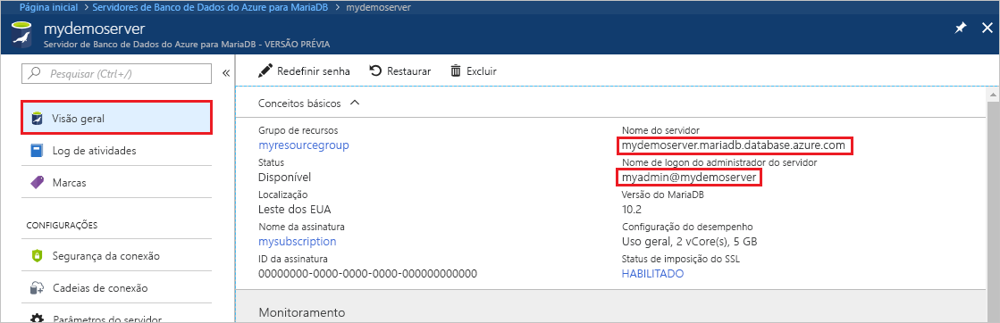
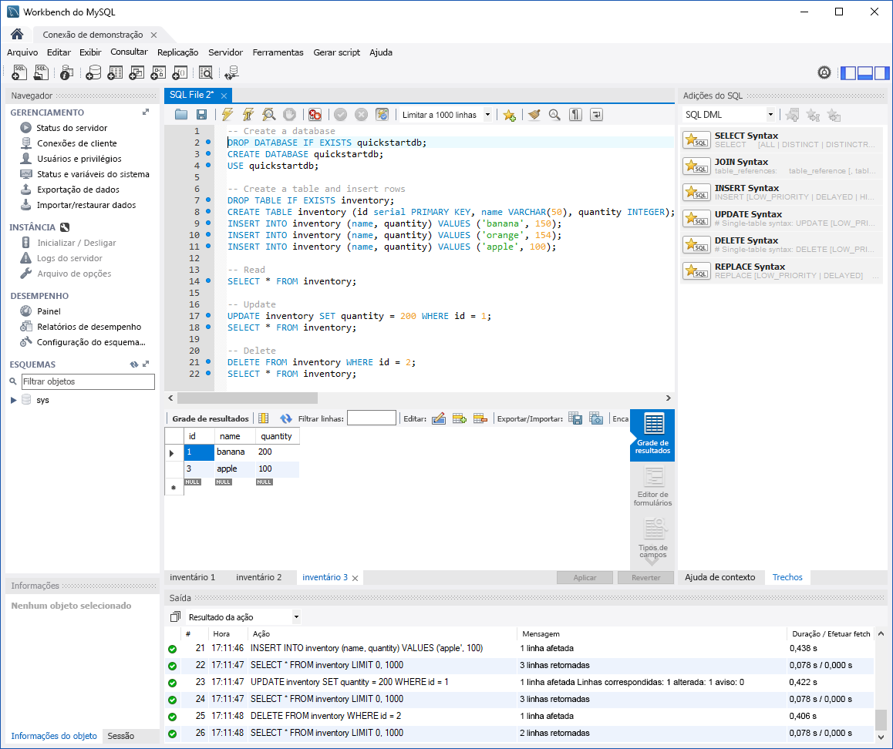

# <a name="azure-database-for-mariadb-use-mysql-workbench-to-connect-and-query-data"></a>Banco de Dados do Azure para MariaDB: use o MySQL Workbench para conectar e consultar dados
Este início rápido demonstra como se conectar a um Banco de Dados do Azure para MariaDB usando o aplicativo MySQL Workbench. 

## <a name="prerequisites"></a>Pré-requisitos
Este guia de início rápido usa os recursos criados em um destes guias como ponto de partida:
- [Criar um Banco de Dados do Azure para MariaDB usando o portal do Azure](./quickstart-create-mariadb-server-database-using-azure-portal.md)
- [Criar um servidor do Banco de Dados do Azure para MariaDB usando a CLI do Azure](./quickstart-create-mariadb-server-database-using-azure-cli.md)

## <a name="install-mysql-workbench"></a>Instalar o MySQL Workbench
Baixe e instale o MySQL Workbench em seu computador e do [site do MySQL](https://dev.mysql.com/downloads/workbench/).

## <a name="get-connection-information"></a>Obter informações de conexão
Obtenha as informações de conexão necessárias para se conectar ao Banco de Dados do Azure para MariaDB. Você precisa das credenciais de logon e do nome do servidor totalmente qualificado.

1. Faça logon no [Portal do Azure](https://portal.azure.com/).

2. No menu à esquerda no portal do Azure, clique em **Todos os recursos** e pesquise o servidor que você criou (como **mydemoserver**).

3. Clique no nome do servidor.

4. No painel **Visão Geral** do servidor, anote o **Nome do servidor** e **Nome de logon do administrador do servidor**. Se você esquecer sua senha, também poderá redefini-la nesse painel.
 

## <a name="connect-to-server-using-mysql-workbench"></a>Conectar-se ao servidor usando MySQL Workbench 
Para conectar-se ao servidor do Banco de Dados do Azure para MariaDB usando o MySQL Workbench, siga estas etapas:

1.  Inicie o aplicativo MySQL Workbench em seu computador. 

2.  Na caixa de diálogo **Configurar Nova Conexão**, insira as seguintes informações na guia **Parâmetros**:

    

    | **Configuração** | **Valor sugerido** | **Descrição do campo** |
    |---|---|---|
    |   Nome da Conexão | Conexão de demonstração | Especifique um rótulo para essa conexão. |
    | Método de Conexão | Padrão (TCP/IP) | Padrão (TCP/IP) é suficiente. |
    | Nome do host | *nome do servidor* | Especifique o valor do nome do servidor que foi usado quando você criou o Banco de Dados do Azure para MariaDB anteriormente. Nosso servidor de exemplo mostrado é mydemoserver.mariadb.database.azure.com. Use o nome de domínio totalmente qualificado (\*.mariadb.database.azure.com) conforme mostrado no exemplo. Siga as etapas na seção anterior para obter as informações da conexão, caso não se lembre do seu nome do servidor.  |
    | Porta | 3306 | Sempre use a porta 3306 ao conectar-se ao Banco de Dados do Azure para MariaDB. |
    | Nome de Usuário |  *nome de logon do administrador do servidor* | Digite o nome de usuário de logon do administrador do servidor fornecido na criação do Banco de Dados do Azure para MariaDB anteriormente. Nosso nome de usuário de exemplo é myadmin@mydemoserver. Siga as etapas na seção anterior para obter as informações da conexão, caso não se lembre do nome do usuário. O formato é *username@servername*.
    | Senha | sua senha | Clique no botão **Armazenar no cofre...** para salvar a senha. |

3.   Clique em **Testar Conexão** para testar se todos os parâmetros estiverem configurados corretamente. 

4.   Clique em **OK** para salvar a conexão. 

5.   Na lista de **Conexões MySQL**, clique no bloco correspondente ao seu servidor e aguarde até que a conexão seja estabelecida.

        Uma nova guia do SQL é aberta, com um editor em branco no qual você pode digitar suas consultas.
    
        > [!NOTE]
        > Por padrão, a segurança da conexão SSL é exigida e imposta no servidor do Banco de Dados do Azure para MariaDB. Embora normalmente nenhuma configuração adicional com certificados SSL seja necessária para que o MySQL Workbench se conecte ao servidor, recomendamos associar a certificação de AC SSL com o MySQL Workbench. Se precisar desabilitar o SSL, visite o portal do Azure e clique na página Segurança de conexão para desabilitar o botão de alternância Impor conexão SSL.

## <a name="create-table-insert-read-update-and-delete-data"></a>Criar tabela, inserir, ler, atualizar e excluir dados
1. Copie e cole o código de exemplo do SQL em uma guia SQL em branco para ilustrar alguns dados de exemplo.

    Esse código cria um banco de dados vazio chamado quickstartdb e, em seguida, cria uma tabela de exemplo chamada inventory. Ele insere algumas linhas e, em seguida, lê as linhas. Ele altera os dados com uma instrução de atualização e lê as linhas novamente. Por fim, exclui uma linha e lê as linhas novamente.
    
    ```sql
    -- Create a database
    -- DROP DATABASE IF EXISTS quickstartdb;
    CREATE DATABASE quickstartdb;
    USE quickstartdb;
    
    -- Create a table and insert rows
    DROP TABLE IF EXISTS inventory;
    CREATE TABLE inventory (id serial PRIMARY KEY, name VARCHAR(50), quantity INTEGER);
    INSERT INTO inventory (name, quantity) VALUES ('banana', 150);
    INSERT INTO inventory (name, quantity) VALUES ('orange', 154);
    INSERT INTO inventory (name, quantity) VALUES ('apple', 100);
    
    -- Read
    SELECT * FROM inventory;
    
    -- Update
    UPDATE inventory SET quantity = 200 WHERE id = 1;
    SELECT * FROM inventory;
    
    -- Delete
    DELETE FROM inventory WHERE id = 2;
    SELECT * FROM inventory;
    ```

    A captura de tela mostra um exemplo do código SQL no SQL Workbench e a saída após sua execução.
    
    

2. Para executar o código SQL de exemplo, clique no ícone de raio na barra de ferramentas da guia **Arquivo SQL**.
3. Observe os resultados em três guias na seção **Grade de Resultados** no meio da página. 
4. Observe a lista de **Saída** na parte inferior da página. O status de cada comando é mostrado. 

Agora, você se conectou ao Banco de Dados do Azure para MariaDB usando o MySQL Workbench e consultou dados usando a linguagem SQL.

<!--
## Next steps
> [!div class="nextstepaction"]
> [Migrate your database using Export and Import](./concepts-migrate-import-export.md)
-->