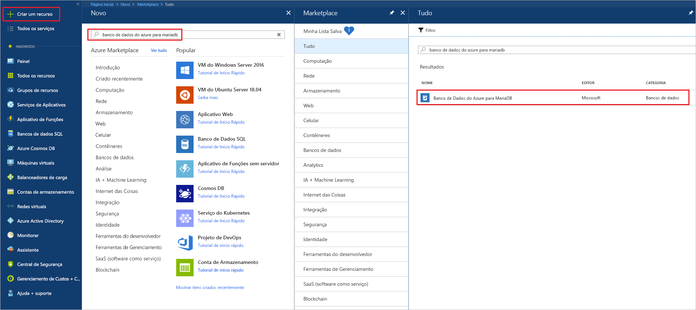
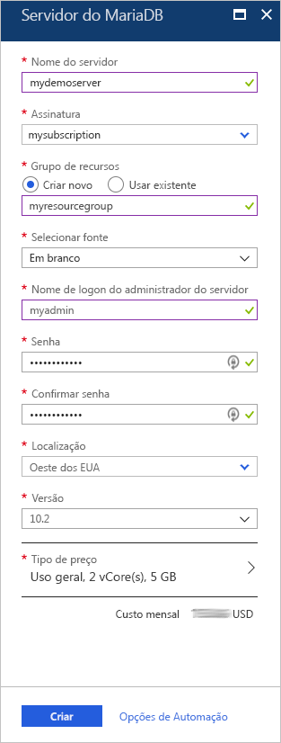
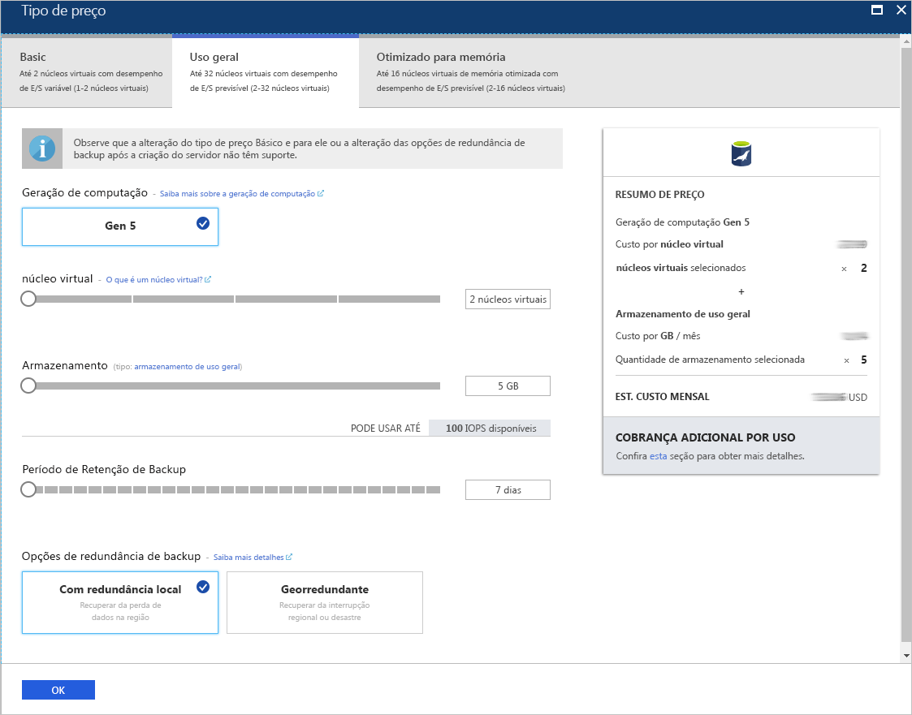
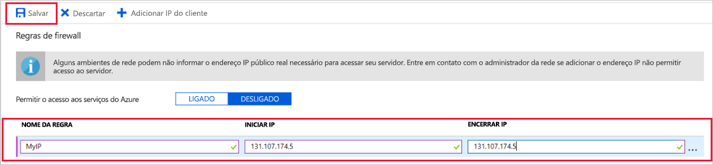
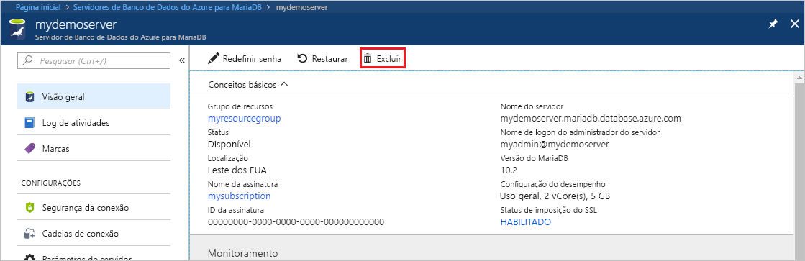

# <a name="create-an-azure-database-for-mariadb-server-by-using-the-azure-portal"></a>Criar um servidor de Banco de Dados do Azure para MariaDB usando o portal do Azure

O Banco de Dados do Azure para MariaDB é um serviço gerenciado usado para executar, gerenciar e dimensionar Bancos de Dados MariaDB altamente disponíveis na nuvem. Este início rápido mostra como criar um servido de Banco de Dados do Azure para MariaDB em aproximadamente cinco minutos usando o portal do Azure.  

Caso você não tenha uma assinatura do Azure, crie uma [conta gratuita do Azure](https://azure.microsoft.com/free/) antes de começar.

## <a name="sign-in-to-the-azure-portal"></a>Entre no Portal do Azure

Acesse o [portal do Azure](https://portal.azure.com/) em um navegador da Web. Insira suas credenciais para entrar no portal. A exibição padrão é o painel de serviço.

## <a name="create-an-azure-database-for-mariadb-server"></a>Criar um servidor do Banco de Dados do Azure para MariaDB

Crie um servidor do Banco de Dados do Azure para MariaDB com um conjunto definido de [recursos de computação e armazenamento](concepts-pricing-tiers.md). Crie o serviço dentro de um [Grupo de recursos do Azure](../azure-resource-manager/resource-group-overview.md).

Para criar um servidor de Banco de Dados do Azure para MariaDB:

1. Marque o botão **Criar um recurso** (+) no canto superior esquerdo do portal.

2. Na caixa de pesquisa, insira **Banco de Dados do Azure para MariaDB** para localizar o serviço.

   

3. Insira ou escolha os seguintes detalhes do servidor:
   
   

    Configuração | Valor sugerido | DESCRIÇÃO
    ---|---|---
    Nome do servidor | *um nome de servidor exclusivo* | Escolha um nome exclusivo que identifique o servidor de Banco de Dados do Azure para MariaDB. Por exemplo, **mydemoserver**. O nome de domínio *.mariadb.database.azure.com* é acrescentado ao nome do servidor inserido. O nome do servidor pode conter apenas letras minúsculas, números e o caractere de hífen (-). Ele deve conter entre 3 e 63 caracteres.
    Assinatura | *sua assinatura* | Selecione a assinatura do Azure que você deseja usar para o servidor. Se você tiver várias assinaturas, escolha a assinatura na qual você recebe a cobrança do recurso.
    Grupo de recursos | **myresourcegroup** | Insira o nome de um novo grupo de recursos ou escolha um grupo de recursos existente. 
    Selecionar a origem | **Em branco** | Selecione **Em branco** para criar um novo servidor do zero. (Escolha **Backup** se você estiver criando um servidor a partir de um backup de área geográfica de um servidor de Banco de Dados do Azure para MariaDB existente.)
    Logon de administrador do servidor | **myadmin** | Uma conta de logon a ser usada ao se conectar ao servidor. O nome de logon do administrador não pode ser **azure_superusuário**, **admin**, **administrador**, **raiz**, **convidado** ou **público**.
    Senha | *sua escolha* | Insira uma nova senha para a conta do administrador do servidor. Ele deve conter entre 8 e 128 caracteres. A senha deve conter caracteres de três das seguintes categorias: letras maiúsculas, letras minúsculas, números (0-9) e caracteres não alfanuméricos (!, $, #, % e assim por diante).
    Confirmar senha | *sua escolha*| Confirme a senha da conta do administrador.
    Local padrão | *a região mais próxima de seus usuários*| Escolha o local mais próximo de seus usuários ou de outros aplicativos do Azure.
    Versão | *a versão mais recente*| A versão mais recente (a menos que você tenha requisitos específicos que exijam outra versão).
    Tipo de preço | Confira a descrição. | As configurações de computação, armazenamento e backup para o novo servidor. Escolha **Tipo de preço** > **Uso Geral**. Mantenha os valores padrão para as seguintes configurações:<br><ul><li>**Geração de Computação** (Gen 5)</li><li>**vCore** (2 vCores)</li><li>**Armazenamento** (5 GB)</li><li>**Período de Retenção de Backup** (7 dias)</li></ul><br>Para habilitar os backups do servidor em armazenamento com redundância geográfica, escolha **Redundância Geográfica** nas **Opções de Redundância de Backup**. <br><br>Para salvar a seleção desse tipo de preço, selecione **OK**. A captura de tela a seguir demonstra essas seleções.
  
    > [!IMPORTANT]
    > O logon de administrador do servidor e a senha especificada aqui são necessários para posteriormente fazer logon no servidor e em seus bancos de dados neste Início rápido. Lembre-se ou registre essas informações para o uso posterior.
    > 

   

4.  Selecione **Criar** para provisionar o servidor. O provisionamento pode levar até 20 minutos.
   
5.  Para monitorar o processo de implantação, escolha **Notificações** na barra de ferramentas (ícone de sino).
   
Por padrão, os seguintes bancos de dados são criados em seu servidor: **information_schema**, **mysql**, **performance_schema** e **sys**.


## <a name="configure-firewall-rule">Configurar uma regra de firewall no nível do servidor</a>

O serviço do Banco de Dados do Azure para MariaDB cria um firewall no nível do servidor. O firewall impede que as ferramentas e os aplicativos externos se conectem ao servidor ou aos bancos de dados no servidor, a menos que uma regra de firewall seja criada para abrir o firewall para endereços IP específicos. 

Para criar uma regra de firewall no nível do servidor:

1.   Quando a implantação for concluída, localize o servidor. Se necessário, você pode pesquisar. Por exemplo, no menu do lado esquerdo, escolha **Todos os Recursos**. Em seguida, insira o nome do servidor. Por exemplo, digite **mydemoserver** para procurar o servidor recém-criado. Selecione o nome do servidor na lista de resultados da pesquisa. A página **Visão Geral** do servidor é aberta. Você pode alterar outras configurações nessa página.

2. Na página Visão Geral do servidor, escolha **Segurança da conexão**.

3.  Em **Regras de firewall**, marque a caixa de texto em branco na coluna **Nome da Regra** para começar a criar a regra de firewall. Especifique o intervalo de IP exato dos clientes que se conectarão a esse servidor.
   
   

4. Na barra de ferramentas superior da página **Segurança da conexão**, selecione **Salvar**. Antes de continuar, aguarde até que você veja a notificação informando que a atualização foi concluída com êxito. 

   > [!NOTE]
   > As conexões ao Banco de Dados do Azure para MariaDB se comunicam pela porta 3306. Se está tentando se conectar de uma rede corporativa, é possível que o tráfego de saída pela porta 3306 não seja permitido. Nesse caso, para se conectar ao servidor, o departamento de TI deve abrir a porta 3306.
   > 

## <a name="get-connection-information"></a>Obter informações de conexão

Para conectar o servidor de banco de dados, você precisa do nome do servidor completo e as credenciais de entrada do administrador. Talvez você tenha anotado esses valores anteriormente neste artigo. Caso contrário, localize facilmente o nome do servidor e as informações de entrada na página **Visão Geral** ou na página **Propriedades** do servidor no portal do Azure:

1. Vá para a página **Visão geral** do servidor. Anote os valores de **Nome do servidor** e **Nome de logon de administrador do servidor**. 

2. Para copiar os valores, coloque o cursor sobre o campo que você deseja copiar. O ícone de cópia aparecerá à direita do texto. Selecione o ícone de cópia conforme necessário para copiar os valores.

Em nosso exemplo, o nome do servidor é **mydemoserver.mariadb.database.azure.com** e o nome de logon do administrador do servidor é **myadmin@mydemoserver**.

## <a name="connect-to-azure-database-for-mariadb-by-using-the-mysql-command-line"></a>Conectar-se ao Banco de Dados do Azure para MariaDB usando a linha de comando mysql

Há vários aplicativos que você pode usar para se conectar ao servidor de Banco de Dados do Azure para MariaDB.

Primeiro, vamos usar a ferramenta de linha de comando [mysql](https://dev.mysql.com/doc/refman/5.7/en/mysql.html) para ilustrar como se conectar ao servidor. Você também pode usar um navegador da Web e o Azure Cloud Shell sem precisar instalar o software. Se você tiver o utilitário mysql instalado localmente, poderá também se conectar com ele.

1. Inicie o Azure Cloud Shell pelo ícone de terminal (**>_**) na barra de ferramentas no canto superior direito do portal do Azure.


2.  O Azure Cloud Shell é aberto no navegador. Você pode usar comandos do shell Bash no Cloud Shell.

   

3. No prompt do Cloud Shell, conecte-se ao servidor de Banco de Dados do Azure para MariaDB inserindo a linha de comando mysql.

    Para conectar-se a um servidor de Banco de Dados do Azure para MariaDB usando o utilitário mysql, use o seguinte formato:

    ```bash
    mysql --host <fully qualified server name> --user <server admin login name>@<server name> -p
    ```

    Por exemplo, o comando abaixo faz a conexão com nosso servidor de exemplo:

    ```azurecli-interactive
    mysql --host mydemoserver.mariadb.database.azure.com --user myadmin@mydemoserver -p
    ```

    parâmetro mysql |Valor sugerido|DESCRIÇÃO
    ---|---|---
    --host | *nome do servidor* | O valor do nome do servidor usado para criar o servidor do Banco de Dados do Azure para MariaDB. Nosso servidor de exemplo é **mydemoserver.mariadb.database.azure.com**. Use o nome de domínio totalmente qualificado (**\*.mariadb.database.azure.com**) conforme mostrado no exemplo. Caso não se lembre do nome do servidor, conclua as etapas da seção anterior para ter acesso às informações de conexão.
    --user | *nome de logon do administrador do servidor* |O nome de usuário do logon do administrador do servidor usado para criar o servidor de Banco de Dados do Azure para MariaDB. Caso não se lembre do nome de usuário, conclua as etapas da seção anterior para ter acesso às informações de conexão. O formato é *username@servername*.
    -p | *sua senha*<br>(aguarde até a solicitação) |Quando solicitado, insira a senha que você usou para criar o servidor. Os caracteres de senha digitados não são mostrados no prompt do Bash quando você os digita. Depois de inserir a senha, pressione Enter.

   Quando o utilitário mysql estiver conectado, ele exibirá um prompt `mysql>`. Você pode inserir comandos no prompt. 

   Veja um exemplo de mysql de saída:

    ```bash
    Welcome to the MySQL monitor.  Commands end with ; or \g.
    Your MySQL connection id is 65505
    Server version: 5.6.39.0 MariaDB Server
    
    Copyright (c) 2000, 2017, Oracle and/or its affiliates. All rights reserved.
    
    Oracle is a registered trademark of Oracle Corporation and/or its
    affiliates. Other names may be trademarks of their respective
    owners.

    Type 'help;' or '\h' for help. Type '\c' to clear the current input statement.
    
    mysql>
    ```
    
    > [!TIP]
    > Se o firewall não estiver configurado para permitir o endereço IP do Azure Cloud Shell, o seguinte erro ocorrerá:
    >
    >   ERRO 2003 (28000): o cliente com o endereço IP 123.456.789.0 não tem permissão para acessar o servidor.
    >
    > Para resolver o erro, verifique se a configuração do servidor corresponde às etapas que estão descritas em [Configurar uma regra de firewall no nível do servidor](#configure-firewall-rule).

4. Para verificar a conexão, insira **status** no prompt `mysql>` para verificar o status do servidor.

    ```sql
    status
    ```

   > [!TIP]
   > Para saber mais sobre outros comandos, veja [Manual de Referência do MySQL 5.7 – Capítulo 4.5.1](https://dev.mysql.com/doc/refman/5.7/en/mysql.html).

5.  Crie um banco de dados em branco no prompt `mysql>` inserindo o seguinte comando:

    ```sql
    CREATE DATABASE quickstartdb;
    ```
    O comando pode levar alguns minutos para ser concluído. 

    Você pode criar um ou vários bancos de dados em um Banco de Dados do Azure para MariaDB. Você pode criar um banco de dados por servidor para utilizar todos os recursos ou pode criar vários bancos de dados para compartilhar os recursos. Não há limites em relação ao número de bancos de dados que você pode criar, mas vários bancos de dados compartilham os mesmos recursos de servidor. 

6. Para listar os bancos de dados, no prompt `mysql>`, digite o seguinte comando:

    ```sql
    SHOW DATABASES;
    ```

7.  Insira **\q** e, em seguida, pressione Enter para fechar a ferramenta mysql. Você já pode fechar o Azure Cloud Shell.

Você se conectou ao servidor de Banco de Dados do Azure para MariaDB e criou um banco de dados de usuário em branco. Na seção a seguir, você se conectará ao mesmo servidor usando outra ferramenta comum, o MySQL Workbench.

## <a name="connect-to-the-server-by-using-mysql-workbench"></a>Conectar-se ao servidor usando MySQL Workbench

Para se conectar ao servidor usando o MySQL Workbench:

1. Abra o MySQL Workbench no computador cliente. Para baixar e instalar o MySQL Workbench, vá para [Baixar MySQL Workbench](https://dev.mysql.com/downloads/workbench/).

2. Para criar uma nova conexão, escolha o ícone de adição (**+**) ao lado do título **Conexões MySQL**.

3. Na caixa de diálogo **Configurar Nova Conexão**, na guia **Parâmetros**, insira as informações de conexão de servidor. Os valores de espaço reservado são mostrados como um exemplo. Substitua o **Nome de Host**, o **Nome de Usuário** e a **Senha** por seus próprios valores.

   

    |Configuração |Valor sugerido|Descrição do campo|
    |---|---|---|
     Nome da conexão | **Conexão de demonstração** | Um rótulo para essa conexão. |
    Método de conexão | **Padrão (TCP/IP)** | Padrão (TCP/IP) é suficiente. |
    Nome do host | *nome do servidor* | O valor do nome do servidor usado para criar o servidor do Banco de Dados do Azure para MariaDB. Nosso servidor de exemplo é **mydemoserver.mariadb.database.azure.com**. Use o nome de domínio totalmente qualificado (**\*.mariadb.database.azure.com**) conforme mostrado no exemplo. Caso não se lembre do nome do servidor, conclua as etapas da seção anterior deste artigo para ter acesso às informações de conexão.|
     Porta | 3306 | A porta a ser usada ao se conectar ao servidor de Banco de Dados do Azure para MariaDB. |
    Nome de Usuário |  *nome de logon do administrador do servidor* | As informações de entrada do administrador do servidor que você usou para criar o Banco de Dados do Azure para MariaDB. Nosso nome de usuário de exemplo é **myadmin@mydemoserver**. Caso não se lembre do nome do usuário, conclua as etapas da seção anterior deste artigo para ter acesso às informações de conexão. O formato é *username@servername*.
    Senha | *sua senha* | Para salvar a senha, escolha **Armazenar no Cofre** . |

4. Para testar se todos os parâmetros estão configurados corretamente, escolha **Testar Conexão**. Em seguida, marque **OK** para salvar a conexão. 

    > [!NOTE]
    > O SSL é imposto por padrão no servidor. Ele requer configuração adicional para se conectar com êxito. Para saber mais, confira [Configure SSL connectivity in your application to securely connect to Azure Database for MariaDB](./howto-configure-ssl.md) (Configurar conectividade SSL em seu aplicativo para se conectar com segurança ao Banco de Dados do Azure para MariaDB). Para desabilitar o SSL neste início rápido, na página de visão geral do servidor no portal do Azure, no menu, escolha **Segurança de conexão**. Em **Impor conexão SSL**, marque **Desabilitado**.
    >

## <a name="clean-up-resources"></a>Limpar recursos

Você pode limpar os recursos criados neste início rápido de duas maneiras. Você pode excluir o [grupo de recursos do Azure](../azure-resource-manager/resource-group-overview.md). Essa opção exclui todos os recursos no grupo de recursos. Se desejar manter os outros recursos intactos, exclua apenas um recurso de servidor.

> [!TIP]
> Outros Inícios Rápidos da coleção utilizam este Início Rápido. Se você pretende continuar trabalhando com o Banco de Dados do Azure para MariaDB, não limpe os recursos criados neste início rápido. Se você não planeja continuar, use as etapas a seguir para excluir todos os recursos criados com este início rápido.
>

Para excluir o grupo de recursos inteiro, incluindo o servidor recém-criado:

1.  No portal do Azure, encontre seu grupo de recursos. No menu à esquerda, marque **Grupos de recursos** e escolha o nome do grupo de recursos (em nosso exemplo, **myresourcegroup**).

2.  Na página do grupo de recursos, marque **Excluir**. Em seguida, insira o nome do grupo de recursos (em nosso exemplo, **myresourcegroup**) para confirmar a exclusão. Selecione **Excluir**.

Para excluir apenas o servidor recém-criado:

1.  No portal do Azure, localize seu servidor caso ele ainda não esteja aberto. No menu do lado esquerdo, selecione **Todos os recursos**. Em seguida, procure o servidor que você criou.

2.  Na página **Visão Geral**, selecione **Excluir**. 

   

3.  Confirme o nome do servidor que você deseja excluir. Exiba os bancos de dados que ele possui, mas que serão afetados pela exclusão. Insira o nome do servidor (em nosso exemplo, **mydemoserver**) para confirmar a exclusão. Selecione **Excluir**.

## <a name="next-steps"></a>Próximas etapas

- [Criar seu primeiro Banco de Dados do Azure para MariaDB](./tutorial-design-database-using-portal.md)
