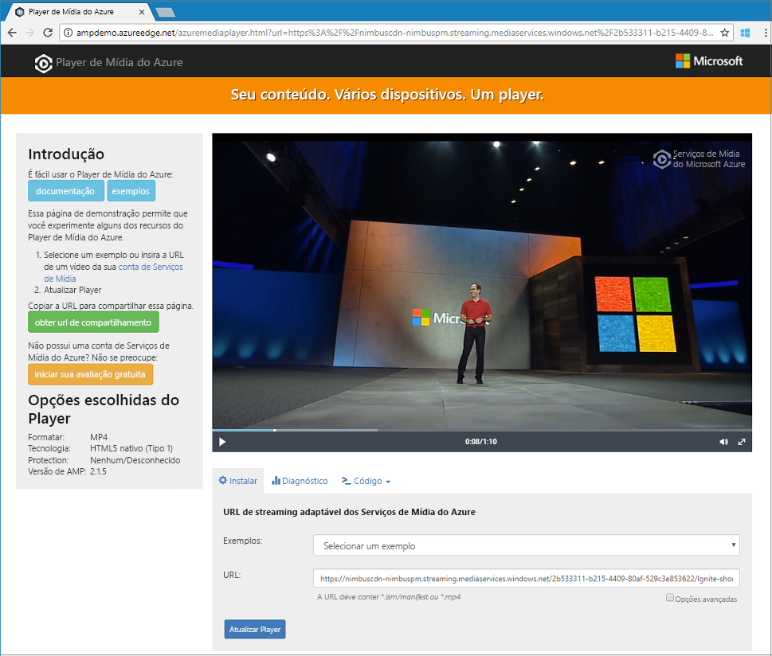

# <a name="quickstart-stream-video-files---net"></a>Início Rápido: Transmissão de arquivos de vídeo - .NET

> [!NOTE]
> A versão mais recente do Azure Media Services está em versão prévia e pode ser chamada de v3. Para começar a usar APIs v3, você deve criar uma nova conta dos Serviços de Mídia, conforme descrito neste início rápido. 

Este início rápido mostra como é fácil iniciar a transmissão de vídeos por streaming em vários navegadores e dispositivos usando os Serviços de Mídia do Azure. O exemplo neste tópico codifica o conteúdo disponibilizado por meio de uma URL HTTPS. 

Ao final do início rápido, você poderá transmitir um vídeo por streaming.  



[!INCLUDE [quickstarts-free-trial-note](../../../includes/quickstarts-free-trial-note.md)]

## <a name="prerequisites"></a>Pré-requisitos

Se o Visual Studio não estiver instalado, você poderá obter o [Visual Studio Community 2017](https://www.visualstudio.com/thank-you-downloading-visual-studio/?sku=Community&rel=15).

## <a name="download-the-sample"></a>Baixar o exemplo

Clone um repositório do GitHub que contém o exemplo de streaming de .NET em sua máquina usando o comando a seguir:  

 ```bash
 git clone http://github.com/Azure-Samples/media-services-v3-dotnet-quickstarts.git
 ```

O exemplo está localizado na pasta [EncodeAndStreamFiles](https://github.com/Azure-Samples/media-services-v3-dotnet-quickstarts/tree/master/AMSV3Quickstarts/EncodeAndStreamFiles).

O exemplo executa as ações a seguir:

1. Cria uma transformação (primeiro, verifica se a transformação especificada existe). 
2. Cria um ativo de saída que é usado como a saída do trabalho de codificação.
3. Cria a entrada do trabalho com base em uma URL HTTPS.
4. Envia o trabalho de codificação usando a entrada e a saída criadas anteriormente.
5. Verifica o status do trabalho.
6. Cria um StreamingLocator.
7. Compila as URLs de streaming.

Para obter explicações sobre cada função no exemplo, examine o código e os comentários neste [arquivo de origem](https://github.com/Azure-Samples/media-services-v3-dotnet-quickstarts/blob/master/AMSV3Quickstarts/EncodeAndStreamFiles/Program.cs).

## <a name="log-in-to-azure"></a>Fazer logon no Azure

Faça logon no [Portal do Azure](http://portal.azure.com).

[!INCLUDE [cloud-shell-try-it.md](../../../includes/cloud-shell-try-it.md)]

[!INCLUDE [media-services-cli-create-v3-account-include](../../../includes/media-services-cli-create-v3-account-include.md)]

[!INCLUDE [media-services-v3-cli-access-api-include](../../../includes/media-services-v3-cli-access-api-include.md)]

## <a name="run-the-sample-app"></a>Executar o aplicativo de exemplo

Quando você executa o aplicativo, as URLs que podem ser usadas para reproduzir o vídeo usando protocolos diferentes são exibidas. 

1. Pressione Ctrl + F5 para executar o aplicativo *EncodeAndStreamFiles*.
2. Escolha o protocolo **HLS** da Apple (termina com *manifest(format=m3u8-aapl)*) e copie a URL de streaming do console.


No exemplo de [código-fonte](https://github.com/Azure-Samples/media-services-v3-dotnet-quickstarts/blob/master/AMSV3Quickstarts/EncodeAndStreamFiles/Program.cs), você pode ver como a URL é criada. Para criá-la, você precisa concatenar o nome do host do ponto de extremidade de streaming e o caminho do localizador de streaming.  

## <a name="test-with-azure-media-player"></a>Testar com o Player de Mídia do Azure

Para testar o streaming, este artigo usa o Player de Mídia do Azure. 

> [!NOTE]
> Se um player estiver hospedado em um site https, atualize a URL para "https".

1. Abra um navegador da Web e navegue até [https://aka.ms/azuremediaplayer/](https://aka.ms/azuremediaplayer/).
2. Na caixa **URL:**, cole um dos valores de URL de streaming que você obteve ao executar o aplicativo. 
3. Pressione **Atualizar Player**.

O Player de Mídia do Azure pode ser usado para testes, mas não deve ser usado em um ambiente de produção. 

## <a name="clean-up-resources"></a>Limpar recursos

Se você não precisar mais de qualquer um dos recursos em seu grupo de recursos, incluindo as contas dos Serviços de Mídia e de armazenamento que você criou neste Início Rápido, exclua o grupo de recursos. Use a ferramenta **CloudShell**.

No **CloudShell**, execute o seguinte comando:

```azurecli-interactive
az group delete --name amsResourceGroup
```

## <a name="examine-the-code"></a>Examinar o código

Para obter explicações sobre cada função no exemplo, examine o código e os comentários neste [arquivo de origem](https://github.com/Azure-Samples/media-services-v3-dotnet-quickstarts/blob/master/AMSV3Quickstarts/EncodeAndStreamFiles/Program.cs).

O tutorial [carregar, codificar e transmitir arquivos por streaming](stream-files-tutorial-with-api.md) fornece um exemplo mais avançado de streaming com explicações detalhadas. 

## <a name="multithreading"></a>Multithreading

Os SDKs dos Serviços de Mídia do Azure v3 não são thread-safe. Ao trabalhar com aplicativos multithread, você deve gerar um novo objeto AzureMediaServicesClient por thread.

## <a name="next-steps"></a>Próximas etapas

> [!div class="nextstepaction"]
> [Tutorial: carregar, codificar e transmitir vídeos](stream-files-tutorial-with-api.md)
