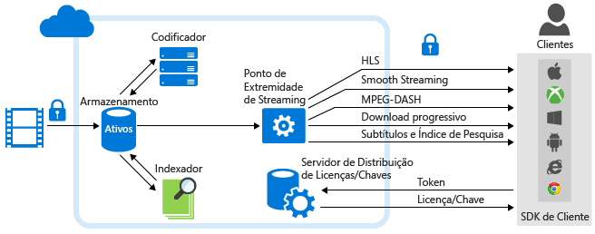

# Visão Geral da Análise dos Serviços de Mídia do Azure | Microsoft Azure
## Visão geral
Mais organizações e empresas estão adotando o vídeo como o meio preferido para treinar seus funcionários,contatar seus clientes e documentar suas funções comerciais. A computação em nuvem faz com que seja mais eficiente armazenar, transmitir e acessar esses arquivos de mídia grandes, mas conforme as empresas expandem suas bibliotecas de conteúdo de vídeo, elas devem ter um meio igualmente eficaz de extrair novas informações de vídeo para criar interações mais significativas e personalizadas com seu público e levar seus negócios para o próximo nível.

Para resolver essa necessidade cada vez maior no Marketplace, os Serviços de Mídia do Azure oferecem a Análise de Mídia, uma coleção de componentes de fala e visão (em escala empresarial, conformidade, segurança e alcance global) que facilitam a obtenção de análises acionáveis para as organizações e empresas de seus arquivos de vídeo. Os serviços de Análise de Mídia do Azure são criados usando os componentes principais da plataforma Serviços de Mídia do Azure e, portanto, estão prontos para lidar com o processamento de mídia em grande escala logo no primeiro dia.

A Análise de Mídia do Azure permite que os desenvolvedores aprendam a usar rapidamente os recursos de pesquisa visual para vídeo em escala limitada e implementar essa funcionalidade avançada em Bots e aplicativos. A Análise de Mídia do Azure foi criada para ser usada por ambientes empresariais com toda a escala, conformidade, segurança e alcance global necessários para grandes organizações.

O diagrama a seguir mostra a **Análise de Mídia** e outras partes importantes da plataforma Serviços de Mídia. Observe que os processadores de mídia da Análise de Mídia produzem arquivos MP4 ou arquivos JSON. Se um processador de mídia produzir um arquivo MP4, você poderá baixar o arquivo progressivamente. Se um processador de mídia produzir um arquivo JSON, você poderá baixar o arquivo do Armazenamento de Blobs do Azure.

## Serviços de Análise de Mídia do Azure
* **Indexador** – o Indexador de Mídia do Azure permite tornar o conteúdo pesquisável, além de gerar faixas de legendagem oculta. Os Serviços de Mídia do Azure lançaram a **Preview do Indexador de Mídia do Azure 2**, com indexação mais rápida e suporte a mais idiomas. Dentre os idiomas com suporte estão: inglês, espanhol, francês, alemão, italiano, chinês, português e árabe. Para obter informações detalhadas e exemplos, confira [Processar vídeos com o Indexador de Mídia do Azure 2](media-services-process-content-with-indexer2.md)
* **Hyperlapse** – o Microsoft Hyperlapse é o resultado de mais de 20 anos de pesquisa visual computacional no MSR (Microsoft Research), combinando estabilização de vídeo e criação de lapsos de tempo para criar vídeos belos, rápidos e consumíveis de seu conteúdo de longa duração. Além de lapsos de tempo, você também pode usar o Hyperlapse para criar vídeos estáveis a partir de vídeos tremidos capturados com telefones celulares e câmeras de vídeo. Para obter informações detalhadas e exemplos, confira [Arquivos de Mídia do Hyperlapse com o Hyperlapse da Mídia do Azure](media-services-hyperlapse-content.md)
* **Detecção de movimento** – É possível usar esse serviço para detectar movimento em um vídeo com telas de fundo fixas. Isso é ideal para clientes que desejam verificar a existência de falsos positivos em eventos de movimento detectados por câmeras de vigilância em transmissões de vídeo de vigilância. Para obter informações detalhadas e exemplos, confira [Detecção de movimento da Análise de Mídia do Azure](media-services-motion-detection.md).
* **Detecção facial e emoções faciais** – Ao usar este serviço, é possível detectar a face das pessoas e suas emoções, incluindo felicidade, tristeza, surpresa, irritação, desprezo, medo, aversão e indiferença/neutralidade. Isso tem várias aplicações úteis no setor, descritas abaixo, incluindo agregar e analisar reações de pessoas participando de um evento. Para obter informações detalhadas e exemplos, confira [Detecção facial e de emoções da Análise de Mídia do Azure](media-services-face-and-emotion-detection.md).
* **Resumo de vídeo** – O resumo de vídeo pode ajudá-lo a criar resumos de vídeos de longa duração com a seleção automática de trechos interessantes do vídeo de origem. Isso será útil quando você desejar fornecer uma visão geral rápida do que esperar de um vídeo de longa duração. Para obter informações detalhadas e exemplos, confira [Usar miniaturas de vídeo da Mídia do Azure para criar um resumo de vídeo](media-services-video-summarization.md)
* **Reconhecimento óptico de caracteres** - o OCR (reconhecimento óptico de caracteres) da Análise de Mídia do Azure permite que você converta o conteúdo de texto de arquivos de vídeo em texto digital editável e pesquisável. Isso permite que você automatize a extração de metadados significativos do sinal de vídeo de sua mídia.
* **Edição facial escalonável** – o **Azure Media Redactor** é um MP do Azure Media Analytics que oferece edição facial escalonável na nuvem. A edição facial permite que você modifique seu vídeo para desfocar rostos de pessoas selecionadas. Você pode querer usar o serviço de edição facial em cenários de segurança pública e de notícias veiculadas. Alguns minutos de vídeo com vários rostos podem levar horas para serem editados manualmente, mas, com esse serviço, o processo de edição facial exigirá apenas algumas etapas simples. Para obter mais informações, consulte [este](media-services-face-redaction.md) artigo.

## Cenários comuns
Veja abaixo alguns cenários em que a Análise de Mídia do Azure pode ajudar as organizações e empresas em vários setores a obter novas percepções de vídeo para criar envolvimentos mais personalizados dos funcionários com o público, além de gerenciar grandes volumes de conteúdo de vídeo com mais eficácia:

* **Call centers** – mesmo com o advento da mídia social, os call centers de clientes ainda facilitam um grande percentual de transações de serviço de atendimento ao cliente. Há uma grande quantidade de informações sobre clientes codificada nesses dados de áudio que podem ser analisadas para melhorar planos de produtos e treinar funcionários de call center para obter maior satisfação do cliente. Usando o Indexador de Mídia do Azure, os clientes conseguem extrair texto e criar um índice de pesquisa e painéis para extrair a inteligência dos problemas mais comuns, fontes de reclamações e outros dados relevantes.
* **Moderação de conteúdo gerado pelo usuário** – dos meios de comunicação às delegacias de polícia, muitas organizações têm portais voltados ao público em que aceitam mídia UGC, como vídeos e imagens. O volume de conteúdo pode ter picos devido a eventos inesperados. Nesses cenários, é quase impossível conduzir uma revisão manual eficaz do conteúdo em relação à adequação. Os clientes podem contar com o serviço de moderação de conteúdo para se concentrar no conteúdo apropriado.
* **Vigilância** – com a expansão das câmeras IP, houve um aumento explosivo de vídeos de vigilância. Revisar manualmente o vídeo de vigilância consome muito tempo e está sujeito a erros humanos. A Análise de Mídia do Azure fornece vários componentes, como detecção de movimento, detecção de face e Hyperlapse para facilitar o processo de revisão, gerenciamento e criação de derivados.

## Processadores de Mídia da Análise dos Serviços de Mídia
Esta seção lista todos os Processadores de Mídia (MP) da Análise dos Serviços de Mídia e mostra como usar .NET ou REST para obter um objeto de MP.

### Nomes dos MP
* Visualização do Indexador de Mídia do Azure 2
* Indexador de Mídia do Azure
* Azure Media Hyperlapse
* Detector de Rostos em Mídias do Azure
* Detector de Movimento em Mídias do Azure
* Miniaturas de Vídeo de Mídia do Azure
* OCR de Mídia do Azure

### .NET
A função a seguir usa um dos nomes MP especificados e retorna um objeto MP.

    static IMediaProcessor GetLatestMediaProcessorByName(string mediaProcessorName)
    {
        var processor = _context.MediaProcessors
            .Where(p => p.Name == mediaProcessorName)
            .ToList()
            .OrderBy(p => new Version(p.Version))
            .LastOrDefault();

        if (processor == null)
            throw new ArgumentException(string.Format("Unknown media processor",
                                                       mediaProcessorName));

        return processor;
    }

## REST
Solicitação:

    GET https://media.windows.net/api/MediaProcessors()?$filter=Name%20eq%20'Azure%20Media%20OCR' HTTP/1.1
    DataServiceVersion: 1.0;NetFx
    MaxDataServiceVersion: 3.0;NetFx
    Accept: application/json
    Accept-Charset: UTF-8
    User-Agent: Microsoft ADO.NET Data Services
    Authorization: Bearer <token>
    x-ms-version: 2.12
    Host: media.windows.net

Resposta:

    . . .

    {  
       "odata.metadata":"https://media.windows.net/api/$metadata#MediaProcessors",
       "value":[  
          {  
             "Id":"nb:mpid:UUID:074c3899-d9fb-448f-9ae1-4ebcbe633056",
             "Description":"Azure Media OCR",
             "Name":"Azure Media OCR",
             "Sku":"",
             "Vendor":"Microsoft",
             "Version":"1.1"
          }
       ]
    }

## Demonstrações
[Demonstrações do Azure Media Analytics](http://azuremedialabs.azurewebsites.net/demos/Analytics.html)

## Próxima etapa
Revise os roteiros de aprendizagem dos Serviços de Mídia.

[!INCLUDE [media-services-learning-paths-include](../../includes/media-services-learning-paths-include.md)]

## Fornecer comentários
[!INCLUDE [media-services-user-voice-include](../../includes/media-services-user-voice-include.md)]

## Artigos relacionados
[Lançamento das Análises dos Serviços de Mídia](https://azure.microsoft.com/blog/introducing-azure-media-analytics/)

<!-- Images -->

[overview]: ./media/media-services-video-on-demand-workflow/media-services-video-on-demand.png

<!---HONumber=AcomDC_0921_2016-->