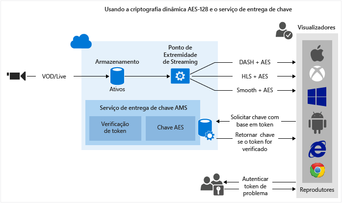

<properties 
	pageTitle="Visão geral sobre a proteção de conteúdo" 
	description="Este artigo fornece uma visão geral da proteção de conteúdo com os Serviços de Mídia." 
	services="media-services" 
	documentationCenter="" 
	authors="Juliako" 
	manager="dwrede" 
	editor=""/>

<tags 
	ms.service="media-services" 
	ms.workload="media" 
	ms.tgt_pltfrm="na" 
	ms.devlang="na" 
	ms.topic="article" 
	ms.date="02/02/2016" 
	ms.author="juliako"/>

#Visão geral sobre a proteção de conteúdo

Os Serviços de Mídia do Microsoft Azure permitem proteger a mídia desde o momento em que ela deixa computador e durante o armazenamento, processamento e entrega. Os Serviços de Mídia permitem distribuir o conteúdo criptografado dinamicamente com criptografia AES (usando chaves de criptografia de 128 bits) e CENC (criptografia comum) usando PlayReady e/ou Widevine DRM. Os serviços de mídia também fornecem um serviço de distribuição de chaves AES e licenças do PlayReady aos clientes autorizados. Você também pode usar os seguintes parceiros do AMS para ajudá-lo a fornecer licenças do Widevine: [Axinom](http://www.axinom.com/press/ibc-axinom-drm-6/), [EZDRM](http://ezdrm.com/) e [castLabs](http://castlabs.com/company/partners/azure/).

- A imagem a seguir demonstra o fluxo de trabalho de “criptografia comum dinâmica PlayReady e/ou Widevine DRM”. Para obter detalhes, consulte [Usando a PlayReady usando a criptografia comum dinâmica PlayReady e/ou Widevine DRM](media-services-protect-with-drm.md).

- A imagem a seguir demonstra o fluxo de trabalho de "criptografia dinâmica AES-128". Para mais detalhes, consulte [Usando criptografia dinâmica AES-128 e serviço de distribuição de chaves](media-services-protect-with-aes128.md).

>[AZURE.NOTE]Para poder usar criptografia dinâmica, primeiro é necessário obter pelo menos uma unidade reservada de streaming no ponto de extremidade de streaming do qual você deseja transmitir conteúdo criptografado.

##Conceitos

###Opções de criptografia de ativos

Dependendo do tipo de conteúdo que você deseja carregar, armazenar e fornecer, o Serviços de Mídia fornece várias opções de criptografia dentre as quais você pode escolher.

**None** - nenhuma criptografia é usada. Esse é o valor padrão. Observe que ao usar essa opção, seu conteúdo não é protegido quando está em trânsito ou em repouso no armazenamento.

Se você pretende enviar um MP4 usando o download progressivo, use essa opção para carregar seu conteúdo.

**StorageEncrypted** - use essa opção para criptografar seu conteúdo limpo localmente usando a criptografia AES de 256 bits e, em seguida, carregue-o para o armazenamento do Azure onde ele é armazenado, criptografado em rest. Ativos protegidos pela criptografia de armazenamento são descriptografados automaticamente e posicionados em um sistema de arquivos criptografado antes da codificação, então opcionalmente criptografados novamente antes do carregamento como um novo ativo de saída. O caso de uso primário para criptografia de armazenamento é quando você deseja proteger seus arquivos de mídia de entrada de alta qualidade com criptografia forte em repouso no disco.

Para entregar um ativo de armazenamento criptografado, você deve configurar a política de entrega do ativo para que o Serviços de Mídia saiba como você deseja distribuir seu conteúdo. Antes que seu ativo possa ser transmitido, o servidor de streaming remove a criptografia de armazenamento e transmite o conteúdo usando a política de distribuição especificada (por exemplo, AES, criptografia comum ou sem criptografia).

**CommonEncryptionProtected** - use esta opção se você desejar criptografar conteúdo (ou carregar conteúdo que já foi criptografado) com criptografia comum. PlayReady e Widewine são criptografados de acordo com a especificação de criptografia comum (CENC) e têm suporte pelo AMS.

**EnvelopeEncryptionProtected** – Use esta opção se você deseja proteger conteúdo (ou carregar conteúdo já protegido) HLS (HTTP Live Streaming) criptografado com AES. Observe que se você estiver carregando um HLS já criptografado com AES, ele deve ter sido criptografado com o Transform Manager.

###Criptografia dinâmica

Os Serviços de Mídia do Microsoft Azure permitem distribuir o conteúdo criptografado dinamicamente com criptografia AES ( usando chaves de criptografia de 128 bits) e PlayReady e/ou Widevine DRM.

Observe que, no momento, você pode criptografar o seguintes formatos de streaming: HLS, MPEG DASH, e Smooth Streaming. Você não pode criptografar o formato de streaming HDSou fazer o download progressivo.

Se você desejar que os Serviços de Mídia criptografem um ativo, você precisa associar uma chave de criptografia (CommonEncryption ou EnvelopeEncryption) ao ativo e também configurar políticas de autorização para a chave.

Você também precisa configurar a política de entrega do ativo. Se você deseja transmitir um ativo de armazenamento criptografado, certifique-se de especificar como deseja entregá-lo configurando a política de entrega de ativos.

Quando um fluxo é solicitado por um player, os Serviços de Mídia usam a chave especificada para criptografar dinamicamente o conteúdo usando a criptografia AES ou comum. Para descriptografar o fluxo, o player solicitará a chave do serviço de distribuição de chaves. Para decidir se o usuário está autorizado para obter a chave ou não, o serviço avalia as políticas de autorização que você especificou para a chave.

>[AZURE.NOTE]Para tirar proveito da criptografia dinâmica, você precisa obter primeiro pelo menos uma unidade de streaming OnDemand para o ponto de extremidade de streaming por meio do qual você planeja fornecer seu conteúdo criptografado. Para obter mais informações, consulte [Como dimensionar os Serviços de Mídia](media-services-manage-origins.md#scale_streaming_endpoints).

###Serviços de distribuição de licenças do PlayReady DRM e chaves não criptografadas AES

Os Serviços de Mídia também fornecem um serviço de distribuição de chaves e licenças do PlayReady aos clientes autorizados. Você pode usar o Portal Clássico do Azure, a API REST ou o SDK dos Serviços de Mídia para .NET para configurar políticas de autorização e autenticação para suas licenças e chaves.

Observe que se você estiver usando o Portal, você pode configurar uma política AES (que será aplicada a todo o conteúdo criptografado do AES) e uma política do PlayReady (que será aplicada a todo o conteúdo PlayReady criptografado). Use o SDK dos Serviços de Mídia para .NET se quiser mais controle sobre as configurações.

###Modelo de licença do PlayReady

Os Serviços de Mídia fornecem um serviço de distribuição de licenças do PlayReady. Quando o player de usuário final (por exemplo, Silverlight) tenta reproduzir o conteúdo protegido por PlayReady, uma solicitação é enviada para o serviço de entrega de licença para obtenção de uma. Se o serviço de licença aprova a solicitação, ele emite a licença que é enviada ao cliente e pode ser usada para descriptografar e reproduzir o conteúdo especificado.

As licenças contêm os direitos e restrições que você deseja que o tempo de execução do PlayReady DRM imponha quando um usuário está tentando reproduzir conteúdo protegido. Os Serviços de Mídia fornecem APIs que permitem que você configure suas licenças do PlayReady. Para obter mais informações, consulte [Visão geral do modelo de licença do PlayReady dos Serviços de Mídia](media-services-playready-license-template-overview).

###Restrição de token

A política de autorização de chave de conteúdo pode ter uma ou mais restrições de autorização: aberta ou restrição de token. A política restrita do token deve ser acompanhada por um token emitido por um Secure Token Service (STS). Os serviços de mídia oferecem suporte a tokens no formato Simple Web Tokens (SWT) e no formato JSON Web Token (JWT). Os serviços de mídia não fornecem Secure Token Services. Você pode criar um STS personalizado ou usar o Microsoft Azure ACS para emitir tokens. O STS deve ser configurado para criar um token assinado com as a chave especificada e declarações de emissão que você especificou na configuração de restrição do token. O serviço de distribuição de chaves dos Serviços de Mídia retornará a chave de criptografia para o cliente se o token for válido e as declarações no token corresponderem àquelas configuradas para a chave (ou licença).

Ao configurar a política restrita do token, você deve especificar os parâmetros da chave de verificação primária, emissor e audiência. A chave de verificação primária contém a chave que o token foi assinado, o emissor é o serviço de token seguro que emite o token. A audiência (às vezes chamada de escopo) descreve a intenção do token ou o recurso que o token autoriza o acesso. O serviço de distribuição de chaves dos serviços de mídia valida que esses valores no token correspondem aos valores no modelo.

###Widevine

O AMS também permite distribuir DASH MPEG criptografado com Widevine DRM. PlayReady e Widewine são criptografados de acordo com a especificação de criptografia comum (CENC). Você pode usar o [SDK do .NET AMS](https://www.nuget.org/packages/windowsazure.mediaservices/) (a partir da versão 3.5.1) ou a API REST para configurar seu AssetDeliveryConfiguration para usar o Widevine.

A partir da versão 3.5.2 do SDK do .NET dos Serviços de Mídia, os Serviços de Mídia permitem que você configure um modelo de licença do Widevine e obtenha licenças do Widevine. Você também pode usar os seguintes parceiros do AMS para ajudá-lo a fornecer licenças do Widevine: [Axinom](http://www.axinom.com/press/ibc-axinom-drm-6/), [EZDRM](http://ezdrm.com/) e [castLabs](http://castlabs.com/company/partners/azure/).

##Cenários comuns

###Proteger o conteúdo no armazenamento, fornecer mídia de streaming criptografada dinamicamente, usar chave AMS/serviço de entrega de licença

1. Ingerir um arquivo mezzanine de alta qualidade em um ativo. Aplique a opção de criptografia de armazenamento ao ativo.
2. Configure os pontos de extremidade de streaming.
1. Codifique para conjunto MP4 de taxa de bits adaptável. Aplique a opção de criptografia de armazenamento ao ativo de saída.
1. Crie uma chave de conteúdo de criptografia para o ativo que você quer que seja criptografado dinamicamente durante a reprodução.
2. Configure a política de autorização de chave de conteúdo.
1. Configure a política de entrega de ativos (usada pelo empacotamento dinâmico e criptografia dinâmica).
1. Publicar o ativo criando um localizador OnDemand.
1. Fluxo de conteúdo publicado.

###Usar o serviço de entrega de chave e licença do Serviço de Mídia com seus próprios serviços de criptografia e fluxo

Para obter mais informações, consulte [Como integrar o serviço de licença do Azure PlayReady a seu próprio criptografador/servidor de streaming](http://mingfeiy.com/integrate-azure-playready-license-service-encryptorstreaming-server).

###Integração com parceiros

[Usando o castLabs para fornecer licenças DRM para os serviços de mídia do Azure](media-services-castlabs-integration.md)

##Roteiros de aprendizagem dos Serviços de Mídia

[AZURE.INCLUDE [media-services-learning-paths-include](../../includes/media-services-learning-paths-include.md)]

##Fornecer comentários

[AZURE.INCLUDE [media-services-user-voice-include](../../includes/media-services-user-voice-include.md)]

##Links relacionados

[Anunciando o PlayReady como um serviço e a criptografia dinâmica AES com os Serviços de Mídia do Azure](http://mingfeiy.com/playready)

[Explicação dos preços de entrega da licença do PlayReady dos Serviços de Mídia do Azure](http://mingfeiy.com/playready-pricing-explained-in-azure-media-services)

[Como depurar para fluxo de criptografado AES nos Serviços de Mídia do Azure](http://mingfeiy.com/debug-aes-encrypted-stream-azure-media-services)

[Autenticação do token JWT](http://www.gtrifonov.com/2015/01/03/jwt-token-authentication-in-azure-media-services-and-dynamic-encryption/)

[Integrar o aplicativo do MVC OWIN dos serviços de mídia do Azure com base no aplicativo com Active Directory do Azure e restringir o fornecimento da chave de conteúdo com base em declarações JWT.](http://www.gtrifonov.com/2015/01/24/mvc-owin-azure-media-services-ad-integration/).

[Usar o ACS do Azure para emitir tokens](http://mingfeiy.com/acs-with-key-services).

[content-protection]: ./media/media-services-content-protection-overview/media-services-content-protection.png

<!---HONumber=AcomDC_0204_2016-->