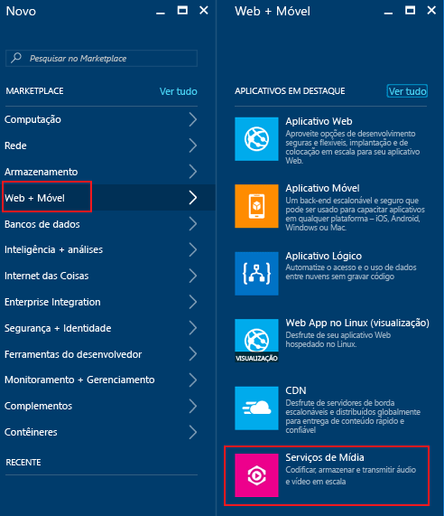
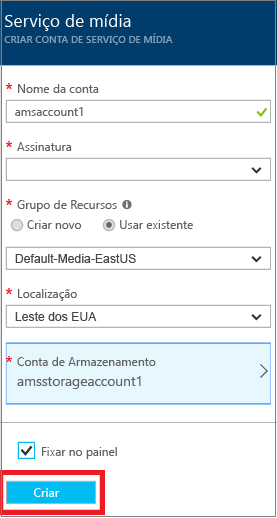

# Criar uma conta dos Serviços de Mídia do Azure usando o portal do Azure
> [!div class="op_single_selector"]
> * [Portal](media-services-portal-create-account.md)
> * [PowerShell](media-services-manage-with-powershell.md)
> * [REST](https://docs.microsoft.com/rest/api/media/mediaservice)
> 
> [!NOTE]
> Para concluir este tutorial, você precisa de uma conta do Azure. Para obter detalhes, consulte [Avaliação gratuita do Azure](https://azure.microsoft.com/pricing/free-trial/). 
> 
> 

O portal do Azure fornece uma maneira de criar rapidamente uma conta de Serviços de Mídia do Azure (AMS). Você pode usar sua conta para acessar os Serviços de Mídia que permitem que você armazene, criptografe, codifique, gerencie e transmita conteúdo de mídia no Azure. Quando você cria uma conta de Serviços de Mídia, você também cria uma conta de armazenamento associada (ou usa uma existente) na mesma região geográfica que a conta de Serviços de Mídia.

Este artigo explica alguns conceitos comuns e mostra como criar uma conta do Serviços de Mídia com o portal do Azure.

> [!NOTE]
> Para saber mais sobre a disponibilidade de recursos dos Serviços de Mídia do Azure em regiões diferentes, veja [disponibilidade de recursos do AMS em data centers](scenarios-and-availability.md#availability).

## Conceitos
O acesso aos Serviços de Mídia requer duas contas associadas:

* Uma conta dos Serviços de Mídia. Sua conta fornece acesso a um conjunto de Serviços de Mídia baseado na nuvem que está disponível no Azure. Uma conta de Serviços de Mídia não armazena o conteúdo de mídia real. Em vez disso, armazena metadados sobre o conteúdo de mídia e os trabalhos de processamento de mídia em sua conta. No momento em que cria a conta, você seleciona uma região de Serviços de Mídia disponível. A região selecionada é um data center que armazena os registros dos metadados de sua conta.
  
* Uma conta de armazenamento do Azure. As contas de armazenamento devem estar localizadas na mesma região geográfica que a conta dos Serviços de Mídia. Quando cria uma conta de Serviços de Mídia, você pode escolher uma conta de armazenamento existente na mesma região ou criar uma nova conta de armazenamento na mesma região. Se você excluir uma conta de Serviços de Mídia, os blobs em sua conta de armazenamento relacionada não serão excluídos.

  > [!NOTE]
  > O Serviços de Mídia restringe a conta de armazenamento principal para ser uma conta do **Armazenamento de Propósito Geral** com Tabelas, Filas. Para saber mais sobre os tipos de armazenamento, veja [Sobre as contas de armazenamento do Azure](https://docs.microsoft.com/azure/storage/common/storage-create-storage-account).

## Criar uma conta do AMS
As etapas nesta seção mostram como criar uma conta do AMS.

1. Faça logon no [Portal do Azure](https://portal.azure.com/).
2. Clique em **+ Novo** > **Web + Móvel** > **Serviços de Mídia**.
   
    
3. Em **CRIAR CONTA DOS SERVIÇOS DE MÍDIA** , insira os valores necessários.
   
    
   
   1. Em **Nome da Conta**, insira o nome da nova conta AMS. Um nome de conta de Serviços de Mídia deve ser composto de letras minúsculas ou números, sem espaços, e deve ter de 3 a 24 caracteres de comprimento.
   2. Em Assinatura, selecione uma das diferentes assinaturas do Azure às quais você tem acesso.
   3. Em **Grupo de Recursos**, selecione o recurso novo ou existente.  Um grupo de recursos é uma coleção de recursos que compartilham o ciclo de vida, as permissões e as políticas. Saiba mais [aqui](../azure-resource-manager/resource-group-overview.md#resource-groups).
   4. Em **Localização**, selecione a região geográfica que será usada para armazenar os registros de mídia e metadados para sua conta de Serviços de Mídia. Essa região será usada para processar e transmitir a mídia. Somente as regiões de Serviços de Mídia disponíveis são exibidas na caixa da lista suspensa. 
   5. Em **Conta de Armazenamento**, selecione uma conta de armazenamento para fornecer armazenamento de blobs do conteúdo de mídia de sua conta de Serviços de Mídia. Você pode selecionar uma conta de armazenamento existente na mesma região geográfica que sua conta de Serviços de Mídia ou criar uma conta de armazenamento. É criada uma nova conta de armazenamento na mesma região. As regras para nomes de contas de armazenamento são as mesmas que para contas de Serviços de Mídia.
      
       Saiba mais sobre o armazenamento [aqui](../storage/common/storage-introduction.md).
   6. Selecione **Fixar no painel** para ver o progresso da implantação da conta.
4. Clique em **Criar** na parte inferior do formulário.
   
    Quando a conta é criada com êxito, a página de visão geral é carregada. Na tabela de ponto de extremidade de streaming, a conta terá um ponto de extremidade de streaming padrão em estado **Parado**. 

    >[!NOTE]
    >Quando sua conta AMS é criada, um ponto de extremidade de streaming **padrão** é adicionado à sua conta em estado **Parado**. Para iniciar seu conteúdo de streaming e tirar proveito do empacotamento dinâmico e da criptografia dinâmica, o ponto de extremidade de streaming do qual você deseja transmitir o conteúdo deve estar em estado **Executando**. 
   
## Para gerenciar sua conta do AMS

Para gerenciar sua conta do AMS (por exemplo, conectar-se à API do AMS programaticamente, carregar vídeos, codificar ativos, configurar a proteção de conteúdo, monitorar o andamento do trabalho), selecione **Configurações** no lado esquerdo do portal. De **Configurações**, navegue até uma das folhas disponíveis (por exemplo: **Acesso à API**, **Ativos**, **Trabalhos**, **Proteção de conteúdo**).

## Próximas etapas

Agora você pode carregar arquivos em sua conta do AMS. Para saber mais, veja [Carregar arquivos](media-services-portal-upload-files.md).

Se você planeja acessar a API do AMS programaticamente, veja [Acessar a API dos Serviços de Mídia do Azure com a autenticação do Azure AD](media-services-use-aad-auth-to-access-ams-api.md).

## Roteiros de aprendizagem dos Serviços de Mídia
[!INCLUDE [media-services-learning-paths-include](../../includes/media-services-learning-paths-include.md)]

## Fornecer comentários
[!INCLUDE [media-services-user-voice-include](../../includes/media-services-user-voice-include.md)]

