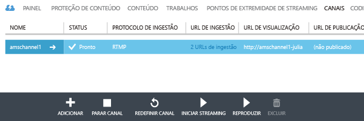
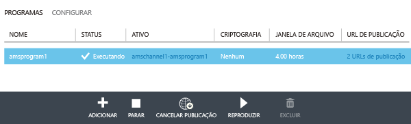
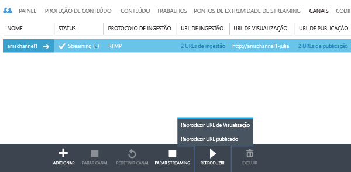
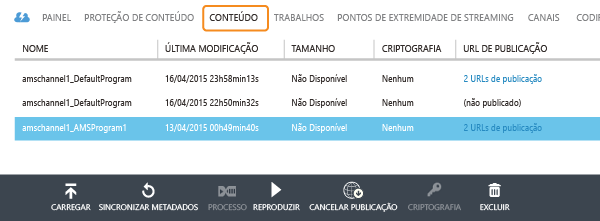

<properties 
	pageTitle="Use o Portal de Gerenciamento para criar canais que realizam codificação ao vivo de um fluxo com taxa de bits única para fluxo múltiplas taxas de bits" 
	description="Este tutorial orienta você pelas etapas de criação de um Canal que recebe um fluxo ao vivo de taxa de bits única e o codifica em fluxo de múltiplas taxas de bits." 
	services="media-services" 
	documentationCenter="" 
	authors="Juliako" 
	manager="dwrede" 
	editor=""/>

<tags 
	ms.service="media-services" 
	ms.workload="media" 
	ms.tgt_pltfrm="na" 
	ms.devlang="ne" 
	ms.topic="article" 
	ms.date="05/27/2015" 
	ms.author="juliako"/>

#Use o Portal de Gerenciamento para criar canais que realizam codificação ao vivo de um fluxo com taxa de bits única para fluxo múltiplas taxas de bits (Visualização)

> [AZURE.SELECTOR]
- [Portal](media-services-portal-creating-live-encoder-enabled-channel.md)
- [.NET SDK](media-services-dotnet-creating-live-encoder-enabled-channel.md)
- [REST API](https://msdn.microsoft.com/library/azure/dn783458.aspx)

Este tutorial orienta você pelas etapas de criação de um **Canal** que recebe um fluxo ao vivo de taxa de bits única e o codifica em fluxo de múltiplas taxas de bits.

>[AZURE.NOTE]Para obter mais informações conceituais relacionadas aos canais habilitados para codificação ao vivo, consulte [Trabalhando com canais que executam codificação ao vivo de um fluxo de taxa de bits única para fluxo de múltiplas taxas de bits](media-services-manage-live-encoder-enabled-channels.md).

##Cenário comum de streaming ao vivo

A seguir, as etapas gerais envolvidas na criação de aplicativos comuns de streaming ao vivo.

1. Conecte uma câmera de vídeo a um computador. Inicie e configure um codificador ao vivo local que possa produzir um fluxo de taxa de bits única em um dos seguintes protocolos: RTMP, Smooth Streaming ou RTP (MPEG-TS). Para obter mais informações, consulte [Suporte RTMP dos Serviços de Mídia do Azure e Codificadores ao Vivo](http://go.microsoft.com/fwlink/?LinkId=532824).
	
	Essa etapa também pode ser realizada após a criação do canal.

1. Crie e inicie um Canal.

1. Recupere a URL de ingestão do canal.

	A URL de ingestão é usada pelo codificador ao vivo para enviar o fluxo para o canal.
1. Recupere a URL de visualização do canal. 

	Use essa URL para verificar se o canal está recebendo corretamente o fluxo ao vivo.

3. Crie um programa (que também criará um ativo).
1. Publica o programa (que vai criar um localizador OnDemand para o ativo associado).  

	Certifique-se de ter pelo menos uma unidade reservada para streaming no ponto de extremidade de streaming por meio do qual você deseja transmitir o conteúdo.
1. Inicie o programa quando estiver pronto para iniciar o streaming e o arquivamento.
2. Opcionalmente, o codificador ao vivo pode ser sinalizado para iniciar um anúncio. O anúncio é inserido no fluxo de saída.
1. Interrompa o programa sempre que você deseja parar o streaming e o arquivamento do evento.
1. Exclua o programa (e, opcionalmente, exclua o ativo).   

##Neste tutorial

Neste tutorial, o Portal de Gerenciamento é usado para realizar as seguintes tarefas:

2.  Configure os pontos de extremidade de streaming.
3.  Crie um canal que esteja habilitado para realizar a codificação ao vivo.
1.  Obtenha a URL de ingestão para fornecê-la ao codificador ao vivo. O codificador ao vivo usará essa URL para receber o fluxo para o canal.
1.  Criar um programa (e um ativo)
1.  Publicar o ativo e obter URLs de streaming  
1.  Reproduzir o conteúdo 
2.  Limpando

##Pré-requisitos
Os itens a seguir são necessários para concluir o tutorial.

- Para concluir este tutorial, você precisa de uma conta do Azure. Se você não tiver uma conta, poderá criar uma conta de avaliação gratuita em apenas alguns minutos. Para obter detalhes, consulte [Avaliação gratuita do Azure](azure.microsoft.com).
- Uma conta dos Serviços de Mídia. Para criar uma conta de Serviços de Mídia, consulte [Criar Conta](media-services-create-account.md).
- Uma webcam e um codificador que possa enviar um fluxo ao vivo de taxa de bits única.

##Configurar ponto de extremidade de streaming usando o Portal

Ao trabalhar com os Serviços de Mídia do Azure, um dos cenários mais comuns é fornecer streaming com taxa de bits adaptável aos clientes dos Serviços de Mídia do Azure. Com streaming de taxa de bits adaptável, o cliente pode alternar para um fluxo de taxa de bits maior ou menor, já que o vídeo é exibido com base na largura de banda de rede atual, a utilização da CPU e outros fatores. Os Serviços de Mídia dão suporte às seguintes tecnologias de streaming com taxa de bits adaptável: HTTP Live Streaming (HLS), Smooth Streaming, MPEG DASH e HDS (apenas para licenciados Adobe PrimeTime/Access).

Ao trabalhar com a transmissão ao vivo, um codificador ao vivo local (no nosso caso Wirecast) recebe uma transmissão ao vivo com múltiplas taxas de bits em seu canal. Quando o fluxo é solicitado por um usuário, o Serviços de Mídia usa empacotamento dinâmico para empacotar novamente o fluxo de origem no fluxo de taxa de bits adaptável solicitado (HLS, DASH ou Smooth).

Para tirar proveito do empacotamento dinâmico, você precisa obter pelo menos uma unidade de streaming para o **ponto de extremidade** de streaming por meio do qual você planeja fornecer seu conteúdo.

Para alterar o número de unidades reservadas para streaming, faça o seguinte:

1. No [Portal de Gerenciamento](https://manage.windowsazure.com/), clique em **Serviços de Mídia**. Em seguida, clique no nome do serviço de mídia.

2. Selecione a página de PONTOS DE EXTREMIDADE DE STREAMING. Então, clique no ponto de extremidade que deseja modificar.

3. Para especificar o número de unidades de streaming, selecione a guia ESCALA e mova o controle deslizante **capacidade reservada**.

	

4. Pressione o botão SALVAR para salvar as alterações.

	A alocação de quaisquer novas unidades de streaming leva cerca de 20 minutos para ser concluída.

	 
	>[AZURE.NOTE]No momento, mudar de qualquer valor positivo de unidades de streaming de volta para nenhuma unidade pode desabilitar o streaming por até uma hora.
	>
	> O número mais alto de unidades especificadas para o período de 24 horas é usado para calcular o custo. Para obter informações sobre os detalhes de preços, consulte [Detalhes de preços dos Serviços de Mídia](http://go.microsoft.com/fwlink/?LinkId=275107).

 
##Criar um CANAL

1.	No [Portal de Gerenciamento](http://manage.windowsazure.com/), clique em Serviços de Mídia e no nome da conta dos Serviços de Mídia.
2.	Selecione a página CANAIS.
3.	Selecione Adicionar+ para adicionar um novo canal.

Escolha tipos de codificação **Padrão**. Esse tipo especifica que você deseja criar um canal que esteja habilitado para codificação ao vivo. Isso significa que a entrada fluxo com taxa de bits única é enviado para o canal e codificado em um fluxo com múltiplas taxas de bits usando configurações do codificador ao vivo especificado. Para obter mais informações, consulte [Trabalhando com canais que realizam codificação ao vivo por meio de um fluxo com taxa de bits única para fluxo com múltiplas taxas de bits](media-services-manage-live-encoder-enabled-channels.md).

![standard0][standard0]

Para o tipo de codificação **Padrão**, as opções de protocolo de ingestão válidas são:

- MP4 fragmentado de taxa de bits única (Smooth Streaming)
- RTMP de taxa de bits única
- RTP (MPEG-TS): fluxo de transporte de MPEG-2 por RTP.

Para obter explicações detalhadas sobre cada protocolo, consulte [Trabalhando com canais que realizam codificação ao vivo por meio de um fluxo com taxa de bits única para fluxo com múltiplas taxas de bits](media-services-manage-live-encoder-enabled-channels.md).

![standard1][standard1]

Você não pode alterar o protocolo de entrada enquanto o canal ou seus programas associados estão em execução. Se você precisar de protocolos diferentes, você deve criar canais separados para cada protocolo de entrada.

Na página **Configuração de publicidade**, você pode especificar a origem para sinais de marcadores de anúncio. Ao usar o Portal você pode selecionar apenas API, que indica que o codificador ao vivo no canal deve escutar buscando um API de marcador de anúncio assíncrono. Ao usar o Portal, você só pode selecionar API.

Para obter mais informações, consulte [Trabalhando com canais que realizam codificação ao vivo por meio de um fluxo com taxa de bits única para fluxo com múltiplas taxas de bits](media-services-manage-live-encoder-enabled-channels.md).

![standard2][standard2]

Na página **Predefinição de codificação**, você pode selecionar as predefinições do sistema. Atualmente, o único sistema de predefinição que você pode selecionar é **Padrão 720p**.

![standard3][standard3]

Na página **Criação de canal**, você pode definir os endereços IP que têm permissão para publicar vídeo nesse canal. Os endereços IP permitidos podem ser especificados como um endereço IP individual (por exemplo, '10.0.0.1'), um intervalo de IPs usando um endereço IP e uma máscara de sub-rede CIDR (por exemplo, ‘10.0.0.1/22’), ou um intervalo de IPs usando um endereço IP e uma máscara de sub-rede decimal com pontos (por exemplo, ‘10.0.0.1(255.255.252.0)’).

Se nenhum endereço IP for especificado e não houver definição de regra, nenhum endereço IP será permitido. Para permitir qualquer endereço IP, crie uma regra e defina 0.0.0.0/0.

![standard4][standard4]

>[AZURE.NOTE]Atualmente na visualização, a inicialização do canal pode levar até 30 minutos. A redefinição de canal pode levar até 5 minutos.

Uma vez criado o canal, você pode selecionar a guia **CODIFICADOR**, onde você pode exibir as configurações de canais. Você também pode gerenciar slates e anúncios.

![standard5][standard5]

Para obter mais informações, consulte [Trabalhando com canais que realizam codificação ao vivo por meio de um fluxo com taxa de bits única para fluxo com múltiplas taxas de bits](media-services-manage-live-encoder-enabled-channels.md).

##Obter URLs de ingestão

Depois que o canal é criado, você pode obter URLs de ingestão que você fornecerá ao codificador ao vivo. O codificador usa essas URLs para gerar entrada de um fluxo ao vivo.

##Criar e gerenciar um programa

###Visão geral

Um canal é associado a programas que permitem que você controle a publicação e o armazenamento de segmentos em um fluxo ao vivo. Canais gerenciam programas. A relação entre canal e programa é muito semelhante à mídia tradicional, onde um canal tem um fluxo constante de conteúdo e um programa tem como escopo algum evento programado naquele canal.

Você pode especificar o número de horas pelo qual você deseja manter o conteúdo gravado para o programa, definindo a duração da **Janela de Arquivo**. Esse valor pode ser definido entre um mínimo de 5 minutos e um máximo de 25 horas. A duração da janela de arquivo também determina que a quantidade máxima de tempo que os clientes podem pesquisar na posição atual em tempo real. Os programas podem ser executados pelo período de tempo especificado, mas o conteúdo que estiver por trás da janela de tamanho será continuamente descartado. Esse valor desta propriedade também determina por quanto tempo os manifestos do cliente podem crescer.

Cada programa está associado um ativo. Para publicar o programa, você precisa criar um localizador OnDemand para o ativo associado. Ter esse localizador permitirá que você crie uma URL de transmissão que você pode fornecer aos seus clientes.

Um canal dá suporte a até três programas em execução simultânea, para que você possa criar diversos arquivos no mesmo fluxo de entrada. Isso permite que você publique e arquive diferentes partes de um evento, conforme necessário. Por exemplo, o requisito de negócios é arquivar 6 horas de um programa, mas transmitir apenas os últimos 10 minutos. Para fazer isso, você precisa criar dois programas em execução simultânea. Um programa é definido para arquivar 6 horas do evento, mas o programa não é publicado. Outro programa é definido para 10 minutos e esse programa é publicado.

Você não deve reutilizar os programas existentes para novos eventos. Em vez disso, crie e inicie um novo programa para cada evento, conforme descrito na seção Programação de aplicativos de streaming ao vivo.

Inicie o programa quando estiver pronto para iniciar o streaming e o arquivamento. Interrompa o programa sempre que você deseja parar o streaming e o arquivamento do evento.

Para excluir o conteúdo arquivado, interrompa e exclua o programa e, em seguida, exclua o ativo associado. Não é possível excluir um ativo se este for usado por um programa; o programa deve ser excluído primeiro.

Mesmo depois que você parar e excluir o programa, os usuários poderão transmitir seu conteúdo arquivado como vídeo por demanda enquanto você não excluir o ativo.

Se desejar manter o conteúdo arquivado mas ele não está disponível para streaming, exclua o localizador de streaming.

###Criar/iniciar/interromper programas

Uma vez que o fluxo está fluindo para o canal, você pode começar o evento de transmissão criando um ativo, programa e localizador de Streaming. Isso vai arquivar o fluxo e torná-lo disponível para usuários por meio do ponto de extremidade de Streaming.

Há duas maneiras de começar o evento:

1. Na página **CANAL**, pressione **ADICIONAR** para adicionar um novo programa.

	Especifique: nome do programa, nome do ativo, janela de arquivo e opção de criptografia.
	
	
	
	Se você deixou **Publicar este programa agora** marcada, o programa PUBLICANDO URLS será criado.
	
	Você pode pressionar **INICIAR** sempre que você estiver pronto para transmitir o programa.

	Depois de iniciar o programa, você pode pressionar REPRODUZIR para iniciar a reprodução do conteúdo.

	

2. Como alternativa, você pode usar um atalho e pressionar o botão **INICIAR STREAMING** na página **CANAL**. Isso criará um ativo, programa e localizador de Streaming.

	O programa é chamado DefaultProgram e a janela de arquivo é definida como 1 hora.

	Você pode executar o programa publicado da página CANAL.

	

Se você clicar em **PARAR STREAMING** na página **CANAL**, o programa padrão será interrompido e excluído. O ativo ainda estará lá e você pode publicá-lo ou cancelar sua publicação na página **CONTEÚDO**.

Se você alternar para a página **CONTEÚDO**, você verá os ativos que foram criados para os programas.

##Reprodução de conteúdo

Para fornecer a seu usuário uma URL que possa ser usada para transmitir seu conteúdo, você precisa primeiro "publicar" seu ativo (conforme descrito na seção anterior), criando um localizador (quando você publica um ativo usando o Portal, os localizadores são criados para você). Os localizadores fornecem acesso aos arquivos contidos no ativo.

Dependendo de qual protocolo de transmissão você deseja usar para reproduzir o conteúdo, talvez seja necessário modificar a URL obtida pelo link **PUBLICAR URL** do canal\programa.

O empacotamento dinâmico se encarregará do empacotamento do fluxo ao vivo para o protocolo especificado.

Por padrão, uma URL de transmissão tem o formato a seguir, e você pode usá-la para reproduzir ativos de Smooth Streaming:

	{streaming endpoint name-media services account name}.streaming.mediaservices.windows.net/{locator ID}/{filename}.ism/Manifest

Para criar uma URL de streaming HLS, anexe (format=m3u8-aapl) à URL.

	{streaming endpoint name-media services account name}.streaming.mediaservices.windows.net/{locator ID}/{filename}.ism/Manifest(format=m3u8-aapl)

Para criar uma URL de streaming MPEG DASH, anexe (format=mpd-time-csf) à URL.

	{streaming endpoint name-media services account name}.streaming.mediaservices.windows.net/{locator ID}/{filename}.ism/Manifest(format=mpd-time-csf)

Para obter mais informações sobre o fornecimento do seu conteúdo, consulte [Fornecimento de conteúdo](media-services-deliver-content-overview.md).

Você pode reproduzir Smooth Stream usando o [AMS Player](http://amsplayer.azurewebsites.net/azuremediaplayer.html) ou usar dispositivos iOS e Android para reproduzir HLS versão 3.

##Limpar

Se você tiver terminado o fluxo de eventos e deseja limpar os recursos provisionados anteriormente, siga o procedimento a seguir.

- Pare de enviar o fluxo por push por meio do codificador.
- Pare o canal. Depois que o canal estiver parado, ele não incorrerá em nenhum encargo. Quando for necessário iniciá-lo novamente ele terá a mesma URL de ingestão, portanto, você não precisará reconfigurar seu codificador.
- Você pode parar seu ponto de extremidade de Streaming, a menos que você deseje continuar a fornecer o arquivo morto do evento ao vivo como um fluxo sob demanda. Se o canal estiver no estado Parado, ele não incorrerá em nenhum encargo.
  

[standard0]: ./media/media-services-portal-creating-live-encoder-enabled-channel/media-services-create-channel-standard0.png
[standard1]: ./media/media-services-portal-creating-live-encoder-enabled-channel/media-services-create-channel-standard1.png
[standard2]: ./media/media-services-portal-creating-live-encoder-enabled-channel/media-services-create-channel-standard2.png
[standard3]: ./media/media-services-portal-creating-live-encoder-enabled-channel/media-services-create-channel-standard3.png
[standard4]: ./media/media-services-portal-creating-live-encoder-enabled-channel/media-services-create-channel-standard4.png
[standard5]: ./media/media-services-portal-creating-live-encoder-enabled-channel/media-services-create-channel-standard_encode.png

<!---HONumber=62-->