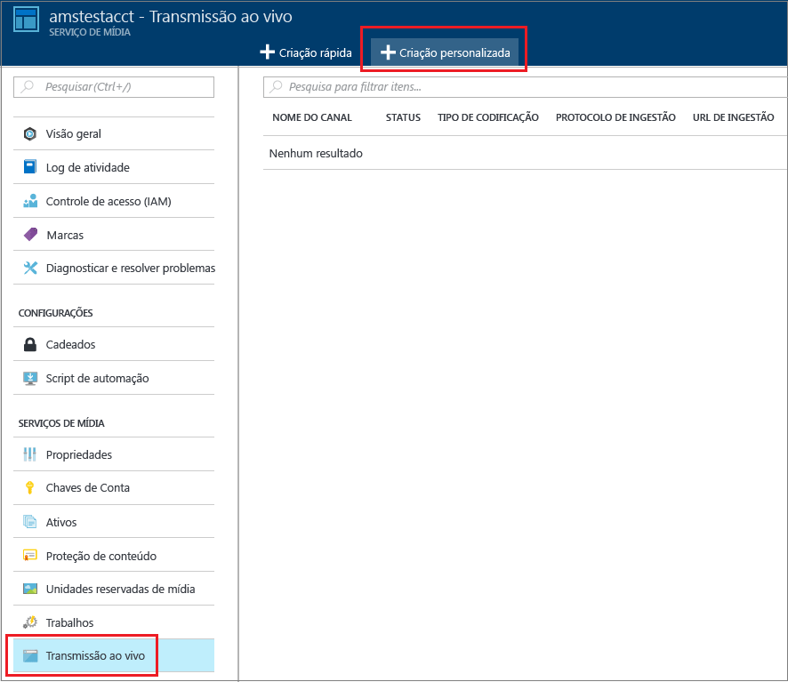
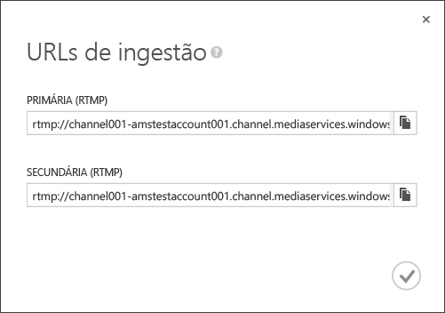
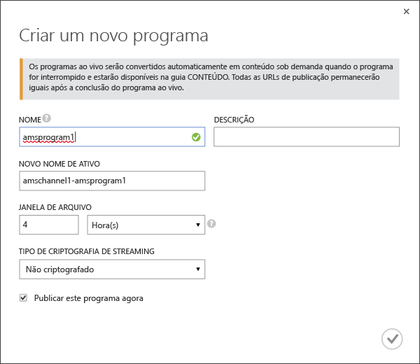
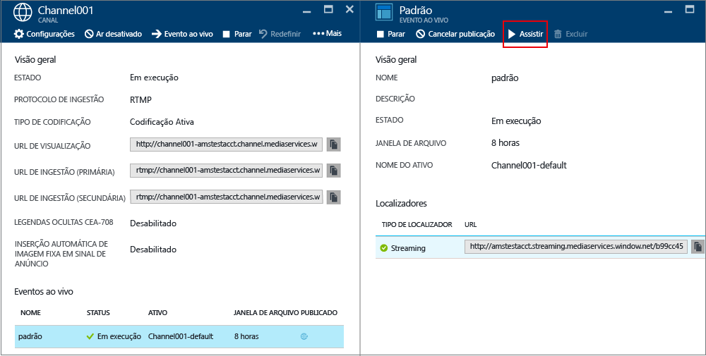
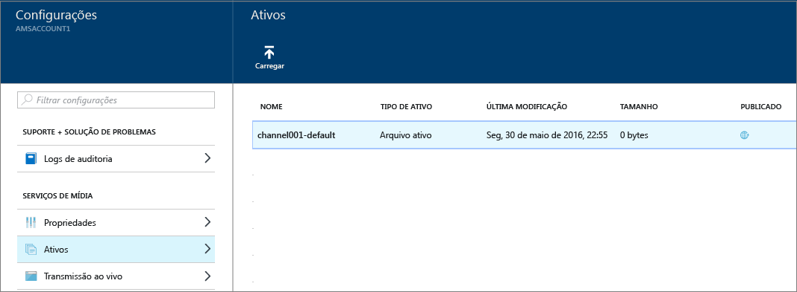

# Como executar a transmissão ao vivo usando os Serviços de Mídia do Azure para criar fluxos de múltiplas taxas de bits com o Portal do Azure
> [!div class="op_single_selector"]
> * [Portal](media-services-portal-creating-live-encoder-enabled-channel.md)
> * [.NET](media-services-dotnet-creating-live-encoder-enabled-channel.md)
> * [API REST](https://docs.microsoft.com/rest/api/media/operations/channel)
> 
> 

Este tutorial orienta você pelas etapas de criação de um **Canal** que recebe um fluxo ao vivo de taxa de bits única e o codifica em fluxo de múltiplas taxas de bits.

> [!NOTE]
> Para obter mais informações conceituais relacionadas aos Canais habilitados para a codificação ao vivo, consulte [Transmissão ao vivo usando os Serviços de Mídia do Azure para criar fluxos de múltiplas taxas de bits](media-services-manage-live-encoder-enabled-channels.md).
> 
> 

## Cenário comum de streaming ao vivo
A seguir, as etapas gerais envolvidas na criação de aplicativos comuns de streaming ao vivo.

> [!NOTE]
> Atualmente, a duração máxima recomendada de um evento ao vivo é de 8 horas. Entre em contato com amslived na Microsoft.com se precisar executar um Canal por períodos mais longos.
> 
> 

1. Conecte uma câmera de vídeo a um computador. Inicie e configure um codificador ao vivo local que possa produzir um fluxo de taxa de bits única em um dos seguintes protocolos: RTMP, Smooth Streaming ou RTP (MPEG-TS). Para obter mais informações, consulte [Suporte RTMP dos Serviços de Mídia do Azure e Codificadores ao Vivo](http://go.microsoft.com/fwlink/?LinkId=532824).
   
    Essa etapa também pode ser realizada após a criação do canal.
2. Crie e inicie um Canal. 
3. Recupere a URL de ingestão do canal. 
   
    A URL de ingestão é usada pelo codificador ao vivo para enviar o fluxo para o canal.
4. Recupere a URL de visualização do canal. 
   
    Use essa URL para verificar se o canal está recebendo corretamente o fluxo ao vivo.
5. Crie um evento/programa (que também criará um ativo). 
6. Publica o evento (que vai criar um localizador OnDemand para o ativo associado).    
7. Inicie o evento quando estiver pronto para começar a transmissão e o arquivamento.
8. Opcionalmente, o codificador ao vivo pode ser sinalizado para iniciar um anúncio. O anúncio é inserido no fluxo de saída.
9. Interrompa o evento sempre que você quiser parar a transmissão e o arquivamento do evento.
10. Exclua o evento (e, opcionalmente, exclua o ativo).   

## Neste tutorial
Neste tutorial, o portal do Azure é usado para realizar as seguintes tarefas: 

1. Crie um canal que esteja habilitado para realizar a codificação ao vivo.
2. Obtenha a URL de ingestão para fornecê-la ao codificador ao vivo. O codificador ao vivo usará essa URL para receber o fluxo para o canal.
3. Criar um evento/programa (e um ativo).
4. Publicar o ativo e obter URLs de streaming.  
5. Reproduzir o conteúdo.
6. Limpar.

## Pré-requisitos
Os itens a seguir são necessários para concluir o tutorial.

* Para concluir este tutorial, você precisa de uma conta do Azure. Se você não tiver uma conta, poderá criar uma conta de avaliação gratuita em apenas alguns minutos. 
  Para obter detalhes, consulte [Avaliação gratuita do Azure](https://azure.microsoft.com/pricing/free-trial/).
* Uma conta dos Serviços de Mídia. Para criar uma conta de Serviços de Mídia, confira [Criar Conta](media-services-portal-create-account.md).
* Uma webcam e um codificador que possa enviar um fluxo ao vivo de taxa de bits única.

## Criar um CANAL
1. No [Portal do Azure](https://portal.azure.com/), selecione Serviços de Mídia e clique no nome da conta dos Serviços de Mídia.
2. Escolha **Transmissão ao Vivo**.
3. Escolha **Criação personalizada**. Essa opção permitirá a criação de um canal habilitado para codificação ativa.
   
    
4. Clique em **Configurações**.
   
   1. Escolha o tipo de canal **Codificação Ativa** . Esse tipo especifica que você deseja criar um canal que esteja habilitado para codificação ao vivo. Isso significa que a entrada fluxo com taxa de bits única é enviado para o canal e codificado em um fluxo com múltiplas taxas de bits usando configurações do codificador ao vivo especificado. Para obter mais informações, consulte [Transmissão ao vivo usando os Serviços de Mídia do Azure para criar fluxos de múltiplas taxas de bits](media-services-manage-live-encoder-enabled-channels.md). Clique em OK.
   2. Especifique o nome do canal.
   3. Clique em OK na parte inferior da tela.
5. Selecione a guia **Ingestão** .
   
   1. Nessa página, você pode selecionar um protocolo de streaming. Para o tipo de canal **Codificação Ativa** , as opções de protocolo válidas são:
      
      * MP4 fragmentado de taxa de bits única (Smooth Streaming)
      * RTMP de taxa de bits única
      * RTP (MPEG-TS): fluxo de transporte de MPEG-2 por RTP.
        
        Para obter explicações detalhadas sobre cada protocolo, consulte [Transmissão ao vivo usando os Serviços de Mídia do Azure para criar fluxos de múltiplas taxas de bits](media-services-manage-live-encoder-enabled-channels.md).
        
        Você não pode alterar a opção de protocolo enquanto o Canal ou seus eventos/programas associados estão em execução. Se você precisar de protocolos diferentes, crie canais separados para cada protocolo de streaming.  
   2. Você pode aplicar a restrição de IP na ingestão. 
      
       Você pode definir os endereços IP que têm permissão para ingerir vídeo nesse canal. Os endereços IP permitidos podem ser especificados como um endereço IP individual (por exemplo, '10.0.0.1'), um intervalo de IPs usando um endereço IP e uma máscara de sub-rede CIDR (por exemplo, ‘10.0.0.1/22’), ou um intervalo de IPs usando um endereço IP e uma máscara de sub-rede decimal com pontos (por exemplo, '10.0.0.1(255.255.252.0)').
      
       Se nenhum endereço IP for especificado e não houver definição de regra, nenhum endereço IP será permitido. Para permitir qualquer endereço IP, crie uma regra e defina 0.0.0.0/0.
6. Na guia **Visualização** , aplique a restrição de IP na visualização.
7. Na guia **Codificação** , especifique a predefinição de codificação. 
   
    Atualmente, o único sistema de predefinição que você pode selecionar é **Padrão 720p**. Para especificar uma predefinição personalizada, abra um tíquete de suporte da Microsoft. Em seguida, insira o nome da predefinição criada para você. 

> [!NOTE]
> Atualmente, a inicialização do Canal pode levar até 30 minutos. A redefinição de canal pode levar até 5 minutos.
> 
> 

Após a criação do Canal, clique no canal e selecione **Configurações**. Nesse local você pode exibir as configurações de seus canais. 

Para obter mais informações, consulte [Transmissão ao vivo usando os Serviços de Mídia do Azure para criar fluxos de múltiplas taxas de bits](media-services-manage-live-encoder-enabled-channels.md).

## Obter URLs de ingestão
Depois que o canal é criado, você pode obter URLs de ingestão que você fornecerá ao codificador ao vivo. O codificador usa essas URLs para gerar entrada de um fluxo ao vivo.

## Criar e gerenciar eventos
### Visão geral
Um canal é associado a eventos/programas que permitem que você controle a publicação e o armazenamento de segmentos em um fluxo ao vivo. Os canais gerenciam os eventos/programas. A relação entre canal e programa é muito semelhante à mídia tradicional, onde um canal tem um fluxo constante de conteúdo e um programa tem como escopo algum evento programado naquele canal.

Você pode especificar o número de horas pelo qual você deseja manter o conteúdo gravado para o evento, definindo a duração da **Janela de Arquivo** . Esse valor pode ser definido entre um mínimo de 5 minutos e um máximo de 25 horas. A duração da janela de arquivo também determina que a quantidade máxima de tempo que os clientes podem pesquisar na posição atual em tempo real. Os eventos podem ser executados no período de tempo especificado, mas o conteúdo que ficar para trás no comprimento da janela será continuamente descartado. Esse valor desta propriedade também determina por quanto tempo os manifestos do cliente podem crescer.

Cada evento está associado um Ativo. Para publicar o evento, você precisa criar um localizador OnDemand para o ativo associado. Ter esse localizador permitirá que você crie uma URL de transmissão que você pode fornecer aos seus clientes.

Um canal dá suporte a até três eventos em execução simultânea para que você possa criar diversos arquivos no mesmo fluxo de entrada. Isso permite que você publique e arquive diferentes partes de um evento, conforme necessário. Por exemplo, o requisito de negócios é arquivar 6 horas de um evento, mas transmitir apenas os últimos 10 minutos. Para fazer isso, você precisa criar dois eventos em execução simultânea. Um evento é definido para arquivar 6 horas do evento, mas o programa não é publicado. Outro evento é definido para 10 minutos e esse programa é publicado.

Você não deve reutilizar os programas existentes para novos eventos. Em vez disso, crie e inicie um novo programa para cada evento.

Inicie um evento/programa quando estiver pronto para iniciar a transmissão e o arquivamento. Interrompa o evento sempre que você quiser parar a transmissão e o arquivamento do evento. 

Para excluir o conteúdo arquivado, interrompa e exclua o evento, em seguida, exclua o ativo associado. Não será possível excluir um ativo se este for usado pelo evento; o evento deve ser excluído primeiro. 

Mesmo depois de você parar e excluir o evento, os usuários poderão transmitir seu conteúdo arquivado como vídeo por demanda enquanto você não excluir o ativo.

Se desejar manter o conteúdo arquivado mas ele não está disponível para streaming, exclua o localizador de streaming.

### Criar/iniciar/interromper eventos
Uma vez que o fluxo está fluindo para o canal, você pode começar o evento de transmissão criando um ativo, programa e localizador de Streaming. Isso vai arquivar o fluxo e torná-lo disponível para usuários por meio do ponto de extremidade de Streaming. 

>[!NOTE]
>Quando sua conta AMS é criada, um ponto de extremidade de streaming **padrão** é adicionado à sua conta em estado **Parado**. Para iniciar seu conteúdo de streaming e tirar proveito do empacotamento dinâmico e da criptografia dinâmica, o ponto de extremidade de streaming do qual você deseja transmitir o conteúdo deve estar em estado **Executando**. 

Há duas maneiras de começar o evento: 

1. Na página **Canal**, pressione **Evento Ativo** para adicionar um novo evento.
   
    Especifique: nome do evento, nome do ativo, janela de arquivo e opção de criptografia.
   
    
   
    Se você deixou a opção **Publicar este evento ao vivo agora** marcada, o evento PUBLICANDO URLS será criado.
   
    Você pode pressionar **Iniciar**sempre que estiver pronto para transmitir o evento.
   
    Depois de iniciar o evento, você pode pressionar **Assistir** para iniciar a reprodução do conteúdo.
2. Como alternativa, você pode usar um atalho e pressionar o botão **Ativar** na página **Canal**. Isso criará um Ativo, Programa e Localizador de Streaming padrão.
   
    O evento é chamado **default** e a janela de arquivo é definida como oito horas.

Você pode assistir ao evento publicado na página **Evento ativo** . 

Se você clicar em **Fora do ar**, todos os eventos ativos serão interrompidos. 

## Assistir ao evento
Para assistir o evento, clique em **Assistir** no portal do Azure ou copie a URL de transmissão e use um player de sua escolha. 

O evento ativo é convertido automaticamente em conteúdo sob demanda quando é interrompido.

## Limpar
Se você tiver terminado o fluxo de eventos e deseja limpar os recursos provisionados anteriormente, siga o procedimento a seguir.

* Pare de enviar o fluxo por push por meio do codificador.
* Pare o canal. Depois que o canal estiver parado, ele não incorrerá em nenhum encargo. Quando for necessário iniciá-lo novamente ele terá a mesma URL de ingestão, portanto, você não precisará reconfigurar seu codificador.
* Você pode parar seu ponto de extremidade de Streaming, a menos que você deseje continuar a fornecer o arquivo morto do evento ao vivo como um fluxo sob demanda. Se o canal estiver no estado Parado, ele não incorrerá em nenhum encargo.

## Exibir conteúdo arquivado
Mesmo depois de você parar e excluir o evento, os usuários poderão transmitir seu conteúdo arquivado como vídeo por demanda enquanto você não excluir o ativo. Não será possível excluir um ativo se este for usado por um evento; o evento deve ser excluído primeiro. 

Para gerenciar os ativos, selecione **Configuração** e clique em **Ativos**.

## Considerações
* Atualmente, a duração máxima recomendada de um evento ao vivo é de 8 horas. Entre em contato com amslived na Microsoft.com se precisar executar um Canal por períodos mais longos.
* Verifique se o ponto de extremidade de streaming do qual você deseja transmitir seu conteúdo está no estado **Executando**.

## Próxima etapa
Revise os roteiros de aprendizagem dos Serviços de Mídia.

[!INCLUDE [media-services-learning-paths-include](../../includes/media-services-learning-paths-include.md)]

## Fornecer comentários
[!INCLUDE [media-services-user-voice-include](../../includes/media-services-user-voice-include.md)]

