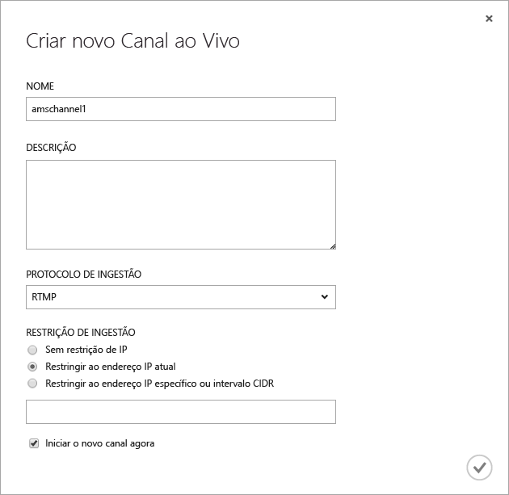
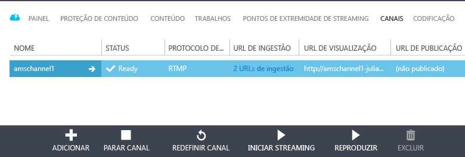
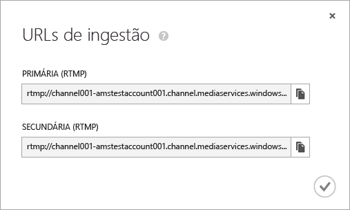
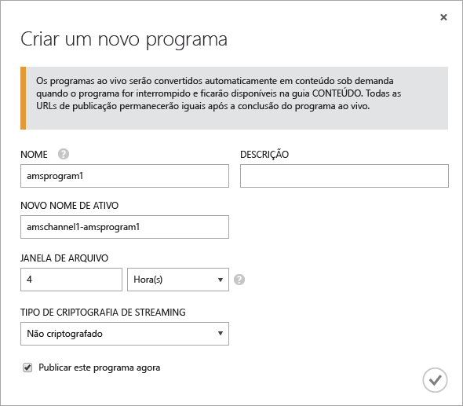
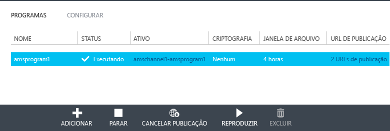
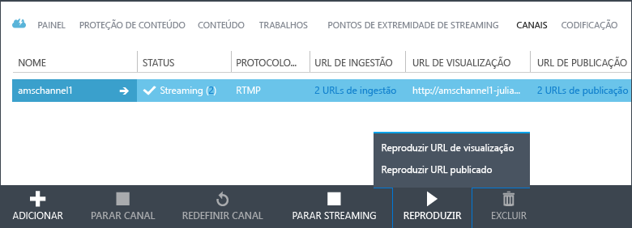
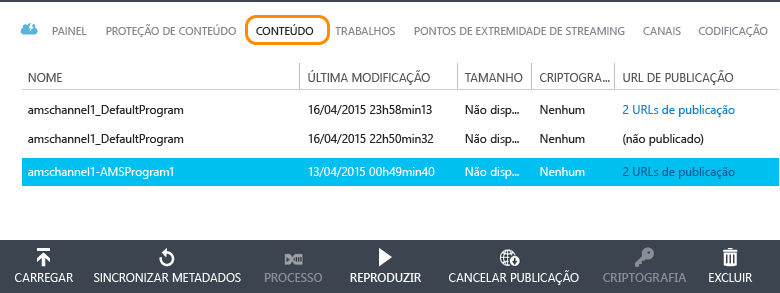

<properties
	pageTitle="Usar o Portal Clássico do Azure para criar canais que recebem transmissões ao vivo de múltiplas taxas de bits de codificadores locais | Microsoft Azure"
	description="Este tutorial orienta você pelas etapas de implementação de um aplicativo básico de streaming ao vivo dos Serviços de Mídia, onde um canal recebe um fluxo ao vivo de múltiplas taxas de bits de um codificador ao vivo local."
	services="media-services"
	documentationCenter=""
	authors="Juliako,cenkdin" 
	manager="dwrede" 
	editor=""/>

<tags 
	ms.service="media-services" 
	ms.workload="media" 
	ms.tgt_pltfrm="na" 
	ms.devlang="ne" 
	ms.topic="article" 
	ms.date="01/31/2016"  
	ms.author="juliako"/>

# Usar o Portal Clássico do Azure para criar canais que recebem transmissões ao vivo de múltiplas taxas de bits de codificadores locais

[AZURE.INCLUDE [media-services-selector-manage-channels](../../includes/media-services-selector-manage-channels.md)]

Este tutorial orienta você pelas etapas de implementação de um aplicativo básico de streaming ao vivo dos Serviços de Mídia, onde um canal recebe um fluxo ao vivo de múltiplas taxas de bits de um codificador ao vivo local. Para obter uma visão geral mais detalhada de como trabalhar com canais e componentes relacionados, consulte [Trabalhando com canais que recebam transmissão ao vivo de múltiplas taxas de bits de codificadores locais](media-services-manage-channels-overview.md).

Neste tutorial, o Portal Clássico do Azure é usado para realizar as seguintes tarefas:

2.  Configure os pontos de extremidade de streaming.
3.  Criar um canal.
1.  Configurar um codificador ao vivo e receber transmissão ao vivo no canal (Wirecast é usado nesta etapa).
1.  Criar um programa (e um ativo).
1.  Publicar o ativo e obter URLs de streaming.
1.  Reproduzir o conteúdo.
2.  Limpar.

## Pré-requisitos
Os itens a seguir são necessários para concluir o tutorial.

- Para concluir este tutorial, você precisa de uma conta do Azure. Para obter detalhes, consulte [Avaliação gratuita do Azure](/pricing/free-trial/?WT.mc_id=A261C142F). 
- Uma conta dos Serviços de Mídia. Para criar uma conta de Serviços de Mídia, consulte [Criar Conta](media-services-create-account.md).
- Uma webcam e um codificador que possa enviar um fluxo ao vivo de múltiplas taxas de bits.

## Configurar o ponto de extremidade de transmissão usando o Portal Clássico do Azure

Ao trabalhar com os Serviços de Mídia do Azure, um dos cenários mais comuns é fornecer streaming com taxa de bits adaptável aos clientes dos Serviços de Mídia do Azure. Com streaming de taxa de bits adaptável, o cliente pode alternar para um fluxo de taxa de bits maior ou menor, já que o vídeo é exibido com base na largura de banda de rede atual, na utilização da CPU e em outros fatores. Os Serviços de Mídia dão suporte às seguintes tecnologias de streaming com taxa de bits adaptável: HTTP Live Streaming (HLS), Smooth Streaming, MPEG DASH e HDS (apenas para licenciados Adobe PrimeTime/Access).

Ao trabalhar com a transmissão ao vivo, um codificador ao vivo local (no nosso caso Wirecast) recebe uma transmissão ao vivo com múltiplas taxas de bits em seu canal. Quando o fluxo é solicitado por um usuário, o Serviços de Mídia usa empacotamento dinâmico para empacotar novamente o fluxo de origem no fluxo de taxa de bits adaptável solicitado (HLS, DASH ou Smooth).

Para tirar proveito do empacotamento dinâmico, você precisa obter pelo menos uma unidade de streaming para o *ponto de extremidade* de streaming por meio do qual você planeja fornecer seu conteúdo.

Para alterar o número de unidades de streaming reservadas, faça o seguinte:

1. No [Portal Clássico do Azure](https://manage.windowsazure.com/), clique em **Serviços de Mídia**. Em seguida, clique no nome do serviço de mídia.

2. Selecione a página **PONTOS DE EXTREMIDADE DE STREAMING**. Então, clique no ponto de extremidade de streaming que deseja modificar.

3. Para especificar o número de unidades de streaming, selecione a guia **ESCALA** e mova o controle deslizante de capacidade reservada.

4. Clique no botão **SALVAR** para salvar as alterações.

A alocação de quaisquer novas unidades de streaming leva cerca de 20 minutos para ser concluída.

>[AZURE.NOTE] No momento, mudar de qualquer valor positivo de unidades de streaming de volta para nenhuma unidade pode desabilitar o streaming por até uma hora.
>
> O número mais alto de unidades especificadas para o período de 24 horas é usado para calcular o custo. Para obter informações sobre os detalhes de preços, consulte [Detalhes de preços dos Serviços de Mídia](http://go.microsoft.com/fwlink/?LinkId=275107).

## Criar um canal

No Portal Clássico do Azure, selecione a página **CANAIS**. Em seguida, clique em **NOVO**. Na página **Criar um novo Canal ao Vivo**, insira um nome para o seu canal.

No canto inferior direito da página, clique na marca de seleção para salvar as atualizações.

Depois de alguns minutos, o canal é criado e iniciado.

## Obter URLs de ingestão

Depois que o canal é criado, você pode obter URLs de ingestão que você fornecerá ao codificador ao vivo. O codificador usa essas URLs para gerar entrada de um fluxo ao vivo.

Para obter mais informações sobre URLs de ingestão, consulte [Usando codificadores de locais para enviar um fluxo ao vivo de múltiplas taxas de bits para um canal](media-services-channels-overview.md).

## Configurar um codificador ao vivo e receber transmissão ao vivo

>[AZURE.NOTE] Esta etapa exige a URL de ingestão do canal que foi mencionada na etapa anterior.

Para obter informações detalhadas sobre como configurar Wirecast e iniciar a ingestão do fluxo, consulte [Configuração Wirecast](https://azure.microsoft.com/blog/2014/09/18/azure-media-services-rtmp-support-and-live-encoders/).

>[AZURE.NOTE] Se por algum motivo você parou o codificador e agora precisa reiniciá-lo, primeiramente você deve redefinir o canal clicando no comando **REDEFINIR** no Portal Clássico do Azure.

## Criar e gerenciar um programa

### Visão geral

Um canal é associado a programas que permitem que você controle a publicação e o armazenamento de segmentos em um fluxo ao vivo. Canais gerenciam programas. A relação entre canal e programa é muito semelhante à mídia tradicional, onde um canal tem um fluxo constante de conteúdo e um programa tem como escopo algum evento programado naquele canal.

Você pode especificar o número de horas pelo qual você deseja manter o conteúdo gravado para o programa, definindo a duração da **Janela de Arquivo**. Esse valor pode ser definido entre um mínimo de 5 minutos e um máximo de 25 horas. A duração da janela de arquivo também determina que a quantidade máxima de tempo que os clientes podem pesquisar na posição atual em tempo real. Os programas podem ser executados pelo período de tempo especificado, mas o conteúdo que estiver por trás da janela de tamanho será continuamente descartado. Esse valor desta propriedade também determina por quanto tempo os manifestos do cliente podem crescer.

Cada programa está associado a um ativo. Para publicar o programa, você precisa criar um localizador OnDemand para o ativo associado. Ter esse localizador permitirá que você crie uma URL de transmissão que você pode fornecer aos seus clientes.

Um canal dá suporte a até três programas em execução simultânea, para que você possa criar diversos arquivos no mesmo fluxo de entrada. Isso permite que você publique e arquive diferentes partes de um evento, conforme necessário. Por exemplo, o requisito de negócios é arquivar 6 horas de um programa, mas transmitir apenas os últimos 10 minutos. Para fazer isso, você precisa criar dois programas em execução simultânea. Um programa é definido para arquivar 6 horas do evento, mas o programa não é publicado. Outro programa é definido para 10 minutos e esse programa é publicado.

Você não deve reutilizar os programas existentes para novos eventos. Em vez disso, crie e inicie um novo programa para cada evento.

Inicie o programa quando estiver pronto para iniciar o streaming e o arquivamento. Interrompa o programa sempre que você deseja parar o streaming e o arquivamento do evento.

Para excluir o conteúdo arquivado, interrompa e exclua o programa e, em seguida, exclua o ativo associado. Não é possível excluir um ativo se este for usado por um programa; o programa deve ser excluído primeiro.

Mesmo depois que você parar e excluir o programa, os usuários poderão transmitir seu conteúdo arquivado como vídeo por demanda enquanto você não excluir o ativo.

Se desejar manter o conteúdo arquivado mas ele não está disponível para streaming, exclua o localizador de streaming.

### Criar, iniciar e parar programas

Uma vez que o fluxo está fluindo para o canal, você pode começar o evento de streaming criando um Ativo, Programa e Localizador de Streaming. Isso vai arquivar o fluxo e torná-lo disponível para visualizadores por meio do ponto de extremidade de streaming.

Há duas maneiras de iniciar um evento:

1. Na página **CANAIS**, clique em **ADICIONAR** para adicionar um novo programa.

Na página **Criar um novo programa**, especifique o nome do programa, o nome do ativo, a janela de arquivo e a opção de criptografia.

Se a opção **Publicar este programa agora** for selecionada, as URLs de publicação serão criadas.

Você pode clicar em **INICIAR** sempre que estiver pronto para transmitir o programa.

Depois de iniciar o programa, é possível clicar em **REPRODUZIR** para iniciar a reprodução do conteúdo.

2. Como alternativa, você pode usar um atalho e clicar no botão **INICIAR TRANSMISSÃO** na página **CANAIS**. Isso criará um ativo, programa e localizador de Streaming.

O programa é chamado DefaultProgram e a janela de arquivo é definida como 1 hora.

Você pode reproduzir o programa publicado na página **CANAIS**.

Se você clicar em **PARAR TRANSMISSÃO** na página **CANAIS**, o programa padrão será interrompido e excluído. O ativo ainda estará lá e você pode publicá-lo ou cancelar sua publicação na página **CONTEÚDO**.

Se você alternar para a página **CONTEÚDO**, você verá os ativos que foram criados para os programas.

## Reprodução de conteúdo

Para fornecer ao usuário uma URL que possa ser usada para transmitir seu conteúdo, primeiramente, você precisa *publicar* seu ativo (conforme descrito na seção anterior) criando um localizador (quando você publica um ativo usando o Portal Clássico do Azure, os localizadores são criados para você). Os localizadores fornecem acesso aos arquivos contidos no ativo.

Dependendo de qual protocolo de transmissão você deseja usar para reproduzir o conteúdo, talvez seja necessário modificar a URL obtida pelo link **PUBLICAR URL** do canal\\programa.

O empacotamento dinâmico se encarregará do empacotamento do fluxo ao vivo para o protocolo especificado.

Por padrão, uma URL de streaming tem o formato a seguir, e você pode usá-la para reproduzir ativos de Smooth Streaming.

{nome do ponto de extremidade de streaming - nome de conta do dos serviços de mídia}.streaming.mediaservices.windows.net/{ID do localizador}/{nome do arqui}.ism/Manifest

Para criar uma URL de streaming HLS, anexe (format=m3u8-aapl) à URL.

{nome do ponto de extremidade de streaming - nome de conta dos serviços de mídia}.streaming.mediaservices.windows.net/{ID do localizador}/{nome do arquivo}.ism/Manifest(format=m3u8-aapl)

Para criar uma URL de streaming MPEG DASH, anexe (format=mpd-time-csf) à URL.

{nome do ponto de extremidade de streaming - nome de conta dos serviços de mídia}.streaming.mediaservices.windows.net/{ID do localizador}/{nome do arquivo}.ism/Manifest(format=mpd-time-csf)

Para obter mais informações sobre o fornecimento do seu conteúdo, consulte [Fornecimento de conteúdo](media-services-deliver-content-overview.md).

Você pode reproduzir Smooth Stream usando o [AMS Player](http://amsplayer.azurewebsites.net/azuremediaplayer.html) ou usar dispositivos iOS e Android para reproduzir HLS versão 3.

## Limpar

Se você tiver terminado o fluxo de eventos e deseja limpar os recursos provisionados anteriormente, use o procedimento a seguir.

- Pare de enviar o fluxo por push por meio do codificador.
- Pare o canal. Depois que o canal estiver parado, ele não incorrerá em nenhum encargo. Quando for necessário iniciá-lo novamente ele terá a mesma URL de ingestão, portanto, você não precisará reconfigurar seu codificador.
- Você pode parar seu ponto de extremidade de streaming, a menos que queira continuar fornecendo o arquivo morto do evento ao vivo como um fluxo sob demanda. Se o canal estiver no estado parado, ele não incorrerá em nenhum encargo.

##Próximas etapas: roteiros de aprendizagem dos Serviços de Mídia

[AZURE.INCLUDE [media-services-learning-paths-include](../../includes/media-services-learning-paths-include.md)]

##Fornecer comentários

[AZURE.INCLUDE [media-services-user-voice-include](../../includes/media-services-user-voice-include.md)]

### Procurando outra coisa?

Se este tópico não contiver o que você esperava, se estiver faltando alguma informação ou se não tiver atendido de alguma outra forma às suas necessidades, envie seus comentários usando o thread Disqus abaixo.

## Recursos adicionais
- [Introdução à transmissão ao vivo usando o Portal Clássico do Azure](https://azure.microsoft.com/blog/getting-started-with-live-streaming-using-the-azure-management-portal/)

<!-- URLs. -->
[Azure Classic Portal]: http://manage.windowsazure.com/

<!-- Images -->

<!---HONumber=AcomDC_0204_2016-->