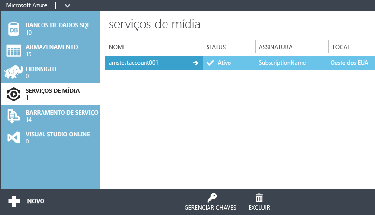
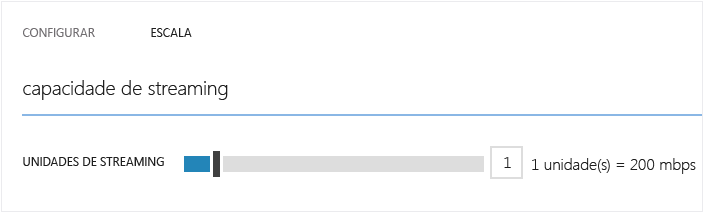

<properties
	pageTitle="Introdução ao fornecimento de conteúdo sob demanda usando o Portal Clássico do Azure | Microsoft Azure"
	description="Este tutorial orienta você pelas etapas de implementação de um aplicativo de entrega de conteúdo de Vídeo sob Demanda (VoD) com os Serviços de Mídia do Azure usando o Portal Clássico do Azure."
	services="media-services"
	documentationCenter=""
	authors="Juliako"
	manager="erikre"
	editor=""/>

<tags
	ms.service="media-services"
	ms.workload="media"
	ms.tgt_pltfrm="na"
	ms.devlang="na"
	ms.topic="get-started-article"
	ms.date="02/25/2016"
	ms.author="juliako"/>

# Introdução ao fornecimento de conteúdo sob demanda usando o Portal Clássico do Azure

[AZURE.INCLUDE [media-services-selector-get-started](../../includes/media-services-selector-get-started.md)]

Este tutorial o orienta ao longo das etapas de implementação de um aplicativo básico de fornecimento de conteúdo de VoD usando o Portal Clássico do Azure.

> [AZURE.NOTE] Para concluir este tutorial, você precisa de uma conta do Azure. Para obter detalhes, consulte [Avaliação gratuita do Azure](/pricing/free-trial/?WT.mc_id=A261C142F).

Este tutorial inclui as seguintes tarefas:

1.  Criar uma conta de Serviços de Mídia do Azure.
2.  Configurar um ponto de extremidade de streaming.
1.  Carregar um arquivo de vídeo.
1.  Codificar o arquivo de origem em um conjunto de arquivos MP4 com taxa de bits adaptável.
1.  Publicar o ativo e obter URLs de download progressivo e streaming.  
1.  Reproduzir o conteúdo.

## Criar uma conta de Serviços de Mídia do Azure

1. No [Portal Clássico do Azure](https://manage.windowsazure.com/), clique em **Novo**, em **Serviço de Mídia** e em **Criação Rápida**.

	

2. Em **NOME**, insira o nome da nova conta. Um nome de conta de Serviços de Mídia deve ser composto de letras minúsculas ou números, sem espaços, e deve ter de 3 a 24 caracteres de comprimento.

3. Em **REGIÃO**, selecione a região geográfica que será usada para armazenar os registros de metadados para sua conta de Serviços de Mídia. Somente as regiões de Serviços de Mídia disponíveis são exibidas na caixa da lista suspensa.

4. Em **CONTA DE ARMAZENAMENTO**, selecione uma conta de armazenamento para fornecer armazenamento de blob do conteúdo de mídia de sua conta de Serviços de Mídia. Você pode selecionar uma conta de armazenamento existente na mesma região geográfica que sua conta de Serviços de Mídia ou criar uma nova conta de armazenamento. É criada uma nova conta de armazenamento na mesma região.

5. Se você criou uma nova conta de armazenamento, em **NOME DA NOVA CONTA DE ARMAZENAMENTO**, insira um nome para a conta de armazenamento. As regras para nomes de contas de armazenamento são as mesmas que para contas de Serviços de Mídia.

6. Clique em **Criação Rápida** na parte inferior do formulário.

	Você pode monitorar o status do processo na área de mensagem na parte inferior da janela.

	Depois que a conta for criada com êxito, o status é alterado para Ativo.

	Na parte inferior da página, o botão **GERENCIAR CHAVES** é exibido. Quando você clica nesse botão, é exibida uma caixa de diálogo com o nome da conta de Serviços de Mídia e as chaves primárias e secundárias. Será necessário o nome da conta e as informações de chave primária para acessar a conta de Serviços de Mídia de modo programático.

	

	Quando você clica duas vezes no nome da conta, a página Início Rápido é exibida por padrão. Esta página permite que você execute algumas tarefas de gerenciamento que também estão disponíveis em outras páginas do portal. Por exemplo, você pode carregar um arquivo de vídeo nesta página ou na página CONTEÚDO.

## Configurar o ponto de extremidade de streaming usando o portal

Ao trabalhar com os Serviços de Mídia do Azure, um dos cenários mais comuns é fornecer streaming com uma taxa de bits adaptável aos clientes dos Serviços de Mídia do Azure. Com streaming de taxa de bits adaptável, o cliente pode alternar para um fluxo de taxa de bits maior ou menor, já que o vídeo é exibido com base na largura de banda de rede atual, a utilização da CPU e outros fatores. Os Serviços de Mídia dão suporte às seguintes tecnologias de streaming com taxa de bits adaptável: HTTP Live Streaming (HLS), Smooth Streaming, MPEG DASH e HDS (apenas para licenciados Adobe PrimeTime/Access).

Os Serviços de Mídia fornecem empacotamento dinâmico, que permite a você distribuir o conteúdo de taxa de bits adaptável MP4 ou Smooth Streaming codificado em formatos de streaming suportados pelo Media Services (MPEG DASH, HLS, Smooth Streaming, HDS) sem a necessidade de empacotar novamente nesses formatos de fluxo contínuo.

Para aproveitar os benefícios do empacotamento dinâmico, você precisa fazer o seguinte:

- Codificar seu arquivo mezanino (fonte) em um conjunto de arquivos MP4 de taxa de bits adaptável ou arquivos Smooth Streaming de taxa de bits adaptável (as etapas de codificação são demonstradas mais tarde neste tutorial).  
- Obter pelo menos uma unidade de streaming para o *ponto de extremidade de streaming* do qual você planeja fornecer seu conteúdo.

Com o empacotamento dinâmico, você só precisa armazenar e pagar pelos arquivos em um único formato de armazenamento, e os Serviços de Mídia criarão e fornecerão a resposta apropriada com base nas solicitações de um cliente.

Para alterar o número de unidades de streaming reservadas, faça o seguinte:

1. No [Portal Clássico do Azure](https://manage.windowsazure.com/), clique em **Serviços de Mídia**. Em seguida, clique no nome do serviço de mídia.

2. Selecione a página de PONTOS DE EXTREMIDADE DE STREAMING. Então, clique no ponto de extremidade de streaming que deseja modificar.

3. Para especificar o número de unidades de streaming, selecione a guia **ESCALA** e mova o controle deslizante **capacidade reservada**.

	

4. Clique no botão **SALVAR** para salvar as alterações.

	A alocação de quaisquer novas unidades de streaming leva cerca de 20 minutos para ser concluída.

	>[AZURE.NOTE] No momento, mudar de qualquer valor positivo de unidades de streaming de volta para nenhuma unidade pode desabilitar o streaming por até uma hora.
	>
	> O número mais alto de unidades especificadas para o período de 24 horas é usado para calcular o custo. Para obter informações sobre os detalhes de preços, consulte [Detalhes de preços dos Serviços de Mídia](http://go.microsoft.com/fwlink/?LinkId=275107).

## Carregar conteúdo

1. No [Portal Clássico do Azure](http://go.microsoft.com/fwlink/?LinkID=256666&clcid=0x409), clique em **Serviços de Mídia** e no nome da conta dos Serviços de Mídia.
2. Selecione a página CONTEÚDO.
3. Clique no botão **Carregar** na página ou na parte inferior do portal.
4. Na caixa de diálogo **Carregar conteúdo**, navegue até o arquivo do ativo desejado. Clique no arquivo e clique em **Abrir** ou pressione Enter.

	![UploadContentDialog][uploadcontent]

5. Na caixa de diálogo **Carregar Conteúdo**, clique no botão de seleção para aceitar o **Arquivo** e o **Nome do Conteúdo**.
6. O carregamento será iniciado e você poderá acompanhar o andamento na parte inferior do portal.  

	![JobStatus][status]

Quando o carregamento for concluído, você verá o novo ativo listado na lista Conteúdo. Por convenção, o nome terá "**Source**" acrescentado ao final para ajudar a acompanhar o novo conteúdo como um conteúdo de origem para tarefas de codificação.

![ContentPage][contentpage]

Se o valor do tamanho do arquivo não for atualizado depois que o processo de carregamento parar, pressione o botão **Sincronizar Metadados**. Isso sincroniza o tamanho do arquivo do ativo com o tamanho real do arquivo no armazenamento e atualiza o valor na página Conteúdo.

## Codificar conteúdo

### Visão geral

Para fornecer vídeo digital pela internet, você deve compactar a mídia. Os Serviços de Mídia oferecem um codificador de mídia que permite que você especifique como deseja que seu conteúdo seja codificado (por exemplo, os codecs para uso, formato de arquivo, resolução e taxa de bits).

Ao trabalhar com os Serviços de Mídia do Azure, um dos cenários mais comuns é fornecer streaming com uma taxa de bits adaptável aos clientes dos Serviços de Mídia do Azure. Com streaming de taxa de bits adaptável, o cliente pode alternar para um fluxo de taxa de bits maior ou menor, já que o vídeo é exibido com base na largura de banda de rede atual, a utilização da CPU e outros fatores. Os Serviços de Mídia dão suporte às seguintes tecnologias de streaming com taxa de bits adaptável: HTTP Live Streaming (HLS), Smooth Streaming, MPEG DASH e HDS (apenas para licenciados Adobe PrimeTime/Access).

Os Serviços de Mídia fornecem empacotamento dinâmico, que permite a você distribuir o conteúdo de taxa de bits adaptável MP4 ou Smooth Streaming codificado em formatos de streaming suportados pelo Media Services (MPEG DASH, HLS, Smooth Streaming ou HDS) sem a necessidade de empacotar novamente nesses formatos de fluxo contínuo.

Para aproveitar os benefícios do empacotamento dinâmico, você precisa fazer o seguinte:

- Codificar seu arquivo mezanino (fonte) em um conjunto de arquivos MP4 de taxa de bits adaptável ou arquivos Smooth Streaming de taxa de bits adaptável (as etapas de codificação são demonstradas mais tarde neste tutorial).
- Obter pelo menos uma unidade de streaming sob demanda para o ponto de extremidade de streaming por meio do qual você planeja fornecer seu conteúdo. Para saber mais, consulte [Como dimensionar unidades reservadas para streaming sob demanda](media-services-manage-origins.md#scale_streaming_endpoints/).

Com o empacotamento dinâmico, você só precisa armazenar e pagar pelos arquivos em um único formato de armazenamento, e os Serviços de Mídia criarão e fornecerão a resposta apropriada com base nas solicitações de um cliente.

Observe que, além de poder usar os recursos de empacotamento dinâmico, unidades reservadas de streaming sob demanda oferecem capacidade de saída dedicada que pode ser comprada em incrementos de 200 Mbps. Por padrão, o streaming sob demanda é configurado em um modelo de instância compartilhada para a qual os recursos do servidor (por exemplo, computação ou capacidade de egresso) são compartilhados com todos os outros usuários. Para melhorar a taxa de transferência de um streaming sob demanda, é recomendável adquirir unidades reservadas para Streaming sob Demanda.

### Codificar

Esta seção descreve as etapas que você pode seguir para codificar o conteúdo com o Codificador de Mídia Padrão usando o Portal Clássico do Azure.

1.  Selecione o arquivo que você deseja codificar. Se houver suporte para codificação para esse tipo de arquivo, o botão **PROCESSO** será habilitado na parte inferior da página CONTEÚDO.
4. Na caixa de diálogo **Processo**, selecione o processador do **Codificador de Mídia Standard**.
5. Escolha uma das **configurações de codificação**.

	![Process2][process2]

	O tópico [Cadeias de Caracteres Predefinidas de Tarefa para o Codificador de Mídia Standard](https://msdn.microsoft.com/pt-BR/library/mt269960) explica o significado de cada predefinição.

5. Em seguida, digite o nome de conteúdo de saída amigável desejado ou aceite o padrão. Em seguida, clique no botão de seleção para iniciar a operação de codificação e você poderá acompanhar o andamento na parte inferior do portal.
6. Selecione **OK**.

	Após a codificação ser realizada, a página de conteúdo conterá o arquivo codificado.

	Para exibir o andamento do trabalho de codificação, alterne para a página **TRABALHOS**.

	Se o valor do tamanho do arquivo não for atualizado depois que a codificação for concluída, selecione o botão **Sincronizar Metadados**. Isso sincroniza o tamanho do arquivo do ativo de saída com o tamanho real do arquivo no armazenamento e atualiza o valor na página Conteúdo.

## Publicar conteúdo

### Visão geral

Para fornecer a seus usuários uma URL que pode ser usada para transmitir ou baixar seu conteúdo, primeiro você precisa "publicar" o ativo criando um localizador. Os localizadores fornecem acesso aos arquivos contidos no ativo. Os Serviços de Mídia oferecem suporte a dois tipos de localizador: OnDemandOrigin, usados para transmitir mídia por streaming (por exemplo, MPEG DASH, HLS ou Smooth Streaming) e SAS (Assinatura de Acesso), usados para baixar arquivos de mídia.

Quando você usa o Portal Clássico do Azure para publicar seus ativos, os localizadores são criados para você e há uma URL baseada em OnDemand (caso seu ativo contenha um arquivo .ism) ou uma URL SAS.

Uma URL SAS tem o seguinte formato.

	{blob container name}/{asset name}/{file name}/{SAS signature}

Uma URL de streaming tem o formato a seguir e você pode usá-la para reproduzir ativos de Smooth Streaming.

	{streaming endpoint name-media services account name}.streaming.mediaservices.windows.net/{locator ID}/{filename}.ism/Manifest

Para criar uma URL de streaming de HLS, anexe (format=m3u8-aapl) à URL.

	{streaming endpoint name-media services account name}.streaming.mediaservices.windows.net/{locator ID}/{filename}.ism/Manifest(format=m3u8-aapl)

Para criar uma URL de streaming de MPEG DASH, anexe (format=mpd-time-csf) à URL.

	{streaming endpoint name-media services account name}.streaming.mediaservices.windows.net/{locator ID}/{filename}.ism/Manifest(format=mpd-time-csf)

Os localizadores têm uma data de validade. Quando você usa o portal para publicar seus ativos, são criados localizadores com uma data de validade de 100 anos.

>[AZURE.NOTE] Se você usou o portal para criar localizadores antes de março de 2015, foram criados localizadores com uma data de validade de dois anos.

Para atualizar uma data de validade em um localizador, use as APIs [REST](http://msdn.microsoft.com/library/azure/hh974308.aspx#update_a_locator) ou [.NET](http://go.microsoft.com/fwlink/?LinkID=533259). Observe que, quando você atualiza a data de validade de um localizador SAS, a URL é alterada.

### Publicar

Para usar o portal para publicar um ativo, faça o seguinte:

1. Selecione o ativo.
2. Em seguida, clique no botão Publicar.

 ![PublishedContent][publishedcontent]

## Reproduzir conteúdo do portal

O Portal Clássico do Azure fornece um player de conteúdo que você pode usar para testar o vídeo.

Clique no vídeo desejado e clique no botão **Reproduzir** na parte inferior do portal.

Algumas considerações se aplicam:

- Verifique se que o vídeo foi publicado.
- O **PLAYER DE CONTEÚDO DOS SERVIÇOS DE MÍDIA** é reproduzido por meio do ponto de extremidade de streaming padrão. Se você deseja reproduzir por meio de um ponto de extremidade de streaming não padrão, use outro reprodutor. Por exemplo, o [Player dos Serviços de Mídia do Azure](http://amsplayer.azurewebsites.net/azuremediaplayer.html).

![AMSPlayer][AMSPlayer]

##Próximas etapas: Roteiros de aprendizagem dos Serviços de Mídia

[AZURE.INCLUDE [media-services-learning-paths-include](../../includes/media-services-learning-paths-include.md)]

##Fornecer comentários

[AZURE.INCLUDE [media-services-user-voice-include](../../includes/media-services-user-voice-include.md)]

## Procurando outra coisa?

Se este tópico não contiver o que você esperava, se estiver faltando alguma informação ou se não tiver atendido de alguma outra forma às suas necessidades, envie seus comentários usando o thread Disqus abaixo.

### Recursos adicionais
- <a href="http://channel9.msdn.com/Shows/Azure-Friday/Azure-Media-Services-101-Get-your-video-online-now-">Serviços de Mídia do Azure 101 - Coloque seu vídeo online agora!</a>
- <a href="http://channel9.msdn.com/Shows/Azure-Friday/Azure-Media-Services-102-Dynamic-Packaging-and-Mobile-Devices">Serviços de Mídia do Azure 102 - pacotes Dinâmicos e Dispositivos Móveis</a>

<!-- Anchors. -->

<!-- URLs. -->
[Azure Classic Portal]: http://manage.windowsazure.com/

<!-- Images -->
[portaloverview]: ./media/media-services-portal-get-started/media-services-content-page.png
[publishedcontent]: ./media/media-services-portal-get-started/media-services-upload-content-published.png
[uploadcontent]: ./media/media-services-portal-get-started/UploadContent.png
[status]: ./media/media-services-portal-get-started/Status.png
[encoder]: ./media/media-services-manage-content/EncoderDialog2.png
[branding]: ./media/branding-reporting.png
[contentpage]: ./media/media-services-portal-get-started/media-services-content-page.png
[process]: ./media/media-services-manage-content/media-services-process-video.png
[process2]: ./media/media-services-portal-get-started/media-services-process-video2.png
[encrypt]: ./media/media-services-manage-content/media-services-encrypt-content.png
[AMSPlayer]: ./media/media-services-portal-get-started/media-services-portal-player.png

<!---HONumber=AcomDC_0302_2016-->