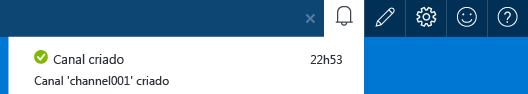
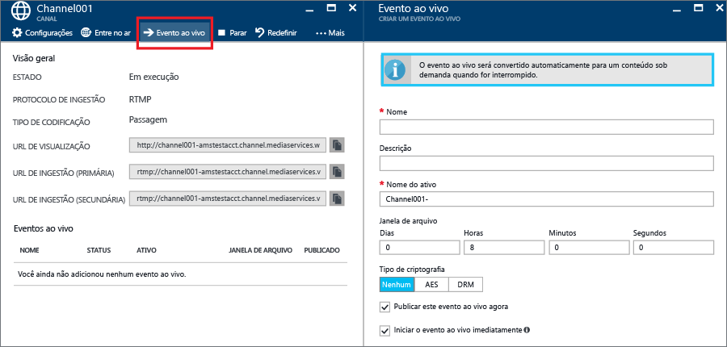
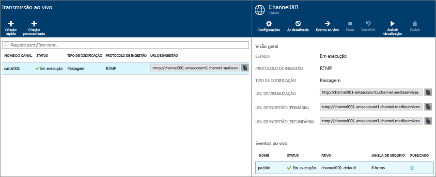
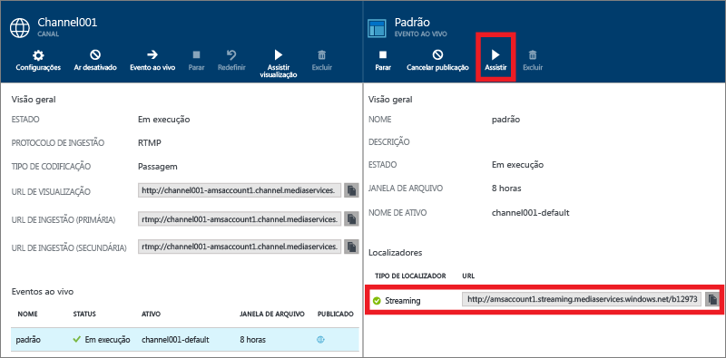
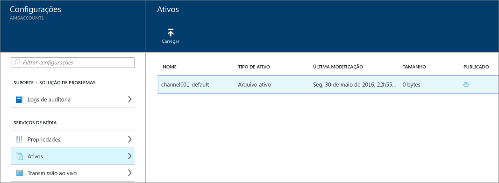

# Como executar uma transmissão ao vivo com codificadores locais usando o portal do Azure
> [!div class="op_single_selector"]
> * [Portal](media-services-portal-live-passthrough-get-started.md)
> * [.NET](media-services-dotnet-live-encode-with-onpremises-encoders.md)
> * [REST](https://docs.microsoft.com/rest/api/media/operations/channel)
> 
> 

Este tutorial orienta você nas etapas de como usar o portal do Azure para criar um **Canal** que é configurado para uma entrega de passagem. 

## Pré-requisitos
Os itens a seguir são necessários para concluir o tutorial:

* Uma conta do Azure. Para obter detalhes, consulte [Avaliação gratuita do Azure](https://azure.microsoft.com/pricing/free-trial/). 
* Uma conta dos Serviços de Mídia. Para criar uma conta de Serviços de Mídia, consulte [Como criar uma conta de Serviços de Mídia](media-services-portal-create-account.md).
* Uma Webcam. Por exemplo, [Codificador Telestream Wirecast](http://www.telestream.net/wirecast/overview.htm).

É recomendável revisar os seguintes artigos:

* [Suporte RTMP dos Serviços de Mídia do Azure e Codificadores Ativos.](https://azure.microsoft.com/blog/2014/09/18/azure-media-services-rtmp-support-and-live-encoders/)
* [Visão geral da transmissão ao vivo usando os Serviços de Mídia do Azure](media-services-manage-channels-overview.md)
* [Transmissão ao vivo com codificadores locais que criam fluxos com múltiplas taxas de bits](media-services-live-streaming-with-onprem-encoders.md)

## Cenário comum de streaming ao vivo
As etapas a seguir descrevem as tarefas envolvidas na criação de aplicativos comuns de transmissão ao vivo que usam canais configurados para entrega de passagem. Este tutorial mostra como criar e gerenciar um canal de passagem e eventos ao vivo.

>[!NOTE]
>Verifique se o ponto de extremidade de streaming do qual você deseja transmitir nosso conteúdo está no estado **Executando**. 
    
1. Conecte uma câmera de vídeo a um computador. Inicie e configure um codificador ao vivo local que gere um fluxo RTMP com múltiplas taxas de bits ou MP4 Fragmentado. Para obter mais informações, consulte [Suporte RTMP dos Serviços de Mídia do Azure e Codificadores ao Vivo](http://go.microsoft.com/fwlink/?LinkId=532824).
   
    Essa etapa também pode ser realizada após a criação do canal.
2. Crie e inicie um Canal de passagem.
3. Recupere a URL de ingestão do canal. 
   
    A URL de ingestão é usada pelo codificador ao vivo para enviar o fluxo para o canal.
4. Recupere a URL de visualização do canal. 
   
    Use essa URL para verificar se o canal está recebendo corretamente o fluxo ao vivo.
5. Crie um evento ao vivo/programa. 
   
    Ao usar o portal do Azure, a criação de um evento ao vivo também cria um ativo. 

6. Inicie o evento/programa quando estiver pronto para iniciar a transmissão e o arquivamento.
7. Opcionalmente, o codificador ao vivo pode ser sinalizado para iniciar um anúncio. O anúncio é inserido no fluxo de saída.
8. Interrompa o evento/programa sempre que você quiser parar a transmissão e o arquivamento do evento.
9. Exclua o evento/programa (e, opcionalmente, exclua o ativo).     

> [!IMPORTANT]
> Examine a [Transmissão ao vivo com codificadores locais que criam fluxos de múltiplas taxas de bits](media-services-live-streaming-with-onprem-encoders.md) para saber mais sobre os conceitos e considerações relacionados à transmissão ao vivo com codificadores locais e canais de passagem.
> 
> 

## Para exibir notificações e erros
Se você quiser exibir as notificações e erros produzidos pelo portal do Azure, clique no ícone Notificação.

## Criar e iniciar canais de passagem e eventos
Um canal é associado a eventos/programas que permitem que você controle a publicação e o armazenamento de segmentos em um fluxo ao vivo. Os canais gerenciam os eventos. 

Você pode especificar o número de horas pelo qual você deseja manter o conteúdo gravado para o programa, definindo a duração da **Janela de Arquivo** . Esse valor pode ser definido entre um mínimo de 5 minutos e um máximo de 25 horas. A duração da janela de arquivo também determina que a quantidade máxima de tempo que os clientes podem pesquisar na posição atual em tempo real. Os eventos podem ser executados no período de tempo especificado, mas o conteúdo que ficar para trás no comprimento da janela será continuamente descartado. Esse valor desta propriedade também determina por quanto tempo os manifestos do cliente podem crescer.

Cada evento está associado um ativo. Para publicar o evento, você precisa criar um localizador OnDemand para o ativo associado. Ter esse localizador permitirá que você crie uma URL de transmissão que você pode fornecer aos seus clientes.

Um canal dá suporte a até três eventos em execução simultânea para que você possa criar diversos arquivos no mesmo fluxo de entrada. Isso permite que você publique e arquive diferentes partes de um evento, conforme necessário. Por exemplo, o requisito de negócios é arquivar 6 horas de um programa, mas transmitir apenas os últimos 10 minutos. Para fazer isso, você precisa criar dois programas em execução simultânea. Um programa é definido para arquivar 6 horas do evento, mas o programa não é publicado. Outro programa é definido para 10 minutos e esse programa é publicado.

Você não deve reutilizar os eventos existentes ao vivo. Em vez disso, crie e inicie um novo evento para cada evento.

Inicie o evento quando estiver pronto para começar a transmissão e o arquivamento. Interrompa o programa sempre que você deseja parar o streaming e o arquivamento do evento. 

Para excluir o conteúdo arquivado, interrompa e exclua o evento, em seguida, exclua o ativo associado. Não será possível excluir um ativo se este for usado por um evento; o evento deve ser excluído primeiro. 

Mesmo depois de você parar e excluir o evento, os usuários poderão transmitir seu conteúdo arquivado como vídeo por demanda enquanto você não excluir o ativo.

Se desejar manter o conteúdo arquivado mas ele não está disponível para streaming, exclua o localizador de streaming.

### Para usar o portal para criar um canal
Esta seção mostra como usar a opção **Criação Rápida** para criar um canal de passagem.

Para obter mais detalhes sobre os canais de passagem, veja [Transmissão ao vivo com codificadores locais que criam fluxos de múltiplas taxas de bits](media-services-live-streaming-with-onprem-encoders.md).

1. No [Portal do Azure](https://portal.azure.com/), selecione sua conta dos Serviços de Mídia do Azure.
2. Na janela **Configurações**, clique em **Transmissão ao vivo**. 
   
    
   
    A janela **Transmissão ao vivo** é exibida.
3. Clique em **Criação Rápida** para criar um canal de passagem com o protocolo de ingestão RTMP.
   
    A janela **CRIAR UM NOVO CANAL** é exibida.
4. Nomeie o novo canal e clique em **Criar**. 
   
    Isso cria um canal de passagem com o protocolo de ingestão RTMP.

## Criar eventos
1. Selecione um canal para o qual você deseja adicionar um evento.
2. Pressione o botão **Evento ao Vivo** .

## Obter URLs de ingestão
Depois que o canal é criado, você pode obter URLs de ingestão que você fornecerá ao codificador ao vivo. O codificador usa essas URLs para gerar entrada de um fluxo ao vivo.

## Assistir ao evento
Para assistir o evento, clique em **Assistir** no portal do Azure ou copie a URL de transmissão e use um player de sua escolha. 

O evento ao vivo é convertido automaticamente no conteúdo sob demanda quando estiver parado.

## Limpar
Para obter mais detalhes sobre os canais de passagem, veja [Transmissão ao vivo com codificadores locais que criam fluxos de múltiplas taxas de bits](media-services-live-streaming-with-onprem-encoders.md).

* Um canal pode ser interrompido somente quando todos os eventos/programas nele foram interrompidos.  Depois que o canal estiver parado, ele não incorrerá em nenhum encargo. Quando for necessário iniciá-lo novamente ele terá a mesma URL de ingestão, portanto, você não precisará reconfigurar seu codificador.
* Um canal pode ser excluído somente quando todos os eventos ao vivo nele foram excluídos.

## Exibir conteúdo arquivado
Mesmo depois de você parar e excluir o evento, os usuários poderão transmitir seu conteúdo arquivado como vídeo por demanda enquanto você não excluir o ativo. Não será possível excluir um ativo se este for usado por um evento; o evento deve ser excluído primeiro. 

Para gerenciar os ativos, selecione **Configuração** e clique em **Ativos**.

## Próxima etapa
Revise os roteiros de aprendizagem dos Serviços de Mídia.

[!INCLUDE [media-services-learning-paths-include](../../includes/media-services-learning-paths-include.md)]

## Fornecer comentários
[!INCLUDE [media-services-user-voice-include](../../includes/media-services-user-voice-include.md)]

