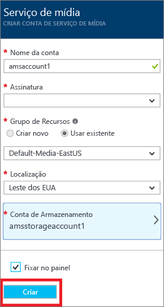
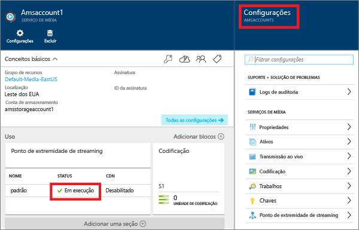
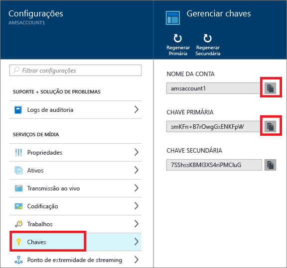
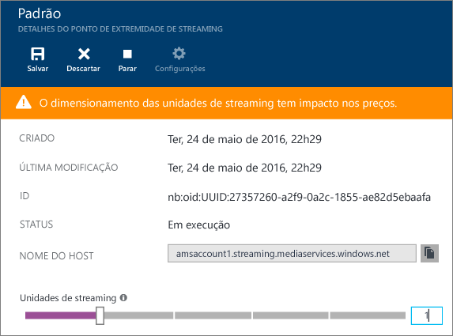
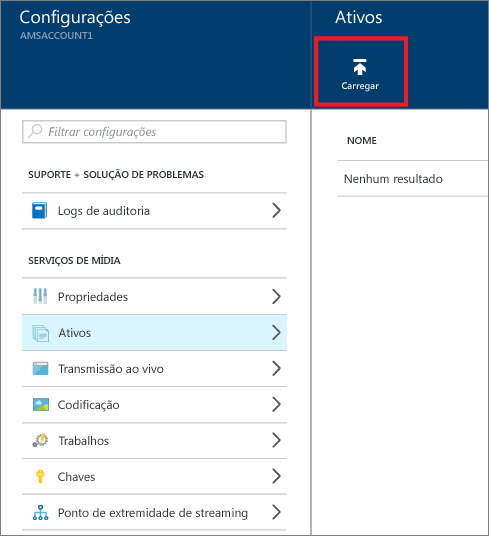
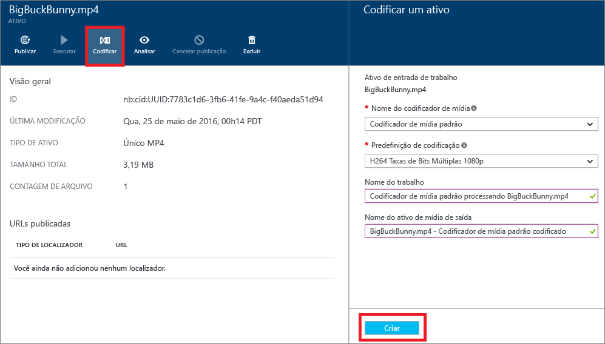
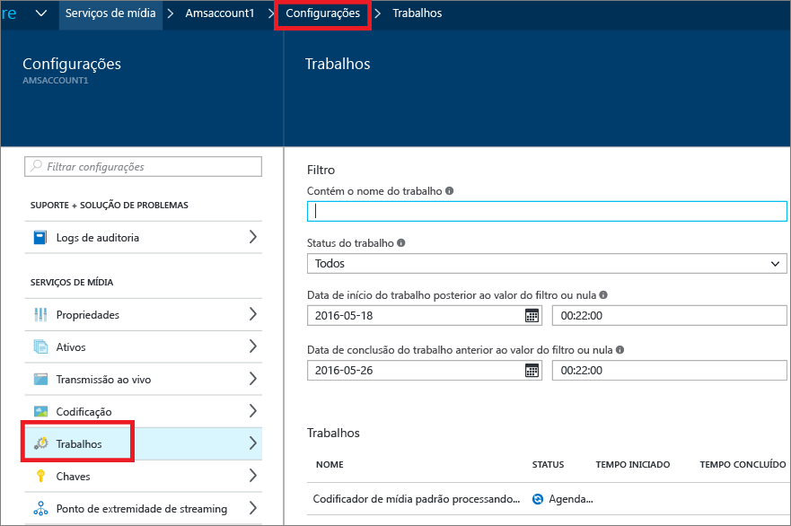
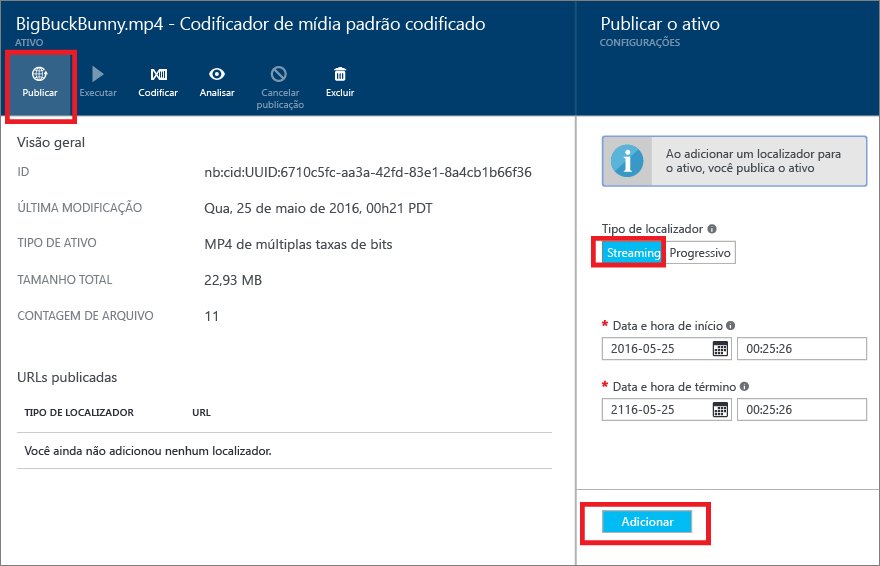
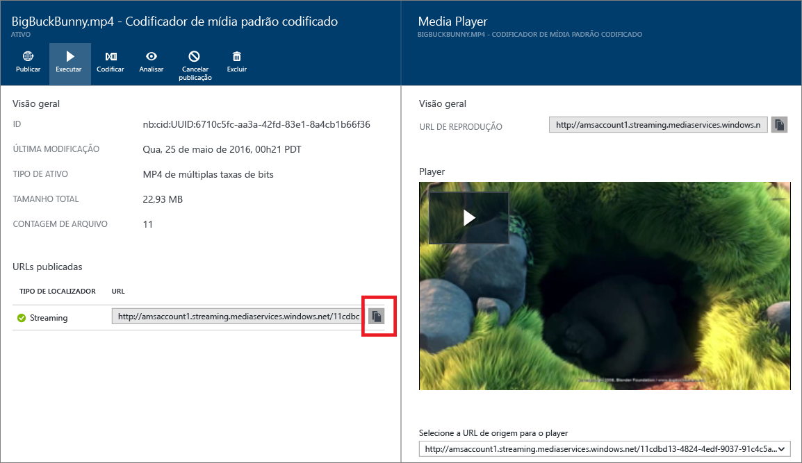

<properties
	pageTitle="Introdução ao fornecimento de conteúdo sob demanda usando o Portal do Azure | Microsoft Azure"
	description="Este tutorial orienta você nas etapas de implementação de um serviço básico de fornecimento de conteúdo de Vídeo sob Demanda (VoD) com o aplicativo AMS (Serviços de Mídia do Azure) usando o Portal do Azure."
	services="media-services"
	documentationCenter=""
	authors="Juliako"
	manager="erikre"
	editor=""/>

<tags
	ms.service="media-services"
	ms.workload="media"
	ms.tgt_pltfrm="na"
	ms.devlang="na"
	ms.topic="get-started-article"
	ms.date="06/05/2016"
	ms.author="juliako"/>

# Introdução ao fornecimento de conteúdo sob demanda usando o Portal do Azure

Este tutorial orienta você nas etapas de implementação de um serviço básico de fornecimento de conteúdo de Vídeo sob Demanda (VoD) com o aplicativo AMS (Serviços de Mídia do Azure) usando o Portal do Azure.

Os Serviços de Mídia do Azure no portal do Azure estão atualmente na visualização.

> [AZURE.NOTE] Para concluir este tutorial, você precisa de uma conta do Azure. Para obter detalhes, consulte [Avaliação gratuita do Azure](https://azure.microsoft.com/pricing/free-trial/).

Este tutorial inclui as seguintes tarefas:

1.  Criar uma conta de Serviços de Mídia do Azure.
2.  Configurar um ponto de extremidade de streaming.
1.  Carregar um arquivo de vídeo.
1.  Codificar o arquivo de origem em um conjunto de arquivos MP4 com taxa de bits adaptável.
1.  Publicar o ativo e obter URLs de download progressivo e streaming.  
1.  Reproduzir o conteúdo.

## Criar uma conta de Serviços de Mídia do Azure

As etapas nesta seção mostram como criar uma nova conta do AMS.

1. Faça logon no [Portal do Azure](https://portal.azure.com/).
2. Clique em **+Novo** > ** Serviço de Mídia + CDN** > **Serviços de Mídia**.

	

3. Em **CRIAR CONTA DOS SERVIÇOS DE MÍDIA**, insira os valores necessários.

	
	
	1. Em **Nome da Conta**, insira o nome da nova conta AMS. Um nome de conta de Serviços de Mídia deve ser composto de letras minúsculas ou números, sem espaços, e deve ter de 3 a 24 caracteres de comprimento.
	2. Em Assinatura, selecione uma das diferentes assinaturas do Azure às quais você tem acesso.
	
	2. Em **Grupo de Recursos**, selecione o recurso novo ou existente. Um grupo de recursos é uma coleção de recursos que compartilham o mesmo ciclo de vida, permissões e políticas. Saiba mais [aqui](resource-group-overview.md#resource-groups).
	3. Em **Localização**, selecione a região geográfica que será usada para armazenar os registros de mídia e metadados para sua conta de Serviços de Mídia. Essa região será usada para processar e transmitir a mídia. Somente as regiões de Serviços de Mídia disponíveis são exibidas na caixa da lista suspensa. 
	
	3. Em **Conta de Armazenamento**, selecione uma conta de armazenamento para fornecer o armazenamento de blobs do conteúdo de mídia de sua conta de Serviços de Mídia. Você pode selecionar uma conta de armazenamento existente na mesma região geográfica que sua conta de Serviços de Mídia ou criar uma nova conta de armazenamento. É criada uma nova conta de armazenamento na mesma região. As regras para nomes de contas de armazenamento são as mesmas que para contas de Serviços de Mídia.

		Saiba mais sobre o armazenamento [aqui](storage-introduction.md).

	4. Selecione **Fixar no painel** para ver o progresso da implantação da conta.
	
7. Clique em **Criar** na parte inferior do formulário.

	Quando a conta for criada com êxito, o status mudará para **Executando**.

	

	Para gerenciar sua conta AMS (por exemplo, carregar vídeos, codificar ativos, monitorar o andamento do trabalho), use a janela **Configurações**.

## Gerenciar Chaves

Será necessário o nome da conta e as informações da chave primária para acessar a conta de Serviços de Mídia de modo programático.

1. No Portal do Azure, selecione sua conta. 

	A janela **Configurações** aparece à direita.

2. Na janela **Configurações**, selecione **Chaves**.

	A janela **Gerenciar chaves** mostra o nome da conta e as chaves primária e secundária são exibidas. 
3. Pressione o botão Copiar para copiar os valores.
	
	

## Configurar os pontos de extremidade de streaming

Ao trabalhar com os Serviços de Mídia do Azure, um dos cenários mais comuns é fornecer o vídeo via streaming de taxa de bits adaptável para seus clientes. Com streaming de taxa de bits adaptável, o cliente pode alternar para um fluxo de taxa de bits maior ou menor, já que o vídeo é exibido com base na largura de banda de rede atual, a utilização da CPU e outros fatores. Os Serviços de Mídia dão suporte às seguintes tecnologias de streaming com taxa de bits adaptável: HTTP Live Streaming (HLS), Smooth Streaming, MPEG DASH e HDS (apenas para licenciados Adobe PrimeTime/Access).

Os Serviços de Mídia fornecem um empacotamento dinâmico que permite a você enviar o conteúdo codificado para MP4 da taxa de bits adaptável nos formatos de transmissão suportados pelos Serviços de Mídia (MPEG DASH, HLS, Smooth Streaming, HDS) just-in-time, sem ter que armazenar as versões recolocadas de cada um dos formatos de transmissão.

Para aproveitar os benefícios do empacotamento dinâmico, você precisa fazer o seguinte:

- Codifique seu arquivo mezanino (fonte) em um conjunto de arquivos MP4 da taxa de bits adaptável (as etapas de codificação serão demonstradas mais tarde neste tutorial).  
- Crie pelo menos uma unidade de transmissão para a *extremidade de transmissão* a partir da qual você planeja fornecer seu conteúdo. As etapas a seguir mostram como alterar o número de unidades da transmissão.

Com o empacotamento dinâmico, você só precisa armazenar e pagar pelos arquivos em um único formato de armazenamento, e os Serviços de Mídia criarão e fornecerão a resposta apropriada com base nas solicitações de um cliente.

Para criar e alterar o número de unidades reservadas de transmissão, faça o seguinte:

1. Na janela **Configurações**, clique em **Pontos de extremidade da transmissão**. 

2. Clique no ponto de extremidade da transmissão padrão.

	A janela **DETALHES DO PONTO DE EXTREMIDADE DA TRANSMISSÃO PADRÃO** é exibida.

3. Para especificar o número de unidades de transmissão, deslize o controle **Unidades de transmissão**.

	

4. Clique no botão **Salvar** para salvar as alterações.

	>[AZURE.NOTE]A alocação de quaisquer novas unidades leva cerca de 20 minutos para ser concluída.

## Carregar arquivos

Para transmitir vídeos usando os Serviços de Mídia do Azure, você precisará carregar os vídeos de origem, codificá-los em várias taxas de bits e publicar o resultado. A primeira etapa é abordada nesta seção.

1. Na janela **Configuração**, clique em **Ativos**.

	

3. Clique no botão **Carregar**.

	A janela **Carregar um ativo de vídeo** é exibida.

	>[AZURE.NOTE] Não há nenhuma limitação de tamanho do arquivo.
	
4. Navegue até o vídeo desejado no seu computador, selecione-o e clique em OK.

	O carregamento é iniciado e você pode ver o progresso abaixo do nome de arquivo.

Quando o carregamento for concluído, você verá o novo ativo listado na janela **Ativos**.

## Codificar ativos

Ao trabalhar com os Serviços de Mídia do Azure, um dos cenários mais comuns é fornecer streaming com uma taxa de bits adaptável aos clientes dos Serviços de Mídia do Azure. Os Serviços de Mídia dão suporte às seguintes tecnologias de streaming com taxa de bits adaptável: HTTP Live Streaming (HLS), Smooth Streaming, MPEG DASH e HDS (apenas para licenciados Adobe PrimeTime/Access). Para preparar os vídeos para a transmissão da taxa de bits adaptável, você precisa codificar o vídeo de origem em arquivos de múltiplas taxas de bits. Você deve usar o codificador **Media Encoder Standard** para codificar seus vídeos.

Os Serviços de Mídia também fornecem um empacotamento dinâmico que permite enviar seus MP4s de múltiplas taxas de bits nos seguintes formatos de transmissão: MPEG DASH, HLS, Smooth Streaming ou HDS, sem a necessidade de recolocar nesses formatos de transmissão. Com o empacotamento dinâmico, você só precisa armazenar e pagar pelos arquivos em um único formato de armazenamento, e os Serviços de Mídia criarão e fornecerão a resposta apropriada com base nas solicitações de um cliente.

Para aproveitar os benefícios do empacotamento dinâmico, você precisa fazer o seguinte:

- Codifique seu arquivo de origem em um conjunto de arquivos MP4 com múltiplas taxas de bits (as etapas da codificação são demonstradas mais tarde nesta seção).
- Obter pelo menos uma unidade de streaming para o ponto de extremidade de streaming do qual você planeja fornecer seu conteúdo. Para saber mais, consulte [configurar pontos de extremidade da transmissão](media-services-portal-vod-get-started.md#configure-streaming-endpoints). 

### Para usar o portal para codificar

Esta seção descreve as etapas que você pode seguir para codificar o conteúdo com o Media Encoder Standard.

1.  Na janela **Configurações**, selecione **Ativos**.  
2.  Na janela **Ativos**, selecione o ativo que você gostaria de codificar.
3.  Pressione o botão **Codificar**.
4.  Na janela **Codificar um ativo**, selecione o processador "Media Encoder Standard" e uma predefinição. Por exemplo, se você souber que o vídeo de entrada tem uma resolução de 1920 x 1080 pixels, poderá usar a predefinição "H264 Múltiplas Taxas de Bits 1080p". Para obter mais informações sobre as predefinições, consulte [este](https://msdn.microsoft.com/library/azure/mt269960.aspx) artigo – é importante selecionar a predefinição mais apropriada para seu vídeo de entrada. Se você tiver um vídeo de baixa resolução (640 x 360), não deverá usar a predefinição padrão "H264 Múltiplas Taxas de Bits 1080p".
	
	Para facilitar o gerenciamento, você tem a opção de editar o nome do ativo de saída e o nome do trabalho.
		
	
5. Pressione em **Criar**.

### Monitorar o andamento do trabalho de codificação

Para monitorar o andamento do trabalho de codificação, clique em **Configurações** (na parte superior da página), em seguida, selecione **Trabalhos**.

## Publicar conteúdo

Para fornecer a seus usuários uma URL que pode ser usada para transmitir ou baixar seu conteúdo, primeiro você precisa "publicar" o ativo criando um localizador. Os localizadores fornecem acesso aos arquivos contidos no ativo. Os Serviços de Mídia oferecem suporte a dois tipos de localizadores:

- Localizadores de transmissão (OnDemandOrigin), usados para a transmissão adaptável (por exemplo, para transmitir MPEG DASH, HLS ou Smooth Streaming). Para criar um localizador de transmissão, seu ativo deve conter um arquivo .ism. 
- Localizadores progressivos (SAS), usados para a entrega de vídeo por meio do download progressivo.

Uma URL de streaming tem o formato a seguir e você pode usá-la para reproduzir ativos de Smooth Streaming.

	{streaming endpoint name-media services account name}.streaming.mediaservices.windows.net/{locator ID}/{filename}.ism/Manifest

Para criar uma URL de streaming de HLS, anexe (format=m3u8-aapl) à URL.

	{streaming endpoint name-media services account name}.streaming.mediaservices.windows.net/{locator ID}/{filename}.ism/Manifest(format=m3u8-aapl)

Para criar uma URL de streaming de MPEG DASH, anexe (format=mpd-time-csf) à URL.

	{streaming endpoint name-media services account name}.streaming.mediaservices.windows.net/{locator ID}/{filename}.ism/Manifest(format=mpd-time-csf)

Uma URL SAS tem o seguinte formato.

	{blob container name}/{asset name}/{file name}/{SAS signature}

>[AZURE.NOTE] Se você usou o portal para criar localizadores antes de março de 2015, foram criados localizadores com uma data de validade de dois anos.

Para atualizar uma data de validade em um localizador, use as APIs [REST](http://msdn.microsoft.com/library/azure/hh974308.aspx#update_a_locator) ou [.NET](http://go.microsoft.com/fwlink/?LinkID=533259). Observe que, quando você atualiza a data de validade de um localizador SAS, a URL é alterada.

### Para usar o portal para publicar um ativo

Para usar o portal para publicar um ativo, faça o seguinte:

1. Selecione **Configurações** > **Ativos**.
1. Selecione o ativo que você deseja publicar.
1. Clique no botão **Publicar**.
1. Selecione o tipo de localizador.
2. Pressione em **Adicionar**.

	

A URL será adicionada à lista de **URLs Publicadas**.

## Reproduzir conteúdo do portal

O Portal do Azure fornece um player de conteúdo que você pode usar para testar o vídeo.

Clique no vídeo desejado e clique no botão **Reproduzir**.

Algumas considerações se aplicam:

- Verifique se que o vídeo foi publicado.
- Esse *Media player** reproduz a partir do ponto de extremidade da transmissão padrão. Se você quiser reproduzir a partir de um ponto de extremidade da transmissão não padrão, clique para copiar a URL e use outra reprodução. Por exemplo, o [Player dos Serviços de Mídia do Azure](http://amsplayer.azurewebsites.net/azuremediaplayer.html).

##Próximas etapas: Roteiros de aprendizagem dos Serviços de Mídia

[AZURE.INCLUDE [media-services-learning-paths-include](../../includes/media-services-learning-paths-include.md)]

##Fornecer comentários

[AZURE.INCLUDE [media-services-user-voice-include](../../includes/media-services-user-voice-include.md)]

<!---HONumber=AcomDC_0615_2016-->