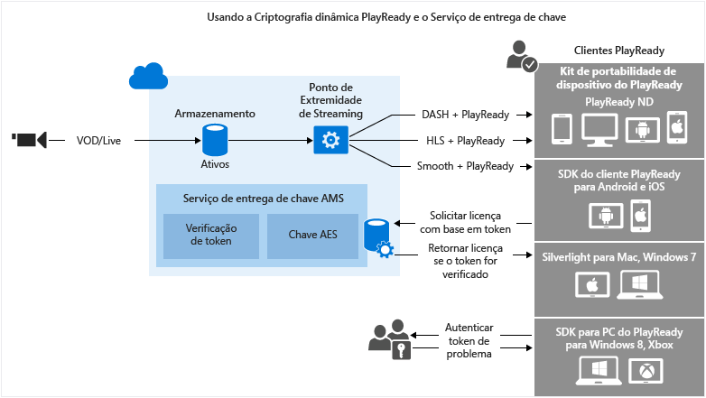

<properties
	pageTitle="Usar o serviço de distribuição de licenças e criptografia dinâmica DRM PlayReady"
	description="Os Serviços de Mídia do Microsoft Azure permitem fornecer fluxos MPEG-DASH, Smooth Streaming e HLS (Http Live Streaming) protegidos com o DRM do Microsoft PlayReady. Este tópico mostra como criptografar dinamicamente com o PlayReady DRM e usar o serviço de distribuição de chaves."
	services="media-services"
	documentationCenter=""
	authors="Juliako"
	manager="dwrede"
	editor=""/>

<tags
	ms.service="media-services"
	ms.workload="media"
	ms.tgt_pltfrm="na"
	ms.devlang="na"
	ms.topic="get-started-article" 
	ms.date="08/06/2015"
	ms.author="juliako"/>

#Usar o serviço de distribuição de licenças e criptografia dinâmica DRM PlayReady

Os Serviços de Mídia do Microsoft Azure permitem fornecer fluxos MPEG-DASH, Smooth Streaming e HLS (Http Live Streaming) protegidos com o [DRM do Microsoft PlayReady](https://www.microsoft.com/playready/overview/).

Os Serviços de Mídia agora fornecem um serviço de distribuição de licenças do Microsoft PlayReady. Os Serviços de Mídia também fornecem APIs que permitem que você configure os direitos e restrições que você deseja que sejam impostos pelo tempo de execução do DRM do PlayReady quando um usuário está tentando reproduzir conteúdo protegido. Quando um usuário faz uma solicitação para ver conteúdo protegido do PlayReady, o aplicativo player cliente solicita esse conteúdo dos Serviços de Mídia do Azure. Os Serviços de Mídia do Azure redirecionam o cliente para um servidor de licenciamento PlayReady dos Serviços de Mídia do Azure que autentica e autoriza o acesso do usuário ao conteúdo. Uma licença do PlayReady contém a chave de descriptografia que pode ser usada pelo player cliente para descriptografar e transmitir o conteúdo.

Os serviços de mídia oferecem suporte a várias maneiras de autenticar os usuários que fazem solicitações de chave. A política de autorização de chave de conteúdo pode ter uma ou mais restrições de autorização: aberta, restrição de token ou restrição de IP. A política restrita do token deve ser acompanhada por um token emitido por um Secure Token Service (STS). Os Serviços de Mídia dão suporte a tokens no formato SWT ([Tokens Web Simples](https://msdn.microsoft.com/library/gg185950.aspx#BKMK_2)) e no formato JWT ([Token Web JSON](https://msdn.microsoft.com/library/gg185950.aspx#BKMK_3)). Para saber mais, consulte Configurar a política de autorização de chave de conteúdo.

Para tirar proveito da criptografia dinâmica, você precisa ter um ativo que contenha um conjunto de arquivos MP4 com múltiplas taxas de bits ou arquivos de origem de Smooth Streaming com múltiplas taxas de bits. Você também precisa configurar a política de entrega para o ativo (descrita mais adiante neste tópico). Em seguida, com base no formato especificado na URL de streaming, o servidor de streaming sob demanda garantirá que você receba o fluxo no protocolo escolhido por você. Como resultado você só precisa armazenar e pagar pelos arquivos em um único formato de armazenamento, e os Serviços de Mídia vão criar e fornecer a resposta apropriada com base nas solicitações de um cliente.

Este tópico poderá ser útil para desenvolvedores que trabalham em aplicativos que entregam mídia protegida. O tópico mostra como configurar o serviço de distribuição de licenças com políticas de autorização para que somente clientes autorizados possam receber licenças do PlayReady. Ele também mostra como usar criptografia dinâmica.

>[AZURE.NOTE]Para começar a usar criptografia dinâmica, é necessário primeiro obter pelo menos uma unidade de escala (também conhecida como unidade de streaming). Para obter mais informações, consulte [Como dimensionar um serviço de mídia](media-services-manage-origins.md#scale_streaming_endpoints).

##Fluxo de trabalho de distribuição de licenças do PlayReady e criptografia dinâmica do PlayReady

A seguir estão as etapas gerais que você precisará executar ao proteger seus ativos com o PlayReady, usando o serviço de distribuição de licenças dos Serviços de Mídia e também usando criptografia dinâmica.

1. Criar um ativo e carregar arquivos no ativo. 
1. Codificar o ativo contendo o arquivo para o conjunto de MP4 de taxa de bits adaptável.
1. Criar uma chave de conteúdo e associá-la ao ativo codificado. Nos Serviços de Mídia, a chave de conteúdo contém a chave de criptografia do ativo. Para obter mais informações, consulte ContentKey.
1. Configurar a política de autorização da chave de conteúdo. A política de autorização de chave de conteúdo deve ser configurada por você e atendida pelo cliente para que a chave de conteúdo seja entregue ao cliente. 
1. Configurar a política de entrega para um ativo. A configuração da política de entrega inclui: protocolo de entrega (por exemplo, MPEG DASH, HLS, HDS, Smooth Streaming ou todos), o tipo de criptografia dinâmica (por exemplo, criptografia comum) e a URL de aquisição de licença do PlayReady. 
 
	Você poderia aplicar uma política diferente a cada protocolo no mesmo ativo. Por exemplo, você poderia aplicar criptografia PlayReady a Smooth/DASH e aplicar Envelope de AES a HLS. Todos os protocolos que não são definidos em uma política de entrega (por exemplo, você adicionar uma única política que só especifica HLS como o protocolo) será bloqueado a partir do streaming. A exceção a isso é se você não tiver nenhuma política de entrega de ativos definida em todos. Em seguida, todos os protocolos poderão ser criptografados.
1. Criar um localizador OnDemand para obter uma URL de streaming.

Você encontrará um exemplo de .NET completo no final do tópico.

A imagem a seguir demonstra o fluxo de trabalho descrito acima. Aqui, o token é usado para autenticação.

O restante deste tópico fornece explicações detalhadas, exemplos de código e links para tópicos que mostram como realizar as tarefas descritas acima.

##Limitações atuais

Se você adicionar ou atualizar a política de fornecimento do ativo, você deve excluir um localizador existente (se houver) e criar um novo localizador.

##Criar um ativo e carregar arquivos no ativo

Para gerenciar, codificar e transmitir seus vídeos, você deve primeiro carregar o conteúdo nos Serviços de Mídia do Microsoft Azure. Depois de carregado, seu conteúdo é armazenado com segurança na nuvem para processamento adicional e transmissão.

O trecho de código a seguir mostra como criar um ativo e carregar o arquivo especificado no ativo.

	static public IAsset UploadFileAndCreateAsset(string singleFilePath)
	{
	    if(!File.Exists(singleFilePath))
	    {
	        Console.WriteLine("File does not exist.");
	        return null;
	    }
	
	    var assetName = Path.GetFileNameWithoutExtension(singleFilePath);
	    IAsset inputAsset = _context.Assets.Create(assetName, AssetCreationOptions.StorageEncrypted);
	
	    var assetFile = inputAsset.AssetFiles.Create(Path.GetFileName(singleFilePath));
	
	    Console.WriteLine("Created assetFile {0}", assetFile.Name);
	
	    var policy = _context.AccessPolicies.Create(
	                            assetName,
	                            TimeSpan.FromDays(30),
	                            AccessPermissions.Write | AccessPermissions.List);
	
	    var locator = _context.Locators.CreateLocator(LocatorType.Sas, inputAsset, policy);
	
	    Console.WriteLine("Upload {0}", assetFile.Name);
	
	    assetFile.Upload(singleFilePath);
	    Console.WriteLine("Done uploading {0}", assetFile.Name);
	
	    locator.Delete();
	    policy.Delete();
	
	    return inputAsset;
	}

##Codificar o ativo contendo o arquivo para o conjunto de MP4 de taxa de bits adaptável

Com a criptografia dinâmica, tudo o que você precisa fazer é criar um ativo que contenha um conjunto de arquivos MP4 com múltiplas taxas de bits ou arquivos de origem de Smooth Streaming com múltiplas taxas de bits. Em seguida, com base no formato especificado na solicitação de fragmento ou manifesto, o servidor de Streaming OnDemand garantirá que você receba o fluxo no protocolo escolhido por você. Como resultado você só precisa armazenar e pagar pelos arquivos em um único formato de armazenamento, e os Serviços de Mídia vão criar e fornecer a resposta apropriada com base nas solicitações de um cliente. Para obter mais informações, consulte o tópico [Visão Geral do Empacotamento Dinâmico](media-services-dynamic-packaging-overview.md).

O trecho de código a seguir mostra como codificar um ativo para o conjunto de MP4 com taxa de bits adaptável:

	static public IAsset EncodeToAdaptiveBitrateMP4Set(IAsset inputAsset)
	{
	    var encodingPreset = "H264 Adaptive Bitrate MP4 Set 720p";
	
	    IJob job = _context.Jobs.Create(String.Format("Encoding into Mp4 {0} to {1}",
	                            inputAsset.Name,
	                            encodingPreset));
	
	    var mediaProcessors = 
	        _context.MediaProcessors.Where(p => p.Name.Contains("Media Encoder")).ToList();
	
	    var latestMediaProcessor = 
	        mediaProcessors.OrderBy(mp => new Version(mp.Version)).LastOrDefault();
	
	
	
	    ITask encodeTask = job.Tasks.AddNew("Encoding", latestMediaProcessor, encodingPreset, TaskOptions.None);
	    encodeTask.InputAssets.Add(inputAsset);
	    encodeTask.OutputAssets.AddNew(String.Format("{0} as {1}", inputAsset.Name, encodingPreset), AssetCreationOptions.StorageEncrypted);
	
	    job.StateChanged += new EventHandler<JobStateChangedEventArgs>(JobStateChanged);
	    job.Submit();
	    job.GetExecutionProgressTask(CancellationToken.None).Wait();
	
	    return job.OutputMediaAssets[0];
	}
	
	static private void JobStateChanged(object sender, JobStateChangedEventArgs e)
	{
	    Console.WriteLine(string.Format("{0}\n  State: {1}\n  Time: {2}\n\n",
	        ((IJob)sender).Name,
	        e.CurrentState,
	        DateTime.UtcNow.ToString(@"yyyy_M_d__hh_mm_ss")));
	}

##Criar uma chave de conteúdo e associá-la ao ativo codificado

Nos Serviços de Mídia, a chave de conteúdo contém a chave com a qual você deseja criptografar um ativo.

Para obter informações detalhadas, consulte [Criar chave de conteúdo](media-services-dotnet-create-contentkey.md).

##Configurar a política de autorização da chave de conteúdo

Os serviços de mídia oferecem suporte a várias maneiras de autenticar os usuários que fazem solicitações de chave. A política de autorização de chave de conteúdo deve ser configurada por você e atendida pelo cliente (player) para que a chave seja entregue ao cliente. A política de autorização de chave de conteúdo pode ter uma ou mais restrições de autorização: aberta, restrição de token ou restrição de IP.

Para obter informações detalhadas, consulte [Configurar política de autorização de chave de conteúdo](media-services-dotnet-configure-content-key-auth-policy.md#playready-dynamic-encryption).

##Configurar política de entrega de ativos 

Configure a política de entrega para seu ativo. Algumas coisas incluídas na configuração de política de entrega de ativos:

- A URL de aquisição de licença do PlayReady. 
- O protocolo de entrega de ativos (por exemplo, MPEG DASH, HLS, HDS, Smooth Streaming ou todos). 
- O tipo de criptografia dinâmica (nesse caso, criptografia comum). 

Para obter informações detalhadas, consulte [Configurar política de entrega de ativos](media-services-rest-configure-asset-delivery-policy.md).

##Criar um localizador de streaming OnDemand para obter uma URL de streaming

Você precisará fornecer ao seu usuário a URL para Smooth Streaming, DASH ou HLS.

>[AZURE.NOTE]Se você adicionar ou atualizar a política de fornecimento do ativo, você deve excluir um localizador existente (se houver) e criar um novo localizador.

Para obter instruções sobre como publicar um ativo e criar uma URL de streaming, consulte [Criar uma URL de streaming](media-services-deliver-streaming-content.md).

##Obter um token de teste

Obtenha um token de teste com base na restrição de token que foi usada para a política de autorização da chave.

	// Deserializes a string containing an Xml representation of a TokenRestrictionTemplate
	// back into a TokenRestrictionTemplate class instance.
	TokenRestrictionTemplate tokenTemplate = 
	    TokenRestrictionTemplateSerializer.Deserialize(tokenTemplateString);
	
	// Generate a test token based on the data in the given TokenRestrictionTemplate.
	//The GenerateTestToken method returns the token without the word “Bearer” in front
	//so you have to add it in front of the token string. 
	string testToken = TokenRestrictionTemplateSerializer.GenerateTestToken(tokenTemplate);
	Console.WriteLine("The authorization token is:\nBearer {0}", testToken);

	
Você pode usar o [AMS Player](http://amsplayer.azurewebsites.net/azuremediaplayer.html) para testar seu fluxo.

##Exemplo

1. Crie um novo projeto de console.
1. Use o NuGet para instalar e adicionar extensões do SDK do .NET dos Serviços de Mídia do Azure. Instalar esse pacote também instala os SDK do .NET dos Serviços de Mídia e adiciona todas as outras dependências necessárias.
2. Adicione o arquivo de configuração que contém o nome da conta e as informações de chave:

	
		<?xml version="1.0" encoding="utf-8"?>
		<configuration>
		    <startup> 
		        <supportedRuntime version="v4.0" sku=".NETFramework,Version=v4.5" />
		    </startup>
			  <appSettings>
			
			    <add key="MediaServicesAccountName" value="AccountName"/>
			    <add key="MediaServicesAccountKey" value="AccountKey"/>
			
			    <add key="Issuer" value="http://testacs.com"/>
			    <add key="Audience" value="urn:test"/>
			  </appSettings>
		</configuration>

1. Substitua o código no seu arquivo Program.cs pelo código mostrado nesta seção.
	
	Certifique-se de atualizar as variáveis para que indiquem as pastas onde estão localizados os arquivos de entrada.

		using System;
		using System.Collections.Generic;
		using System.Configuration;
		using System.IO;
		using System.Linq;
		using System.Text;
		using System.Threading;
		using System.Threading.Tasks;
		using System.Xml.Linq;
		using Microsoft.WindowsAzure.MediaServices.Client;
		using Microsoft.WindowsAzure.MediaServices.Client.ContentKeyAuthorization;
		using Microsoft.WindowsAzure.MediaServices.Client.DynamicEncryption;
		
		namespace PlayReadyDynamicEncryptAndKeyDeliverySvc
		{
		    class Program
		    {
		        // Read values from the App.config file.
		        private static readonly string _mediaServicesAccountName =
		            ConfigurationManager.AppSettings["MediaServicesAccountName"];
		        private static readonly string _mediaServicesAccountKey =
		            ConfigurationManager.AppSettings["MediaServicesAccountKey"];
		
		        private static readonly Uri _sampleIssuer =
		            new Uri(ConfigurationManager.AppSettings["Issuer"]);
		        private static readonly Uri _sampleAudience =
		            new Uri(ConfigurationManager.AppSettings["Audience"]);
		
		        // Field for service context.
		        private static CloudMediaContext _context = null;
		        private static MediaServicesCredentials _cachedCredentials = null;
		
		        private static readonly string _mediaFiles =
		            Path.GetFullPath(@"../..\Media");
		
		        private static readonly string _singleMP4File =
		            Path.Combine(_mediaFiles, @"BigBuckBunny.mp4");
		
		        static void Main(string[] args)
		        {
		            // Create and cache the Media Services credentials in a static class variable.
		            _cachedCredentials = new MediaServicesCredentials(
		                            _mediaServicesAccountName,
		                            _mediaServicesAccountKey);
		            // Used the cached credentials to create CloudMediaContext.
		            _context = new CloudMediaContext(_cachedCredentials);
		
		            bool tokenRestriction = false;
		            string tokenTemplateString = null;
		
		            IAsset asset = UploadFileAndCreateAsset(_singleMP4File);
		            Console.WriteLine("Uploaded asset: {0}", asset.Id);
		
		            IAsset encodedAsset = EncodeToAdaptiveBitrateMP4Set(asset);
		            Console.WriteLine("Encoded asset: {0}", encodedAsset.Id);
		
		            IContentKey key = CreateCommonTypeContentKey(encodedAsset);
		            Console.WriteLine("Created key {0} for the asset {1} ", key.Id, encodedAsset.Id);
		            Console.WriteLine("PlayReady License Key delivery URL: {0}", key.GetKeyDeliveryUrl(ContentKeyDeliveryType.PlayReadyLicense));
		            Console.WriteLine();
		    
		            if (tokenRestriction)
		                tokenTemplateString = AddTokenRestrictedAuthorizationPolicy(key);
		            else
		                AddOpenAuthorizationPolicy(key);
		
		            Console.WriteLine("Added authorization policy: {0}", key.AuthorizationPolicyId);
		            Console.WriteLine();
		
		            CreateAssetDeliveryPolicy(encodedAsset, key);
		            Console.WriteLine("Created asset delivery policy. \n");
		            Console.WriteLine();
		
		            if (tokenRestriction && !String.IsNullOrEmpty(tokenTemplateString))
		            {
		                // Deserializes a string containing an Xml representation of a TokenRestrictionTemplate
		                // back into a TokenRestrictionTemplate class instance.
		                TokenRestrictionTemplate tokenTemplate =
		                    TokenRestrictionTemplateSerializer.Deserialize(tokenTemplateString);
		
		                // Generate a test token based on the the data in the given TokenRestrictionTemplate.
		                // Note, you need to pass the key id Guid because we specified 
		                // TokenClaim.ContentKeyIdentifierClaim in during the creation of TokenRestrictionTemplate.
		                Guid rawkey = EncryptionUtils.GetKeyIdAsGuid(key.Id);
		
		                //The GenerateTestToken method returns the token without the word “Bearer” in front
		                //so you have to add it in front of the token string. 
		                string testToken = TokenRestrictionTemplateSerializer.GenerateTestToken(tokenTemplate, null, rawkey, DateTime.UtcNow.AddDays(365));
		                Console.WriteLine("The authorization token is:\nBearer {0}", testToken);
		                Console.WriteLine();
		            }
		
		            // You can use the http://smf.cloudapp.net/healthmonitor player 
		            // to test the smoothStreamURL URL.
		            //
		            string url = GetStreamingOriginLocator(encodedAsset);
		            Console.WriteLine("Encrypted Smooth Streaming URL: {0}/manifest", url);
		
		
		            Console.ReadLine();
		        }
		
		        static public IAsset UploadFileAndCreateAsset(string singleFilePath)
		        {
		            if (!File.Exists(singleFilePath))
		            {
		                Console.WriteLine("File does not exist.");
		                return null;
		            }
		
		            var assetName = Path.GetFileNameWithoutExtension(singleFilePath);
		            IAsset inputAsset = _context.Assets.Create(assetName, AssetCreationOptions.StorageEncrypted);
		
		            var assetFile = inputAsset.AssetFiles.Create(Path.GetFileName(singleFilePath));
		
		            Console.WriteLine("Created assetFile {0}", assetFile.Name);
		
		            var policy = _context.AccessPolicies.Create(
		                                    assetName,
		                                    TimeSpan.FromDays(30),
		                                    AccessPermissions.Write | AccessPermissions.List);
		
		            var locator = _context.Locators.CreateLocator(LocatorType.Sas, inputAsset, policy);
		
		            Console.WriteLine("Upload {0}", assetFile.Name);
		
		            assetFile.Upload(singleFilePath);
		            Console.WriteLine("Done uploading {0}", assetFile.Name);
		
		            locator.Delete();
		            policy.Delete();
		
		            return inputAsset;
		        }
		
		
		        static public IAsset EncodeToAdaptiveBitrateMP4Set(IAsset inputAsset)
		        {
		            var encodingPreset = "H264 Adaptive Bitrate MP4 Set 720p";
		
		            IJob job = _context.Jobs.Create(String.Format("Encoding into Mp4 {0} to {1}",
		                                    inputAsset.Name,
		                                    encodingPreset));
		
		            var mediaProcessors =
		                _context.MediaProcessors.Where(p => p.Name.Contains("Media Encoder")).ToList();
		
		            var latestMediaProcessor =
		                mediaProcessors.OrderBy(mp => new Version(mp.Version)).LastOrDefault();
		
		
		
		            ITask encodeTask = job.Tasks.AddNew("Encoding", latestMediaProcessor, encodingPreset, TaskOptions.None);
		            encodeTask.InputAssets.Add(inputAsset);
		            encodeTask.OutputAssets.AddNew(String.Format("{0} as {1}", inputAsset.Name, encodingPreset), AssetCreationOptions.StorageEncrypted);
		
		            job.StateChanged += new EventHandler<JobStateChangedEventArgs>(JobStateChanged);
		            job.Submit();
		            job.GetExecutionProgressTask(CancellationToken.None).Wait();
		
		            return job.OutputMediaAssets[0];
		        }
		
		
		        static public IContentKey CreateCommonTypeContentKey(IAsset asset)
		        {
		            // Create envelope encryption content key
		            Guid keyId = Guid.NewGuid();
		            byte[] contentKey = GetRandomBuffer(16);
		
		            IContentKey key = _context.ContentKeys.Create(
		                                    keyId,
		                                    contentKey,
		                                    "ContentKey",
		                                    ContentKeyType.CommonEncryption);
		
		            // Associate the key with the asset.
		            asset.ContentKeys.Add(key);
		
		            return key;
		        }
		
		    static public void AddOpenAuthorizationPolicy(IContentKey contentKey)
		    {
		
		        // Create ContentKeyAuthorizationPolicy with Open restrictions 
		        // and create authorization policy          
		
		        List<ContentKeyAuthorizationPolicyRestriction> restrictions = new List<ContentKeyAuthorizationPolicyRestriction>
		        {
		            new ContentKeyAuthorizationPolicyRestriction 
		            { 
		                Name = "Open", 
		                KeyRestrictionType = (int)ContentKeyRestrictionType.Open, 
		                Requirements = null
		            }
		        };
		
		        // Configure PlayReady license template.
		        string newLicenseTemplate = ConfigurePlayReadyLicenseTemplate();
		
		        IContentKeyAuthorizationPolicyOption policyOption =
		            _context.ContentKeyAuthorizationPolicyOptions.Create("",
		                ContentKeyDeliveryType.PlayReadyLicense,
		                    restrictions, newLicenseTemplate);
		
		        IContentKeyAuthorizationPolicy contentKeyAuthorizationPolicy = _context.
		                    ContentKeyAuthorizationPolicies.
		                    CreateAsync("Deliver Common Content Key with no restrictions").
		                    Result;
		
		
		        contentKeyAuthorizationPolicy.Options.Add(policyOption);
		
		        // Associate the content key authorization policy with the content key.
		        contentKey.AuthorizationPolicyId = contentKeyAuthorizationPolicy.Id;
		        contentKey = contentKey.UpdateAsync().Result;
		    }
		
		        public static string AddTokenRestrictedAuthorizationPolicy(IContentKey contentKey)
		        {
		            string tokenTemplateString = GenerateTokenRequirements();
		
		            IContentKeyAuthorizationPolicy policy = _context.
		                                    ContentKeyAuthorizationPolicies.
		                                    CreateAsync("HLS token restricted authorization policy").Result;
		
		            List<ContentKeyAuthorizationPolicyRestriction> restrictions = new List<ContentKeyAuthorizationPolicyRestriction>
		            {
		                new ContentKeyAuthorizationPolicyRestriction 
		                { 
		                    Name = "Token Authorization Policy", 
		                    KeyRestrictionType = (int)ContentKeyRestrictionType.TokenRestricted,
		                    Requirements = tokenTemplateString, 
		                }
		            };
		
		            // Configure PlayReady license template.
		            string newLicenseTemplate = ConfigurePlayReadyLicenseTemplate();
		
		            IContentKeyAuthorizationPolicyOption policyOption =
		                _context.ContentKeyAuthorizationPolicyOptions.Create("Token option",
		                    ContentKeyDeliveryType.PlayReadyLicense,
		                        restrictions, newLicenseTemplate);
		
		            IContentKeyAuthorizationPolicy contentKeyAuthorizationPolicy = _context.
		                        ContentKeyAuthorizationPolicies.
		                        CreateAsync("Deliver Common Content Key with no restrictions").
		                        Result;
		            
		            policy.Options.Add(policyOption);
		
		            // Add ContentKeyAutorizationPolicy to ContentKey
		            contentKeyAuthorizationPolicy.Options.Add(policyOption);
		
		            // Associate the content key authorization policy with the content key
		            contentKey.AuthorizationPolicyId = contentKeyAuthorizationPolicy.Id;
		            contentKey = contentKey.UpdateAsync().Result;
		
		            return tokenTemplateString;
		        }
		
		        static private string GenerateTokenRequirements()
		        {
		            TokenRestrictionTemplate template = new TokenRestrictionTemplate(TokenType.SWT);
		
		            template.PrimaryVerificationKey = new SymmetricVerificationKey();
		            template.AlternateVerificationKeys.Add(new SymmetricVerificationKey());
		            template.Audience = _sampleAudience;
		            template.Issuer = _sampleIssuer;
		            template.RequiredClaims.Add(TokenClaim.ContentKeyIdentifierClaim);
		
		            return TokenRestrictionTemplateSerializer.Serialize(template);
		        } 
		
		        static private string ConfigurePlayReadyLicenseTemplate()
		        {
		            // The following code configures PlayReady License Template using .NET classes
		            // and returns the XML string.
		             
		            PlayReadyLicenseResponseTemplate responseTemplate = new PlayReadyLicenseResponseTemplate();
		            PlayReadyLicenseTemplate licenseTemplate = new PlayReadyLicenseTemplate();
		
		            responseTemplate.LicenseTemplates.Add(licenseTemplate);
		
		            return MediaServicesLicenseTemplateSerializer.Serialize(responseTemplate);
		        }
		
		        static public void CreateAssetDeliveryPolicy(IAsset asset, IContentKey key)
		        {
		            Uri acquisitionUrl = key.GetKeyDeliveryUrl(ContentKeyDeliveryType.PlayReadyLicense);
		
		            Dictionary<AssetDeliveryPolicyConfigurationKey, string> assetDeliveryPolicyConfiguration =
		                new Dictionary<AssetDeliveryPolicyConfigurationKey, string>
		            {
		                {AssetDeliveryPolicyConfigurationKey.PlayReadyLicenseAcquisitionUrl, acquisitionUrl.ToString()},
		            };
		
		            var assetDeliveryPolicy = _context.AssetDeliveryPolicies.Create(
		                    "AssetDeliveryPolicy",
		                AssetDeliveryPolicyType.DynamicCommonEncryption,
		                AssetDeliveryProtocol.SmoothStreaming,
		                assetDeliveryPolicyConfiguration);
		
		            // Add AssetDelivery Policy to the asset
		            asset.DeliveryPolicies.Add(assetDeliveryPolicy);
		
		            Console.WriteLine();
		            Console.WriteLine("Adding Asset Delivery Policy: " +
		                assetDeliveryPolicy.AssetDeliveryPolicyType);
		        }
		
		
		        /// 

		        /// Gets the streaming origin locator.
		        /// 

		        /// <param name="assets"></param>
		        /// <returns></returns>
		        static public string GetStreamingOriginLocator(IAsset asset)
		        {
		
		            // Get a reference to the streaming manifest file from the  
		            // collection of files in the asset. 
		
		            var assetFile = asset.AssetFiles.Where(f => f.Name.ToLower().
		                                         EndsWith(".ism")).
		                                         FirstOrDefault();
		
		            // Create a 30-day readonly access policy. 
		            IAccessPolicy policy = _context.AccessPolicies.Create("Streaming policy",
		                TimeSpan.FromDays(30),
		                AccessPermissions.Read);
		
		            // Create a locator to the streaming content on an origin. 
		            ILocator originLocator = _context.Locators.CreateLocator(LocatorType.OnDemandOrigin, asset,
		                policy,
		                DateTime.UtcNow.AddMinutes(-5));
		
		            // Create a URL to the manifest file. 
		            return originLocator.Path + assetFile.Name;
		        }
		
		        static private void JobStateChanged(object sender, JobStateChangedEventArgs e)
		        {
		            Console.WriteLine(string.Format("{0}\n  State: {1}\n  Time: {2}\n\n",
		                ((IJob)sender).Name,
		                e.CurrentState,
		                DateTime.UtcNow.ToString(@"yyyy_M_d__hh_mm_ss")));
		        }
		
		        static private byte[] GetRandomBuffer(int length)
		        {
		            var returnValue = new byte[length];
		
		            using (var rng =
		                new System.Security.Cryptography.RNGCryptoServiceProvider())
		            {
		                rng.GetBytes(returnValue);
		            }
		
		            return returnValue;
		        }
		    }
		}

<!---HONumber=August15_HO7-->