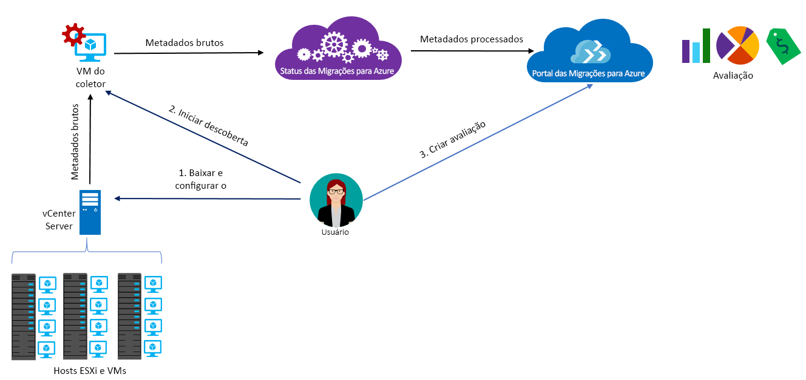

# Sobre as Migrações para Azure

O serviço Migrações para Azure avalia as cargas de trabalho locais para migração para o Azure. O serviço avalia a adequação da migração de máquinas locais, realiza o dimensionamento com base no desempenho e fornece estimativas de custo para a execução das máquinas locais no Azure. Se está considerando as migrações lift-and-shift ou se está nos primeiros estágios da migração, este serviço é para você. Após a avaliação, você pode usar serviços como o [Azure Site Recovery](https://docs.microsoft.com/azure/site-recovery/site-recovery-overview) e o [Serviço de Migração de Banco de Dados do Azure](https://docs.microsoft.com/azure/dms/dms-overview) para migrar as máquinas para o Azure.

## Por que usar Migrações para Azure?

As Migrações para Azure ajudam você a:

- **Avaliar a preparação para o Azure**: avalie se os computadores locais são adequados para execução no Azure.
- **Obter recomendações de tamanho**: obtenha recomendações de tamanho para VMs do Azure com base no histórico de desempenho das VMs locais.
- **Estimar custos mensais**: obtenha custos estimados para execução de computadores locais no Azure.  
- **Migrar com confiança alta**: visualize as dependências de computadores locais para criar grupos de computadores que serão avaliados e migrados juntos.

## Limitações atuais

- Só é possível acessar as máquinas virtuais (VMs) VMware locais para migração a VMs do Azure. As VMs VMware devem ser gerenciadas por um vCenter Server (versão 5.5, 6.0 ou 6.5).
- Se você quer avaliar as VMs Hyper-V e servidores físicos, use o [Planejador de Implantações do Azure Site Recovery](https://aka.ms/asr-dp-hyperv-doc) para Hyper-V e nossas [ferramentas de parceiros](https://azure.microsoft.com/migration/partners/) para computadores físicos.
- Você pode encontrar até 1.500 VMs em uma única descoberta e até 1.500 VMs em um único projeto. Além disso, pode estimar até 1.500 VMs em uma única avaliação.
- Caso deseje descobrir um ambiente maior, você pode dividir a descoberta e criar vários projetos. [Saiba mais](how-to-scale-assessment.md). As Migrações para Azure oferecem suporte a até 20 projetos por assinatura.
- As Migrações para Azure são compatíveis com discos gerenciados apenas para avaliação de migração.
-  Você só pode criar um projeto das Migrações para Azure nas seguintes regiões geográficas. No entanto, isso não restringe sua capacidade de criar avaliações para outros locais do Azure de destino.
    **Geografia** | **Localização de armazenamento**
    --- | ---
    Estados Unidos | Centro-oeste dos EUA ou Leste dos EUA
    Azure Government | Gov. dos EUA – Virgínia

    A geografia associada ao projeto de migração é usada apenas para armazenar os metadados descobertos no ambiente local. Metadados são armazenados em uma das regiões com base na geografia especificada para o projeto de migração. Se você usar a visualização de dependência criando um novo workspace do Log Analytics, ele é criado na mesma região que o projeto.
- A funcionalidade de visualização de dependências não está disponível no Azure Governamental.

## Pelo que eu preciso pagar?

[Saiba mais](https://azure.microsoft.com/pricing/details/azure-migrate/) sobre os preços das Migrações para Azure.

## O que é uma avaliação?

As configurações de avaliação podem ser personalizadas de acordo com suas necessidades. As propriedades de avaliação estão resumidas na tabela a seguir.

**Propriedade** | **Detalhes**
--- | ---
**Local de destino** | O local do Azure para o qual você deseja migrar.  Atualmente, as Migrações para Azure dão suporte a 33 regiões como locais de destino da migração. [Verificar regiões](https://azure.microsoft.com/global-infrastructure/services/). Por padrão, a região de destino é definida como Oeste dos EUA 2.
**Tipo de armazenamento** | O tipo de discos gerenciados que você quer alocar para todas as VMs fazem parte da avaliação. Se o critério de dimensionamento for *como dimensionamento local* você pode especificar o tipo de disco de destino como discos premium (padrão), discos SSD standard ou discos HDD standard. Para *dimensionamento com base no desempenho*, juntamente com as opções acima, você também tem a opção de selecionar Automático, o que garantirá que a recomendação de dimensionamento de disco seja feita automaticamente com base nos dados de desempenho das VMs. Por exemplo, para obter um [SLA de VM de instância única de 99,9%](https://azure.microsoft.com/support/legal/sla/virtual-machines/v1_8/), você talvez queira especificar o tipo de armazenamento como discos gerenciados Premium que garantam que todos os discos na avaliação sejam recomendados como discos gerenciados Premium. Observe que as Migrações para Azure são compatíveis apenas com discos gerenciados para avaliação de migração.
**Instâncias reservadas** |  Se você tem [instâncias reservadas](https://azure.microsoft.com/pricing/reserved-vm-instances/) no Azure. As Migrações para Azure calculam o custo de acordo com isso.
**Critério de dimensionamento** | O dimensionamento pode ser baseado no **histórico de desempenho** das VMs locais (padrão) ou **como local**, sem considerar o histórico de desempenho.
**Histórico de desempenho** | Por padrão, as Migrações para Azure avaliam o desempenho das máquinas locais usando o histórico de desempenho do último dia, com um valor de percentil de 95%.
**Fator de conforto** | As Migrações para Azure consideram um buffer (fator de conforto) durante a avaliação. Esse buffer é aplicado sobre os dados de utilização da máquina para VMs (CPU, memória, disco e rede). O fator de conforto considera problemas como uso sazonal, histórico curto de desempenho e aumento provável do uso futuro.   Por exemplo, uma VM com 10 núcleos e 20% de utilização normalmente resulta em uma VM de dois núcleos. No entanto, com um fator de conforto de 2.0x, o resultado é uma VM de quatro núcleos. A configuração de conforto padrão é de 1.3 x.
**Série de VM** | A série de VM usada para estimativas de tamanho. Por exemplo, se você tiver um ambiente de produção que não pretende migrar para VMs da série A no Azure, poderá excluir a série A da lista ou da série. O dimensionamento baseia-se apenas na série selecionada.   
**Moeda** | Moeda de cobrança. O padrão é dólares americanos.
**Desconto (%)** | Qualquer desconto específico da assinatura  recebido por você sobre a oferta do Azure. A configuração padrão é 0%.
**Tempo de atividade da VM** | Se as VMs não estiverem em execução 24x7 no Azure, será possível especificar a duração da execução (número de dias por mês e número de horas por dia) e as estimativas de custo serão feitas adequadamente. O valor padrão é 31 dias por mês e 24 horas por dia.
**Oferta do Azure** | A [oferta do Azure](https://azure.microsoft.com/support/legal/offer-details/) na qual você se inscreveu. As Migrações para Azure calculam o custo de acordo com isso.
**Benefício Híbrido do Azure** | Se você tem a garantia do software e está qualificado para o [Benefício Híbrido do Azure](https://azure.microsoft.com/pricing/hybrid-use-benefit/) com desconto nos valores.

## Como funcionam as Migrações para Azure?

1.  Você cria um projeto das Migrações para Azure.
2.  As Migrações para Azure usam uma VM local chamada dispositivo coletor para descobrir informações sobre suas máquinas locais. Para criar o dispositivo, baixe o arquivo de configuração no formato Open Virtualization Appliance (.ova) e importe-o como uma VM em seu servidor local do vCenter Server.
3. Você se conecta à VM do vCenter Server e especifica uma nova senha para ele durante a conexão.
4. Execute o coletor na VM para iniciar a descoberta.
5. O coletor coleta metadados da VM usando os cmdlets de VMware PowerCLI. A descoberta não tem agente e não instala nada em VMs ou hosts VMware. Os metadados coletados incluem informações da VM (núcleos, memória, discos, tamanhos de disco e adaptadores de rede). Também coleta dados de desempenho para VMs, incluindo CPU e uso da memória, IOPS de disco, taxa de transferência do disco (MBps) e saída da rede (MBps).
5.  Os metadados são enviados para o projeto das Migrações para Azure. Consulte-os no Portal do Azure.
6.  Para fins de avaliação, junte as VMs descobertas em grupos. Por exemplo, agrupe as VMs que executam o mesmo aplicativo. Para um agrupamento mais preciso, você pode usar a visualização de dependência para exibir as dependências de um computador específico ou para todos os computadores em um grupo e refinar o grupo.
7.  Após o grupo ser definido, crie uma avaliação para ele.
8.  Após a conclusão da avaliação, você poderá exibi-la no portal ou baixá-la no formato do Excel.

  

## Quais são os requisitos de porta?

A tabela resume as portas necessárias para as comunicações das Migrações para Azure.

Componente | Comunica-se com |  Detalhes
--- | --- |---
Coletor  | Serviço Migrações para Azure | O coletor se conecta ao serviço através da porta SSL 443.
Coletor | vCenter Server | Por padrão, o coletor se conecta ao vCenter Server na porta 443. Se o servidor escutar em uma porta diferente, configure-a como uma porta de saída na VM coletora.
VM local | Workspace do Log Analytics | [TCP 443] | [O MMA (Microsoft Monitoring Agent)](../log-analytics/log-analytics-windows-agent.md) usa a porta TCP 443 para se conectar ao Log Analytics. Você só precisará dessa porta se estiver usando a visualização de dependência, que requer o agente MMA.

## O que acontece após a avaliação?

Após a avaliação das máquinas locais, você poderá usar algumas ferramentas para executar a migração:

- **Azure Site Recovery**: você pode usar o Azure Site Recovery para migrar para o Azure. Para fazer isso, [prepare os componentes do Azure](../site-recovery/tutorial-prepare-azure.md) necessários, incluindo uma conta de armazenamento e uma rede virtual. No local, [prepare seu ambiente VMware](../site-recovery/vmware-azure-tutorial-prepare-on-premises.md). Quando tudo estiver preparado, configure e habilite a replicação para o Azure e migre as VMs. [Saiba mais](../site-recovery/vmware-azure-tutorial.md).
- **Migração de Banco de Dados do Azure**: se as máquinas locais estiverem executando um banco de dados como SQL Server, MySQL ou Oracle, use o [Serviço de Migração de Banco de Dados do Azure](../dms/dms-overview.md) para migrá-los para o Azure.

## Próximas etapas

- [Siga o tutorial](tutorial-assessment-vmware.md) para criar uma avaliação para uma VM VMware local.
- [Reveja as perguntas frequentes](resources-faq.md) sobre Migrações para Azure.
