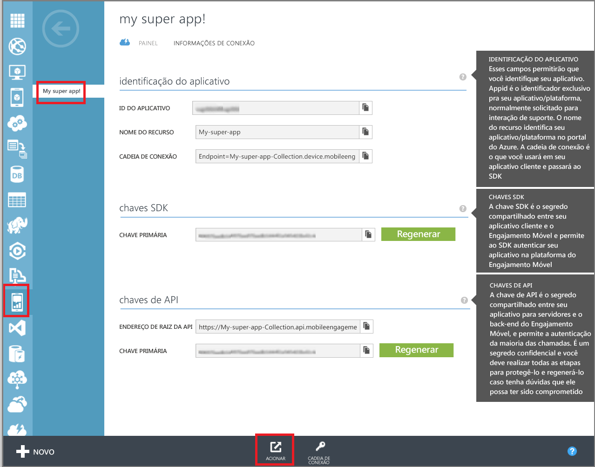

<properties
	pageTitle="Criar um Aplicativo do Azure Mobile Engagement | Microsoft Azure"
	description="Descreve como criar uma nova Coleção de Aplicativos do Mobile Engagement no Azure e começar a gerenciar seus aplicativos com o portal do Mobile Engagement."
	services="mobile-engagement"
	documentationCenter=""
	authors="piyushjo"
	manager="dwrede"
	editor=""/>

<tags
	ms.service="mobile-engagement"
	ms.workload="mobile"
	ms.tgt_pltfrm="mobile-windows-store"
	ms.devlang="na"
	ms.topic="get-started-article"
	ms.date="08/19/2016"  
	ms.author="piyushjo"/>

# Criar um Aplicativo do Azure Mobile Engagement

Este artigo mostra como usar o método **Criação Rápida** para criar um novo Aplicativo do **Azure Mobile Engagement**. O artigo também mostra como navegar até o portal do **Mobile Engagement** para iniciar o monitoramento e o gerenciamento de seus aplicativos.

Observe que você deve adicionar um conjunto mínimo de "integração básica" para poder coletar dados para seu aplicativo e enviar notificações por push. A documentação de integração completa pode ser encontrada na [integração do Mobile Engagement](mobile-engagement-windows-store-integrate-engagement.md)

> [AZURE.IMPORTANT] Para concluir qualquer tutorial do Mobile Engagement do Azure, você precisará ter uma conta ativa do Azure. Se você não tiver uma conta, poderá criar uma conta de avaliação gratuita em apenas alguns minutos. Para obter detalhes, consulte <a href="http://azure.microsoft.com/pricing/free-trial/?WT.mc_id=A0E0E5C02&amp;returnurl=http%3A%2F%2Fwww.windowsazure.com%2Fpt-BR%2Fdevelop%2Fmobile%2Ftutorials%2Fget-started%2F" target="_blank">Avaliação Gratuita do Azure</a>.

##Configurar o Mobile Engagement para seu aplicativo móvel no Azure

[AZURE.INCLUDE [Criar Aplicativo de Mobile Engagement no Portal](../../includes/mobile-engagement-create-app-in-portal.md)]

##Navegue até o portal do Mobile Engagement

Para iniciar o monitoramento e o gerenciamento do seu aplicativo, navegue até o portal do Mobile Engagement clicando no botão **Acionar** na parte inferior.

Quando você estiver no portal do Mobile Engagement, poderá analisar, criar e gerenciar segmentos, acessar os usuários etc.:

- [Monitorar dados em tempo real sobre o seu aplicativo](mobile-engagement-user-interface-monitor.md)
- [Analisar dados históricos sobre seu aplicativo](mobile-engagement-user-interface-analytics.md)
- [Criar e gerenciar segmentos de usuários para identificar padrões de uso](mobile-engagement-user-interface-segments.md)
- [Entrar em contato com os usuários do seu aplicativo com notificações por push](mobile-engagement-user-interface-reach.md)

##Consulte também

[Definir sua estratégia do Mobile Engagement](mobile-engagement-define-your-mobile-engagement-strategy.md)

[Introdução ao Mobile Engagement do Azure](mobile-engagement-windows-store-dotnet-get-started.md) (você pode selecionar outras plataformas móveis na parte superior da página).

<!---HONumber=AcomDC_0824_2016-->