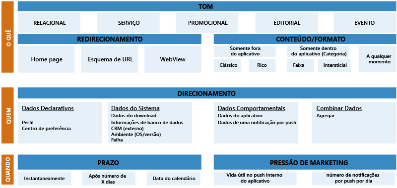
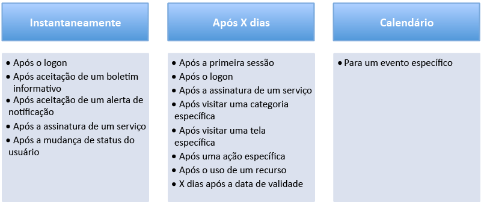

<properties 
	pageTitle="Guia de introdução ao Azure Mobile Engagement com práticas recomendadas"
	description="Guia de introdução ao Azure Mobile Engagement e práticas recomendadas para a integração" 
	services="mobile-engagement" 
	documentationCenter="mobile" 
	authors="wesmc7777"
	manager="dwrede"
	editor=""/>

<tags
	ms.service="mobile-engagement"
	ms.devlang="na"
	ms.topic="article"
	ms.tgt_pltfrm="mobile-multiple"
	ms.workload="mobile" 
	ms.date="09/25/2015"
	ms.author="wesmc"/>

# Azure Mobile Engagement - Guia de introdução com práticas recomendadas

## Visão geral

**A tela do celular é um espaço muito concorrido:** em 2013, um estudo descobriu que o dispositivo móvel médio tinha 27 aplicativos instalados. Os usuários normalmente passam 30 horas por mês em seus aplicativos. A maior parte desse tempo foi passado em redes sociais e em jogos (cerca de 20 horas). Até 2014, o Android disponibilizava cerca de 1,5 milhão de aplicativos para os usuários. A Apple Store continha cerca de 1,2 milhão de aplicativos. O uso de aplicativos móveis não para de aumentar à medida que os desenvolvedores competem nesse mercado em expansão.

O usuário móvel comum instalará e desinstalará aplicativos frequentemente, dependendo das mudança de interesse e nas experiências proporcionadas no aplicativo. Para determinar o êxito de um aplicativo, tornou-se essencial ter mais informações além de quantos usuários instalaram o seu aplicativo. É importante saber a utilidade de seu aplicativo e se essa tendência de uso está mudando. As perguntas a seguir tornam-se importantes:

- Seus usuários estão começando a achar seu aplicativo pouco interessante ou obsoleto? 
- Quantos usuários deixaram de usar seu aplicativo? 
- A tendência de compras no aplicativo está aumentando ou diminuindo?
- Os usuários estão deixando de concluir os fluxos de trabalho devido a problemas com o aplicativo ou pela falta de interesse? 
- Você conseguiria manter a utilidade e relevância de seu aplicativo disponibilizando conteúdo atualizado para sua base de usuários? 
- Esse conteúdo atualizado seria o mesmo para todos os usuários ou estaria focado em segmentos de usuários baseados no comportamento em seu aplicativo? 
 
As respostas a perguntas parecidas poderiam ajudar a estender a vida útil e a receita de seu aplicativo. Elas também podem ajudar você a definir e a manter sua base de usuários.

Os aplicativos relacionados a mídia costumam apresentar a retenção mais alta entre os usuários. Um dos motivos disso é o fornecimento constante de conteúdo atualizado aos usuários. A adoção antecipada de notificações úteis por push direcionadas a um segmento de usuários costuma apresentar um grande impacto sobre a retenção do aplicativo.

O programa Azure Mobile Engagement foi projetado para ajudar você a estender a vida útil e a retenção de seu aplicativo por meio de um método de coleta e análise de informações detalhadas sobre o uso de seu aplicativo. Ele ajudará a classificar sua base de usuários de acordo com o comportamento e a criar campanhas focadas para o envio de notificações por push e mensagens no aplicativo aos segmentos de usuários identificados. Os indicadores chave de desempenho (KPIs) medem o nível de atividade dos usuários em diferentes aspectos de seu aplicativo. O Azure Mobile Engagement fornece os métodos necessários para determinar esses KPIs. Ele ajuda a aumentar o retorno sobre o investimento (ROI), fornecendo a infraestrutura necessária para aumentar o envolvimento com seu aplicativo móvel.

Para tirar o máximo proveito do Azure Mobile Engagement, você precisará começar com um plano de envolvimento bem projetado. Seu plano ajudará você a identificar os dados granulares necessários para que você possa segmentar sua base de usuários. Isso pode ter base no comportamento e em experiências no aplicativo. Para que seu plano seja bem-sucedido, é uma prática recomendada definir claramente o KPI que medirá os objetivos de seu aplicativo. Com os indicadores de desempenho claramente definidos, você pode incorporar facilmente a lógica necessária em seu aplicativo a fim de coletar dados refinados para análise e avaliação dos KPIs. Este tópico é um guia de práticas recomendadas para a definição dos KPIs que serão usados com seu plano de envolvimento.

## Etapa 1: definir os KPIs de acordo com o modelo BET

Definir corretamente os KPIs pode ser uma tarefa bem difícil. Os aplicativos projetados para diversos setores têm suas próprias especificações e objetivos. Isso pode confundir sua abordagem. Para evitar isso, os objetivos e KPIs devem ser classificados em três categorias principais: **Negócios**, **Envolvimento** e **Técnico**. Isso é o que chamamos de **modelo BET**.

Geralmente, um bom plano terá objetivos com os KPIs que medem o sucesso em cada uma das categorias do modelo BET a seguir.

#### KPIs de Negócios

A criação dos KPIs de Negócios deve ser a parte mais fácil. Provavelmente você já os definiu de alguma forma quando planejou seu aplicativo móvel. Esses KPIs normalmente ajudam a medir a receita e o ROI do aplicativo. A lista a seguir fornece alguns exemplos de KPIs de Negócios que podem orientar você na definição de seus indicadores de desempenho:

- KPIs de Negócios de Mídia
	- Número de anúncios clicados
	- Número de visitas à página por usuário
	- Número de assinaturas atuais
- KPIs de Negócios em Jogos
	- Número de compras no aplicativo
	- Receita média por usuário (ARPU)
	- Tempo gasto por sessão
	- Dias jogados e atuais no nível do jogo
- KPIs da Negócios em Comércio Eletrônico
	- Dias de utilização do aplicativo
	- Receita média por usuário (ARPU)
	- Valor médio no carrinho durante o check-out
	- Categoria do produto com mais visualizações e compras
- KPIs de Negócios em Banco e Seguros
	- Número de contas
	- Recursos ativados
	- Páginas de ofertas visitadas
	- Alertas clicados ou ativados	   

#### KPIs de Envolvimento

Uma KPI de Envolvimento é um indicador de desempenho que mede o envolvimento dos usuários. As tendências nessa área ajudam a determinar a retenção de seu aplicativo. Aqui estão alguns exemplos de indicadores de desempenho para esse tipo de KPI:

- Usuários ativos nos últimos sete dias
- Contagem de usuários inativos nos últimos sete dias
- Contagem de usuários que não usaram o aplicativo em 30 dias  

Alguns fatores externos óbvios podem influenciar os indicadores nessa área. Por exemplo, você pode considerar que um usuário carrega o dispositivo móvel sempre com ele. Isso pode ou não ser verdadeiro. Um aplicativo de jogo tende a ser mais usado durante os feriados, quando um jogador pode jogar mais por estar de folga do trabalho ou da escola.

Os KPIs bem definidos nessa categoria ajudarão você a avaliar a relação entre seu aplicativo e seus clientes.

#### KPIs Técnicos

Os indicadores de desempenho nessa categoria ajudarão você a determinar se o seu aplicativo está se comportando corretamente, se está travando ou falhando. Esses indicadores podem medir a integridade de seu aplicativo e identificar problemas de uso que podem impedir a utilização do aplicativo pelos usuários. As informações coletadas para essa categoria também podem apresentar dados sobre o desempenho que talvez sejam relevantes para as equipes de marketing. Os dados também podem ser úteis para a solução de problemas por parte das equipes de TI e de suporte, a fim de identificar os bugs não relatados.
 
Veja alguns exemplos de KPIs Técnicos:

- Contagem e informações sobre exceções manipuladas ou não manipuladas 
- Carimbo de data e hora do último travamento
- Último botão clicado ou última página visitada
- Uso de memória do aplicativo
- Taxa de quadros do aplicativo
- A versão do SO no qual o aplicativo está em execução
- Versão do aplicativo

Defina esses KPIs para ajudar a medir o desempenho do aplicativo e identificar possíveis bugs. Esses indicadores devem ajudar a reduzir o tempo necessário para entregar uma correção aos clientes. Eles também podem ajudar a definir um segmento de usuários que enfrentou um problema específico. Você pode usar essa segmentação de usuários para criar campanhas de envio de notificações sobre as correções disponíveis e possíveis promoções para ajudar a recuperar a satisfação do cliente.

#### Exercício 1 do guia estratégico: Criar seu painel de KPIs

Depois de definir sua estratégia de marketing, os KPIs deverão apresentar uma visão de cada um dos seus principais objetivos. Eles devem ser pontos de dados claramente definidos que permitirão a coleta de informações vitais para o monitoramento de seu aplicativo e o comportamento do usuário final.

Crie um painel de KPIs que contenha as informações abaixo

1.	Quais são os KPIs para o aplicativo?
2.	Quais pontos de dados eu usarei para representar cada KPI?
3.	Onde esses dados estarão localizados para meu aplicativo (ou seja, tela, configurações, sistema...)?
4.	Posso executar uma sequência de Envolvimento para este KPI?

Você pode usar a planilha **Construtor de KPI** em nosso [Modelo de guia estratégico de mídia][Media Playbook link] para obter exemplos e orientações.

## Etapa 2: seu programa de envolvimento

Um ótimo programa de envolvimento móvel deve ser considerado um componente fundamental de seu aplicativo. Ele deve incluir um excelente programa de boas-vindas que seja executado para um usuário durante os primeiros dias de utilização do aplicativo. Isso costuma ter um efeito muito positivo no envolvimento e na retenção de seu aplicativo. Estudos mostraram que a maioria dos usuários deixa de usar um aplicativo nos primeiros dias após a instalação. Convém tentar atender ou exceder a expectativa do cliente gerando interesse logo no início, enquanto o foco do usuário ainda está em seu aplicativo. Lembre-se de apresentar os principais benefícios e o valor de seu aplicativo para seus clientes.

As notificações por push são a melhor abordagem para o envolvimento inicial com usuários de dispositivos móveis. No entanto, tome bastante cuidado ao segmentar os usuários para o envio de notificações por push. Isso porque se o usuário sentir que está recebendo spam ou notificações desinteressantes, o impacto poderá ser grave. Com alguns cliques, o usuário poderá excluir seu aplicativo e nunca mais retornar. O usuário deve receber algo altamente personalizado no aplicativo, em vez de spam genérico.

Quando os usuários estiverem ativamente envolvidos, seu programa de envolvimento poderá ajudar a conduzir outros aspectos do aplicativo.

Por exemplo, você pode configurar uma campanha que solicita aos usuários ativos a avaliação de seu aplicativo. Como este segmento de usuários é o mais ativo e apresenta a maior experiência com seu aplicativo, você esperaria deles a classificação mais precisa. Uma classificação alta de seu aplicativo pode ajudar a aumentar o download orgânico e também a reduzir os custos de aquisição de novos clientes.

#### Sequência de envolvimento

Um programa de envolvimento global inclui sequências de envolvimento diferentes. Cada sequência tem como objetivo atingir vários objetivos.

###### Sequência de envio por push durante a vida útil

Os objetivos de uma sequência de envio por push durante a vida útil pode variar dependendo do ciclo de vida do envolvimento do usuário com o aplicativo. Um usuário específico pode ser novo, inativo ou muito ativo. Em estágios diferentes de um ciclo de vida de envolvimento, os usuários poderão aproveitar o conteúdo atualizado na forma de dicas ou links para a documentação.

Por exemplo, um novo usuário pode precisar de orientação com relação a um aplicativo ou se beneficiar de um novo incentivo de usuário semelhante ao seguinte na primeira vez que inicia o aplicativo...

*"Estamos felizes por ter você a bordo! Lembre-se de fazer logon para ganhar seu primeiro mês gratuito!"*

###### Sequência de envio por push comportamental

A sequência de envio por push comportamental tem como objetivo aumentar o uso com base no comportamento do usuário coletado para o aplicativo.

Por exemplo, um usuário muito ativo de um aplicativo de futebol pode se beneficiar do envolvimento com a seguinte notificação por push...

*"Julio, você é um verdadeiro fã de futebol! Faça logon em nossa seção sobre o Brasileirão e ganhe acesso gratuito à Copa do Mundo!"*

###### Sequência de envio por push de alerta

Os usuários apreciarão notícias relevantes focadas em seus interesses. Uma sequência de envio por push de alerta melhora o envolvimento enviando alertas baseados nos interesses claramente demonstrados de um usuário. Isso pode ser explícito se um usuário selecionar seus próprios interesses no aplicativo. Isso também pode ser determinado de forma implícita com base nos dados coletados durante a interação do usuário com o aplicativo.

Por exemplo, o usuário de um aplicativo de comércio eletrônico pode comprar regularmente uma marca específica de café que você capturou com um KPI de negócios. O seguinte alerta pode aprimorar o envolvimento do usuário com o aplicativo.
 
*"Olá Inês, uma de suas marcas favoritas de café estará com 25% de desconto na primeira semana de setembro de 2015. Estamos felizes por tê-la como cliente e queremos ter certeza de que você está ciente desta promoção."*

###### Sequência de envio por push de retenção

Essa sequência tem como objetivo reter usuários por meio de campanhas de notificação por push repetitivas, a fim de gerar um hábito regular de envolvimento com o aplicativo. Isso pode ajudar a aumentar a retenção do aplicativo, caso o usuário desfrute das interações.

Por exemplo, o usuário de um aplicativo relacionado a esportes pode receber semanalmente a seguinte notificação por push, com base nas equipes favoritas do usuário:

*"Para concorrer a 200 pontos, vote se a Seleção Brasileira ganhará o jogo desta semana contra a Argentina!"*

#### A abordagem 3W

Dominar as diferentes sequências de envio por push ajudará você a se comunicar com os usuários finais. No entanto, você ainda precisa usar a abordagem 3W para personalizar suas notificações. A abordagem 3W deve abordar Quem (Who), O que (What) e Quando (When) de cada notificação. Se você responder claramente essas perguntas, suas notificações estarão apropriadamente focadas no envolvimento.

###### Quem: o segmento de usuários que receberá as mensagens

O envio de notificações por push aos usuários deve ser considerado um canal de comunicação muito confidencial. Verifique se as notificações que você gostaria de enviar a um segmento de usuários estão com o escopo bem definido de acordo com os interesses desse segmento. Uma notificação encaminhada incorretamente provavelmente terá um efeito negativo sobre um usuário. Ele pode considerá-la um spam e desinstalar seu aplicativo.

Use uma combinação de critérios técnicos e comportamentais específicos ao definir os segmentos de usuários que receberão as notificações. Um exemplo simples de definição de um segmento de usuários poderia ser semelhante a seguinte declaração:

"Todos os usuários que iniciaram um aplicativo móvel pela primeira vez há três dias e visitaram a página de logon duas vezes sem concluir o logon".
 
Essa declaração ajuda a identificar os dados que você precisará coletar para dar suporte a um cenário específico.

###### O que: a mensagem que você enviará

**Tom**

Use, em seus envolvimentos, um tom apropriado para seus usuários segmentados. Essa é, definitivamente, uma boa maneira de conectar-se com os usuários finais e promover o interesse do usuário em seu aplicativo.

**Redirecionamento**

É possível usar uma notificação por push para outros fins além da abertura do aplicativo. Se a mensagem de notificação fornecer um contexto, como a transmissão de notícias ou a promoção de um produto, essa notificação poderá levar diretamente ao conteúdo correto no aplicativo. Para dar suporte a isso, você deverá criar um esquema de URL que permita ao aplicativo gerenciar o redirecionamento. Ao trabalhar em suas sequências de envolvimento, essa é uma etapa importante que não deve ser negligenciada.

O redirecionamento também pode ser gerenciado para outros sistemas. Por exemplo, uma URL de ação pode redirecionar os usuários finais a vários outros sistemas, incluindo os seguintes:

- Um site
- Uma caixa de correio com um email já configurado
- Uma caixa de SMS
- Um serviço de discagem
- Diretamente à loja de aplicativos para classificação do aplicativo. 

Isso proporciona muitas oportunidades de envolvimento com os usuários finais e cria regras automáticas para melhorar o desempenho.

**Formato/conteúdo**

Tipos e formatos diferentes de notificação por push:

1. **Anúncios**: permite o envio de mensagens de anúncio para os usuários em momentos diferentes (fora do aplicativo, no aplicativo ou a qualquer momento).
2. **Pesquisas**: permite a coleta de informações dos usuários finais por meio de perguntas. Essas respostas ficam disponíveis durante a criação de critérios para a segmentação dos usuários finais.
3. **Envios de dados por push**: permite o envio de um arquivo de dados binário ou de base64 a fim de atualizar o aplicativo. As informações contidas em um envio de dados por push são enviadas ao seu aplicativo para personalizarem a experiência dos usuários em seu aplicativo. Seu aplicativo precisa ser desenvolvido para dar suporte aos dados em um envio de dados.
4. **Blocos (somente Windows Phone)**: permite o uso do Serviço de Notificação por Push da Microsoft (MPNS) para enviar notificações por push nativas contendo dados XML (com suporte desde a versão 0.9.0 do SDK. A carga final dos blocos não pode exceder 32 quilobytes). A mensagem aparece diretamente no bloco de seu painel.
5. **Modo de exibição da Web**: um modo de exibição da Web é um pop-up com conteúdo da Web. Essa janela pop-up aparece quando o usuário final tiver clicado em uma notificação por push. Uma exibição da web permite que você tenha mais interação com o usuário final.
 
>[AZURE.NOTE]Certifique-se de que o conteúdo que você está enviando como notificações por push esteja em conformidade com as respectivas diretrizes das plataformas (iOS, Android, Windows) para o desenvolvimento de aplicativos e o envio de notificações por push.

 

###### Quando: o cronograma de sua campanha.

Quando é o melhor momento para ativar uma campanha por meio do envio de notificações por push? Isso deve ser manual ou automático? Deve ser recorrente? Determinar o momento ou frequência certa é essencial para envolver os usuários e obter os melhores resultados. Para cada sequência e cenário de envolvimento, você deve especificar quando será o melhor momento para enviar notificações por push. Aqui estão alguns exemplos possíveis:

Se você estiver enviando muitas notificações por dia, pense seriamente se os usuários estão considerando suas comunicações como spam.

O Azure Mobile Engagement fornece duas maneiras para ajudar a evitar que sua comunicação seja percebida como spam. Primeiro, use uma segmentação refinada para garantir que você não selecione os mesmos usuários. Além disso, o Azure Mobile Engagement fornece um recurso de "cota". Esse recurso pode limitar as notificações enviadas para uma campanha. Por exemplo, a configuração de uma cota padrão de cinco por semana garantirá que um usuário incluído como parte do segmento de usuários da campanha receba no máximo cinco notificações por semana.

#### Exercício 2 do guia estratégico: Criar o seu programa de envolvimento

Reserve algum tempo para resumir seus objetivos e definir as campanhas que você pretende aplicar com sequências específicas. Não deixe de aplicar a abordagem 3W às notificações em suas campanhas.

Use a planilha **Programa de envolvimento** em nosso [Modelo de guia estratégico de mídia][Media Playbook link] para obter exemplos e orientações.

## Etapa 3: integração do aplicativo

#### Criar um plano de marca

Para integrar o Azure Mobile Engagement em seu aplicativo, você precisará criar um plano de marca. O plano de marca é a base do projeto. Ele define a relação entre as especificações de marketing, o fluxo de trabalho do aplicativo e os dados reais de marca coletados no aplicativo a fim de medir os KPIs. Ele indica qual análise você poderá ver no portal. Ele também ajuda a definir os segmentos de usuários e a enviar notificações por push a fim de envolver os usuários finais. Após a definição do plano de marca, a adição do código para integrá-lo ao seu aplicativo é bastante simples, basta usar o SDK do Azure Mobile Engagement.

Um plano de marca não deve marcar tudo em um aplicativo. Ele deve incluir apenas os dados de marca que fazem parte de sua estratégia de envolvimento móvel. Provavelmente haverá diferenças entre os aplicativos. O [Modelo de guia estratégico de mídia][Media Playbook link] fornecido pelo Azure Mobile Engagement ajuda você criar um plano de marca com um determinado método. Use a planilha **Plano de Marca** como um guia para a criação de seu plano de marca.

Ao definir uma seção de marca na planilha, seja bastante específico. Isso é muito importante para evitar confusões. Detalhe cada cenário esperado no qual cada marca será enviada. Inclua o nome da atividade na qual cada marca será inserida. Tudo isso deve ser incluído na parte **Informativa** da planilha. A planilha do plano de marca deve ser a principal referência para a verificação de teste.

Na seção **Dados a serem coletados**, sua equipe de desenvolvimento deve localizar os tipos, os nomes, os valores e os pares de chave/valor com informações adicionais necessários para cada marca inserida no aplicativo.

Recomendamos a revisão do plano de marca com todas as equipes associadas ao projeto. Faça as correções necessárias e confirme se tudo está claro para as equipes de marketing e desenvolvimento.

A planilha **Declaração de trabalho** pode ser usada para ajudar a orientar todas as pessoas envolvidas no projeto.

#### Tipos de dados

Estes são os tipos comuns de dados com suporte no Azure Mobile Engagement.

###### Dispositivos e usuários

O Azure Mobile Engagement identifica os usuários gerando um identificador exclusivo para cada dispositivo. Esse identificador é chamado de identificador de dispositivo (ou deviceid). Ele é gerado de forma que a execução de todos os aplicativos do mesmo dispositivo compartilha o mesmo identificador de dispositivo.

###### Sessões e atividades

Uma sessão é uma instância do aplicativo que está sendo executada por um usuário. A sessão abrange desde o momento em que o usuário inicia o aplicativo, até o momento em que ele para.

Uma atividade é um agrupamento lógico de um conjunto de coisas que o aplicativo realiza durante uma sessão. Geralmente é uma tela específica no aplicativo, mas pode ser que qualquer coisa definida pela lógica do aplicativo. No mínimo, você deve marcar cada tela ou atividade para seu aplicativo. Isso permitirá a compreensão sobre o caminho do usuário.

###### Eventos

Eventos são usados para relatar a interação do usuário com o aplicativo. Podem ser ações instantâneas, como o compartilhamento de conteúdo ou reprodução de um vídeo. A marcação de eventos fornecerá coletas de dados que mostram como os usuários interagem com o aplicativo.

###### Trabalhos

Trabalhos são usados para relatar ações com uma duração. Alguns exemplos incluem:

- Execução de chamadas à API
- Tempo de exibição de anúncios
- Execução de tarefas em segundo plano 
- Duração do processo de compra
- Reprodução de um vídeo

###### Erros

Erros são usados para relatar problemas detectados pelo aplicativo. Por exemplo, ações incorretas do usuário ou falhas na chamada da API.

###### Informações do aplicativo

Informações do aplicativo (App-Info) são usadas para marcar os dados relacionados à experiência do usuário com um aplicativo. Elas são geradas por uma interação do usuário com o aplicativo.

Para uma determinada chave app-info, o Azure Mobile Engagement controla o valor mais recente (sem histórico). As informações do aplicativo revelam o status de seu aplicativo ou de seus usuários finais. Por exemplo, o status de logon ou o grupo de produtos favorito do usuário.

###### Dados de falha

Os dados de falha coletados automaticamente pelo SDK do Mobile Engagement relatam falhas do aplicativo não tratadas pelo aplicativo. Por exemplo, uma exceção não tratada que ocorrer.

###### Dados extras

Eventos, erros, atividades e eventos podem ser aprimorados com parâmetros. Essas são informações extras que um desenvolvedor pode fornecer como dados específicos do aplicativo. Isso é importante para a definição de uma segmentação mais refinada.

Por exemplo, o valor de uma marca "article" permitirá a segmentação dos usuários finais com base em quem exibiu esse artigo específico. No entanto, talvez isso não seja suficiente. Talvez fosse melhor se essa mesma marca "article" também incluísse informações adicionais, como "news\_category" em uma atividade. Isso seria útil para determinar dinamicamente as categorias favoritas para o usuário.

Informação extras são reportadas como um par de chave/valor. No exemplo para este aplicativo de mídia, as informações adicionais para "news\_category" seriam o valor dessa categoria. Por exemplo, “sports", "economy" ou "politics".

#### Marcas e integração do SDK 

Para obter instruções detalhadas de integração do SDK do Azure Mobile Engagement em seu aplicativo, siga a documentação [Integração do SDK de envolvimento](mobile-engagement-windows-store-integrate-engagement.md) no site do Azure. Escolha sua plataforma de destino nos links na parte superior da página.

Recomendamos a criação de projetos para dois aplicativos criados com base no Azure Mobile Engagement. Um para desenvolvimento e teste e outro para preparação para a produção. Sua equipe de TI pode promover do teste para a produção quando a aceitação do usuário for bem-sucedida.

#### Teste de aceitação do usuário

O Teste de aceitação do usuário envolve a certeza de que tudo está funcionando corretamente. É possível usar fluxos de trabalho para coletar todos os dados necessários com base em seu plano de marca:
 
- A marcação de informações deve ter sido implementada de acordo com os conceitos AZME documentados
- Todas as informações necessárias foram coletadas (incluindo os valores Extra info e App info)
- A nomenclatura corresponde ao seu plano de marca
- Nenhuma marca duplicada foi enviada

Teste completamente todos os tipos de comportamento de notificação incorporados ao seu aplicativo

- Envios por push de anúncios, pesquisas e dados para fora do aplicativo e dentro do aplicativo
- Modos de exibição de texto/Web
- Atualização de notificação, categorias

#### Configuração

A configuração do Azure Mobile Engagement é muito simples. Toda a documentação relacionada à interface do usuário está disponível no site do Azure Mobile Engagement, [Como navegar pela interface do usuário](mobile-engagement-user-interface-navigation.md).

Recomendamos que você comece definindo as funções certas e associações de função para os usuários de seu projeto. Isso ajuda com o gerenciamento do acesso apropriado à plataforma para todos os usuários. As funções podem incluir:

- Administradores
- Desenvolvedores
- Visualizadores 

Em seguida: - registre seu deviceID para testar em seu próprio dispositivo. -Acesse as configurações de sua conta e configure o fuso horário para definir os gráficos e o tempo de entrega das notificação para seu fuso horário. -Acesse as configurações de seu aplicativo e registre as "App-info" necessárias para segmentar os usuários finais dentro do alcance.

Para saber mais sobre como executar sua campanha de notificação por push, consulte [Como começar a usar e a gerenciar envios por push para alcançar seus usuários finais](mobile-engagement-how-tos.md).

## Conclusão

Os programas de envolvimento são iterativos, e você deve melhorar os seus continuamente à medida que experimenta o que funciona melhor para seu aplicativo.

Inicialmente, durante o desenvolvimento da experiência com as estratégias de envolvimento não tente construir uma estratégia de envolvimento global. Adote uma abordagem passo a passo identificando os KPIs e como aproveitá-los. A estratégia de envolvimento será exclusiva para cada aplicativo.

Depois de reunir alguma experiência, adicione o seguinte aos seus programas de envolvimento:

- Acompanhamento: você vai adquirir usuários e provavelmente definirá fontes de coleta de dados. O Azure mobile Engagement pode ser vinculado a fontes de coleta de dados. Isso permite o monitoramento do desempenho de cada fonte. Essas informações serão interessantes para maximizar seus investimentos de aquisição. 

- Teste A/B: essa é uma parte essencial do programa de envolvimento. Cada aplicativo tem suas própria especificações. Com o teste A/B, você pode melhorar seu programa de envolvimento.

- Localização geográfica: essa é uma grande oportunidade para as marcas. Graças a esse recurso, você pode entrar em contato no lugar certo, na hora certa. Recomendamos que você verifique se coletou dados suficientes sobre o comportamento do usuário final antes de começar a usar a localização geográfica.

- Envio de dados por push: o envio de dados por push é um envio invisível. O envio de dados por push permite a personalização de seu aplicativo com base no comportamento do usuário final. Por exemplo, se um segmento de usuários geralmente consulta produtos de alta tecnologia, o proprietário do aplicativo poderá enviar dados por push que personalizarão a página inicial dos usuários com conteúdo de alta tecnologia.

## Próximas etapas

- [Criar uma conta no Azure Mobile Engagement](mobile-engagement-create-account.md).
- Visite [Definir sua estratégia do Mobile Engagement](mobile-engagement-define-your-mobile-engagement-strategy.md) para saber mais sobre como definir sua estratégia do Mobile Engagement.

  

<!--Image references-->

<!--Link references-->
[Media Playbook link]: https://github.com/Azure/azure-mobile-engagement-samples/tree/master/Playbooks

<!---HONumber=AcomDC_1210_2015-->