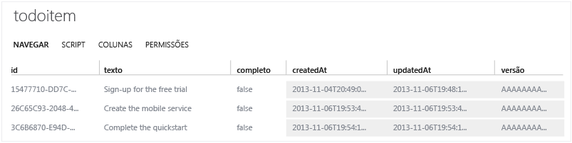

<properties 
	pageTitle="Introdução aos Serviços Móveis do Azure para aplicativos iOS" 
	description="Siga este tutorial para começar a usar os serviços móveis do Azure para desenvolvimento do iOS." 
	services="" 
	documentationCenter="ios" 
	authors="krisragh" 
	manager="dwrede" 
	editor=""/>

<tags 
	ms.service="mobile-services" 
	ms.workload="mobile" 
	ms.tgt_pltfrm="mobile-ios" 
	ms.devlang="objective-c" 
	ms.topic="hero-article" 
	ms.date="10/10/2014" 
	ms.author="krisragh"/>

# Introdução aos Serviços Móveis

[AZURE.INCLUDE [mobile-services-selector-get-started](../includes/mobile-services-selector-get-started.md)]

Este tutorial mostra como adicionar um serviço de back-end baseado em nuvem a um aplicativo iOS usando os Serviços Móveis do Azure.

Se você preferir assistir a um vídeo, o clipe à direita segue as mesmas etapas deste tutorial.

<a href="http://channel9.msdn.com/Series/Windows-Azure-Mobile-Services/iOS-Creating-your-first-app-using-the-Windows-Azure-Mobile-Services-Quickstart" target="_blank" class="label">assista ao tutorial</a> <a style="background-image: url('/media/devcenter/mobile/videos/get-started-ios-180x120.png') !important;" href="http://channel9.msdn.com/Series/Windows-Azure-Mobile-Services/iOS-Creating-your-first-app-using-the-Windows-Azure-Mobile-Services-Quickstart" target="_blank" class="dev-onpage-video">Executar o vídeo</a> 09:38

Neste tutorial, você criará um novo serviço móvel e um aplicativo simples _To do list_ que armazena dados do aplicativo no novo serviço móvel. O serviço móvel que você criará usa JavaScript para a lógica de negócios do lado do servidor. Para criar um serviço móvel que permita escrever sua lógica de negócios do lado do servidor nos idiomas com suporte de .NET usando o Visual Studio, consulte [Versão de back-end do .NET] deste tópico.

Uma captura de tela do aplicativo completo está disponível abaixo:

![][0]

Para concluir este tutorial, é necessário ter XCode 4.5 e iOS 5.0 ou versões posteriores.

> [AZURE.NOTE] Para concluir este tutorial, você precisa de uma conta do Azure. Se você não tem uma conta, você pode se inscrever para uma avaliação do Azure e obter até 10 serviços móveis gratuitos que você pode continuar usando mesmo depois do fim de sua avaliação. Para obter detalhes, consulte [Avaliação Gratuita do Azure](http://azure.microsoft.com/pricing/free-trial/?WT.mc_id=AE564AB28&amp;returnurl=http%3A%2F%2Fwww.windowsazure.com%2Fpt-br%2Fdevelop%2Fmobile%2Ftutorials%2Fget-started-ios%2F%20 target="_blank").

## Criar um novo serviço móvel

[AZURE.INCLUDE [mobile-services-create-new-service](../includes/mobile-services-create-new-service.md)]

<h2>Criar um novo aplicativo iOS</h2>

Depois de criar seu serviço móvel, você poderá seguir um guia de início rápido fácil no Portal de Gerenciamento para criar um novo aplicativo ou modificar um aplicativo existente para conexão a seu serviço móvel.

Nesta seção você criará um novo aplicativo iOS que está conectado ao seu serviço móvel.

1.  No Portal de Gerenciamento, clique em **Serviços Móveis**e, em seguida, clique no serviço móvel que você acabou de criar.

2. Na guia de início rápido, clique em **iOS** em **Escolher a plataforma** e expanda **Criar um novo aplicativo iOS**.

   	![][6]

   	Isso exibe as três etapas fáceis para criar um aplicativo iOS conectado ao seu serviço móvel.

  	![][7]

3. Se você ainda não o fez, baixe e instale o [Xcode] v 4.4 ou posterior.

4. Clique em **Criar tabela TodoItems** para criar uma tabela para armazenar os dados do aplicativo.

5. Em **Baixar e executar o aplicativo**, clique em **Baixar**.

  	Será baixado o projeto para o aplicativo _To do list_ que está conectado ao serviço móvel, juntamente com os Serviços Móveis iOS SDK. Salve o arquivo de projeto compactado em seu computador local e anote onde ele foi salvo.

## Executar seu novo aplicativo iOS

[AZURE.INCLUDE [mobile-services-ios-run-app](../includes/mobile-services-ios-run-app.md)]

<ol start="4">
<li>
No Portal de Gerenciamento, clique na guia <strong>Dados</strong> e, em seguida na tabela <strong>TodoItems</strong>.
</li></ol>

Isso permite que você procure os dados inseridos pelo aplicativo na tabela.

## Próximas Etapas
Agora que você concluiu o início rápido, aprenda a executar tarefas adicionais importantes nos Serviços Móveis:

* [Introdução aos dados]
   Saiba mais sobre como armazenar e consultar dados usando os Serviços Móveis.

* [Introdução à sincronização de dados offline]
   Saiba como usar a sincronização de dados offline para tornar seu aplicativo ágil e robusto.

* [Introdução à autenticação]
   Aprenda a autenticar usuários do aplicativo com um provedor de identidade.

* [Introdução às notificações por push]
   Saiba como enviar uma notificação por push bastante básica a seu aplicativo.

<!-- Anchors. -->
[Introdução aos Serviços Móveis]:#getting-started
[Criar um novo serviço móvel]:#create-new-service
[Definir a instância do serviço móvel]:#define-mobile-service-instance
[Próximas etapas]:#next-steps

<!-- Images. -->
[0]: ./media/mobile-services-ios-get-started/mobile-quickstart-completed-ios.png

[6]: ./media/mobile-services-ios-get-started/mobile-portal-quickstart-ios.png
[7]: ./media/mobile-services-ios-get-started/mobile-quickstart-steps-ios.png
[8]: ./media/mobile-services-ios-get-started/mobile-xcode-project.png

[10]: ./media/mobile-services-ios-get-started/mobile-quickstart-startup-ios.png
[11]: ./media/mobile-services-ios-get-started/mobile-data-tab.png
[12]: ./media/mobile-services-ios-get-started/mobile-data-browse.png

<!-- URLs. -->
[Introdução aos dados]: /pt-br/documentation/articles/mobile-services-ios-get-started-data/
[Introdução à autenticação]: /pt-br/documentation/articles/mobile-services-ios-get-started-users/
[Introdução à sincronização de dados offline]: /pt-br/documentation/articles/mobile-services-ios-get-started-offline-data
[Introdução às notificações por push]: /pt-br/documentation/articles/mobile-services-javascript-backend-ios-get-started-push/

[SDK do iOS dos Serviços Móveis]: https://go.microsoft.com/fwLink/p/?LinkID=266533
[Portal de Gerenciamento]: https://manage.windowsazure.com/
[XCode]: https://go.microsoft.com/fwLink/p/?LinkID=266532
[Versão de back-end do .NET]: /pt-br/documentation/articles/mobile-services-dotnet-backend-ios-get-started

\<!--HONumber=42-->
