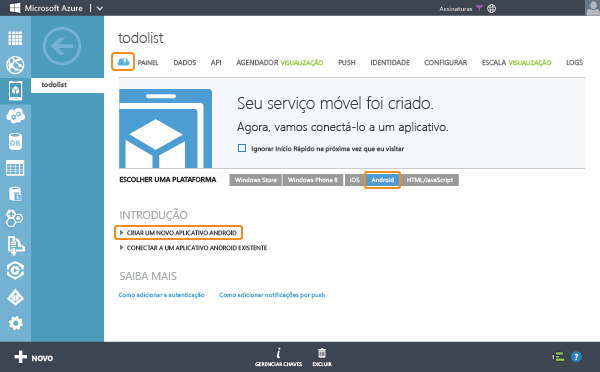

<properties
	pageTitle="Introdução aos Serviços Móveis do Azure para aplicativos do Android (back-end JavaScript)"
	description="Siga este tutorial para começar a usar os Serviços Móveis do Azure para o desenvolvimento Android (back-end do JavaScript)."
	services="mobile-services"
	documentationCenter="android"
	authors="RickSaling"
	manager="reikre"
	editor=""/>

<tags
	ms.service="mobile-services"
	ms.workload="mobile"
	ms.tgt_pltfrm="mobile-android"
	ms.devlang="java"
	ms.topic="hero-article"
	ms.date="07/21/2016"
	ms.author="ricksal"/>

# Introdução aos Serviços Móveis para Android (back-end do JavaScript)

[AZURE.INCLUDE [mobile-services-selector-get-started](../../includes/mobile-services-selector-get-started.md)]

&nbsp;

[AZURE.INCLUDE [mobile-service-note-mobile-apps](../../includes/mobile-services-note-mobile-apps.md)]
> Para a versão de Aplicativos Móveis equivalente deste tópico, consulte [Criar um aplicativo Android nos Aplicativos Móveis do Azure](../app-service-mobile/app-service-mobile-android-get-started.md).

Este tutorial mostra como adicionar um serviço de back-end baseado em nuvem a um aplicativo Android usando os Serviços Móveis do Azure. Neste tutorial, você criará um novo serviço móvel e um aplicativo simples **To do list** que armazena dados do aplicativo no novo serviço móvel.

> [AZURE.VIDEO mobile-get-started-android]

Uma captura de tela do aplicativo completo está disponível abaixo:

## Pré-requisitos

A conclusão deste tutorial requer as [Ferramentas para desenvolvedores do Android](https://developer.android.com/sdk/index.html), que incluem o ambiente de desenvolvimento integrado do Android Studio e a plataforma Android mais recente. Android 4.2 ou uma versão posterior é necessária.

O projeto de início rápido baixado contém o SDK de Serviços Móveis do Azure para Android.

> [AZURE.IMPORTANT] Para concluir este tutorial, você precisa de uma conta do Azure. Se você não tiver uma conta, poderá criar uma conta de avaliação gratuita em apenas alguns minutos. Para obter detalhes, consulte [Avaliação gratuita do Azure](https://azure.microsoft.com/pricing/free-trial/?WT.mc_id=AE564AB28).

## Criar um novo serviço móvel

[AZURE.INCLUDE [mobile-services-create-new-service](../../includes/mobile-services-create-new-service.md)]

## Criar novo aplicativo Android

Depois de criar seu serviço móvel, você poderá seguir um início rápido fácil no portal clássico do Azure para criar um novo aplicativo ou modificar um aplicativo existente para conexão a seu serviço móvel.

Nesta seção você criará um novo aplicativo Android que está conectado ao seu serviço móvel.

1.  No portal clássico do Azure, clique em **Serviços Móveis** e clique no serviço móvel que você acabou de criar.

2. Na guia de início rápido, clique em **Android** em **Escolher a plataforma** e expanda **Criar um novo aplicativo Android**.

   	

   	Isso exibe as três etapas fáceis para criar um aplicativo Android conectado ao seu serviço móvel.

  	

3. Se ainda não o fez, baixe e instale [Android Developer Tools](https://go.microsoft.com/fwLink/p/?LinkID=280125) em seu computador local ou máquina virtual.

4. Clique em **Criar tabela TodoItem** para criar uma tabela para armazenar os dados do aplicativo.

5. Baixe agora o aplicativo pressionando o botão **Baixar**.

## Executar seu aplicativo Android

[AZURE.INCLUDE [mobile-services-run-your-app](../../includes/mobile-services-android-get-started.md)]

## Próximas etapas
Agora que você concluiu o início rápido, aprenda a executar tarefas adicionais importantes nos Serviços Móveis:

* [Introdução aos dados]   Saiba mais sobre armazenar e consultar dados usando os Serviços Móveis.

* [Introdução à autenticação]  Saiba como autenticar usuários de seu aplicativo com um provedor de identidade.

* [Introdução às notificações por push]  Saiba como enviar uma notificação por push bastante básica a seu aplicativo.

[AZURE.INCLUDE [app-service-disqus-feedback-slug](../../includes/app-service-disqus-feedback-slug.md)]

<!-- URLs. -->
[Get started (Eclipse)]: mobile-services-android-get-started-ec.md
[Introdução aos dados]: mobile-services-android-get-started-data.md
[Introdução à autenticação]: mobile-services-android-get-started-users.md
[Introdução às notificações por push]: mobile-services-javascript-backend-android-get-started-push.md
[Mobile Services Android SDK]: https://go.microsoft.com/fwLink/p/?LinkID=266533

<!---HONumber=AcomDC_0727_2016-->