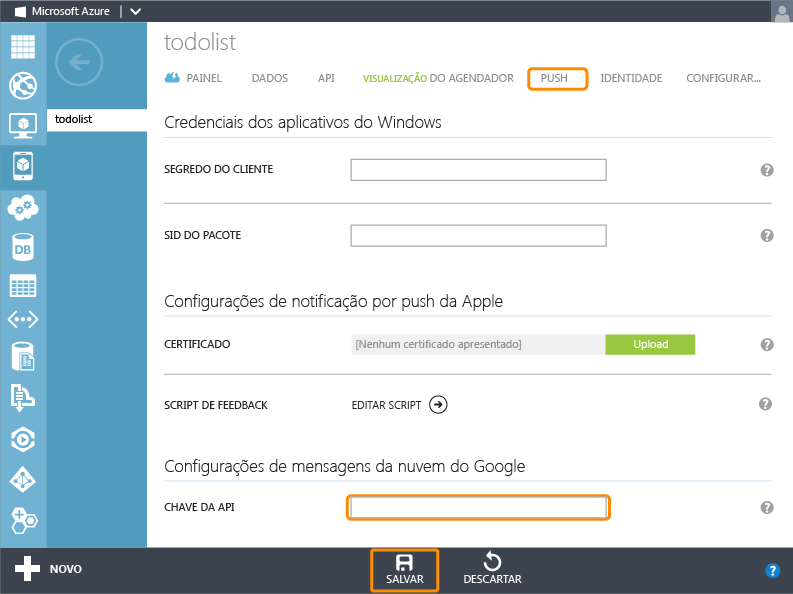

<properties 
	pageTitle="Introdução ao push (Android) | Mobile Dev Center" 
	description="Saiba como usar os serviços móveis do Azure para enviar notificações por push para seu aplicativo .Net do Android." 
	services="mobile-services, notification-hubs" 
	documentationCenter="android" 
	authors="RickSaling" 
	manager="dwrede" 
	editor=""/>

<tags 
	ms.service="mobile-services" 
	ms.workload="mobile" 
	ms.tgt_pltfrm="mobile-android" 
	ms.devlang="java" 
	ms.topic="article" 
	ms.date="05/12/2015" 
	ms.author="ricksal"/>

# Adicionar notificações por push a seu aplicativo de Serviços Móveis

[AZURE.INCLUDE [mobile-services-selector-get-started-push](../../includes/mobile-services-selector-get-started-push-EC.md)]

##Visão geral

Este tópico mostra como usar os Serviços Móveis do Azure para enviar notificações por push a um aplicativo Android. Neste tutorial você adiciona notificações por push usando o serviço de Mensagens de Nuvem do Google (GCM) para o projeto quickstart. Ao concluir, seu serviço móvel enviará uma notificação por push sempre que um registro for inserido.

Este tutorial baseia-se no início rápido dos Serviços Móveis. Antes de iniciar este tutorial, você deve primeiro concluir a [Introdução aos Serviços Móveis] ou [Adicionar Serviços Móveis a um aplicativo existente] para conectar seu projeto ao serviço móvel. Como tal, esse tutorial também requer o Visual Studio 2013.

##Habilitar as mensagens em nuvem do Google

[AZURE.INCLUDE [Habilite o GCM](../../includes/mobile-services-enable-Google-cloud-messaging.md)]

##Configurar Serviços Móveis para enviar solicitações de push

1. Faça logon no [Portal de Gerenciamento do Azure], clique em **Serviços Móveis** e clique em seu aplicativo.

   	

2. Clique na guia **Push** e insira o valor **API Key** obtido do GCM no procedimento anterior e clique em **Salvar**.

   	

> [AZURE.IMPORTANT]Quando você define suas credenciais do GCM para notificações por push aprimoradas na guia Enviar por Push no portal, elas são compartilhadas com os Hubs de Notificação para configurar o hub de notificação com seu aplicativo.

Seu serviço móvel agora está configurado para trabalhar com o GCM e Hubs de Notificação.

##Baixar o serviço em seu computador local

[AZURE.INCLUDE [mobile-services-download-service-locally](../../includes/mobile-services-download-service-locally.md)]

##Testar o serviço móvel

[AZURE.INCLUDE [mobile-services-dotnet-backend-test-local-service](../../includes/mobile-services-dotnet-backend-test-local-service.md)]

##Atualizar o servidor para enviar notificações por push

1. No Gerenciador de Soluções do Visual Studio, expanda a pasta **Controladores** no projeto do serviço móvel. Abra o TodoItemController.cs. Na parte superior do arquivo, adicione as seguintes instruções `using`:

		using System;
		using System.Collections.Generic;

2. Atualize a definição do método `PostTodoItem` com o seguinte código:

        public async Task<IHttpActionResult> PostTodoItem(TodoItem item)
        {
            TodoItem current = await InsertAsync(item);

            Dictionary<string, string> data = new Dictionary<string, string>()
            {
                { "message", item.Text}
            };
            GooglePushMessage message = new GooglePushMessage(data, TimeSpan.FromHours(1));

            try
            {
                var result = await Services.Push.SendAsync(message);
                Services.Log.Info(result.State.ToString());
            }
            catch (System.Exception ex)
            {
                Services.Log.Error(ex.Message, null, "Push.SendAsync Error");
            }
            return CreatedAtRoute("Tables", new { id = current.Id }, current);
        }

    Esse código irá enviar uma notificação por push (com o texto do item inserido) depois de inserir um item de tarefa pendente. Se ocorrer um erro, o código adicionará uma entrada no log de erros que pode ser visualizada na guia **Logs** do serviço móvel no Portal de Gerenciamento.

##Publicar o serviço móvel no Azure

[AZURE.INCLUDE [mobile-services-dotnet-backend-publish-service](../../includes/mobile-services-dotnet-backend-publish-service.md)]

##Adicionar notificações de push para seu aplicativo

###Verificar Versão de SDK do Android

[AZURE.INCLUDE [mobile-services-verify-android-sdk-version](../../includes/mobile-services-verify-android-sdk-version-EC.md)]

A próxima etapa é instalar os serviços do Google Play. A mensagens de nuvem do Google tem alguns requisitos mínimos de nível do API para desenvolvimento e teste, o que a propriedade **minSdkVersion** no manifesto deve estar de acordo.

Se você for testar com um dispositivo mais antigo, consulte [Configurar o SDK do Google Play Services] para determinar o mínimo que pode ser definido para esse valor e defina-o de maneira apropriada.

###Inclua o Google Play Services no projeto

[AZURE.INCLUDE [Adicionar Play Services](../../includes/mobile-services-add-Google-play-services-EC.md)]

###Incluir código

[AZURE.INCLUDE [mobile-services-android-getting-started-with-push](../../includes/mobile-services-android-getting-started-with-push-EC.md)]

##Testar o aplicativo no serviço móvel publicado

Você pode testar o aplicativo anexando um telefone Android com um cabo USB diretamente ou usando um dispositivo virtual no emulador.

###Se você estiver usando o emulador para teste...

Assegure-se de usar um Dispositivo Virtual Android (AVD) que suporte APIs do Google.

1. Em **Janela**, selecione **Gerenciador de Dispositivo Virtual Android**, selecione seu dispositivo, clique em **Editar** (ou **Novo** se não tiver dispositivos).

	

2. Selecione **Apis do Google** (ou **APIs do Google x86**) em **Destino**, clique em Ok.

   	

	Destina-se ao AVD para usar APIs do Google. Se você tiver várias versões do SDK do Android instaladas, assegure-se de que o Nível da API corresponda àquele configurado nas propriedades do projeto anteriormente.

###Habilitar notificações por push para teste local

[AZURE.INCLUDE [mobile-services-dotnet-backend-configure-local-push](../../includes/mobile-services-dotnet-backend-configure-local-push.md)]

###Executando o teste

1. No menu **Executar** no Eclipse, clique em **Executar** para iniciar o aplicativo.

2. No aplicativo, digite um texto significativo, como _Uma nova tarefa de Serviços Móveis_ e clique no botão **Incluir**.

  	

3. Passe o dedo para baixo da parte superior da tela para abrir a Central de Notificação do dispositivo para ver a notificação.

Este tutorial foi concluído com êxito.

## Próximas etapas

<!---This tutorial demonstrated the basics of enabling an Android app to use Mobile Services and Notification Hubs to send push notifications. Next, consider completing the next tutorial, [Send push notifications to authenticated users], which shows how to use tags to send push notifications from a Mobile Service to only an authenticated user.

+ [Send push notifications to authenticated users]
	 Learn how to use tags to send push notifications from a Mobile Service to only an authenticated user.

+ [Send broadcast notifications to subscribers]
	 Learn how users can register and receive push notifications for categories they're interested in.

+ [Send template-based notifications to subscribers]
	 Learn how to use templates to send push notifications from a Mobile Service, without having to craft platform-specific payloads in your back-end.
-->
Saiba mais sobre os Serviços Móveis e Hubs de Notificação nos tópicos a seguir:

* [Começar a trabalhar com dados]  Saiba mais sobre armazenar e consultar dados usando serviços móveis.

* [Introdução à autenticação]  Saiba como autenticar usuários de seu aplicativo com diferentes tipos de contas usando Serviços Móveis.

* [O que são Hubs de Notificação?]  Saiba mais sobre como os Hubs de Notificação funcionam para entregar notificações aos seus aplicativos entre todas as diversas principais plataformas de cliente.

* [Depuração de aplicativos de Hubs de Notificação](http://go.microsoft.com/fwlink/p/?linkid=386630)  Obtenha diretrizes de solução de problemas e depuração de soluções de Hubs de Notificação.

* [Como usar a biblioteca de cliente Android para os Serviços Móveis]  Saiba mais sobre como usar os Serviços Móveis com o Android.
  
<!-- Anchors. -->

[Create a new mobile service]: #create-service
[Download the service locally]: #download-the-service-locally
[Test the mobile service]: #test-the-service
[Download the GetStartedWithData project]: #download-app
[Update the app to use the mobile service for data access]: #update-app
[Test the Android App against the service hosted locally]: #test-locally-hosted
[Publish the mobile service to Azure]: #publish-mobile-service
[Test the Android App against the service hosted in Azure]: #test-azure-hosted
[Test the app against the published mobile service]: #test-app
[Next Steps]: #next-steps

<!-- Images. -->
[0]: ./media/mobile-services-dotnet-backend-windows-store-dotnet-get-started-data/app-view.png
[1]: ./media/mobile-services-dotnet-backend-windows-store-dotnet-get-started-data/mobile-data-sample-download-dotnet-vs13.png
[2]: ./media/mobile-services-dotnet-backend-windows-store-dotnet-get-started-data/mobile-service-overview-page.png
[3]: ./media/mobile-services-dotnet-backend-windows-store-dotnet-get-started-data/download-service-project.png
[4]: ./media/mobile-services-dotnet-backend-windows-store-dotnet-get-started-data/add-service-project-to-solution.png
[5]: ./media/mobile-services-dotnet-backend-windows-store-dotnet-get-started-data/download-publishing-profile.png
[6]: ./media/mobile-services-dotnet-backend-windows-store-dotnet-get-started-data/add-existing-project-dialog.png
[7]: ./media/mobile-services-dotnet-backend-windows-store-dotnet-get-started-data/vs-manage-nuget-packages.png
[8]: ./media/mobile-services-dotnet-backend-windows-store-dotnet-get-started-data/manage-nuget-packages.png
[9]: ./media/mobile-services-dotnet-backend-windows-store-dotnet-get-started-data/copy-mobileserviceclient-snippet.png
[10]: ./media/mobile-services-dotnet-backend-windows-store-dotnet-get-started-data/vs-pasted-mobileserviceclient.png
[11]: ./media/mobile-services-dotnet-backend-windows-store-dotnet-get-started-data/vs-build-solution.png
[12]: ./media/mobile-services-dotnet-backend-windows-store-dotnet-get-started-data/vs-run-solution.png
[13]: ./media/mobile-services-dotnet-backend-windows-store-dotnet-get-started-data/new-local-todoitem.png
[14]: ./media/mobile-services-dotnet-backend-windows-store-dotnet-get-started-data/vs-show-local-table-data.png
[15]: ./media/mobile-services-dotnet-backend-windows-store-dotnet-get-started-data/local-item-checked.png
[16]: ./media/mobile-services-dotnet-backend-windows-store-dotnet-get-started-data/azure-items.png
[17]: ./media/mobile-services-dotnet-backend-windows-store-dotnet-get-started-data/manage-sql-azure-database.png
[18]: ./media/mobile-services-dotnet-backend-windows-store-dotnet-get-started-data/sql-azure-query.png

[20]: ./media/mobile-services-dotnet-backend-windows-store-dotnet-get-started-data/vs-build-service-project.png
[21]: ./media/mobile-services-dotnet-backend-windows-store-dotnet-get-started-data/vs-start-debug-service-project.png
[22]: ./media/mobile-services-dotnet-backend-windows-store-dotnet-get-started-data/service-welcome-page.png
[23]: ./media/mobile-services-dotnet-backend-windows-store-dotnet-get-started-data/iis-express-tray.png

[26]: ./media/mobile-services-dotnet-backend-windows-store-dotnet-get-started-data/copy-service-and-packages-folder.png

<!-- URLs. -->
[Introdução aos Serviços Móveis]: mobile-services-dotnet-backend-android-get-started.md
[Adicionar Serviços Móveis a um aplicativo existente]: mobile-services-dotnet-backend-android-get-started-data.md
[Introdução à autenticação]: mobile-services-dotnet-backend-android-get-started-users.md
[Azure Management Portal]: https://manage.windowsazure.com/
[Management Portal]: https://manage.windowsazure.com/
[Mobile Services SDK]: http://go.microsoft.com/fwlink/p/?LinkId=257545
[Developer Code Samples site]: http://go.microsoft.com/fwlink/p/?LinkId=328660

[Como usar a biblioteca de cliente Android para os Serviços Móveis]: mobile-services-android-how-to-use-client-library.md

[Send push notifications to authenticated users]: mobile-services-dotnet-backend-android-push-notifications-app-users.md

[O que são Hubs de Notificação?]: ../notification-hubs-overview.md
[Send broadcast notifications to subscribers]: ../notification-hubs-windows-store-dotnet-send-breaking-news.md
[Send template-based notifications to subscribers]: ../notification-hubs-windows-store-dotnet-send-localized-breaking-news.md
[Portal de Gerenciamento do Azure]: https://manage.windowsazure.com/
 

<!---HONumber=August15_HO6-->