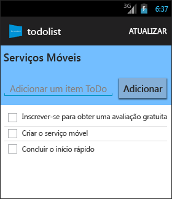

<properties
	pageTitle="Introdução aos Serviços Móveis do Azure para aplicativos Android"
	description="Siga este tutorial para começar a usar os serviços móveis do Azure para desenvolvimento Android."
	services="mobile-services"
	documentationCenter="android"
	authors="RickSaling"
	manager="erikre"
	editor=""/>

<tags
	ms.service="mobile-services"
	ms.workload="mobile"
	ms.tgt_pltfrm="mobile-android"
	ms.devlang="java"
	ms.topic="get-started-article"
	ms.date="03/05/2016"
	ms.author="ricksal"/>

# Introdução aos Serviços Móveis

[AZURE.INCLUDE [mobile-services-selector-get-started](../../includes/mobile-services-selector-get-started.md)]

&nbsp;

[AZURE.INCLUDE [mobile-service-note-mobile-apps](../../includes/mobile-services-note-mobile-apps.md)]
> Para a versão de Aplicativos Móveis equivalente deste tópico, consulte [Criar um aplicativo Android nos Aplicativos Móveis do Azure](../app-service-mobile/app-service-mobile-android-get-started.md).

Este tutorial mostra como adicionar um serviço de back-end baseado em nuvem a um aplicativo Android usando os Serviços Móveis do Azure. Neste tutorial, você criará um novo serviço móvel e um aplicativo simples _To do list_ que armazena dados do aplicativo no novo serviço móvel. O serviço móvel que você criará usa as linguagens do .NET com suporte usando o Visual Studio para a lógica de negócios do lado do servidor e para gerenciar o serviço móvel. Para criar um serviço móvel que permita que você escreva a lógica de negócios do lado do servidor em JavaScript, consulte [Versão de back-end do JavaScript](mobile-services-android-get-started.md) neste tópico.

Uma captura de tela do aplicativo completo está disponível abaixo:

A conclusão deste tutorial requer as [Ferramentas para desenvolvedores do Android][Android Studio], que incluem o ambiente de desenvolvimento integrado do Android Studio e a plataforma Android mais recente. Android 4.2 ou uma versão posterior é necessária.

O projeto de início rápido baixado contém o SDK de Serviços Móveis para Android.

> [AZURE.IMPORTANT] Para concluir este tutorial, você precisa de uma conta do Azure. Se você não tem uma conta, você pode se inscrever para uma avaliação do Azure e obter até 10 serviços móveis gratuitos que você pode continuar usando mesmo depois do fim de sua avaliação. Para obter detalhes, consulte [Avaliação gratuita do Azure](https://azure.microsoft.com/pricing/free-trial/?WT.mc_id=AE564AB28).

## Criar um novo serviço móvel

[AZURE.INCLUDE [mobile-services-dotnet-backend-create-new-service](../../includes/mobile-services-dotnet-backend-create-new-service.md)]

## Baixar o serviço móvel para o computador local

Agora que você criou o serviço móvel, baixe o projeto de serviço móvel personalizado que pode ser executado no computador local ou na máquina virtual.

1. Clique no serviço móvel que você acabou de criar, em seguida, na guia quickstart, clique em **Android** em **Escolher plataforma** e expanda **Criar um novo aplicativo Android**.

	![][1]

2. Se ainda não tiver feito isso, baixe e instale o [Visual Studio Professional 2013](https://go.microsoft.com/fwLink/p/?LinkID=391934) ou uma versão posterior.

3. Na etapa 2, clique em **Baixar** em **Baixar e publicar o serviço na nuvem**.

	Isso baixa o projeto do Visual Studio que implementa o serviço móvel. Salve o arquivo de projeto compactado em seu computador local e anote onde ele foi salvo.

## Testar o serviço móvel

[AZURE.INCLUDE [mobile-services-dotnet-backend-test-local-service](../../includes/mobile-services-dotnet-backend-test-local-service.md)]

## Publicar o serviço móvel

[AZURE.INCLUDE [mobile-services-dotnet-backend-publish-service](../../includes/mobile-services-dotnet-backend-publish-service.md)]

## Criar novo aplicativo Android

Nesta seção você criará um novo aplicativo Android que está conectado ao seu serviço móvel.

1. No [portal clássico do Azure], clique em **Serviços Móveis** e clique no serviço móvel que você acabou de criar.

2. Na guia de início rápido, clique em **Android** em **Escolher a plataforma** e expanda **Criar um novo aplicativo Android**.

	![][2]

3. Se ainda não o fez, baixe e instale [Android Developer Tools][Android SDK] em seu computador local ou máquina virtual.

4. Em **Baixe e execute o aplicativo**, clique em **Baixar**.

  	Isso baixa o projeto para o aplicativo de exemplo _To do list_ que está conectado ao seu serviço móvel. Salve o arquivo do projeto compactado em seu computador local e anote onde ele foi salvo.

## Executar seu aplicativo Android

[AZURE.INCLUDE [mobile-services-run-your-app](../../includes/mobile-services-android-get-started.md)]

## Próximas etapas
Agora que você concluiu o início rápido, aprenda a executar tarefas adicionais importantes nos Serviços Móveis:

* [Adicionar notificações por push ao seu aplicativo]  Saiba como enviar uma notificação por push bem básica ao seu aplicativo.

* [Adicionar autenticação ao seu aplicativo]  Aprenda a restringir o acesso a seus dados de back-end para usuários específicos e registrados de seu aplicativo.

* [Solucionar problemas de back-end do .NET dos Serviços Móveis]   Saiba como diagnosticar e corrigir problemas que podem surgir com o back-end do .NET dos Serviços Móveis.

<!-- Anchors. -->
[Getting started with Mobile Services]: #getting-started
[Create a new mobile service]: #create-new-service
[Define the mobile service instance]: #define-mobile-service-instance
[Next Steps]: #next-steps

<!-- Images. -->
[0]: ./media/mobile-services-dotnet-backend-android-get-started/mobile-quickstart-completed-android.png
[1]: ./media/mobile-services-dotnet-backend-android-get-started/mobile-quickstart-steps-vs-AS.png
[2]: ./media/mobile-services-dotnet-backend-android-get-started/mobile-quickstart-steps-android-AS.png

[6]: ./media/mobile-services-dotnet-backend-android-get-started/mobile-portal-quickstart-android.png
[7]: ./media/mobile-services-dotnet-backend-android-get-started/mobile-quickstart-steps-android.png
[8]: ./media/mobile-services-dotnet-backend-android-get-started/mobile-eclipse-quickstart.png

[10]: ./media/mobile-services-dotnet-backend-android-get-started/mobile-quickstart-startup-android.png
[11]: ./media/mobile-services-dotnet-backend-android-get-started/mobile-data-tab.png
[12]: ./media/mobile-services-dotnet-backend-android-get-started/mobile-data-browse.png

[14]: ./media/mobile-services-dotnet-backend-android-get-started/mobile-services-import-android-workspace.png
[15]: ./media/mobile-services-dotnet-backend-android-get-started/mobile-services-import-android-project.png

<!-- URLs. -->
[Get started (Eclipse)]: mobile-services-dotnet-backend-android-get-started-ec.md
[Adicionar notificações por push ao seu aplicativo]: mobile-services-dotnet-backend-android-get-started-push.md
[Adicionar autenticação ao seu aplicativo]: mobile-services-dotnet-backend-android-get-started-auth.md
[Android SDK]: https://go.microsoft.com/fwLink/p/?LinkID=280125
[Android Studio]: https://developer.android.com/sdk/index.html
[Mobile Services Android SDK]: https://go.microsoft.com/fwLink/p/?LinkID=266533
[Solucionar problemas de back-end do .NET dos Serviços Móveis]: mobile-services-dotnet-backend-how-to-troubleshoot.md

[portal clássico do Azure]: https://manage.windowsazure.com/

<!---HONumber=AcomDC_0309_2016-->