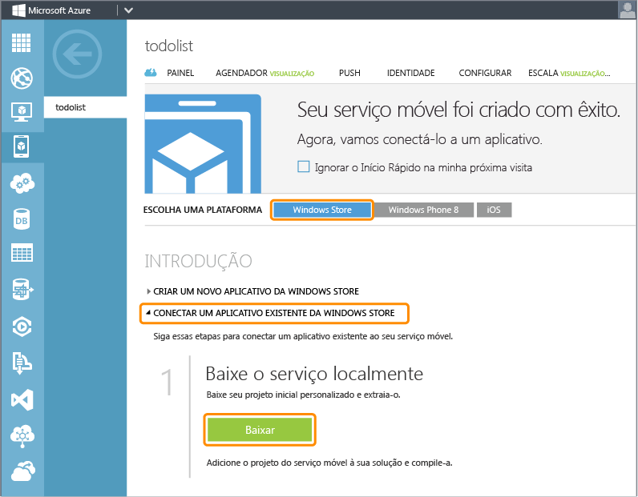
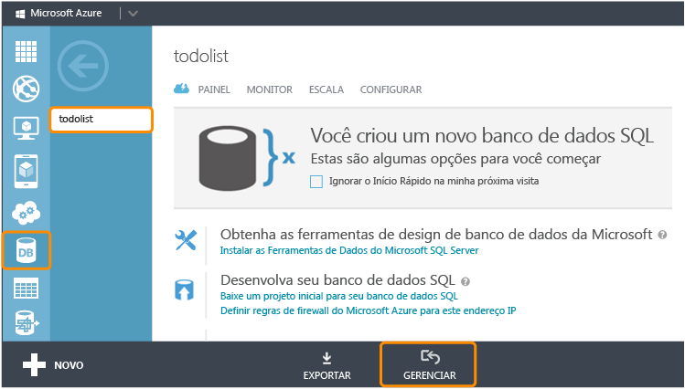

<properties 
	pageTitle="Adicionar Serviços Móveis a um aplicativo existente (Windows Phone) | Microsoft Azure" 
	description="Saiba como começar a usar os serviços móveis para utilizar dados em seu aplicativo do Windows Phone." 
	services="mobile-services" 
	documentationCenter="windows" 
	authors="wesmc7777" 
	manager="dwrede" 
	editor=""/>

<tags 
	ms.service="mobile-services" 
	ms.workload="mobile" 
	ms.tgt_pltfrm="mobile-windows-phone" 
	ms.devlang="dotnet" 
	ms.topic="article" 
	ms.date="05/12/2015" 
	ms.author="wesmc"/>

# Adicionar Serviços Móveis a um aplicativo existente

##Visão geral

[AZURE.INCLUDE [mobile-services-selector-get-started-data-legacy](../../includes/mobile-services-selector-get-started-data-legacy.md)]

Este tópico mostra como adicionar Serviços Móveis do Azure como uma fonte de dados de back-end a um aplicativo Windows Phone 8.1 Silverlight. Neste tutorial, você baixará um projeto do Visual Studio para um aplicativo que armazena dados na memória, criará um novo serviço móvel, integrará o serviço móvel ao aplicativo e exibirá as alterações de dados feitas durante a execução do aplicativo. Para adicionar Serviços Móveis a um aplicativo do Windows Phone Store 8.1, consulte [esta versão do tutorial](mobile-services-dotnet-backend-windows-universal-dotnet-get-started-data.md).

O serviço móvel que você criará neste tutorial dará suporte ao tempo de execução do .NET no Serviço Móvel. Isso permitirá que você use linguagens .NET e o Visual Studio para a lógica dos negócios do lado do servidor no serviço móvel. Para criar um serviço móvel que permita que você escreva a lógica de negócios do lado do servidor em JavaScript, consulte [Versão de back-end do JavaScript](mobile-services-windows-phone-get-started-data.md) neste tópico.

##Pré-requisitos

Este tutorial exige o seguinte:

+ Visual Studio 2013 Atualização 2, ou uma versão posterior.
+ Uma conta do Microsoft Azure. Se você não tiver uma conta, poderá criar uma conta de avaliação gratuita em apenas alguns minutos. Para obter detalhes, consulte <a href="http://azure.microsoft.com/pricing/free-trial/?WT.mc_id=AE564AB28&amp;returnurl=http%3A%2F%2Fazure.microsoft.com%2Fpt-br%2Fdocumentation%2Farticles%2Fmobile-services-dotnet-backend-windows-store-dotnet-get-started-data%2F" target="_blank">Avaliação Gratuita do Azure</a>. 

##Baixar o projeto GetStartedWithData

Este tutorial é baseado no [aplicativo GetStartedWithMobileServices](https://code.msdn.microsoft.com/Add-Azure-Mobile-to-a-8b906f72), que é um aplicativo do projeto do Windows Phone Silverlight 8.1 para o Visual Studio 2013.

1. Baixe a versão C# do aplicativo de exemplo GetStartedWithMobileServices do [site de exemplos de código do desenvolvedor](https://code.msdn.microsoft.com/Add-Azure-Mobile-to-a-8b906f72). 

	>[AZURE.NOTE]Para criar um aplicativo do Windows Phone Silverlight 8.1, simplesmente altere o SO de destino no projeto do aplicativo para Windows Phone Silverlight 8 baixado para o Windows Phone 8.1. Para criar um aplicativo do Windows Phone Store, baixe a [versão do aplicativo do Windows Phone Store](http://go.microsoft.com/fwlink/p/?LinkId=397372) do projeto do aplicativo de exemplo GetStartedWithData.

2. Execute o Visual Studio com privilégios de administrador clicando com o botão direito do mouse em Visual Studio e clicando em **Executar como administrador**.

3. No Visual Studio, abra o projeto baixado e examine o arquivo MainPage.xaml.cs.

   	Observe que os objetos **TodoItem** adicionados estão armazenados em um **ObservableCollection&lt;TodoItem&gt;** na memória.

4. No Visual Studio, escolha um destino de implantação para o aplicativo. Você pode implantar em um dispositivo Windows Phone ou em um dos emuladores incluídos com o SDK do Windows Phone. Neste tutorial, demonstramos a implantação em um emulador.

5. Pressione a tecla **F5**. Isso irá criar, implantar e iniciar o aplicativo para depuração.

6. No aplicativo, digite texto na caixa de texto e, em seguida, clique em **Salvar** para salvar alguns itens na memória do aplicativo.

   	

   	Observe que o texto para cada `TodoItem` é exibido abaixo do botão de atualização juntamente com uma caixa de seleção que permite que você marque o item concluído.

##Criar um novo serviço móvel

[AZURE.INCLUDE [mobile-services-dotnet-backend-create-new-service](../../includes/mobile-services-dotnet-backend-create-new-service.md)]

##Baixar o projeto do serviço móvel e adicioná-lo à solução

1. Se ainda não tiver feito isso, baixe e instale o [Visual Studio Professional 2013](https://go.microsoft.com/fwLink/p/?LinkID=391934) ou uma versão posterior.
 
2. No [Portal de Gerenciamento do Azure](https://manage.windowsazure.com/), clique no seu novo Serviço Móvel. Na página de início rápido, clique na plataforma **Windows** e, em **Introdução**, expanda **Conectar a um aplicativo Windows ou Windows Phone existente**.

    

4. Em **Baixar e publicar seu serviço na nuvem**, clique em **Baixar**.

	Isso baixa o projeto do Visual Studio que implementa o serviço móvel.

4. Descompacte a solução personalizada de início do serviço que você baixou e copie as pastas que estavam no arquivo zip no mesmo diretório **C#** em que o arquivo de solução (.sln) Introdução com dados está localizado. Isso facilita a manutenção da sincronização de todos os pacotes pelo Gerenciador de Pacotes NuGet.

5. No Gerenciador de Soluções do Visual Studio, clique com o botão direito do mouse em sua solução para o aplicativo de Introdução a dados da Windows Store. Clique em **Adicionar** e em **Projeto Existente**.

6. Na caixa de diálogo **Adicionar Projeto Existente**, navegue até a pasta do projeto de serviço móvel que você moveu para o diretório **C#**, selecione o arquivo de projeto C# (.csproj) no subdiretório do serviço e clique em **Abrir** para adicionar o projeto à sua solução.

7. No Gerenciador de Soluções do Visual Studio, clique com o botão direito do mouse no projeto de serviço que você acabou de adicionar e clique em **Compilar** para verificar se ele é compilado sem erros. Durante a compilação, o Gerenciador de Pacotes NuGet talvez precise restaurar alguns pacotes NuGet referenciados no projeto.

8. Clique com o botão direito do mouse no projeto do serviço novamente. Desta vez, clique em **Iniciar nova instância** na caixa de contexto **Depurar**.

    O Visual Studio abre a página da web padrão do serviço. Você pode clicar em **Experimentar agora** para testar métodos no serviço móvel da página da web padrão.

    

    Por padrão, o Visual Studio hospeda o serviço móvel localmente no IIS Express. Você pode ver isso, clicando com o botão direito do mouse no ícone de bandeja do IIS Express na barra de tarefas.

##Atualizar o aplicativo do Windows Phone para usar o serviço móvel

Nesta seção, você irá atualizar o aplicativo Windows Phone para usar o serviço móvel como um serviço de back-end do aplicativo.

1. No Gerenciador de Soluções do Visual Studio, clique com o botão direito do mouse no projeto do aplicativo Windows Phone e clique em **Gerenciar Pacotes NuGet**.

2. Na caixa de diálogo Gerenciar Pacotes NuGet, pesquise por **WindowsAzure.MobileServices** na coleção de pacotes online e clique para instalar o Pacote NuGet dos Serviços Móveis do Azure. Em seguida, feche a caixa de diálogo.

    

3. De volta no Portal de Gerenciamento do Azure, localize a etapa rotulada **Conectar seu aplicativo e armazenar dados no seu serviço**. Copie o trecho de código que cria a conexão `MobileServiceClient`.

    

4. No Visual Studio, abra o App.xaml.cs. Cole o trecho de código no início da definição da classe `App`. Além disso, adicione a seguinte instrução `using` na parte superior desse arquivo e salve o arquivo.

		using Microsoft.WindowsAzure.MobileServices;

5. No Visual Studio, abra a MainPage.xaml.cs e adicione a instrução de uso na parte superior do arquivo:

		using Microsoft.WindowsAzure.MobileServices;

6. No Visual Studio, em MainPage.xaml.cs, substitua a definição da classe `MainPage` pela definição a seguir e salve o arquivo.

    Esse código usa o SDK dos Serviços Móveis para habilitar o aplicativo a armazenar seus dados em uma tabela fornecida pelo serviço em vez de armazená-los localmente na memória. Os três métodos principais são `InsertTodoItem`, `RefreshTodoItems` e `UpdateCheckedTodoItem`. Esses três métodos permitem que você insira, consulte e atualize sua coleção de dados, de forma assíncrona em uma tabela no Azure.

        public sealed partial class MainPage : PhoneApplicationPage
        {
            private MobileServiceCollection<TodoItem, TodoItem> items;
            private IMobileServiceTable<TodoItem> todoTable = 
                App.MobileService.GetTable<TodoItem>();            
            public MainPage()
            {
                this.InitializeComponent();
            }
            private async void InsertTodoItem(TodoItem todoItem)
            {
                await todoTable.InsertAsync(todoItem); 
                items.Add(todoItem);
            }
            private async void RefreshTodoItems()
            {
                items = await todoTable 
                    .ToCollectionAsync(); 
                ListItems.ItemsSource = items;
            }
            private async void UpdateCheckedTodoItem(TodoItem item)
            {
                await todoTable.UpdateAsync(item);      
            }
            private void ButtonRefresh_Click(object sender, RoutedEventArgs e)
            {
                RefreshTodoItems();
            }
            private void ButtonSave_Click(object sender, RoutedEventArgs e)
            {
                var todoItem = new TodoItem { Text = InputText.Text };
                InsertTodoItem(todoItem);
            }
            private void CheckBoxComplete_Checked(object sender, RoutedEventArgs e)
            {
                CheckBox cb = (CheckBox)sender;
                TodoItem item = cb.DataContext as TodoItem;
                item.Complete = (bool)cb.IsChecked;
                UpdateCheckedTodoItem(item);
            }
            protected override void OnNavigatedTo(NavigationEventArgs e)
            {
                RefreshTodoItems();
            }
        }

##Testar o aplicativo do Windows Phone com o serviço hospedado localmente</h2>

Nesta seção você usará o Visual Studio para testar o aplicativo e o serviço móvel localmente em sua estação de trabalho de desenvolvimento. Para testar o serviço móvel hospedado localmente no IIS Express em um dispositivo Windows Phone ou em um dos emuladores do Windows Phone, você precisa configurar o IIS Express e a estação de trabalho para permitir conexões ao endereço IP e à porta da estação de trabalho. Os emuladores e dispositivos Windows Phone se conectam como clientes de rede não local.

#### Configurar o IIS Express para permitir conexões remotas

[AZURE.INCLUDE [mobile-services-how-to-configure-iis-express](../../includes/mobile-services-how-to-configure-iis-express.md)]

#### Testar o aplicativo no serviço móvel no IIS Express

6. No Visual Studio, abra o arquivo App.xaml.cs e comente a definição de `MobileService` recém-colada no arquivo. Adicione uma nova definição para fazer a conexão com base no endereço IP e na porta que você configurou na estação de trabalho. Em seguida, salve o arquivo. Seu código deve ser semelhante ao seguinte...

        public static MobileServiceClient MobileService = new MobileServiceClient(
            "http://192.168.111.11:54321");

        //public static MobileServiceClient MobileService = new MobileServiceClient(
        //    "https://todolist.azure-mobile.net/",
        //    "XXXXXXXXXXXXXXXXXXXXXXXXXXXXXXXX"
        //);        

7. No Visual Studio, pressione a tecla F7 ou clique em **Compilar solução** no menu Compilar para compilar o aplicativo Windows Phone e o serviço móvel. Verifique se os dois projetos são compilados sem erros na janela de saída do Visual Studio

8. No Visual Studio, pressione a tecla F5 ou clique em **Iniciar Depuração** no menu Depurar para executar o aplicativo e hospedar o serviço móvel localmente no IIS Express.

    >[AZURE.NOTE]Certifique-se de que você executou o Visual Studio com a opção **Executar como administrador**. Caso contrário, o IIS Express poderá não carregar suas alterações no applicationhost.config.

9. Digite um novo texto de todoitem. Em seguida, clique em **Salvar**. Isso insere um novo todoItem no banco de dados criado pelo serviço móvel hospedado localmente no IIS Express. Clique na caixa de seleção de um dos itens para marcá-lo como concluído.

10. No Visual Studio, pare a depuração do aplicativo. Você pode exibir as alterações no banco de dados criado para o serviço de back-end abrindo o Gerenciador de Servidores e expandindo as Conexões de Dados. Clique com o botão direito do mpuse na tabela TodoItems em **MS\_TableConnectionString** e clique em **Mostrar Dados da Tabela**

    

11. Ao concluir o teste com o serviço móvel hospedado localmente, exclua a regra de Firewall do Windows criada que abriu a porta em sua estação de trabalho.

##Publicar o serviço móvel no Azure

[AZURE.INCLUDE [mobile-services-dotnet-backend-publish-service](../../includes/mobile-services-dotnet-backend-publish-service.md)]

##Testar o serviço móvel publicado no Azure

1. No Visual Studio, abra o App.xaml.cs. Comente o código que cria o `MobileServiceClient` que conecta ao serviço móvel hospedado localmente. Remova o comentário do código que cria o `MobileServiceClient` que se conecta ao seu serviço no Azure. Salve suas alterações no arquivo.

        sealed partial class App : Application
        {
            //public static MobileServiceClient MobileService = new MobileServiceClient(
            //          "http://192.168.111.11:54321");

            // Use this constructor instead after publishing to the cloud
            public static MobileServiceClient MobileService = new MobileServiceClient(
                 "https://todolist.azure-mobile.net/",
                 "XXXXXXXXXXXXXXXXXXXXXXXXXXXXXXXX"
            );        
            ....

2. No Visual Studio, pressione a tecla F5 ou clique em **Iniciar Depuração** no menu Depurar. Isso fará com que o aplicativo seja recriado com a alteração anterior antes de executar o aplicativo para se conectar ao serviço móvel hospedado remotamente no Azure.

3. Insira alguns novos todoitems e clique em **Salvar** para cada um. Clique na caixa de seleção para concluir alguns dos itens novos. Cada novo todoItem será armazenado e atualizado no banco de dados SQL configurado anteriormente para o serviço móvel no Portal de Gerenciamento do Azure.

    Você pode reiniciar o aplicativo para ver se as alterações foram persistidas no banco de dados no Azure. Você também pode examinar o banco de dados usando o Portal de Gerenciamento do Azure ou o Pesquisador de Objetos do SQL Server. As próximas duas etapas usarão o Portal de Gerenciamento do Azure para exibir as alterações no banco de dados.

4. No Portal de Gerenciamento do Azure, clique em gerenciar para o banco de dados associado a seu serviço móvel.

    

5. No Portal de Gerenciamento, execute uma consulta para exibir as alterações feitas pelo aplicativo. Sua consulta será semelhante à consulta a seguir, mas usará o nome de seu banco de dados em vez de `todolist`.

        SELECT * FROM [todolist].[todoitems]

    

Isso conclui o tutorial **Introdução aos dados**.

##Próximas etapas

Este tutorial demonstrou as noções básicas de como habilitar um aplicativo Windows Phone 8 para trabalhar com dados nos Serviços Móveis que são criados usando o tempo de execução do .NET. Em seguida, tente um desses outros tutoriais:

* [Introdução à autenticação]  Saiba como autenticar os usuários do seu aplicativo.

* [Adicionar notificações por push ao seu aplicativo]()  Saiba como enviar uma notificação por push bem básica ao seu aplicativo.

* [Referência conceitual do tutorial do .NET de Serviços Móveis]  Saiba mais sobre como usar os Serviços Móveis com o .NET.
  

<!-- Images. -->

<!-- URLs. -->
[Get started with Mobile Services]: ../mobile-services-dotnet-backend-windows-phone-get-started.md
[Get started with data]: mobile-services-dotnet-backend-windows-phone-get-started-data.md
[Introdução à autenticação]: mobile-services-dotnet-backend-windows-phone-get-started-users.md
[Get started with push notifications]: mobile-services-dotnet-backend-windows-phone-get-started-push.md

[Windows Phone 8 SDK]: http://go.microsoft.com/fwlink/p/?linkid=268374
[Azure Management Portal]: https://manage.windowsazure.com/
[Management Portal]: https://manage.windowsazure.com/
[Mobile Services SDK]: http://go.microsoft.com/fwlink/p/?LinkId=257545
[site de exemplos de código do desenvolvedor]: https://code.msdn.microsoft.com/Add-Azure-Mobile-to-a-8b906f72
[Referência conceitual do tutorial do .NET de Serviços Móveis]: mobile-services-windows-dotnet-how-to-use-client-library.md
[MobileServiceClient class]: http://go.microsoft.com/fwlink/p/?LinkId=302030
[How to add a new Windows Firewall port rule]: http://go.microsoft.com/fwlink/?LinkId=392240
   

<!---HONumber=August15_HO7-->