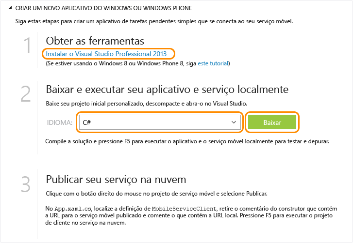

<properties
	pageTitle="Introdução aos Serviços Móveis para aplicativos Windows Universal | Centro de Desenvolvimento de Serviços Móveis"
	description="Siga este tutorial para começar a usar os Serviços Móveis do Azure para desenvolvimento de aplicativos universais do Windows no C#."
	services="mobile-services"
	documentationCenter="windows"
	authors="ggailey777"
	manager="dwrede"
	editor=""/>

<tags
	ms.service="mobile-services"
	ms.workload="mobile"
	ms.tgt_pltfrm="mobile-windows"
	ms.devlang="dotnet"
	ms.topic="article" 
	ms.date="05/03/2015"
	ms.author="glenga"/>

# Introdução aos Serviços Móveis

[AZURE.INCLUDE [mobile-services-selector-get-started](../../includes/mobile-services-selector-get-started.md)]

Este tutorial mostra como adicionar um serviço de back-end baseado na nuvem a um aplicativo universal do Windows usando os Serviços Móveis do Azure. Soluções de aplicativos universais do Windows incluem projetos para a Windows Store 8.1 e a Loja do Windows Phone 8.1, e um projeto compartilhado comum. Para obter mais informações, consulte [Criar aplicativos universais do Windows voltados para Windows e Windows Phone](http://msdn.microsoft.com/library/windows/apps/xaml/dn609832.aspx).

Neste tutorial, você criará um novo serviço móvel e um aplicativo simples *To do list* que armazena dados do aplicativo no novo serviço móvel. O serviço móvel que você criará usa as linguagens do .NET com suporte usando o Visual Studio para a lógica de negócios do lado do servidor e para gerenciar o serviço móvel. Para criar um serviço móvel que permita que você escreva a lógica de negócios do lado do servidor em JavaScript, consulte Versão de back-end do JavaScript neste tópico.

>[AZURE.NOTE]Este tópico mostra como criar um novo projeto de serviço móvel e o aplicativo universal do Windows usando o Portal de Gerenciamento do Azure. Usando o Visual Studio 2013 Update 3, você também pode adicionar um novo projeto de serviço móvel em uma solução existente do Visual Studio. Para obter mais informações, consulte [Adicionar Serviços Móveis a um aplicativo existente](mobile-services-dotnet-backend-windows-universal-dotnet-get-started-data.md).

>Para adicionar um serviço móvel a um projeto de aplicativo para Windows Phone 8.0 ou Windows Phone Silverlight 8.1, consulte [Adicionar Serviços Móveis a um aplicativo do Windows Phone existente](mobile-services-dotnet-backend-windows-phone-get-started-data.md).

[AZURE.INCLUDE [mobile-services-windows-universal-get-started](../../includes/mobile-services-windows-universal-get-started.md)]

Para concluir este tutorial, você precisará do seguinte:

* Uma conta ativa do Azure. Se você não tem uma conta, você pode se inscrever para uma avaliação do Azure e obter até 10 serviços móveis gratuitos que você pode continuar usando mesmo depois do fim de sua avaliação. Para obter detalhes, consulte [Avaliação gratuita do Azure](http://azure.microsoft.com/pricing/free-trial/?WT.mc_id=A0E0E5C02&amp;returnurl=http%3A%2F%2Fazure.microsoft.com%2Fen-us%2Fdocumentation%2Farticles%2Fmobile-services-dotnet-backend-windows-store-dotnet-get-started%2F).
* [Visual Studio 2013].

## Criar um novo serviço móvel

[AZURE.INCLUDE [mobile-services-dotnet-backend-create-new-service](../../includes/mobile-services-dotnet-backend-create-new-service.md)]

## Criar um novo aplicativo universal do Windows

Depois de criar seu serviço móvel, você poderá seguir um quickstart fácil no Portal de Gerenciamento para criar um novo aplicativo ou modificar um aplicativo existente para conexão a seu serviço móvel.

Nesta seção, você criará um novo aplicativo universal do Windows conectado ao seu serviço móvel.

1. No Portal de Gerenciamento, clique em **Serviços Móveis**e, em seguida, clique no serviço móvel que você acabou de criar.

2. Na guia de início rápido, clique em **Windows** em **Escolher plataforma** e expanda **Criar um novo aplicativo da Windows Store**.

   	Isso exibe as três etapas fáceis para criar um aplicativo da Windows Store conectado ao seu serviço móvel.

  	

3. Se ainda não o fez, baixe e instale o [Visual Studio 2013] no computador local ou na máquina virtual.

4. Em **Baixar e executar seu aplicativo e serviço localmente**, selecione um idioma para seu aplicativo da Windows Store e clique em **Baixar**.

  	Isso baixa uma solução que contém projetos para o serviço móvel e para o aplicativo de exemplo _To do list_ que está conectado ao seu serviço móvel. Salve o arquivo do projeto compactado em seu computador local e anote onde ele foi salvo.

## Testar o aplicativo no serviço móvel local

[AZURE.INCLUDE [mobile-services-dotnet-backend-test-local-service-dotnet](../../includes/mobile-services-dotnet-backend-test-local-service-dotnet.md)]

>[AZURE.NOTE]Você pode rever o código que acessa o serviço móvel para consultar e inserir dados, que está localizado no arquivo MainPage.xaml.cs.

## Publicar o serviço móvel

[AZURE.INCLUDE [mobile-services-dotnet-backend-publish-service](../../includes/mobile-services-dotnet-backend-publish-service.md)]

<ol start="4">
<li>
No projeto do código compartilhado, abra o arquivo App.xaml.cs, localize o código que cria uma instância de <a href="http://msdn.microsoft.com/library/Windowsazure/microsoft.windowsazure.mobileservices.mobileserviceclient.aspx" target="_blank">MobileServiceClient</a>, comente o código que cria esse cliente usando <em>localhost</em> e remova o comentário do código que cria o cliente usando a URL de serviço móvel remoto, de maneira semelhante à seguinte:

        <pre><code>public static MobileServiceClient MobileService = new MobileServiceClient(
            "https://todolist.azure-mobile.net/",
            "XXXX-APPLICATION-KEY-XXXXX");</code></pre>

	
Agora, o cliente acessará o serviço móvel publicado no Azure.
</li>
</ol>

## Testar o aplicativo no serviço móvel hospedado no Azure

Agora que o serviço móvel está publicado e o cliente está conectado a um serviço móvel hospedado no Azure, podemos executar o aplicativo usando o Azure para armazenar itens.

[AZURE.INCLUDE [mobile-services-windows-universal-test-app](../../includes/mobile-services-windows-universal-test-app.md)]

## Próximas etapas
Agora que você concluiu o início rápido, aprenda a executar tarefas adicionais importantes nos Serviços Móveis:

* [Adicionar Serviços Móveis a um aplicativo existente][Get started with data]  Saiba mais sobre como armazenar e consultar dados usando os Serviços Móveis.

* [Introdução à sincronização de dados offline]  Saiba como usar a sincronização de dados offline para tornar o seu aplicativo responsivo e robusto.

* [Adicionar autenticação ao aplicativo de Serviços Móveis][Get started with authentication]  Saiba como autenticar usuários de seu aplicativo com um provedor de identidade.

* [Adicionar notificações por push ao seu aplicativo][Get started with push notifications]  Saiba como enviar uma notificação por push bem básica ao seu aplicativo.

* [Solucionar problemas de back-end do .NET dos Serviços Móveis]   Saiba como diagnosticar e corrigir problemas que podem surgir com o back-end do .NET dos Serviços Móveis.

Para obter mais informações sobre os aplicativos universais do Windows, consulte [Suporte a plataformas de múltiplos dispositivos por meio de um único serviço móvel](mobile-services-how-to-use-multiple-clients-single-service.md#shared-vs).

<!-- Anchors. -->

<!-- Images. -->

<!-- URLs. -->
[Visual Studio 2013]: https://go.microsoft.com/fwLink/p/?LinkID=257546
[Get started with data]: mobile-services-dotnet-backend-windows-universal-dotnet-get-started-data.md
[Get started with data]: ../mobile-services-dotnet-backend-windows-store-dotnet-get-started-data.md
[Introdução à sincronização de dados offline]: mobile-services-windows-store-dotnet-get-started-offline-data.md
[Get started with authentication]: ../mobile-services-dotnet-backend-windows-store-dotnet-get-started-users.md
[Get started with push notifications]: ../mobile-services-dotnet-backend-windows-store-dotnet-get-started-push.md
[Visual Studio Professional 2013]: https://go.microsoft.com/fwLink/p/?LinkID=257546
[Mobile Services SDK]: http://go.microsoft.com/fwlink/?LinkId=257545
[JavaScript and HTML]: mobile-services-win8-javascript/
[Management Portal]: https://manage.windowsazure.com/
[JavaScript backend version]: ../mobile-services-windows-store-get-started.md
[Get started with data in Mobile Services using Visual Studio 2012]: ../mobile-services-windows-store-dotnet-get-started-data-vs2012.md
[Solucionar problemas de back-end do .NET dos Serviços Móveis]: mobile-services-dotnet-backend-how-to-troubleshoot.md
 

<!---HONumber=July15_HO4-->