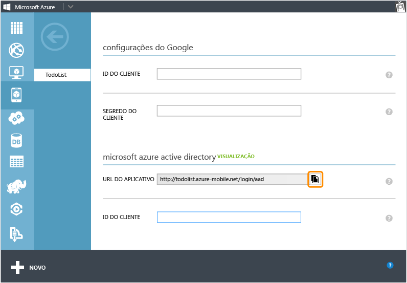
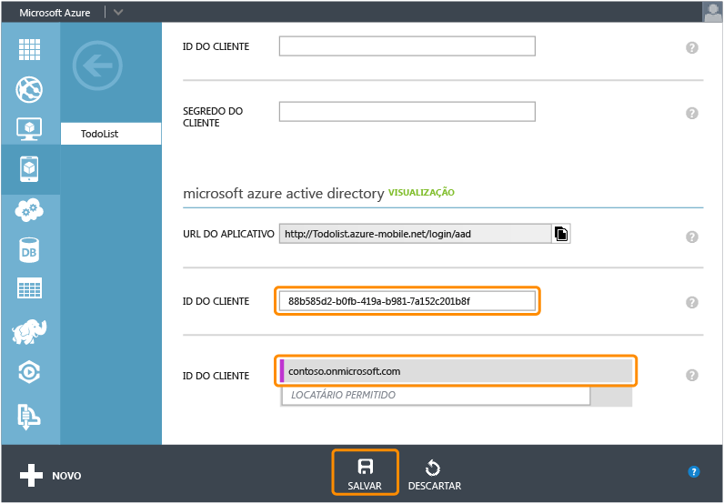

<properties 
	pageTitle="Registrar-se para autenticação do Active Directory do Azure | Microsoft Azure" 
	description="Saiba como se registrar para a autenticação do Active Directory do Azure em seu aplicativo de serviços móveis." 
	authors="wesmc7777" 
	services="mobile-services" 
	documentationCenter="" 
	manager="dwrede" 
	editor=""/>

<tags 
	ms.service="mobile-services" 
	ms.workload="mobile" 
	ms.tgt_pltfrm="multiple" 
	ms.devlang="multiple" 
	ms.topic="article" 
	ms.date="09/24/2015" 
	ms.author="ricksal"/>

# Registrar seus aplicativos para usar um logon de conta do Active Directory do Azure

[AZURE.INCLUDE [mobile-services-selector-register-identity-provider](../../includes/mobile-services-selector-register-identity-provider.md)]

##Visão geral

Este tópico mostra como registrar seus aplicativos para poderem usar o Active Directory do Azure como um provedor de autenticação para o seu serviço móvel.

##Registrando seu aplicativo

>[AZURE.NOTE]As etapas descritas neste tópico devem ser usadas com o tutorial [Adicionar autenticação ao aplicativo de Serviços Móveis](../mobile-services-dotnet-backend-windows-store-dotnet-get-started-users.md) quando você desejar usar [operações de logon voltadas a serviços](http://msdn.microsoft.com/library/azure/dn283952.aspx) com o aplicativo. Como alternativa, se seu aplicativo exigir [operações de logon voltadas a cliente](http://msdn.microsoft.com/library/azure/jj710106.aspx) para o Active Directory do Azure e um serviço móvel de back-end do .NET, você deve começar com o tutorial [Autenticar o seu aplicativo com Logon Único da biblioteca de autenticação do Active Directory](mobile-services-windows-store-dotnet-adal-sso-authentication.md).

1. Faça logon no [Portal de Gerenciamento do Azure], navegue até seu serviço móvel, clique na guia **Identidade**, role para baixo até a seção do provedor de identidade do **Active Directory do Azure** e copie a **URL do Aplicativo** mostrada aqui.

    

2. Navegue até **Active Directory** no portal de gerenciamento, clique no seu diretório, clique em **Domínios** e anote o domínio padrão do seu diretório.

3. Clique em **Aplicativos** > **Adicionar** > **Adicionar um aplicativo que minha organização está desenvolvendo**.

4. No Assistente de Adicionar Aplicativo, insira um **Nome** para seu aplicativo e clique no tipo **Aplicativo Web e/ou API Web**.

    

5. Na caixa **URL de Logon**, cole o valor da URL do aplicativo que você copiou do serviço móvel. Insira o mesmo valor exclusivo na caixa **URI da ID do Aplicativo** e clique em continuar.
 
    

6. Após o aplicativo ter sido adicionado, clique na guia **Configurar** e copie a **ID do Cliente** do aplicativo.

    >[AZURE.NOTE]Para um serviço móvel de back-end do .Net, você precisa editar o valor de **URL de Resposta** em **Logon Único** para ser a URL do seu serviço móvel acrescentada ao caminho _signin-aad_. Por exemplo, `https://todolist.azure-mobile.net/signin-aad`

7. Retorne à guia **Identidade** do seu serviço móvel e cole o valor copiado de **ID do Cliente** para o provedor de identidade do Active Directory do Azure.
 
    

8.  Na lista **Locatários Permitidos**, digite o domínio do diretório no qual você registrou o aplicativo (por exemplo, `contoso.onmicrosoft.com`) e clique em **Salvar**.

Agora você está pronto para usar um Active Directory do Azure para autenticação em seu aplicativo.

<!-- Anchors. -->

<!-- Images. -->

<!-- URLs. -->
[Portal de Gerenciamento do Azure]: https://manage.windowsazure.com/

 

<!---HONumber=Oct15_HO3-->